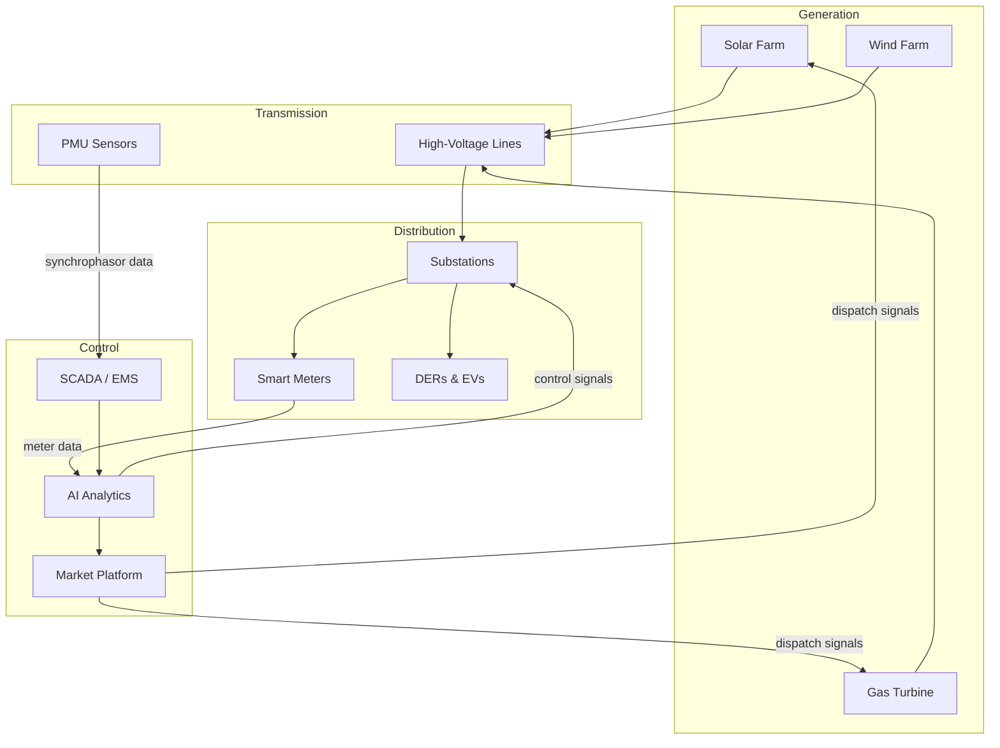

# Smart Grids: Architecture, Data, and AI Applications

## Overview

A smart grid is an electricity network that uses digital communication, sensors, and automated control to improve the reliability, efficiency, and sustainability of power delivery. Unlike the traditional grid — a one-way system where power flows from large plants to passive consumers — a smart grid is bidirectional, data-rich, and adaptive.

The term "smart grid" gained prominence after the U.S. Energy Independence and Security Act of 2007, but the underlying ideas go back decades. What changed was the convergence of cheap sensors (smart meters, phasor measurement units), ubiquitous connectivity (fiber, 5G, LoRaWAN), and machine learning capable of extracting actionable intelligence from massive, noisy, real-time data streams.

A modern smart grid generates enormous volumes of data: a single phasor measurement unit (PMU) samples voltage and current at 30–120 Hz, producing millions of measurements per day. Smart meters report consumption at 15-minute to 1-second intervals across millions of endpoints. Weather stations, satellite imagery, and market data add further dimensions. The central challenge is turning this data flood into real-time decisions — exactly the kind of problem where AI excels.

**Smart Grid Architecture**



## Key Concepts

- **SCADA (Supervisory Control and Data Acquisition)**: The legacy control system for grid monitoring. SCADA polls data every 2–4 seconds — too slow for modern dynamic phenomena. AI supplements SCADA with faster PMU-based analytics.
- **Phasor Measurement Units (PMUs)**: Devices that measure voltage and current phasors synchronized via GPS at 30–120 samples/second. PMU data enables wide-area monitoring and AI-based oscillation detection.
- **Advanced Metering Infrastructure (AMI)**: The network of smart meters, communication links, and data management systems that provides granular consumption data for load forecasting and demand response.
- **Grid Topology**: The graph structure of buses, lines, and switches. Graph neural networks (GNNs) are increasingly used to learn representations that respect this topology.
- **State Estimation**: Estimating the full state (voltages, angles) of the grid from noisy, incomplete measurements. ML-enhanced state estimators improve accuracy and robustness.
- **Fault Detection and Isolation**: Identifying and localizing faults (short circuits, equipment failures) using time-series anomaly detection on sensor data.

## Core Mathematics

State estimation finds the voltage state vector $\mathbf{x}$ that best explains the measurements $\mathbf{z}$:

$$\hat{\mathbf{x}} = \arg\min_{\mathbf{x}} (\mathbf{z} - h(\mathbf{x}))^T \mathbf{R}^{-1} (\mathbf{z} - h(\mathbf{x}))$$

where $h(\mathbf{x})$ is the nonlinear measurement function and $\mathbf{R}$ is the measurement noise covariance. This is solved iteratively via Gauss-Newton:

$$\mathbf{x}^{(k+1)} = \mathbf{x}^{(k)} + [\mathbf{H}^T \mathbf{R}^{-1} \mathbf{H}]^{-1} \mathbf{H}^T \mathbf{R}^{-1} (\mathbf{z} - h(\mathbf{x}^{(k)}))$$

where $\mathbf{H} = \partial h / \partial \mathbf{x}$ is the Jacobian (measurement matrix).

For anomaly detection on time series, a common approach is an autoencoder reconstruction error threshold:

$$\text{anomaly score} = \|\mathbf{x}_t - \hat{\mathbf{x}}_t\|^2 > \tau$$

## Code Examples

```python
import numpy as np
from sklearn.ensemble import IsolationForest

def detect_grid_anomalies(pmu_data: np.ndarray, contamination: float = 0.01) -> np.ndarray:
    """
    Detect anomalies in PMU time-series data using Isolation Forest.

    Args:
        pmu_data: shape (n_timesteps, n_features) — voltage magnitudes, angles, frequencies
        contamination: expected fraction of anomalies

    Returns:
        labels: -1 for anomaly, 1 for normal
    """
    model = IsolationForest(contamination=contamination, random_state=42)
    labels = model.fit_predict(pmu_data)
    return labels

# Example: simulate PMU data with injected anomalies
np.random.seed(42)
n = 10000
normal = np.column_stack([
    230 + np.random.randn(n) * 0.5,       # voltage magnitude (kV)
    np.random.randn(n) * 0.02,             # voltage angle (rad)
    50 + np.random.randn(n) * 0.01,        # frequency (Hz)
])

# Inject 50 anomalies (voltage sag events)
anomaly_idx = np.random.choice(n, 50, replace=False)
normal[anomaly_idx, 0] -= 15  # 15 kV voltage drop

labels = detect_grid_anomalies(normal)
detected = np.sum(labels[anomaly_idx] == -1)
print(f"Detected {detected}/{len(anomaly_idx)} injected anomalies")
```

```python
import networkx as nx

def build_grid_graph(buses: list[int], lines: list[tuple[int, int, dict]]) -> nx.Graph:
    """Build a NetworkX graph representation of the power grid."""
    G = nx.Graph()
    G.add_nodes_from(buses)
    for u, v, attrs in lines:
        G.add_edge(u, v, **attrs)
    return G

# IEEE 6-bus example
buses = [1, 2, 3, 4, 5, 6]
lines = [
    (1, 2, {'impedance': 0.1+0.2j, 'rating_mw': 100}),
    (1, 4, {'impedance': 0.05+0.2j, 'rating_mw': 80}),
    (2, 3, {'impedance': 0.08+0.3j, 'rating_mw': 100}),
    (3, 6, {'impedance': 0.02+0.1j, 'rating_mw': 120}),
    (4, 5, {'impedance': 0.06+0.2j, 'rating_mw': 60}),
    (5, 6, {'impedance': 0.06+0.2j, 'rating_mw': 70}),
]
G = build_grid_graph(buses, lines)
print(f"Grid: {G.number_of_nodes()} buses, {G.number_of_edges()} lines")
```

## Exercises

1. **PMU Analysis**: Given PMU data at 60 Hz, calculate how many data points per day a single PMU generates. If a utility has 500 PMUs, what is the daily data volume in GB (assuming 8 bytes per float, 6 channels per PMU)?
2. **Anomaly Detection**: Extend the Isolation Forest example to use a sliding window approach — instead of individual timesteps, use windows of 10 consecutive measurements as features. How does this affect detection accuracy?
3. **Graph Representation**: Build a graph representation of the IEEE 14-bus system. Compute the adjacency matrix and discuss how a GNN could use this topology for state estimation.
4. **Smart Meter Clustering**: Using k-means or DBSCAN, cluster daily load profiles from smart meter data into consumer archetypes (e.g., residential, commercial, industrial).

## Further Reading

- Kezunovic, M. et al. "The Role of Big Data Analytics in Grid Modernization" — IEEE Transactions on Smart Grid (2020)
- Deka, D. & Misra, S. "Learning for Power Systems" — Annual Review of Control, Robotics, and Autonomous Systems (2023)
- NIST Framework and Roadmap for Smart Grid Interoperability Standards (2024 update)
- OpenPMU project — open-source PMU hardware and software
