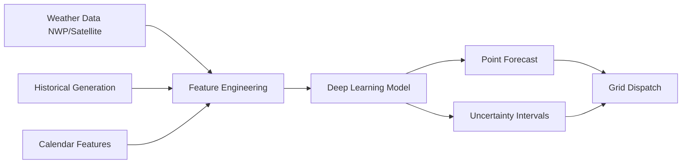

# Renewable Energy Forecasting with Deep Learning

## Overview

Accurate forecasting of solar and wind power output is critical for grid stability and economic efficiency. Every megawatt of forecast error must be compensated by expensive reserve capacity or curtailment — wasting clean energy. Traditional forecasting relied on Numerical Weather Prediction (NWP) models, but deep learning has dramatically improved accuracy, especially at short-term horizons (minutes to hours ahead).

Solar forecasting predicts the power output of photovoltaic (PV) systems, which depends on solar irradiance, temperature, humidity, cloud cover, and panel characteristics. Wind forecasting predicts the power output of wind turbines, driven by wind speed, direction, turbulence, and air density. Both are inherently uncertain — clouds can appear suddenly, wind gusts are chaotic — making probabilistic forecasting (quantifying uncertainty) as important as point forecasting.

The forecasting horizon determines the appropriate model:

- **Very short-term (seconds to minutes)**: Persistence models, sky imagers, sensor fusion
- **Short-term (1–6 hours)**: LSTM, Temporal Convolutional Networks (TCN), Transformers
- **Day-ahead (12–48 hours)**: NWP post-processing with ML, ensemble methods
- **Medium-term (1–2 weeks)**: Hybrid NWP + statistical models

Deep learning has shown particular strength in the short-term regime, where it can learn complex nonlinear relationships between weather features and power output that traditional models miss.

**Renewable Forecasting Pipeline**



## Key Concepts

- **Solar Irradiance Components**: Global Horizontal Irradiance (GHI) = Direct Normal Irradiance (DNI) + Diffuse Horizontal Irradiance (DHI). Decomposition models convert between these for tilted-panel predictions.
- **Wind Power Curve**: The nonlinear relationship between wind speed and turbine power output — cubic below rated speed, flat at rated, zero above cut-out speed. ML can learn the actual (degraded, site-specific) power curve from operational data.
- **Numerical Weather Prediction (NWP)**: Physics-based atmospheric simulations (GFS, ECMWF, HRRR) that provide gridded weather forecasts. ML post-processing corrects NWP biases.
- **LSTM (Long Short-Term Memory)**: A recurrent architecture with gating mechanisms that captures long-range temporal dependencies in time-series data.
- **Temporal Fusion Transformer (TFT)**: A state-of-the-art architecture combining variable selection, temporal attention, and quantile regression for multi-horizon forecasting.
- **Probabilistic Forecasting**: Producing prediction intervals or full probability distributions rather than single-point forecasts. Essential for grid operators managing reserves.

## Core Mathematics

Wind power is related to wind speed $v$ by:

$$P_{\text{wind}} = \frac{1}{2} \rho A C_p v^3$$

where $\rho$ is air density (kg/m³), $A = \pi r^2$ is the swept area, and $C_p \leq 16/27$ (Betz limit) is the power coefficient.

For solar, the clear-sky model provides a baseline:

$$\text{GHI}_{\text{clear}} = I_0 \cdot \cos(\theta_z) \cdot \exp\left(-\frac{\tau}{\cos(\theta_z)}\right)$$

where $I_0 \approx 1361$ W/m² is the solar constant, $\theta_z$ is the zenith angle, and $\tau$ is the atmospheric optical depth.

Forecast accuracy is measured by:

$$\text{RMSE} = \sqrt{\frac{1}{n} \sum_{i=1}^{n} (\hat{y}_i - y_i)^2}, \quad \text{MAE} = \frac{1}{n} \sum_{i=1}^{n} |\hat{y}_i - y_i|$$

The forecast skill score compares against persistence:

$$\text{Skill} = 1 - \frac{\text{RMSE}_{\text{model}}}{\text{RMSE}_{\text{persistence}}}$$

For probabilistic forecasts, the pinball loss for quantile $q$ is:

$$L_q(y, \hat{y}_q) = \begin{cases} q(y - \hat{y}_q) & \text{if } y \geq \hat{y}_q \\ (1-q)(\hat{y}_q - y) & \text{if } y < \hat{y}_q \end{cases}$$

## Code Examples

```python
import numpy as np
import torch
import torch.nn as nn

class SolarLSTM(nn.Module):
    """LSTM model for solar power forecasting."""

    def __init__(self, input_dim: int, hidden_dim: int = 64,
                 num_layers: int = 2, forecast_horizon: int = 24):
        super().__init__()
        self.lstm = nn.LSTM(input_dim, hidden_dim, num_layers,
                            batch_first=True, dropout=0.1)
        self.fc = nn.Linear(hidden_dim, forecast_horizon)

    def forward(self, x: torch.Tensor) -> torch.Tensor:
        # x: (batch, seq_len, input_dim)
        lstm_out, _ = self.lstm(x)
        # Use last hidden state
        last = lstm_out[:, -1, :]
        return self.fc(last)  # (batch, forecast_horizon)

# Example usage
input_dim = 8   # GHI, temperature, humidity, wind speed, hour, month, etc.
model = SolarLSTM(input_dim=input_dim, hidden_dim=128, forecast_horizon=24)

# Dummy data: 32 samples, 72 hours lookback, 8 features
x = torch.randn(32, 72, input_dim)
forecast = model(x)
print(f"Forecast shape: {forecast.shape}")  # (32, 24)
```

```python
def quantile_loss(y_true: torch.Tensor, y_pred: torch.Tensor,
                  quantiles: list[float]) -> torch.Tensor:
    """
    Pinball loss for probabilistic forecasting.

    Args:
        y_true: (batch, horizon)
        y_pred: (batch, horizon, n_quantiles)
        quantiles: list of quantile levels, e.g. [0.1, 0.5, 0.9]
    """
    losses = []
    for i, q in enumerate(quantiles):
        error = y_true - y_pred[:, :, i]
        loss = torch.max(q * error, (q - 1) * error)
        losses.append(loss.mean())
    return sum(losses) / len(losses)
```

## Exercises

1. **Persistence Baseline**: Implement a persistence forecast (predict today's solar output = yesterday's output at same hour). Compute RMSE and compare with an LSTM on a public solar dataset.
2. **Feature Engineering**: List 10 features you would include for a wind power forecasting model. Which are static (site-specific) vs. dynamic (time-varying)?
3. **Probabilistic Intervals**: Extend the SolarLSTM to output 3 quantiles (10th, 50th, 90th percentile) instead of point forecasts. Train with the pinball loss function provided above.
4. **NWP Post-Processing**: Download GFS forecast data for a location with a known solar farm. Train a gradient-boosted tree to correct GFS irradiance bias using historical observations.

## Further Reading

- Pedro, H. & Coimbra, C. "Assessment of Forecasting Techniques for Solar Power Production" — Solar Energy (2012)
- Lim, B. et al. "Temporal Fusion Transformers for Interpretable Multi-horizon Time Series Forecasting" — International Journal of Forecasting (2021)
- Yang, D. et al. "A Review of Solar Forecasting, Its Dependence on Atmospheric Sciences and Implications for Grid Integration" — Renewable and Sustainable Energy Reviews (2022)
- Open Climate Fix — open-source solar forecasting models: https://openclimatefix.org
