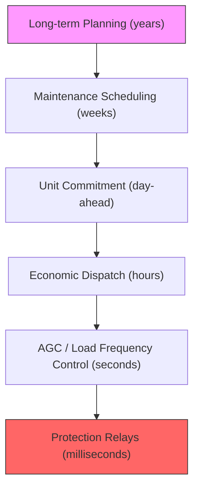

# AI for Power Grid Operations and Stability

## Overview

Grid stability is the art of keeping the lights on — maintaining voltage within ±5% of nominal and frequency at exactly 50 or 60 Hz, every second of every day. As grids incorporate more renewable generation, which lacks the rotational inertia of conventional turbines, this task becomes dramatically harder. AI is increasingly used to ensure stability in this new, low-inertia world.

The fundamental challenge is that electricity supply must exactly match demand at every instant. Any mismatch causes frequency deviations: excess generation speeds up the grid (frequency rises), while excess demand slows it down (frequency drops). Historically, the inertia of spinning turbines provided a natural buffer — their rotational energy absorbed short-term imbalances. With inverter-based renewables replacing synchronous machines, this physical buffer is disappearing, making faster, smarter control essential.

Grid operations involve multiple timescales of decision-making:

- **Milliseconds**: Automatic Generation Control (AGC) adjusts generator output to correct frequency deviations
- **Minutes**: Economic dispatch determines optimal power output for each generator
- **Hours**: Unit commitment decides which generators to start up or shut down
- **Days**: Maintenance scheduling and outage planning

AI is transforming each of these timescales, from deep reinforcement learning for real-time voltage control to graph neural networks for contingency analysis that evaluates thousands of what-if failure scenarios in seconds rather than hours.

**Grid Operations Decision Hierarchy**



## Key Concepts

- **Frequency Regulation**: Maintaining grid frequency at the nominal value (50/60 Hz). Primary control acts within seconds (governor response), secondary control within minutes (AGC), and tertiary control handles scheduling.
- **Voltage Stability**: Keeping bus voltages within acceptable bounds. Reactive power compensation (capacitor banks, SVCs, STATCOMs) and tap-changing transformers are the traditional tools; RL agents are learning to coordinate these.
- **Contingency Analysis (N-1 / N-2)**: Checking whether the grid remains stable if any one (N-1) or two (N-2) components fail. Traditionally requires solving power flow equations thousands of times; GNNs can approximate this in real time.
- **Optimal Power Flow (OPF)**: The optimization problem of minimizing generation cost while satisfying physical constraints (power balance, voltage limits, line ratings). ML is used to warm-start solvers or directly predict solutions.
- **Transient Stability**: Whether the grid returns to synchronism after a large disturbance (fault, generator trip). Time-domain simulation is expensive; ML classifiers can predict stability from pre-fault conditions.
- **Inertia**: The rotational kinetic energy stored in synchronous machines that resists frequency changes. Inverter-based resources have zero inherent inertia, requiring synthetic inertia from control algorithms.

## Core Mathematics

The swing equation governs generator rotor dynamics:

$$M_i \frac{d^2 \delta_i}{dt^2} + D_i \frac{d\delta_i}{dt} = P_{m,i} - P_{e,i}$$

where $M_i$ is the inertia constant, $D_i$ is the damping coefficient, $\delta_i$ is the rotor angle, $P_{m,i}$ is mechanical power, and $P_{e,i}$ is electrical power.

The rate of change of frequency (RoCoF) after a sudden power imbalance $\Delta P$:

$$\text{RoCoF} = \frac{d f}{d t} = \frac{\Delta P \cdot f_0}{2 H_{\text{sys}} \cdot S_{\text{sys}}}$$

where $H_{\text{sys}}$ is the system inertia constant and $S_{\text{sys}}$ is the system base MVA.

The AC Optimal Power Flow (ACOPF) objective:

$$\min \sum_{g \in \mathcal{G}} C_g(P_g) \quad \text{s.t.} \quad \text{power flow equations, } V^{\min} \leq V_i \leq V^{\max}, \; |S_\ell| \leq S_\ell^{\max}$$

## Code Examples

```python
import numpy as np

def simulate_frequency_response(
    H: float,         # system inertia constant (seconds)
    D: float,          # damping coefficient (pu)
    R: float,          # droop (pu)
    delta_P: float,    # power imbalance (pu)
    dt: float = 0.01,
    t_max: float = 30.0
) -> tuple[np.ndarray, np.ndarray]:
    """
    Simulate frequency response to a step load change using the
    single-machine equivalent model.

    Returns time array and frequency deviation array (Hz).
    """
    f0 = 60.0  # nominal frequency
    t = np.arange(0, t_max, dt)
    delta_f = np.zeros_like(t)
    d_delta_f = 0.0

    for i in range(1, len(t)):
        # Governor response: delta_Pm = -delta_f / (R * f0)
        governor = -delta_f[i-1] / (R * f0)
        # Swing equation: 2H * d(delta_f)/dt = delta_P + governor - D * delta_f
        d_delta_f = (delta_P + governor - D * delta_f[i-1]) / (2 * H)
        delta_f[i] = delta_f[i-1] + d_delta_f * dt

    return t, delta_f * f0  # convert to Hz

# Simulate loss of 500 MW on a 50 GW system (0.01 pu)
t, freq_dev = simulate_frequency_response(H=5.0, D=1.0, R=0.05, delta_P=-0.01)
print(f"Frequency nadir: {60 + min(freq_dev):.3f} Hz at t={t[np.argmin(freq_dev)]:.1f}s")
print(f"Steady-state frequency: {60 + freq_dev[-1]:.3f} Hz")
```

```python
import torch
import torch.nn as nn

class StabilityClassifier(nn.Module):
    """
    Binary classifier for transient stability assessment.
    Input: pre-fault system state (voltages, angles, power flows).
    Output: probability of stable response after contingency.
    """

    def __init__(self, input_dim: int, hidden_dim: int = 128):
        super().__init__()
        self.net = nn.Sequential(
            nn.Linear(input_dim, hidden_dim),
            nn.ReLU(),
            nn.Dropout(0.2),
            nn.Linear(hidden_dim, hidden_dim),
            nn.ReLU(),
            nn.Dropout(0.2),
            nn.Linear(hidden_dim, 1),
            nn.Sigmoid()
        )

    def forward(self, x: torch.Tensor) -> torch.Tensor:
        return self.net(x)

# Example: 14-bus system with 28 state features (voltage mag + angle per bus)
model = StabilityClassifier(input_dim=28)
x = torch.randn(16, 28)
probs = model(x)
print(f"Stability probabilities: {probs.squeeze()[:4].tolist()}")
```

## Exercises

1. **Frequency Response**: Using the simulation code, investigate how reducing system inertia $H$ from 5s to 2s (simulating a high-renewable grid) affects the frequency nadir. What inertia level causes frequency to drop below 59.5 Hz?
2. **N-1 Contingency**: For the IEEE 14-bus system, list all N-1 contingencies (single line outages). How many power flow solutions must be computed? Discuss how a GNN could reduce this computational burden.
3. **OPF Approximation**: Train a neural network to predict the solution of a DC-OPF problem. Generate 10,000 random load scenarios, solve each with a linear program, and train the network to map loads to optimal generator setpoints.
4. **Voltage Control**: Design an RL environment where the agent controls reactive power injections at 3 buses to keep all voltages within [0.95, 1.05] pu. Define the state, action, and reward.

## Further Reading

- Donnot, B. et al. "Introducing Machine Learning for Power System Operation Support" — arXiv:1709.09527
- Pan, X. et al. "DeepOPF: Deep Neural Network for DC Optimal Power Flow" — IEEE SmartGridComm (2020)
- Huang, Q. et al. "Adaptive Power System Emergency Control Using Deep Reinforcement Learning" — IEEE Transactions on Smart Grid (2020)
- PowerWorld Simulator — educational tool for power system analysis
