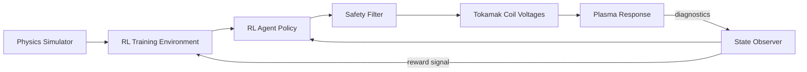

# Nuclear Fusion Plasma Control with Reinforcement Learning

## Overview

Nuclear fusion — the process that powers the sun — promises virtually unlimited clean energy: no carbon emissions, no long-lived radioactive waste, and fuel (deuterium from seawater and tritium bred from lithium) abundant enough to last billions of years. The challenge is confining a plasma at 150 million °C long enough for fusion reactions to sustain themselves. This is where AI, and specifically reinforcement learning, is making breakthrough contributions.

The dominant approach to fusion uses tokamaks — doughnut-shaped (toroidal) chambers that confine plasma with powerful magnetic fields. The plasma must be shaped and positioned with exquisite precision: it cannot touch the walls (which would cool it and damage the chamber), and its shape affects fusion performance. Traditional controllers use hand-tuned PID loops for each of dozens of magnetic coils, a process that takes months of expert effort for each new plasma configuration.

In 2022, DeepMind published a landmark paper demonstrating that a single RL agent could simultaneously control all 19 magnetic coils of the TCV tokamak at EPFL, learning to produce and maintain a variety of plasma shapes — including configurations never before achieved. This work showed that RL could replace years of manual controller tuning with a few hours of training in simulation.

The fusion-AI pipeline works as follows: a high-fidelity physics simulator (like LIUQE or FreeGS) models the plasma evolution and magnetic coil interactions; an RL agent trains in this simulator; the learned policy is then deployed on the real tokamak hardware with safety constraints.

**Fusion RL Control Pipeline**



## Key Concepts

- **Tokamak**: A toroidal (doughnut-shaped) vacuum chamber surrounded by magnetic coils that confine fusion plasma. Key designs: ITER (France, under construction), JET (UK, retired 2024), TCV (Switzerland, DeepMind experiments).
- **Plasma Confinement**: Using magnetic fields to keep the 150M°C plasma away from the chamber walls. The field has toroidal and poloidal components that create nested magnetic surfaces.
- **Magnetic Equilibrium**: The steady-state configuration where plasma pressure is balanced by magnetic forces, described by the Grad-Shafranov equation.
- **Reinforcement Learning for Control**: The RL agent observes plasma diagnostics (position, shape, current), takes actions (coil voltages), and receives rewards for maintaining the desired configuration.
- **Sim-to-Real Transfer**: Training in simulation and deploying on real hardware. The gap between simulated and real plasma physics is a major challenge.
- **Safety Constraints**: Hard limits on coil currents, plasma position, and wall proximity. The RL policy must satisfy these at all times — unconstrained exploration could damage the machine.

## Core Mathematics

The Grad-Shafranov equation describes axisymmetric magnetic equilibrium:

$$R \frac{\partial}{\partial R}\left(\frac{1}{R} \frac{\partial \psi}{\partial R}\right) + \frac{\partial^2 \psi}{\partial Z^2} = -\mu_0 R J_\phi = -\mu_0 R^2 \frac{dp}{d\psi} - F \frac{dF}{d\psi}$$

where $\psi$ is the poloidal flux function, $R$ is the major radius, $Z$ is the vertical coordinate, $p(\psi)$ is the pressure profile, and $F(\psi) = R B_\phi$ relates to the toroidal field.

The RL problem is formulated as an MDP:

- **State** $s_t$: plasma boundary shape coefficients, magnetic measurements, coil currents
- **Action** $a_t$: voltage commands for each of the $N_c$ coils (continuous)
- **Reward**: $r_t = -\alpha \|s_t - s_{\text{target}}\|^2 - \beta \|a_t\|^2 - \gamma \cdot \mathbb{1}[\text{constraint violation}]$
- **Policy**: $\pi_\theta(a_t | s_t)$ parameterized as a neural network, trained with PPO

The Lawson criterion for fusion ignition:

$$n \cdot T \cdot \tau_E > 3 \times 10^{21} \; \text{keV} \cdot \text{s/m}^3$$

where $n$ is plasma density, $T$ is temperature, and $\tau_E$ is energy confinement time.

## Code Examples

```python
import numpy as np

class SimpleTokamakEnv:
    """
    Simplified 2D tokamak plasma control environment.
    The agent controls coil currents to position the plasma center at a target location.
    """

    def __init__(self, n_coils: int = 6, dt: float = 0.001):
        self.n_coils = n_coils
        self.dt = dt
        # Coil positions around the chamber (angles)
        self.coil_angles = np.linspace(0, 2 * np.pi, n_coils, endpoint=False)
        self.coil_R = 1.5  # coil major radius
        self.reset()

    def reset(self) -> np.ndarray:
        """Reset plasma to initial position."""
        self.plasma_R = 1.0 + np.random.randn() * 0.05  # major radius
        self.plasma_Z = np.random.randn() * 0.05          # vertical position
        self.plasma_vR = 0.0
        self.plasma_vZ = 0.0
        self.coil_currents = np.zeros(self.n_coils)
        self.step_count = 0
        return self._get_state()

    def _get_state(self) -> np.ndarray:
        return np.concatenate([
            [self.plasma_R, self.plasma_Z, self.plasma_vR, self.plasma_vZ],
            self.coil_currents
        ])

    def step(self, action: np.ndarray) -> tuple:
        """
        Apply coil voltage commands and advance one timestep.
        action: voltage for each coil (clipped to [-1, 1])
        """
        action = np.clip(action, -1, 1)

        # Update coil currents (L*dI/dt = V)
        self.coil_currents += action * self.dt * 10

        # Compute magnetic force on plasma from coils (simplified)
        force_R, force_Z = 0.0, 0.0
        for i, theta in enumerate(self.coil_angles):
            coil_r = self.coil_R * np.cos(theta)
            coil_z = self.coil_R * np.sin(theta)
            dr = coil_r - self.plasma_R
            dz = coil_z - self.plasma_Z
            dist = np.sqrt(dr**2 + dz**2) + 0.1
            force_R += self.coil_currents[i] * dr / dist**3
            force_Z += self.coil_currents[i] * dz / dist**3

        # Update plasma dynamics
        self.plasma_vR += force_R * self.dt
        self.plasma_vZ += force_Z * self.dt
        self.plasma_R += self.plasma_vR * self.dt
        self.plasma_Z += self.plasma_vZ * self.dt

        # Reward: negative distance from target (R=1.0, Z=0.0)
        target_R, target_Z = 1.0, 0.0
        dist_to_target = np.sqrt((self.plasma_R - target_R)**2 + (self.plasma_Z - target_Z)**2)
        reward = -dist_to_target - 0.01 * np.sum(action**2)

        self.step_count += 1
        done = dist_to_target > 0.5 or self.step_count > 1000

        return self._get_state(), reward, done, {}

# Test the environment
env = SimpleTokamakEnv(n_coils=6)
state = env.reset()
print(f"Initial state: R={state[0]:.3f}, Z={state[1]:.3f}")
for _ in range(100):
    action = np.random.randn(6) * 0.1  # random policy
    state, reward, done, _ = env.step(action)
    if done:
        break
print(f"Final state: R={state[0]:.3f}, Z={state[1]:.3f}, reward={reward:.4f}")
```

## Exercises

1. **Lawson Criterion**: Calculate the required confinement time $\tau_E$ if $n = 10^{20}$ m⁻³ and $T = 10$ keV. Compare with current tokamak records.
2. **RL for Plasma Control**: Using the SimpleTokamakEnv above, implement a PPO or DDPG agent to learn plasma positioning. Plot the learning curve over 1000 episodes.
3. **Safety Constraints**: Add hard constraints to the environment: if any coil current exceeds ±5 A or the plasma gets within 0.1 of the wall, end the episode with a large penalty. How does this affect learning?
4. **Research Review**: Read the DeepMind TCV paper (Degrave et al., Nature 2022). Summarize the key differences between their approach and the simplified model above.

## Further Reading

- Degrave, J. et al. "Magnetic Control of Tokamak Plasmas through Deep Reinforcement Learning" — Nature 602, 414–419 (2022)
- Seo, J. et al. "Avoiding Fusion Plasma Tearing Instability with Deep Reinforcement Learning" — Nature 626, 746–751 (2024)
- ITER Organization — https://www.iter.org — the world's largest fusion experiment
- Freidberg, J.P. "Plasma Physics and Fusion Energy" — Cambridge University Press (2007)
