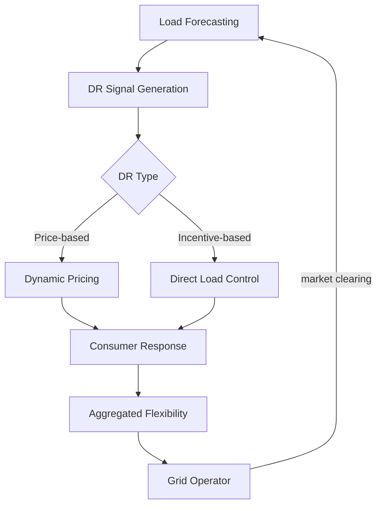

## Demand Response and Energy Demand Forecasting

## Overview

Traditionally, electricity systems matched supply to demand by ramping generators up and down. Demand response (DR) flips this: instead of building more generation to meet peak demand, DR shifts flexible loads to times when supply is abundant and cheap. With growing renewable penetration, DR is becoming essential — it provides the flexibility needed to absorb variable solar and wind output without curtailment or expensive storage.

Demand forecasting is the prerequisite for effective DR. If a utility can accurately predict that tomorrow's peak will be 10% above average, it can activate DR programs in advance, avoiding the need to fire up expensive peaker plants. Modern ML models achieve forecast errors of 1–3% for day-ahead predictions at the system level, though individual building or household forecasting remains challenging due to high volatility.

The key insight is that a significant fraction of electricity demand is flexible: HVAC systems can pre-cool buildings before peak hours, EV charging can shift to overnight, industrial processes can batch operations during off-peak periods, and water heaters have inherent thermal storage. The challenge is identifying, quantifying, and orchestrating this flexibility across millions of endpoints — a perfect application for AI.

Demand response programs fall into two categories:

- **Price-based DR**: Time-of-use rates, real-time pricing, or critical peak pricing incentivize consumers to shift load voluntarily.
- **Incentive-based DR**: Direct load control, interruptible service, or capacity market programs where the utility can directly curtail or shift loads in exchange for payments.

**Demand Response Ecosystem**



## Key Concepts

- **Load Forecasting**: Predicting future electricity demand at various aggregation levels (system, feeder, building, appliance) and horizons (minutes to weeks). Deep learning excels at capturing weather, calendar, and behavioral patterns.
- **Peak Shaving**: Reducing demand during peak hours to avoid expensive peaker generation and defer infrastructure upgrades. A 5% peak reduction can save a utility hundreds of millions of dollars annually.
- **Load Shifting**: Moving energy consumption from peak to off-peak hours without reducing total consumption. Example: pre-cooling a building from 6–8 AM to reduce air conditioning load during the 2–6 PM peak.
- **Demand Elasticity**: How responsive demand is to price changes. Elastic loads (EV charging, water heating) can be shifted; inelastic loads (lighting, computing) cannot.
- **Virtual Power Plant (VPP)**: An aggregation of distributed loads, storage, and generation managed as a single flexible resource. AI orchestrates thousands of individual assets.
- **Baseline Estimation**: Estimating what a consumer would have consumed without DR intervention. Essential for verifying DR performance and calculating payments.

## Core Mathematics

Short-term load forecasting can be modeled as:

$$P_{\text{load}}(t) = f(T_{\text{air}}(t), H(t), \text{DoW}(t), \text{holiday}(t), P_{\text{load}}(t-1), \ldots) + \varepsilon(t)$$

where $T_{\text{air}}$ is ambient temperature, $H$ is humidity, DoW is day of week, and $\varepsilon$ is noise. The function $f$ is learned by the neural network.

Price elasticity of demand:

$$\epsilon = \frac{\partial Q / Q}{\partial P / P} = \frac{\partial \ln Q}{\partial \ln P}$$

where $Q$ is quantity demanded and $P$ is price. Typical short-run elasticity for residential electricity: $\epsilon \approx -0.1$ to $-0.3$.

The DR optimization problem for a building:

$$\min_{u(t)} \sum_{t=1}^{T} \left[ c(t) \cdot P_{\text{load}}(t) + \lambda \cdot (\text{comfort deviation})^2 \right]$$

$$\text{s.t.} \quad T^{\min} \leq T_{\text{indoor}}(t) \leq T^{\max}, \quad P^{\min} \leq P_{\text{load}}(t) \leq P^{\max}$$

## Code Examples

```python
import numpy as np
import torch
import torch.nn as nn

class LoadForecaster(nn.Module):
    """
    Multi-layer GRU model for short-term load forecasting.
    Handles weather features, calendar encodings, and lagged load values.
    """

    def __init__(self, n_weather: int = 4, n_calendar: int = 3,
                 n_lags: int = 168, hidden: int = 64, horizon: int = 24):
        super().__init__()
        input_dim = n_weather + n_calendar + 1  # +1 for lagged load at each step
        self.gru = nn.GRU(input_dim, hidden, num_layers=2,
                          batch_first=True, dropout=0.1)
        self.head = nn.Linear(hidden, horizon)

    def forward(self, weather: torch.Tensor, calendar: torch.Tensor,
                lagged_load: torch.Tensor) -> torch.Tensor:
        # weather: (batch, seq, n_weather)
        # calendar: (batch, seq, n_calendar)
        # lagged_load: (batch, seq, 1)
        x = torch.cat([weather, calendar, lagged_load], dim=-1)
        out, _ = self.gru(x)
        return self.head(out[:, -1, :])

# Example
model = LoadForecaster()
batch = 16
seq = 168  # 1 week of hourly data
weather = torch.randn(batch, seq, 4)
calendar = torch.randn(batch, seq, 3)
load = torch.randn(batch, seq, 1)
forecast = model(weather, calendar, load)
print(f"24-hour forecast shape: {forecast.shape}")
```

```python
def simulate_dr_event(
    baseline_load: np.ndarray,
    price_signal: np.ndarray,
    elasticity: float = -0.2
) -> np.ndarray:
    """
    Simulate consumer response to a price signal using constant elasticity.

    Args:
        baseline_load: hourly load without DR (MW)
        price_signal: hourly price multiplier (1.0 = normal, 2.0 = double)
        elasticity: price elasticity of demand

    Returns:
        adjusted_load: hourly load after DR response
    """
    # Percentage change in load = elasticity * percentage change in price
    price_change = (price_signal - 1.0)  # fractional change from normal
    load_change = elasticity * price_change
    adjusted_load = baseline_load * (1 + load_change)
    return adjusted_load

# Example: critical peak pricing event (2-6 PM)
baseline = np.array([40, 42, 45, 50, 55, 60, 65, 62, 58, 52, 48, 44,  # hours 0-11
                      42, 44, 55, 65, 70, 68, 60, 55, 50, 48, 45, 42])  # hours 12-23
price = np.ones(24)
price[14:18] = 3.0  # triple price during 2-6 PM

adjusted = simulate_dr_event(baseline, price, elasticity=-0.15)
peak_reduction = (baseline[14:18].max() - adjusted[14:18].max()) / baseline[14:18].max()
print(f"Peak load reduction: {peak_reduction:.1%}")
```

## Exercises

1. **Load Profiling**: Cluster hourly load profiles from 100 simulated buildings into 5 archetypes using k-means. Which archetypes have the most DR potential (highest peak-to-average ratio)?
2. **Temperature Sensitivity**: Plot the relationship between daily peak load and maximum daily temperature for a year of data. Identify the "comfort band" where load is flat and the heating/cooling slopes.
3. **DR Optimization**: Formulate and solve a simple building HVAC pre-cooling problem: minimize electricity cost over 24 hours subject to indoor temperature constraints [20°C, 26°C] and a time-of-use tariff.
4. **Baseline Estimation**: Implement the "10 of 10" baseline method (average of last 10 similar days) and compare with an ML-based baseline. Which is more accurate for a volatile commercial building?

## Further Reading

- Hong, T. & Fan, S. "Probabilistic Electric Load Forecasting: A Tutorial Review" — International Journal of Forecasting (2016)
- Vazquez-Canteli, J. & Nagy, Z. "Reinforcement Learning for Demand Response: A Review" — Applied Energy (2019)
- O'Connell, N. et al. "Benefits and Challenges of Electrical Demand Response: A Critical Review" — Renewable and Sustainable Energy Reviews (2014)
- CityLearn — RL environment for building demand response: https://github.com/intelligent-environments-lab/CityLearn
