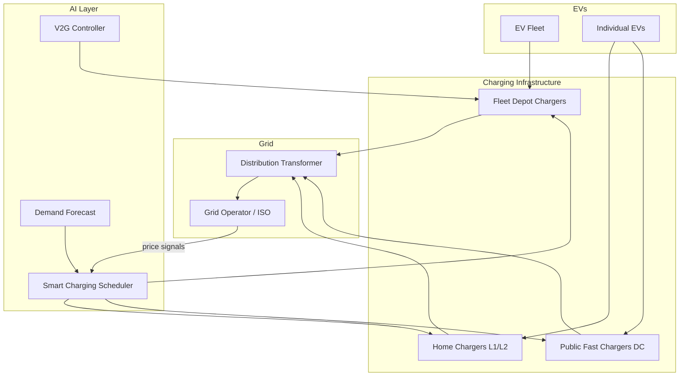

## Electric Vehicle Charging Networks and Optimization

## Overview

The electrification of transportation represents one of the largest shifts in energy demand patterns in history. By 2030, an estimated 145 million electric vehicles (EVs) will be on the road globally, each acting as a mobile battery that interacts with the grid. Uncoordinated charging — where millions of drivers plug in simultaneously after the evening commute — could create demand spikes that overwhelm grid infrastructure. AI-optimized smart charging transforms this challenge into an opportunity, turning EVs into flexible grid resources.

The EV charging problem spans multiple scales: individual drivers want fast, convenient, and cheap charging; fleet operators want to minimize costs while meeting service schedules; grid operators want to avoid overloading transformers and feeders; and society wants to maximize renewable energy utilization. These objectives often conflict, creating a rich multi-objective optimization problem that AI is uniquely suited to address.

Vehicle-to-Grid (V2G) technology takes this further: EVs can discharge power back to the grid during peak demand, effectively acting as distributed energy storage. A fleet of 1,000 EVs with 60 kWh batteries represents 60 MWh of potential storage — comparable to a utility-scale battery installation. The challenge is orchestrating charge/discharge across thousands of vehicles with different arrival times, departure times, energy needs, and battery degradation constraints.

**EV-Grid Interaction Architecture**



## Key Concepts

- **Charging Levels**: Level 1 (120V AC, ~1.4 kW, overnight), Level 2 (240V AC, ~7–19 kW, 4–8 hours), DC Fast Charging (50–350 kW, 20–60 min). Smart charging primarily targets L2 and depot charging where vehicles are parked for hours.
- **Smart Charging**: AI-controlled modulation of charging power and timing to minimize cost, reduce peak demand, and maximize renewable utilization while meeting driver departure deadlines.
- **Vehicle-to-Grid (V2G)**: Bidirectional power flow allowing EVs to discharge back to the grid. Challenges include battery degradation, communication protocols (ISO 15118), and market participation rules.
- **State of Charge (SoC)**: The current battery charge level as a percentage. Smart charging must ensure each EV reaches its target SoC before departure.
- **Transformer Overloading**: A residential transformer serving 10 homes may only be rated for 50 kW. If 5 homes simultaneously charge EVs at 7 kW each, the transformer approaches its limit. Smart charging staggers loads to stay within ratings.
- **Charging Station Placement**: Facility location problem: where to build charging stations to maximize coverage and utilization. Solved with mixed-integer programming, GNNs, or RL.

## Core Mathematics

The smart charging optimization for $N$ EVs over $T$ time slots:

$$\min_{\{p_{i,t}\}} \sum_{t=1}^{T} c_t \cdot \sum_{i=1}^{N} p_{i,t} \cdot \Delta t$$

subject to:

$$\text{SoC}_{i,T_{\text{dep},i}} \geq \text{SoC}_{i}^{\text{target}} \quad \forall i$$

$$\text{SoC}_{i,t+1} = \text{SoC}_{i,t} + \frac{\eta \cdot p_{i,t} \cdot \Delta t}{E_i^{\text{cap}}} \quad \forall i, t$$

$$0 \leq p_{i,t} \leq P_i^{\max} \quad \forall i, t$$

$$\sum_{i=1}^{N} p_{i,t} \leq P_{\text{transformer}}^{\max} \quad \forall t$$

where $c_t$ is the electricity price, $p_{i,t}$ is charging power for EV $i$ at time $t$, $\eta$ is charging efficiency, and $E_i^{\text{cap}}$ is battery capacity.

Battery degradation from cycling:

$$\Delta \text{DoD}_{\text{cycle}} \propto \text{DoD}^{k_d}$$

where DoD is depth of discharge and $k_d \approx 1.5$–$2.0$ captures the nonlinear degradation relationship.

## Code Examples

```python
import numpy as np
from scipy.optimize import linprog

def smart_charging_schedule(
    n_evs: int,
    n_slots: int,
    prices: np.ndarray,
    arrivals: np.ndarray,
    departures: np.ndarray,
    soc_initial: np.ndarray,
    soc_target: np.ndarray,
    battery_cap: np.ndarray,
    max_power: float = 7.0,
    transformer_limit: float = 50.0,
    efficiency: float = 0.92,
    dt: float = 1.0
) -> np.ndarray:
    """
    Solve the smart charging LP for N EVs over T time slots.

    Returns:
        schedule: (n_evs, n_slots) charging power in kW
    """
    n_vars = n_evs * n_slots

    # Objective: minimize total electricity cost
    c = np.zeros(n_vars)
    for i in range(n_evs):
        for t in range(n_slots):
            c[i * n_slots + t] = prices[t] * dt

    # Bounds: 0 <= p_it <= max_power (only when EV is present)
    bounds = []
    for i in range(n_evs):
        for t in range(n_slots):
            if arrivals[i] <= t < departures[i]:
                bounds.append((0, max_power))
            else:
                bounds.append((0, 0))

    # Inequality constraints: transformer limit at each time slot
    A_ub = np.zeros((n_slots, n_vars))
    b_ub = np.full(n_slots, transformer_limit)
    for t in range(n_slots):
        for i in range(n_evs):
            A_ub[t, i * n_slots + t] = 1.0

    # Equality constraints: each EV must reach target SoC
    A_eq = np.zeros((n_evs, n_vars))
    b_eq = np.zeros(n_evs)
    for i in range(n_evs):
        energy_needed = (soc_target[i] - soc_initial[i]) * battery_cap[i] / efficiency
        b_eq[i] = energy_needed
        for t in range(n_slots):
            A_eq[i, i * n_slots + t] = dt

    result = linprog(c, A_ub=A_ub, b_ub=b_ub, A_eq=A_eq, b_eq=b_eq,
                     bounds=bounds, method='highs')

    if result.success:
        return result.x.reshape(n_evs, n_slots)
    else:
        raise ValueError(f"Optimization failed: {result.message}")

# Example: 5 EVs, 24 hourly slots
np.random.seed(42)
n_evs, n_slots = 5, 24
prices = np.array([0.05]*7 + [0.15]*5 + [0.10]*2 + [0.20]*4 + [0.08]*6)  # $/kWh TOU
arrivals = np.array([17, 18, 16, 19, 17])   # arrival hour
departures = np.array([7, 8, 6, 7, 8]) + 24  # next-day departure (extended to 24+)
# Wrap to 24-hour window
departures = np.minimum(departures, 24)
soc_init = np.array([0.3, 0.4, 0.2, 0.5, 0.35])
soc_target = np.array([0.9, 0.85, 0.95, 0.8, 0.9])
bat_cap = np.array([60, 75, 40, 80, 60])  # kWh

schedule = smart_charging_schedule(
    n_evs, n_slots, prices, arrivals, departures,
    soc_init, soc_target, bat_cap
)
print("Charging schedule (kW):")
for i in range(n_evs):
    active = schedule[i, schedule[i] > 0.01]
    print(f"  EV {i}: {len(active)} active slots, total energy: {schedule[i].sum():.1f} kWh")
```

## Exercises

1. **Uncoordinated vs. Smart**: Simulate 100 EVs arriving home between 5–8 PM, all plugging in immediately at 7 kW. Plot the aggregate load profile. Then apply the smart charging LP to shift charging to off-peak hours. Compare peak demand.
2. **V2G Economics**: If an EV earns $0.15/kWh by discharging during peak hours but battery degradation costs $0.08/kWh per cycle, calculate the net profit per V2G event (assuming 10 kWh discharged). At what degradation cost does V2G become uneconomical?
3. **Station Placement**: Given a city grid with 50 candidate locations and demand projections, formulate a facility location problem to place 10 charging stations. What data inputs and constraints would you include?
4. **RL for Charging**: Design an RL agent that learns a charging policy for a single EV. Define state (SoC, time, price, departure time), action (charge rate), and reward (negative cost + penalty for not reaching target SoC).

## Further Reading

- Nimalsiri, N. et al. "A Survey of Algorithms for Distributed Charging Control of EVs in Smart Grid" — IEEE Transactions on Intelligent Transportation Systems (2020)
- Noel, L. et al. "Vehicle-to-Grid: A Sociotechnical Transition Beyond Electric Mobility" — Palgrave Macmillan (2019)
- Powell, S. et al. "Charging Infrastructure Access and Operation to Reduce the Grid Impacts of Deep Electric Vehicle Adoption" — Nature Energy (2022)
- Tesla Virtual Power Plant — https://www.tesla.com/support/energy/powerwall/own/virtual-power-plant
