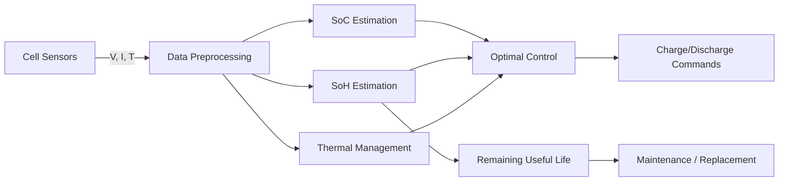

# AI for Energy Storage and Battery Management Systems

## Overview

Energy storage is the linchpin of the clean energy transition. Without storage, renewable energy can only be used when the sun shines or the wind blows. Lithium-ion batteries dominate today's storage landscape — from Tesla Megapacks storing gigawatt-hours at grid scale to the cells in your phone — and AI is transforming how these batteries are designed, operated, and managed throughout their lifecycle.

A Battery Management System (BMS) is the electronic brain of a battery pack. It monitors cell voltages, currents, and temperatures, estimates the State of Charge (SoC) and State of Health (SoH), balances cells, and enforces safety limits. Traditional BMS algorithms use equivalent circuit models with extended Kalman filters, but these struggle with the nonlinear, aging-dependent behavior of real batteries. Machine learning is replacing these hand-tuned models with data-driven approaches that improve accuracy and adapt over time.

At grid scale, the challenge shifts from battery physics to market economics: when should a 100 MW battery charge and discharge to maximize revenue from energy arbitrage, frequency regulation, and capacity markets? This is a sequential decision problem under uncertainty (prices, renewable generation, demand) — a natural fit for reinforcement learning.

The battery lifecycle presents distinct AI opportunities:

1. **Design**: ML-accelerated materials discovery and cell design optimization
2. **Manufacturing**: Quality prediction and defect detection on production lines
3. **Operation**: Real-time SoC/SoH estimation and optimal charge/discharge control
4. **Second life**: Predicting remaining useful life for repurposing EV batteries as grid storage
5. **Recycling**: Automated sorting and materials recovery optimization

**Battery Management AI Pipeline**



## Key Concepts

- **State of Charge (SoC)**: The current charge level as a fraction of capacity, analogous to a fuel gauge. Accurate SoC estimation prevents overcharge (safety) and over-discharge (degradation).
- **State of Health (SoH)**: The ratio of current capacity to original capacity, indicating battery aging. SoH drops from 100% to ~80% over the battery's useful life (typically 1000–3000 cycles for Li-ion).
- **Equivalent Circuit Model (ECM)**: Represents the battery as a voltage source with internal resistance and RC networks. Parameters drift with aging, requiring periodic recalibration — or replacement with learned models.
- **Electrochemical Impedance Spectroscopy (EIS)**: Measures battery impedance across frequencies to diagnose degradation mechanisms. ML can extract SoH from EIS spectra in seconds.
- **Energy Arbitrage**: Buying electricity when cheap (off-peak, high renewable) and selling when expensive (peak). Battery revenue = price spread × efficiency − degradation cost.
- **Calendar and Cycle Aging**: Batteries degrade both from use (cycle aging: charge/discharge) and from time (calendar aging: temperature, SoC level). ML models capture both mechanisms.

## Core Mathematics

The equivalent circuit model relates terminal voltage to SoC:

$$V_t = \text{OCV}(\text{SoC}) - I \cdot R_0 - V_{RC}$$

where OCV is the open-circuit voltage (a nonlinear function of SoC), $R_0$ is ohmic resistance, and $V_{RC}$ is the voltage across the RC network:

$$\frac{dV_{RC}}{dt} = \frac{I}{C_1} - \frac{V_{RC}}{R_1 C_1}$$

SoC dynamics via Coulomb counting:

$$\text{SoC}(t) = \text{SoC}(t_0) - \frac{1}{Q_{\text{nom}}} \int_{t_0}^{t} I(\tau) \, d\tau$$

where $Q_{\text{nom}}$ is the nominal capacity (Ah). Coulomb counting drifts over time due to measurement noise — ML-based estimators correct this.

Battery degradation (semi-empirical model):

$$Q_{\text{loss}} = A \cdot \exp\left(-\frac{E_a}{RT}\right) \cdot (\text{Ah-throughput})^{0.5}$$

where $A$ is a pre-exponential factor, $E_a$ is activation energy, $R$ is gas constant, and $T$ is temperature. The square-root dependence on throughput is a common empirical finding.

The energy arbitrage optimization:

$$\max_{p_t} \sum_{t=1}^{T} c_t \cdot p_t \cdot \Delta t - \lambda \cdot \text{degradation}(p_t)$$

subject to $\text{SoC}^{\min} \leq \text{SoC}_t \leq \text{SoC}^{\max}$ and $|p_t| \leq P^{\max}$.

## Code Examples

```python
import numpy as np
import torch
import torch.nn as nn

class SoCEstimator(nn.Module):
    """
    LSTM-based State of Charge estimator.
    Input: time series of (voltage, current, temperature).
    Output: SoC estimate at each timestep.
    """

    def __init__(self, input_dim: int = 3, hidden_dim: int = 64, num_layers: int = 2):
        super().__init__()
        self.lstm = nn.LSTM(input_dim, hidden_dim, num_layers,
                            batch_first=True, dropout=0.1)
        self.fc = nn.Linear(hidden_dim, 1)
        self.sigmoid = nn.Sigmoid()

    def forward(self, x: torch.Tensor) -> torch.Tensor:
        # x: (batch, seq_len, 3) — [voltage, current, temperature]
        out, _ = self.lstm(x)
        soc = self.sigmoid(self.fc(out))  # SoC ∈ [0, 1]
        return soc.squeeze(-1)

# Example
model = SoCEstimator()
# Simulate a discharge cycle: 100 timesteps, batch of 8
x = torch.randn(8, 100, 3)
soc_pred = model(x)
print(f"SoC predictions shape: {soc_pred.shape}")  # (8, 100)
```

```python
def simulate_battery_arbitrage(
    prices: np.ndarray,
    capacity_kwh: float = 100.0,
    max_power_kw: float = 50.0,
    efficiency: float = 0.90,
    soc_min: float = 0.1,
    soc_max: float = 0.9,
    dt: float = 1.0  # hours
) -> dict:
    """
    Simple threshold-based arbitrage strategy:
    charge when price < median, discharge when price > 75th percentile.
    """
    median_price = np.median(prices)
    high_price = np.percentile(prices, 75)

    soc = 0.5  # start at 50%
    revenue = 0.0
    soc_history = [soc]

    for t, price in enumerate(prices):
        if price < median_price and soc < soc_max:
            # Charge
            power = min(max_power_kw, (soc_max - soc) * capacity_kwh / dt)
            energy = power * dt * efficiency
            soc += energy / capacity_kwh
            revenue -= power * dt * price  # pay for charging
        elif price > high_price and soc > soc_min:
            # Discharge
            power = min(max_power_kw, (soc - soc_min) * capacity_kwh / dt)
            energy = power * dt / efficiency
            soc -= power * dt / capacity_kwh
            revenue += energy * price  # earn from discharging
        soc_history.append(soc)

    return {
        'total_revenue': revenue,
        'final_soc': soc,
        'soc_history': np.array(soc_history),
        'n_cycles': sum(1 for i in range(1, len(soc_history))
                       if (soc_history[i] - soc_history[i-1]) *
                          (soc_history[i-1] - soc_history[max(0, i-2)]) < 0) / 2
    }

# Example: 24-hour price profile
prices = np.array([0.04, 0.03, 0.03, 0.03, 0.04, 0.05, 0.08, 0.12,
                    0.15, 0.13, 0.11, 0.10, 0.09, 0.10, 0.14, 0.18,
                    0.22, 0.25, 0.20, 0.15, 0.10, 0.07, 0.05, 0.04])
result = simulate_battery_arbitrage(prices)
print(f"Revenue: ${result['total_revenue']:.2f}")
print(f"Approx. cycles: {result['n_cycles']:.1f}")
```

## Exercises

1. **SoC Estimation**: Generate synthetic battery discharge data (voltage vs. SoC from a known OCV curve + noise) and train the SoCEstimator LSTM. Compare with Coulomb counting accuracy.
2. **Degradation Modeling**: Using the Severson et al. (2019) public dataset of 124 commercial Li-ion cells, train an ML model to predict cycle life from the first 100 cycles of data.
3. **Arbitrage RL**: Replace the threshold-based arbitrage strategy with a DQN agent. Define actions as {charge at full power, idle, discharge at full power}. Compare revenue over a year of hourly price data.
4. **Second Life Assessment**: An EV battery at 80% SoH is retired. Estimate its remaining useful life for grid storage (where end-of-life is 60% SoH) given the degradation model above.

## Further Reading

- Severson, K. et al. "Data-Driven Prediction of Battery Cycle Life Before Capacity Degradation" — Nature Energy (2019)
- Ng, M. et al. "Predicting the State of Charge and Health of Batteries Using Data-Driven Machine Learning" — Nature Machine Intelligence (2020)
- How, D. et al. "State of Art of SoC and SoH Estimation of Lithium-Ion Batteries" — Applied Energy (2019)
- Battery Archive — open data for battery research: https://batteryarchive.org
