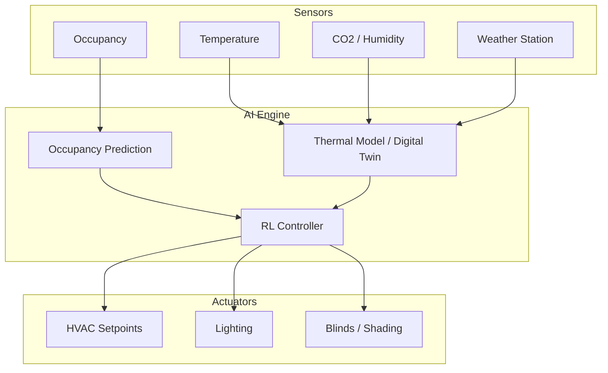

## Building Energy Management and Smart Buildings

## Overview

Buildings consume approximately 40% of global energy and 33% of greenhouse gas emissions, making them one of the largest opportunities for energy savings. Heating, ventilation, and air conditioning (HVAC) alone accounts for roughly half of a building's energy use. Traditional building controls use simple rule-based setpoints — "maintain 72°F from 8 AM to 6 PM" — that ignore occupancy patterns, weather forecasts, electricity prices, and thermal dynamics. AI-powered Building Energy Management Systems (BEMS) can reduce energy consumption by 20–40% while improving occupant comfort.

The key insight is that buildings have significant thermal inertia: a well-insulated building can maintain comfortable temperatures for hours even if HVAC is temporarily reduced. This thermal mass acts as free energy storage — AI can pre-cool or pre-heat buildings during off-peak hours and coast through expensive peak periods, a strategy called thermal load shifting.

Modern smart buildings are instrumented with hundreds of sensors: temperature, humidity, CO₂, occupancy (PIR, cameras, badge access), light levels, plug loads, and outdoor weather stations. Digital twins — physics-based simulation models calibrated with real data — enable what-if analysis and model predictive control (MPC). When combined with reinforcement learning, these systems can learn optimal control strategies that outperform hand-tuned MPC by adapting to building-specific quirks that are difficult to model explicitly.

Google's DeepMind demonstrated this dramatically in 2016 by applying ML to cool Google's data centers, achieving a 40% reduction in cooling energy — equivalent to a 15% reduction in overall PUE (Power Usage Effectiveness). Since then, similar approaches have been applied to commercial buildings, hospitals, and university campuses.

**Smart Building Control Architecture**



## Key Concepts

- **HVAC System**: The heating, ventilation, and air conditioning system — typically the largest energy consumer in commercial buildings. Key components: chillers, boilers, air handling units (AHUs), variable air volume (VAV) boxes, and heat pumps.
- **Model Predictive Control (MPC)**: An optimization-based control strategy that uses a model of the building to predict future states and optimizes control actions over a rolling horizon. MPC can incorporate weather forecasts, occupancy predictions, and price signals.
- **Digital Twin**: A calibrated simulation model of the building that mirrors real-time conditions. Used for MPC, fault detection, and what-if analysis. Tools: EnergyPlus, Modelica, IDA ICE.
- **Occupancy-Based Control**: Adjusting HVAC and lighting based on actual occupancy rather than fixed schedules. Even simple occupancy detection (vacant vs. occupied) can save 15–30% of HVAC energy.
- **Thermal Comfort Models**: PMV/PPD (Predicted Mean Vote / Predicted Percentage Dissatisfied) quantify occupant comfort as a function of temperature, humidity, air speed, and clothing. AI can learn personalized comfort models.
- **Fault Detection and Diagnostics (FDD)**: Identifying HVAC equipment faults (stuck valves, sensor drift, simultaneous heating and cooling) that waste 10–30% of energy. ML-based FDD uses unsupervised anomaly detection on operational data.

## Core Mathematics

Building thermal dynamics (single-zone RC model):

$$C \frac{dT_{\text{in}}}{dt} = \frac{T_{\text{out}} - T_{\text{in}}}{R} + Q_{\text{HVAC}} + Q_{\text{internal}} + Q_{\text{solar}}$$

where $C$ is thermal capacitance (J/K), $R$ is thermal resistance (K/W), $Q_{\text{HVAC}}$ is HVAC heating/cooling power, $Q_{\text{internal}}$ is internal heat gains (people, equipment), and $Q_{\text{solar}}$ is solar heat gain.

The MPC optimization over horizon $H$:

$$\min_{u_0, \ldots, u_{H-1}} \sum_{t=0}^{H-1} \left[ c_t \cdot |Q_{\text{HVAC},t}| + \alpha (T_{\text{in},t} - T_{\text{set}})^2 \right]$$

subject to thermal dynamics constraints and:

$$T^{\min} \leq T_{\text{in},t} \leq T^{\max}, \quad Q_{\text{HVAC}}^{\min} \leq Q_{\text{HVAC},t} \leq Q_{\text{HVAC}}^{\max}$$

Predicted Mean Vote (PMV) thermal comfort:

$$\text{PMV} = f(M, W, I_{cl}, T_a, T_r, v_a, p_a)$$

where $M$ is metabolic rate, $W$ is external work, $I_{cl}$ is clothing insulation, $T_a$ is air temperature, $T_r$ is mean radiant temperature, $v_a$ is air velocity, and $p_a$ is water vapor pressure. PMV ∈ [-3, +3]; comfort zone is $|\text{PMV}| < 0.5$.

## Code Examples

```python
import numpy as np

class BuildingThermalModel:
    """
    Simple RC thermal model of a single-zone building.
    """

    def __init__(self, C: float = 5e6, R: float = 0.005,
                 T_init: float = 22.0, dt: float = 300):
        """
        Args:
            C: thermal capacitance (J/K)
            R: thermal resistance (K/W)
            T_init: initial indoor temperature (°C)
            dt: timestep (seconds)
        """
        self.C = C
        self.R = R
        self.T_in = T_init
        self.dt = dt

    def step(self, T_out: float, Q_hvac: float,
             Q_internal: float = 500, Q_solar: float = 0) -> float:
        """Advance one timestep and return new indoor temperature."""
        dT = (
            (T_out - self.T_in) / self.R
            + Q_hvac
            + Q_internal
            + Q_solar
        ) * self.dt / self.C
        self.T_in += dT
        return self.T_in

def mpc_controller(
    building: BuildingThermalModel,
    T_out_forecast: np.ndarray,
    prices: np.ndarray,
    T_set: float = 22.0,
    T_min: float = 20.0,
    T_max: float = 25.0,
    Q_max: float = 10000,  # watts
    comfort_weight: float = 100.0
) -> float:
    """
    Simple greedy MPC: evaluate a few candidate HVAC actions
    and pick the one with lowest cost over the forecast horizon.
    """
    best_action = 0
    best_cost = float('inf')

    for q_hvac in np.linspace(-Q_max, Q_max, 21):
        # Simulate forward
        sim = BuildingThermalModel(
            C=building.C, R=building.R,
            T_init=building.T_in, dt=building.dt
        )
        cost = 0
        for t in range(min(12, len(T_out_forecast))):
            T_new = sim.step(T_out_forecast[t], q_hvac if t == 0 else 0)
            energy_cost = prices[t] * abs(q_hvac if t == 0 else 0) * building.dt / 3.6e6
            comfort_cost = comfort_weight * max(0, T_new - T_max)**2 + \
                          comfort_weight * max(0, T_min - T_new)**2
            cost += energy_cost + comfort_cost

        if cost < best_cost:
            best_cost = cost
            best_action = q_hvac

    return best_action

# Simulate 24 hours with MPC
building = BuildingThermalModel(T_init=22.0, dt=300)  # 5-min steps
n_steps = 24 * 12  # 288 steps

# Outdoor temperature: sinusoidal with 35°C peak
hours = np.arange(n_steps) / 12
T_out = 28 + 7 * np.sin(2 * np.pi * (hours - 6) / 24)
prices = np.where((hours >= 14) & (hours < 18), 0.25, 0.08)

T_indoor = []
for t in range(n_steps):
    forecast_len = min(12, n_steps - t)
    q = mpc_controller(building, T_out[t:t+forecast_len], prices[t:t+forecast_len])
    T_new = building.step(T_out[t], q)
    T_indoor.append(T_new)

T_indoor = np.array(T_indoor)
print(f"Indoor temp range: {T_indoor.min():.1f}°C — {T_indoor.max():.1f}°C")
print(f"Comfort violations: {np.sum((T_indoor < 20) | (T_indoor > 25))} of {n_steps} steps")
```

## Exercises

1. **Thermal Model Calibration**: Given a week of indoor/outdoor temperature data and HVAC power measurements, fit the RC model parameters ($C$ and $R$) using least squares. Compare the calibrated model's predictions with actual data.
2. **Occupancy Prediction**: Train a classifier to predict hourly occupancy (low/medium/high) from historical badge access and calendar data. How would you integrate this into the MPC controller?
3. **RL for HVAC**: Using CityLearn or Sinergym, train a PPO agent to control HVAC in a simulated building. Compare energy consumption and comfort with the rule-based baseline.
4. **Fault Detection**: Implement an autoencoder-based FDD system. Train on normal HVAC operation data and flag anomalies. What types of faults (stuck damper, sensor drift, refrigerant leak) produce the highest reconstruction errors?

## Further Reading

- Lazrak, A. et al. "Deep Reinforcement Learning for Building HVAC Control" — Energy and AI (2024)
- Zhang, Z. & Lam, K.P. "Practical Implementation and Evaluation of Deep Reinforcement Learning Control for a Radiant Heating System" — ACM BuildSys (2020)
- Wei, T. et al. "Deep Reinforcement Learning for Building HVAC Control" — DAC (2017)
- Sinergym — RL environment for building energy control: https://github.com/ugr-sail/sinergym
