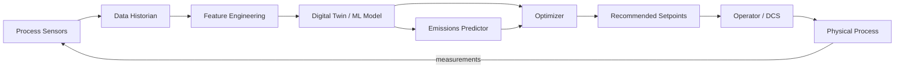

## Industrial Energy Efficiency and Process Optimization

## Overview

Industry consumes approximately 37% of global final energy and produces 24% of direct CO₂ emissions. Heavy industries — cement, steel, chemicals, aluminum, glass — are particularly energy-intensive, with individual plants consuming as much electricity as a small city. Even small percentage improvements in energy efficiency at this scale translate to massive reductions in cost and emissions. AI is enabling a new generation of process optimization that goes beyond what traditional control theory can achieve.

Traditional industrial process control uses Proportional-Integral-Derivative (PID) controllers, model-based control, and operator expertise. These approaches work well for steady-state operations with known dynamics, but struggle with the complexity, nonlinearity, and variability of real industrial processes. A cement kiln, for example, involves coupled heat transfer, chemical reactions, material flow, and fuel combustion — with raw material composition varying by the hour. An experienced operator develops intuition over decades; AI can capture and exceed this expertise from historical data.

The opportunity is enormous. The IEA estimates that AI-driven efficiency improvements could reduce industrial energy consumption by 10–20%, equivalent to the total electricity consumption of Japan. Companies like Google (data center cooling), HeidelbergCement (kiln optimization), and BASF (chemical process optimization) are already deploying AI at scale.

Key application areas include:

- **Combustion optimization**: Adjusting air-fuel ratios, temperatures, and pressures in boilers and kilns to minimize fuel consumption while maintaining product quality
- **Process scheduling**: Optimizing batch sequences and equipment utilization to minimize energy waste during transitions
- **Predictive maintenance**: Detecting degradation that causes energy waste (fouled heat exchangers, worn bearings, air leaks)
- **Emissions monitoring**: Real-time prediction of NOₓ, SO₂, and CO₂ emissions using soft sensors (ML models trained on process data)

**Industrial AI Optimization Loop**



## Key Concepts

- **Distributed Control System (DCS)**: The industrial automation system that controls process variables (temperature, pressure, flow, level) in real time. AI augments the DCS by providing optimal setpoints.
- **Specific Energy Consumption (SEC)**: Energy consumed per unit of product (e.g., kWh/tonne of cement, GJ/tonne of steel). The key metric for benchmarking and optimization.
- **Soft Sensors**: ML models that predict hard-to-measure variables (product quality, emissions) from easily measured process data. Replace expensive physical analyzers.
- **Combustion Efficiency**: The fraction of fuel energy converted to useful heat. Losses come from incomplete combustion (CO in flue gas), excess air (hot gas up the stack), and radiation. AI optimizes the air-fuel ratio in real time.
- **Process Digital Twin**: A physics-informed model of the industrial process that runs in parallel with the real plant, enabling optimization, anomaly detection, and operator training.
- **Carbon Capture and Storage (CCS)**: Technologies to capture CO₂ from industrial flue gases. AI optimizes the energy-intensive capture process (amine scrubbing, membrane separation).

## Core Mathematics

Combustion stoichiometry for methane (natural gas):

$$\text{CH}_4 + 2\text{O}_2 \rightarrow \text{CO}_2 + 2\text{H}_2\text{O} + \Delta H$$

where $\Delta H = -890$ kJ/mol. The excess air ratio:

$$\lambda = \frac{\text{actual air}}{\text{stoichiometric air}} = 1 + \frac{O_{2,\text{flue}}}{21 - O_{2,\text{flue}}} \cdot \frac{100}{100}$$

Optimal $\lambda$ balances incomplete combustion ($\lambda < 1$, CO emissions) vs. stack losses ($\lambda \gg 1$, excess hot exhaust). AI finds the dynamic optimum.

Specific energy consumption:

$$\text{SEC} = \frac{\sum_i E_i}{\text{production volume}} \quad \left[\frac{\text{kWh}}{\text{tonne}}\right]$$

Process optimization as a constrained problem:

$$\min_{\mathbf{u}} \text{SEC}(\mathbf{u}) \quad \text{s.t.} \quad q(\mathbf{u}) \geq q_{\min}, \; \text{emissions}(\mathbf{u}) \leq e_{\max}, \; \mathbf{u} \in \mathcal{U}$$

where $\mathbf{u}$ is the vector of controllable setpoints, $q$ is product quality, and $\mathcal{U}$ is the feasible operating region.

For NOₓ prediction (soft sensor), a typical model:

$$\text{NO}_x = f(T_{\text{flame}}, O_{2,\text{excess}}, \text{fuel rate}, \text{air preheat}, \ldots)$$

learned via gradient boosting or neural network from historical DCS data.

## Code Examples

```python
import numpy as np
from sklearn.ensemble import GradientBoostingRegressor
from sklearn.model_selection import train_test_split

def train_combustion_optimizer(process_data: np.ndarray, energy_labels: np.ndarray):
    """
    Train a surrogate model for combustion energy consumption,
    then find optimal setpoints via grid search.

    Args:
        process_data: (n_samples, n_features) — air ratio, fuel rate, temperature, etc.
        energy_labels: (n_samples,) — specific energy consumption (kWh/tonne)

    Returns:
        optimal_setpoints, model
    """
    X_train, X_test, y_train, y_test = train_test_split(
        process_data, energy_labels, test_size=0.2, random_state=42
    )

    model = GradientBoostingRegressor(n_estimators=200, max_depth=5, random_state=42)
    model.fit(X_train, y_train)

    train_score = model.score(X_train, y_train)
    test_score = model.score(X_test, y_test)
    print(f"Train R²: {train_score:.3f}, Test R²: {test_score:.3f}")

    # Grid search for optimal setpoints within safe operating bounds
    bounds = np.column_stack([process_data.min(axis=0), process_data.max(axis=0)])
    best_sec = float('inf')
    best_setpoints = None

    for _ in range(100000):
        candidate = np.array([
            np.random.uniform(bounds[j, 0], bounds[j, 1])
            for j in range(process_data.shape[1])
        ])
        sec = model.predict(candidate.reshape(1, -1))[0]
        if sec < best_sec:
            best_sec = sec
            best_setpoints = candidate

    return best_setpoints, best_sec, model

# Simulate cement kiln process data
np.random.seed(42)
n = 5000
air_ratio = 1.05 + np.random.rand(n) * 0.3       # excess air ratio (1.05 - 1.35)
fuel_rate = 80 + np.random.rand(n) * 40           # fuel rate (80-120 units)
feed_rate = 200 + np.random.rand(n) * 100          # raw material feed rate
kiln_speed = 2.0 + np.random.rand(n) * 1.5        # kiln rotation speed (rpm)

# Simulated SEC with complex dependencies
sec = (
    50 + 20 * (air_ratio - 1.15)**2      # optimal air ratio ~1.15
    + 0.3 * fuel_rate
    - 0.1 * feed_rate
    + 5 * np.sin(kiln_speed * 2)
    + np.random.randn(n) * 2              # noise
)

process_data = np.column_stack([air_ratio, fuel_rate, feed_rate, kiln_speed])
optimal, best_sec, model = train_combustion_optimizer(process_data, sec)
print(f"\nOptimal SEC: {best_sec:.1f} kWh/tonne")
print(f"Current avg SEC: {sec.mean():.1f} kWh/tonne")
print(f"Potential savings: {(sec.mean() - best_sec) / sec.mean() * 100:.1f}%")
```

```python
def nox_soft_sensor(features: np.ndarray, model) -> np.ndarray:
    """
    Predict NOx emissions from process variables using a trained ML model.
    Replaces expensive Continuous Emissions Monitoring Systems (CEMS).
    """
    predictions = model.predict(features)
    # Flag high-emission periods
    threshold = np.percentile(predictions, 95)
    alerts = predictions > threshold
    return predictions, alerts
```

## Exercises

1. **Cement Kiln Optimization**: Using the simulated data above, compare the gradient boosting model with a neural network. Which achieves lower prediction error? Use the better model to find optimal setpoints with Bayesian optimization instead of random search.
2. **Emissions Prediction**: Build a soft sensor for NOₓ emissions using process variables from a power plant dataset (UCI ML repository has relevant datasets). What features are most predictive?
3. **Anomaly Detection**: Train an autoencoder on normal operating data from an industrial process. Use reconstruction error to detect anomalous operating conditions that indicate equipment degradation or energy waste.
4. **Carbon Accounting**: For a steel plant producing 1 million tonnes/year with SEC of 5,500 kWh/tonne, calculate annual CO₂ emissions (using the grid carbon intensity of your country). What SEC reduction is needed to meet a 30% emissions target?

## Further Reading

- Narciso, D. & Martins, F. "Application of Machine Learning Tools for Energy Efficiency in Industry" — Energy Reports (2020)
- IEA, "Energy Efficiency 2024" — analysis of AI for industrial efficiency
- Xenos, D. et al. "Demand-Side Management and Optimal Operation of Industrial Loads" — Applied Energy (2016)
- Google DeepMind, "Safety-First AI for Autonomous Data Centre Cooling and Industrial Control" (2018)
