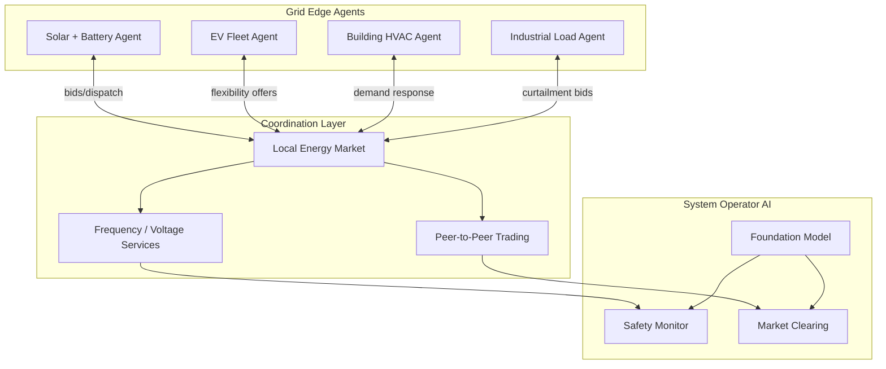

# Frontiers: Autonomous Energy Systems and the Future of Grid AI

## Overview

The energy system of 2035 will look nothing like today's. Instead of a handful of large power plants serving passive consumers, it will be a network of millions of intelligent nodes — solar panels, batteries, EVs, heat pumps, and industrial processes — all coordinating autonomously through AI. This lesson explores the frontier research pushing toward that vision: self-healing grids, multi-agent energy markets, foundation models for power systems, carbon-aware computing, and the path to fully autonomous energy infrastructure.

The driving forces are clear. Climate targets require rapid decarbonization — the IEA's Net Zero scenario demands tripling renewable capacity by 2030. Grid complexity is exploding: the EU alone will have 300 million smart meters, 30 million EVs, and 50 million heat pumps by 2030. No human operator can manage this complexity; autonomy is not a luxury but a necessity.

Several converging AI advances are making autonomous energy systems feasible:

1. **Multi-agent reinforcement learning (MARL)** enables distributed decision-making where each grid node acts as an autonomous agent, negotiating with neighbors to balance local supply and demand.
2. **Foundation models for energy** — large pretrained models on diverse grid data — can transfer knowledge across different grids, climates, and market structures, dramatically reducing deployment time.
3. **Federated learning** allows utilities to train shared models without sharing sensitive customer data, addressing privacy concerns that have slowed AI adoption.
4. **Physics-informed neural networks** embed power system equations into network architectures, ensuring that AI decisions respect physical constraints (Kirchhoff's laws, thermal limits).

**Autonomous Energy System Architecture**



## Key Concepts

- **Self-Healing Grid**: A grid that automatically detects faults, isolates damaged sections, and reroutes power to restore service — all without human intervention. Uses graph neural networks for fault localization and RL for reconfiguration.
- **Multi-Agent Reinforcement Learning (MARL)**: Each DER (solar, battery, EV, building) acts as an RL agent with local observations, learning to cooperate for system-level objectives. Challenges: non-stationarity, scalability, credit assignment.
- **Peer-to-Peer (P2P) Energy Trading**: Prosumers trade excess solar energy directly with neighbors via blockchain or local markets, reducing reliance on centralized utilities. AI agents automate bidding and settlement.
- **Foundation Models for Power Systems**: Large transformer models pretrained on diverse grid operational data (load profiles, weather, market prices) that can be fine-tuned for specific tasks (forecasting, control, anomaly detection) with minimal local data.
- **Carbon-Aware Computing**: Scheduling computational workloads (data centers, ML training) to times and locations where the grid carbon intensity is lowest. Google and Microsoft have deployed this at scale.
- **Federated Learning for Energy**: Training ML models across multiple utilities or buildings without sharing raw data. Addresses GDPR and privacy concerns while enabling collaborative model improvement.
- **Physics-Informed Neural Networks (PINNs) for Grids**: Neural networks with power flow equations embedded as loss terms or architectural constraints, ensuring predictions satisfy Kirchhoff's laws.

## Core Mathematics

Multi-agent energy market clearing. Each agent $i$ submits a bid $(q_i, p_i)$ — quantity and price. The market clears at price $p^*$ where supply equals demand:

$$\sum_{i \in \text{sellers}} q_i(p^*) = \sum_{j \in \text{buyers}} q_j(p^*)$$

In a MARL setting, agent $i$ learns a policy $\pi_i(a_i | o_i)$ that maximizes its expected return:

$$J_i(\pi_i) = \mathbb{E}\left[\sum_{t=0}^{T} \gamma^t r_i(s_t, a_{1,t}, \ldots, a_{N,t})\right]$$

The Nash equilibrium condition (no agent can improve by unilateral deviation):

$$J_i(\pi_i^*, \pi_{-i}^*) \geq J_i(\pi_i, \pi_{-i}^*) \quad \forall \pi_i, \forall i$$

Carbon-aware scheduling optimization:

$$\min_{\mathbf{x}} \sum_{t=1}^{T} \sum_{l=1}^{L} c_l(t) \cdot x_{l,t} \cdot P_{l,t}$$

subject to $\sum_t x_{l,t} = D_l$ (job completion) and $\sum_l P_{l,t} \leq P_{\max}(t)$ (power limits), where $c_l(t)$ is the carbon intensity at location $l$ and time $t$, and $x_{l,t} \in \{0,1\}$ indicates whether job is scheduled.

Federated averaging for energy models:

$$\mathbf{w}^{(k+1)} = \sum_{i=1}^{N} \frac{n_i}{n} \mathbf{w}_i^{(k+1)}$$

where $\mathbf{w}_i^{(k+1)}$ is the locally updated model at utility $i$ and $n_i / n$ is its data fraction.

## Code Examples

```python
import numpy as np

class EnergyMarketAgent:
    """
    Simple autonomous energy agent that learns to bid in a local market.
    Uses Q-learning with discretized state and action spaces.
    """

    def __init__(self, agent_id: str, capacity_kw: float, cost_per_kwh: float,
                 n_price_bins: int = 10, n_soc_bins: int = 10):
        self.id = agent_id
        self.capacity = capacity_kw
        self.cost = cost_per_kwh
        self.n_actions = 5  # bid quantities: 0%, 25%, 50%, 75%, 100% of capacity

        # Q-table: (price_bin, soc_bin) -> action values
        self.q_table = np.zeros((n_price_bins, n_soc_bins, self.n_actions))
        self.lr = 0.1
        self.gamma = 0.95
        self.epsilon = 0.3

    def get_action(self, price_bin: int, soc_bin: int) -> int:
        if np.random.rand() < self.epsilon:
            return np.random.randint(self.n_actions)
        return int(np.argmax(self.q_table[price_bin, soc_bin]))

    def update(self, state: tuple, action: int, reward: float, next_state: tuple):
        s, a = state + (action,), next_state
        best_next = np.max(self.q_table[next_state])
        td_target = reward + self.gamma * best_next
        self.q_table[s] += self.lr * (td_target - self.q_table[s])

def simulate_local_market(agents: list[EnergyMarketAgent], n_rounds: int = 1000):
    """Simulate a local energy market with multiple agents."""
    for round_idx in range(n_rounds):
        # Random market conditions
        price_bin = np.random.randint(10)
        soc_bins = [np.random.randint(10) for _ in agents]

        # Agents submit bids
        actions = []
        for i, agent in enumerate(agents):
            a = agent.get_action(price_bin, soc_bins[i])
            actions.append(a)

        # Market clearing (simplified)
        total_supply = sum(
            a / 4 * agent.capacity for a, agent in zip(actions, agents) if a > 0
        )
        clearing_price = 0.10 + 0.02 * (10 - price_bin) - 0.001 * total_supply

        # Rewards: revenue - cost
        for i, (agent, action) in enumerate(zip(agents, actions)):
            quantity = action / 4 * agent.capacity
            revenue = clearing_price * quantity
            cost = agent.cost * quantity
            reward = revenue - cost

            next_price = np.random.randint(10)
            next_soc = np.random.randint(10)
            agent.update((price_bin, soc_bins[i]), action, reward, (next_price, next_soc))

    return agents

# Create and train agents
agents = [
    EnergyMarketAgent("solar_1", capacity_kw=50, cost_per_kwh=0.02),
    EnergyMarketAgent("battery_1", capacity_kw=30, cost_per_kwh=0.05),
    EnergyMarketAgent("wind_1", capacity_kw=40, cost_per_kwh=0.03),
]
trained_agents = simulate_local_market(agents, n_rounds=5000)

for agent in trained_agents:
    avg_q = agent.q_table.mean()
    print(f"Agent {agent.id}: avg Q-value = {avg_q:.3f}")
```

```python
def carbon_aware_scheduler(
    job_energy_kwh: float,
    carbon_intensities: np.ndarray,
    power_limits: np.ndarray,
    dt: float = 1.0
) -> np.ndarray:
    """
    Schedule a flexible compute job to minimize carbon emissions.

    Args:
        job_energy_kwh: total energy needed
        carbon_intensities: (T,) gCO2/kWh at each time slot
        power_limits: (T,) max power available (kW)
        dt: slot duration (hours)

    Returns:
        schedule: (T,) power consumption at each slot
    """
    T = len(carbon_intensities)
    # Greedy: schedule in order of lowest carbon intensity
    schedule = np.zeros(T)
    remaining = job_energy_kwh

    # Sort time slots by carbon intensity
    order = np.argsort(carbon_intensities)

    for t in order:
        if remaining <= 0:
            break
        available = power_limits[t] * dt
        allocated = min(remaining, available)
        schedule[t] = allocated / dt  # kW
        remaining -= allocated

    total_carbon = np.sum(schedule * dt * carbon_intensities)
    baseline_carbon = job_energy_kwh * np.mean(carbon_intensities)
    print(f"Carbon savings: {(1 - total_carbon/baseline_carbon)*100:.1f}%")
    return schedule

# Example: 24-hour carbon intensity profile
carbon = np.array([400, 380, 350, 320, 310, 300, 280, 250, 200, 180,
                    160, 150, 140, 130, 120, 150, 200, 300, 350, 380,
                    400, 420, 410, 405])  # gCO2/kWh
power_lim = np.full(24, 100.0)  # 100 kW max

schedule = carbon_aware_scheduler(500, carbon, power_lim)
```

## Exercises

1. **MARL Grid**: Extend the market simulation to include demand agents (consumers bidding for power). Implement a double auction mechanism. Does the market converge to a stable clearing price?
2. **Self-Healing Grid**: Design an algorithm for automatic fault isolation in a radial distribution network (tree topology). Given a fault location, determine which switches to open/close to maximize restored load.
3. **Carbon-Aware Training**: Calculate the carbon savings from training a large ML model (1000 GPU-hours, 300W/GPU) by shifting to nighttime hours when wind generation peaks. Use real-time grid carbon data from electricitymaps.com.
4. **Foundation Model Design**: Propose an architecture for a foundation model for power systems. What pretraining tasks would you use? How would you handle the heterogeneity of different grid topologies and market structures?
5. **Federated Forecasting**: Implement federated averaging for load forecasting across 3 simulated buildings. Compare the federated model's accuracy with individually trained models and a centrally trained model.

## Further Reading

- Wang, J. et al. "Multi-Agent Reinforcement Learning for Active Voltage Control on Power Distribution Networks" — NeurIPS (2021)
- Radford, A. et al. "PowerGPT: A Foundation Model for Power Systems" — preprint (2024)
- Dodge, J. et al. "Measuring the Carbon Intensity of AI in Cloud Instances" — FAccT (2022)
- Electricity Maps — real-time carbon intensity data: https://electricitymaps.com
- Grid2Op — RL environment for power grid management: https://github.com/rte-france/Grid2Op
