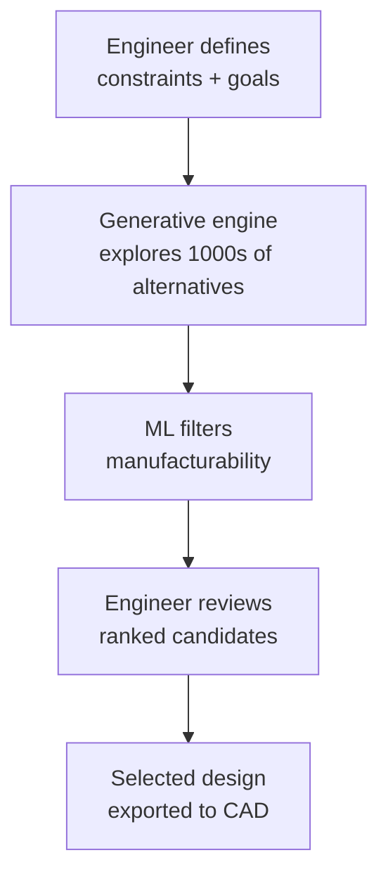

# AI for Structural Engineering and Design Optimization

## Overview

Structural engineering is the art and science of designing buildings, bridges, towers, and other load-bearing structures that safely withstand environmental forces — gravity, wind, earthquakes, and snow. Traditionally, structural engineers iterate on designs using rules of thumb, simplified calculations, and expensive finite element simulations. **AI is transforming this process**, enabling generative design, real-time structural health monitoring, and optimization at scales previously impossible.

This lesson covers three major application areas: topology optimization (generating material distributions within a design domain), generative design (exploring design alternatives), and structural health monitoring (detecting damage before catastrophic failure).

---

## Topology Optimization

Topology optimization is a computational method that finds the optimal material distribution within a given design domain to minimize compliance (maximize stiffness) under given loads and constraints. Unlike shape optimization (which deforms an existing boundary) or sizing optimization (which adjusts member cross-sections), topology optimization can produce entirely new structural forms — including holes, trusses, and complex internal geometries.

### Mathematical Formulation

Given a design domain $\Omega$ with volume fraction constraint $V^*$, the topology optimization problem is:

$$\min_{\rho} \quad C(\rho) = \mathbf{U}^T \mathbf{K} \mathbf{U} = \sum_{e=1}^{N} \left(\rho_e\right)^p \mathbf{u}_e^T \mathbf{k}_e \mathbf{u}_e$$

where $\rho_e$ is the relative density of element $e$ (between 0 and 1), $\mathbf{K}$ is the global stiffness matrix, $\mathbf{U}$ is the displacement vector, and $p$ is the SIMP (Solid Isotropic Material with Penalization) penalty exponent.

The filter modifies densities to produce crisp 0-1 designs:

$$\tilde{\rho}_i = \frac{\sum_{j \in N_i} H_{ij} \rho_j}{\sum_{j \in N_i} H_{ij}}, \quad H_{ij} = \max(0, r - \Delta_{ij})$$

### Neural Network Approaches

Recent work replaces iterative optimization with feed-forward networks that learn the mapping from design domain + loads to optimal density distribution:

```python
import torch
import torch.nn as nn

class TopoNet(nn.Module):
    """Learns topology optimization solutions."""
    def __init__(self, input_channels=3):
        super().__init__()
        self.encoder = nn.Sequential(
            nn.Conv2d(input_channels, 64, 3, padding=1),
            nn.ReLU(),
            nn.Conv2d(64, 128, 3, padding=1),
            nn.ReLU(),
            nn.Conv2d(128, 128, 3, padding=1),
            nn.ReLU()
        )
        self.decoder = nn.Sequential(
            nn.Conv2d(128, 64, 3, padding=1),
            nn.ReLU(),
            nn.Conv2d(64, 1, 1),
            nn.Sigmoid()  # Density output [0, 1]
        )

    def forward(self, x):
        features = self.encoder(x)
        return self.decoder(features)
```

Training uses supervised learning: for each (design domain, boundary conditions) pair, the network is trained to reproduce the density field from classical SIMP optimization. Once trained, inference is orders of magnitude faster than iterative optimization.

---

## Generative Design

Generative design takes topology optimization further: instead of a single optimal design, it explores thousands of design alternatives that satisfy constraints, then ranks them by multiple objectives (weight, cost, carbon footprint, manufacturability).

### Autodesk DreamCraft and Generative Design

Autodesk's generative design platform (DreamConfig, integrated into Fusion 360) works as follows:

1. **Define design space**: Engineer specifies material, manufacturing method (CNC, casting, 3D printing), cost constraints, and functional requirements.
2. **Algorithmic exploration**: The system explores thousands of design alternatives using evolutionary algorithms.
3. **AI ranking**: Machine learning models predict manufacturability and performance, filtering out impractical designs.
4. **Human selection**: Engineer reviews 10-100 candidate designs, selects one, and refines.



### Reinforcement Learning for Structural Design

RL has been applied to large-scale structural design problems. The agent receives rewards for designs that minimize compliance while satisfying stress and displacement constraints. Recent work (e.g., "Design with reinforcement learning" by Raina et al.) uses graph neural networks to represent structural systems and policy gradients to optimize member sizes and configurations.

---

## Structural Health Monitoring

Bridges, dams, and high-rise buildings are instrumented with accelerometers, strain gauges, and displacement sensors. AI transforms this sensor data into actionable damage assessments.

### Vibration-Based Damage Detection

Every structure has natural frequencies and mode shapes that depend on its mass and stiffness distribution. Damage changes local stiffness, shifting frequencies and altering mode shapes. CNNs trained on simulated modal data can detect and localize damage:

```python
import torch
from torch.utils.data import DataLoader

class DamageClassifier(nn.Module):
    def __init__(self, n_frequencies=20, n_locations=10):
        super().__init__()
        self.fc = nn.Sequential(
            nn.Linear(n_frequencies, 64),
            nn.ReLU(),
            nn.Linear(64, 128),
            nn.ReLU(),
            nn.Linear(128, n_locations),  # Damage location
            nn.Softmax(dim=1)
        )

    def forward(self, freq_shifts):
        # freq_shifts: tensor of natural frequency changes
        return self.fc(freq_shifts)
```

### Digital Twins for Bridges

Modern bridges increasingly operate with **digital twins** — real-time physics-based simulations calibrated to sensor data. The digital twin continuously updates its model as environmental conditions and load patterns change. Anomalies in sensor readings trigger ML-based damage detection, which propagates the uncertainty through the digital twin to estimate remaining service life.

---

## Key Takeaways

- Topology optimization generates optimal material distributions within a design domain; neural networks can learn to predict these distributions orders of magnitude faster than iterative solvers.
- Generative design explores thousands of design alternatives using evolutionary algorithms and ML filtering, outputting ranked candidates for human selection.
- Structural health monitoring uses vibration data, strain readings, and digital twins to detect and localize damage before catastrophic failure.
- AI does not replace structural engineers — it amplifies their ability to explore design spaces and monitor infrastructure safety.

---

## Further Reading

- Bendsoe & Sigmund, "Topology Optimization: Theory, Methods, and Applications" (Springer)
- SIMP method: Bendsøe (1989), "Optimal shape design as a material distribution problem"
- Raina et al., "Design with reinforcement learning" (ML for physical sciences workshop, 2021)
- Autodesk generative design documentation: https://www.autodesk.com/solutions/generative-design
- Worden et al., "Damage detection and prognosis" (Mechanical Systems and Signal Processing)
