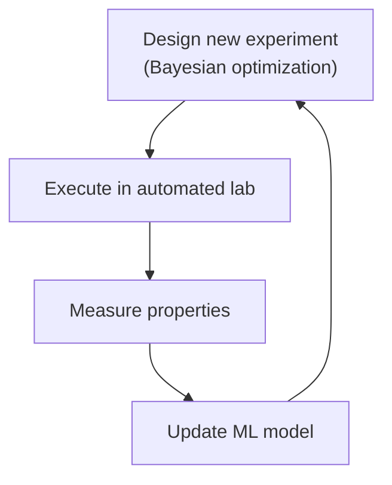

# AI for Materials Engineering

## Overview

Materials engineering is the discipline that connects microstructure — the arrangement of atoms, defects, and phases at the nanoscale — to macroscopic properties like strength, toughness, conductivity, and corrosion resistance. Developing new materials traditionally requires years of trial-and-error experimentation. **AI is compressing this timeline dramatically** by predicting properties from composition and processing, guiding experiments, and even discovering novel material candidates.

This lesson covers machine learning for microstructure-property relationships, uncertainty quantification in materials simulation, and autonomous materials discovery.

---

## Microstructure-Property Linkages

The central problem in computational materials science: given a material's composition and processing history, what properties will it have? This is a multiscale problem — atomic-level defects determine macroscopic behavior.

### Feature Engineering for Materials

Materials are described by **descriptors**: numerical features that capture composition and structure. Effective descriptors are critical for ML performance:

```python
import numpy as np
from sklearn.preprocessing import StandardScaler

def compute_composition_features(element_list, fractions):
    """
    Compute composition-based features for a material.
    Uses element property statistics (mean, std, range, etc.)
    """
    # Elemental properties from periodic table
    properties = {
        ' Electronegativity': np.array([2.20, 3.44, ...]),  # Pauling electronegativity
        ' Atomic Radius': np.array([1.80, 1.53, ...]),    # Angstroms
        ' Valence': np.array([1, 2, ...]),
        ' Melting Point': np.array([923, 1560, ...]),     # Kelvin
        ' Density': np.array([2.70, 7.87, ...]),           # g/cm^3
    }

    features = []
    for prop_name, prop_values in properties.items():
        mean = np.sum(fractions * prop_values)
        std = np.sqrt(np.sum(fractions * (prop_values - mean)**2))
        max_val = np.max(prop_values)
        min_val = np.min(prop_values)
        features.extend([mean, std, max_val, min_val])

    return np.array(features)

def compute_structure_features(crystal_lattice, atom_positions):
    """
    Compute structure-based features for crystalline materials.
    Uses radial distribution function (RDF) statistics.
    """
    # Simplified RDF computation
    distances = []
    for i, pos_i in enumerate(atom_positions):
        for j, pos_j in enumerate(atom_positions):
            if i < j:
                distances.append(np.linalg.norm(pos_i - pos_j))

    # Bin into histogram features
    rdf_hist, _ = np.histogram(distances, bins=50, range=(0, 10))
    return rdf_hist / rdf_hist.sum()  # Normalized RDF
```

### Gradient Boosting for Property Prediction

Gradient boosting models (XGBoost, LightGBM) have become the workhorse for materials property prediction:

```python
import lightgbm as lgb
import numpy as np

def train_materials_predictor(X_train, y_train):
    """
    X_train: [n_samples, n_features] composition + structure descriptors
    y_train: [n_samples] target property (e.g., bulk modulus, yield strength)
    """
    train_data = lgb.Dataset(X_train, label=y_train)

    params = {
        'objective': 'regression',
        'metric': 'rmse',
        'num_leaves': 63,
        'learning_rate': 0.05,
        'feature_fraction': 0.8,
        'bagging_fraction': 0.8,
        'bagging_freq': 5,
        'min_data_in_leaf': 5
    }

    model = lgb.train(params, train_data, num_boost_round=1000)
    return model
```

### Graph Neural Networks for Crystals

CNNs and LSTMs struggle with irregular crystal structures. **Crystal Graph Convolutional Neural Networks (CGCNN)** represent crystals as graphs:

```python
import torch
import torch.nn as nn

class CGCNN(nn.Module):
    """Crystal Graph Convolutional Neural Network for property prediction."""
    def __init__(self, atom_feature_dim=92, nbr_feature_dim=41,
                 embedding_dim=64, num_conv=3, n_classes=1):
        super().__init__()
        # Atom embedding
        self.atom_embedding = nn.Linear(atom_feature_dim, embedding_dim)
        # Edge (bond) embedding
        self.bond_embedding = nn.Linear(nbr_feature_dim, embedding_dim)
        # Convolution layers
        self.convs = nn.ModuleList([
            GraphConv(embedding_dim, embedding_dim) for _ in range(num_conv)
        ])
        # Pooling and prediction
        self.pool = nn.Linear(embedding_dim, embedding_dim)
        self.predictor = nn.Linear(embedding_dim, n_classes)

    def forward(self, atom_features, nbr_indices, nbr_features, batch_idx):
        # Atom features: [N_atoms, atom_feature_dim]
        # Nbr indices: [N_atoms, max_n_neighbors]
        # Nbr features: [N_atoms, max_n_neighbors, nbr_feature_dim]
        x = torch.relu(self.atom_embedding(atom_features))

        for conv in self.convs:
            x = conv(x, nbr_indices, nbr_features)

        # Pool to crystal-level representation
        crystal_feat = self.pool(torch.zeros_like(x))
        for i in range(int(batch_idx.max()) + 1):
            mask = (batch_idx == i)
            crystal_feat[mask] = x[mask].mean(dim=0)

        return self.predictor(crystal_feat[:len(atom_features)])

class GraphConv(nn.Module):
    """Graph convolution operation."""
    def __init__(self, in_dim, out_dim):
        super().__init__()
        self.fc = nn.Linear(in_dim, out_dim)

    def forward(self, node_features, nbr_indices, nbr_features):
        # Aggregate neighbor features
        N, K = nbr_indices.shape
        out_dim = node_features.shape[1]
        aggregated = torch.zeros_like(node_features)

        for k in range(K):
            nbr_idx = nbr_indices[:, k]
            nbr_feat = node_features[nbr_idx]
            aggregated += nbr_feat

        aggregated /= K
        return torch.relu(self.fc(aggregated))
```

---

## Uncertainty Quantification in Materials Simulation

Engineering decisions require not just predictions but **uncertainty estimates**. How confident is the model that this new alloy has a yield strength above 500 MPa?

### Bayesian Neural Networks for Uncertainty

```python
class BayesianLinear(nn.Module):
    def __init__(self, in_features, out_features, prior_std=1.0):
        super().__init__()
        self.weight_mean = nn.Parameter(torch.zeros(out_features, in_features))
        self.weight_std = nn.Parameter(torch.ones(out_features, in_features) * prior_std)
        self.bias_mean = nn.Parameter(torch.zeros(out_features))
        self.bias_std = nn.Parameter(torch.ones(out_features) * prior_std)

    def forward(self, x):
        weight = self.weight_mean + torch.randn_like(self.weight_std) * self.weight_std
        bias = self.bias_mean + torch.randn_like(self.bias_std) * self.bias_std
        return x @ weight.T + bias

class BayesianMaterialsNet(nn.Module):
    def __init__(self, input_dim, hidden_dim=128, output_dim=1):
        super().__init__()
        self.layers = nn.ModuleList([
            BayesianLinear(input_dim, hidden_dim),
            BayesianLinear(hidden_dim, hidden_dim),
            BayesianLinear(hidden_dim, hidden_dim),
            BayesianLinear(hidden_dim, output_dim)
        ])

    def predict_with_uncertainty(self, x, n_samples=50):
        """Monte Carlo dropout for uncertainty estimation."""
        predictions = []
        for _ in range(n_samples):
            h = x
            for layer in self.layers:
                h = torch.relu(layer(h))
            predictions.append(h)

        preds = torch.stack(predictions)
        mean = preds.mean(dim=0)
        std = preds.std(dim=0)  # Epistemic uncertainty
        return mean, std
```

### Gaussian Process Regression for Uncertainty

GPR provides built-in uncertainty estimates and is effective for small datasets:

```python
from sklearn.gaussian_process import GaussianProcessRegressor
from sklearn.gaussian_process.kernels import RBF, ConstantKernel

def train_gpr_model(X_train, y_train):
    kernel = ConstantKernel(1.0) * RBF(length_scale=1.0)
    model = GaussianProcessRegressor(
        kernel=kernel,
        n_restarts_optimizer=10,
        alpha=0.01  # Noise variance
    )
    model.fit(X_train, y_train)
    return model

# Predict with uncertainty
def predict_with_uncertainty(model, X_test):
    y_mean, y_std = model.predict(X_test, return_std=True)
    return y_mean, y_std
```

---

## Autonomous Discovery and Self-Driving Labs

The ultimate goal: an autonomous system that proposes, executes, and learns from experiments with minimal human intervention. **Self-driving laboratories** for materials discovery integrate ML planning with automated experimentation:



### Active Learning Loop

```python
def active_learning_loop(materials_predictor, experiment_executor,
                         initial_data, budget=100):
    """
    Iteratively select experiments using Bayesian optimization.
    """
    X_train, y_train = initial_data['compositions'], initial_data['properties']
    model = train_gpr_model(X_train, y_train)

    for iteration in range(budget):
        # Select next experiment using acquisition function
        next_candidate = bayesian_optimization_select(model, search_space)

        # Execute experiment
        measured_property = experiment_executor.run(next_candidate)

        # Update model
        X_train = np.vstack([X_train, next_candidate])
        y_train = np.append(y_train, measured_property)
        model = train_gpr_model(X_train, y_train)

        print(f"Iteration {iteration}: Tested {next_candidate}, Got {measured_property}")

    return X_train, y_train
```

---

## Key Takeaways

- Materials ML uses composition descriptors (elemental properties) and structure descriptors (RDF, crystal graphs) as input features.
- CGCNNs represent crystals as graphs, enabling end-to-end learning from crystal structure to properties without hand-crafted features.
- Uncertainty quantification (Bayesian NNs, GPR) is essential for engineering decisions — providing confidence intervals alongside predictions.
- Self-driving labs integrate Bayesian optimization with automated experimentation for closed-loop materials discovery.

---

## Further Reading

- Xie et al., "Crystal Graph Convolutional Neural Networks for Predicting Material Properties" (Phys. Rev. Materials 2019)
- Rajan, "Materials Informatics: The Materials "Gene" and Data-Driven Materials Science" (MRS Bulletin 2018)
- Häse et al., "Phoenix: A Bayesian Optimization Algorithm for Autonomous Materials Discovery" (arXiv)
- Butler et al., "Machine Learning in Materials Science: The Materials Genome Initiative" (ACS Materials Letters 2020)
- Jha et al., "ElemENT: A Library for Computing Elemental Properties" (arXiv)
