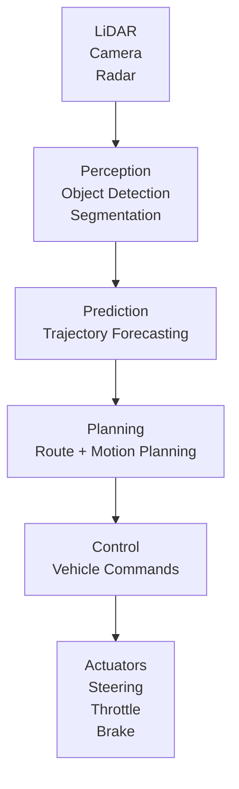

# AI for Autonomous Systems

## Overview

Autonomous systems — self-driving vehicles, drones, and robots operating in the real world — must perceive their environment, predict what will happen next, plan safe actions, and execute them with millisecond latency. These systems are among the most demanding AI applications: they operate in open-world environments, must make decisions with life-or-death consequences, and must generalize from limited data. **AI for autonomy spans perception, prediction, planning, and control** in an integrated stack.

This lesson covers end-to-end driving, neural radiance fields for autonomy, uncertainty-aware planning, and safety verification.

---

## The Autonomous Driving Stack

Modern autonomous vehicles use a modular stack:



### Perception: 3D Object Detection

LiDAR point clouds and camera images are processed to detect vehicles, pedestrians, cyclists, and infrastructure:

```python
import torch
import torch.nn as nn

class PointPillars(nn.Module):
    """
    3D object detection from LiDAR point clouds.
    Used in production systems (Waymo, Zoox).
    """
    def __init__(self, num_classes=3):
        super().__init__()
        # Pillar feature network
        self.pfn = nn.ModuleList([PFNLayer(10, 64), PFNLayer(64, 64)])
        self.scanner = Scanner(64, 512)
        self.backbone = nn.Sequential(
            nn.Conv2d(512, 256, 3, padding=1),
            nn.BatchNorm2d(256),
            nn.ReLU(),
            nn.Conv2d(256, 256, 3, padding=1),
            nn.BatchNorm2d(256),
            nn.ReLU()
        )
        self.detection_head = nn.Conv2d(256, num_classes * 7)  # (x, y, z, w, h, l, theta)

    def forward(self, pillars, coordinates, batch_indices):
        for pfn in self.pfn:
            pillars = pfn(pillars, coordinates, batch_indices)
        spatial_features = self.scanner(pillars, coordinates, batch_indices)
        backbone_features = self.backbone(spatial_features)
        return self.detection_head(backbone_features)

class PFNLayer(nn.Module):
    def __init__(self, in_channels, out_channels):
        super().__init__()
        self.linear = nn.Linear(in_channels, out_channels)
        self.norm = nn.BatchNorm1d(out_channels)

    def forward(self, features, coordinates, batch_indices):
        x = self.linear(features)
        x = self.norm(x.permute(1, 2, 0).contiguous()).permute(2, 0, 1).contiguous()
        return torch.relu(x)
```

### Camera-Based BEV Perception

Bird's Eye View (BEV) perception transforms multi-camera views into a unified top-down representation:

```python
class BEVTransformer(nn.Module):
    """
    Transforms multi-camera images into Bird's Eye View representation.
    Tesla's occupancy network uses this approach.
    """
    def __init__(self, num_cameras=8, bev_size=128, hidden_dim=256):
        super().__init__()
        self.camera_encoders = nn.ModuleList([
            EfficientNetCameraEncoder() for _ in range(num_cameras)
        ])
        self.transformer = nn.TransformerDecoder(
            nn.TransformerDecoderLayer(d_model=hidden_dim, nhead=8),
            num_layers=6
        )
        self.bev_decoder = nn.Sequential(
            nn.Conv2dTranspose(hidden_dim, 128, 4, stride=2, padding=1),
            nn.ReLU(),
            nn.Conv2dTranspose(128, 64, 4, stride=2, padding=1),
            nn.ReLU(),
            nn.Conv2d(64, bev_size, 1)
        )

    def forward(self, multi_camera_images, intrinsics, extrinsics):
        camera_features = [enc(img) for enc, img in zip(self.camera_encoders, multi_camera_images)]
        bev_queries = torch.randn(bev_size, bev_size, hidden_dim)
        bev_features = self.transformer(bev_queries, torch.stack(camera_features))
        bev_grid = bev_features.permute(2, 0, 1).reshape(bev_size, bev_size, -1).permute(2, 0, 1)
        return self.bev_decoder(bev_grid)
```

---

## Neural Radiance Fields for Autonomy

NeRFs (Neural Radiance Fields) represent 3D scenes as continuous functions, enabling novel view synthesis from a few input images. For autonomy, they provide **dense 3D reconstruction for planning and simulation**.

```python
import torch
import torch.nn as nn

class NeRF(nn.Module):
    """Neural Radiance Field for scene representation."""
    def __init__(self, hidden_dim=256, num_layers=8):
        super().__init__()
        self.layers = nn.ModuleList([
            nn.Linear(3 + 3 + 2 * hidden_dim, hidden_dim) for _ in range(num_layers)
        ])
        self.sigma_head = nn.Linear(hidden_dim, 1)
        self.color_head = nn.Sequential(
            nn.Linear(hidden_dim, hidden_dim // 2),
            nn.ReLU(),
            nn.Linear(hidden_dim // 2, 3)
        )
        self.pos_encoding = PositionalEncoding(10)

    def forward(self, ray_origin, ray_direction):
        p = self.pos_encoding(ray_origin)
        d = self.pos_encoding(ray_direction)
        h = torch.cat([p, d], dim=-1)
        for layer in self.layers:
            h = torch.relu(layer(h))
        sigma = torch.relu(self.sigma_head(h))
        color = torch.sigmoid(self.color_head(h))
        return color, sigma
```

---

## Uncertainty-Aware Planning

Planning must account for perception uncertainty, prediction uncertainty, and model uncertainty. **Risk-aware planning** explicitly reasons about uncertainty:

```python
class RiskAwarePlanner(nn.Module):
    def __init__(self, num_agents=20, hidden_dim=128):
        super().__init__()
        self.encoder = nn.GRU(4, hidden_dim, num_layers=2, batch_first=True)
        self.decoder = nn.GRU(hidden_dim, 2, num_layers=2)
        self.cost_predictor = nn.Sequential(
            nn.Linear(hidden_dim * num_agents, 512),
            nn.ReLU(),
            nn.Linear(512, 256),
            nn.ReLU(),
            nn.Linear(256, 1)
        )

    def forward(self, agent_states):
        encoded, _ = self.encoder(agent_states)
        ego_encoded = encoded[:, 0:1]
        action, _ = self.decoder(ego_encoded)
        flat_features = encoded.flatten(1)
        collision_prob = torch.sigmoid(self.cost_predictor(flat_features))
        return action, collision_prob

    def plan_with_ensemble(self, agent_states, n_ensemble=10):
        """Plan under uncertainty using ensemble of predictions."""
        actions = []
        risks = []
        for _ in range(n_ensemble):
            action, risk = self.forward(agent_states)
            actions.append(action)
            risks.append(risk)
        action_mean = torch.stack(actions).mean(dim=0)
        risk_max = torch.stack(risks).max(dim=0).values
        return action_mean, risk_max
```

---

## Key Takeaways

- The autonomous driving stack uses LiDAR/Camera perception, trajectory prediction, motion planning, and control in a modular pipeline.
- 3D object detection (PointPillars) and BEV perception transformers are the dominant perception architectures.
- NeRFs provide dense 3D scene representations for simulation and planning.
- Risk-aware planning uses ensemble methods to quantify and plan under uncertainty.
- Safety verification combines scenario-based testing with formal methods for critical scenarios.

---

## Further Reading

- Lang et al., "PointPillars: Fast Encoders for Object Detection from Point Clouds" (CVPR 2019)
- Tesla AI, "Occupancy Networks" (2019)
- Mildenhall et al., "NeRF: Representing Scenes as Neural Radiance Fields for View Synthesis" (ECCV 2020)
- Wu et al., "Comprehensive Safety Benchmark for Autonomous Vehicles" (NeurIPS 2022)
- Feng et al., "Deep Learning for Autonomous Vehicle Planning" (Springer 2023)
