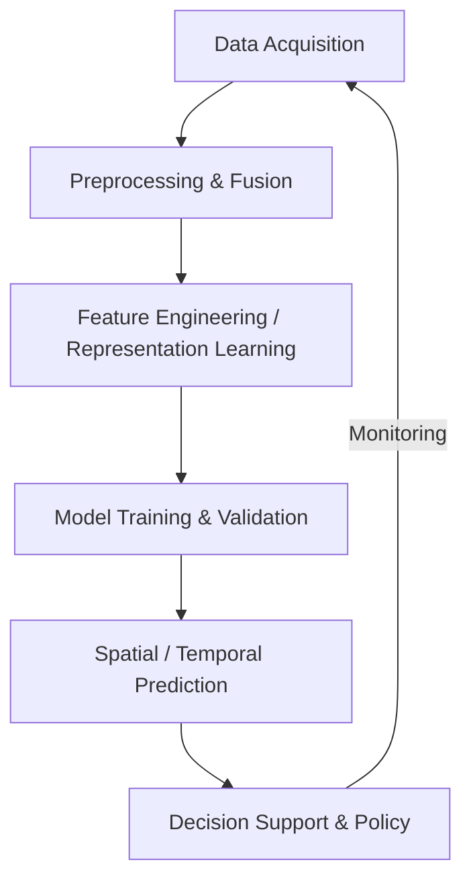

# Introduction to AI for Environmental Science

## Overview

Environmental science sits at the intersection of ecology, atmospheric science, hydrology, oceanography, and geoscience — disciplines that generate vast, heterogeneous datasets spanning satellite imagery, sensor networks, field surveys, and simulation outputs. Traditionally, researchers relied on process-based models grounded in first principles. But as data volumes explode and environmental change accelerates, **artificial intelligence offers new tools to detect patterns, forecast change, and guide interventions** at scales impossible for manual analysis.

This lesson introduces the landscape of AI for environmental science: why the field is both a natural fit and a uniquely challenging domain for machine learning, the history of computational approaches, and the major application areas covered in this track.

---

## Why AI for Environmental Science?

Environmental systems present several characteristics that make AI particularly valuable:

**Scale and complexity.** Earth's environment spans spatial scales from microbiomes in soil to planetary atmospheric circulation, and temporal scales from flash floods lasting hours to glacial cycles spanning millennia. No single process-based model captures all relevant interactions. AI can learn cross-scale relationships directly from data.

**Data abundance with sparse labels.** Satellites generate petabytes of imagery daily, sensor networks log continuous streams of temperature, precipitation, and air quality, and citizen science platforms contribute millions of species observations. Yet labeled ground truth — confirmed species IDs, validated land cover classes, measured carbon fluxes — remains scarce and expensive to obtain.

**Non-stationarity.** Climate change means historical patterns may not predict future conditions. AI models must contend with distribution shift — the environment they're deployed in may differ systematically from their training data.

**Actionable urgency.** Unlike many scientific domains, environmental science directly informs policy decisions with immediate consequences: where to place flood barriers, which forests to protect, how to allocate water during droughts.

---

## A Brief History

### Early Computational Ecology (1960s–1990s)

Quantitative ecology began with population models like the Lotka-Volterra equations and statistical methods for species-abundance distributions. Geographic Information Systems (GIS) emerged in the 1960s, enabling spatial analysis of environmental data:

Key milestones:
- **1960s**: Advent of GIS for land use mapping
- **1970s**: Remote sensing from Landsat satellites
- **1980s**: General Circulation Models (GCMs) for climate
- **1990s**: Species distribution modeling with logistic regression

### Machine Learning Era (2000s–2015)

Random forests and gradient-boosted machines (GBMs) became standard tools for ecology:

- **MaxEnt (2006)** — maximum entropy models for species distribution became the most-cited tool in biodiversity research
- **Random forests** for land cover classification from satellite imagery
- **Support vector machines** for remote sensing applications

### Deep Learning Revolution (2015–Present)

Convolutional neural networks, transformers, and graph neural networks brought step-change improvements:

- **2018**: Microsoft's AI for Earth initiative funded hundreds of environmental AI projects
- **2020**: DeepMind's weather forecasting models began outperforming traditional numerical weather prediction
- **2023**: Foundation models (e.g., Google's MetNet-3, Prithvi) designed specifically for Earth observation data

---

## Key Challenges

### Data Heterogeneity

Environmental data arrives in wildly different formats — satellite multispectral images, point-sensor time series, polygon-based land parcels, species occurrence records with varying spatial precision. Fusing these into coherent model inputs requires careful preprocessing.

### Spatial and Temporal Autocorrelation

Nearby locations and adjacent time steps are correlated, violating the i.i.d. assumption of standard ML. Naive train/test splits leak information:

$$\text{Moran's } I = \frac{n}{\sum_{i}\sum_{j} w_{ij}} \cdot \frac{\sum_{i}\sum_{j} w_{ij}(x_i - \bar{x})(x_j - \bar{x})}{\sum_{i}(x_i - \bar{x})^2}$$

Spatial cross-validation strategies (block CV, leave-one-region-out) are essential.

### Causality vs. Correlation

Observational environmental data is rife with confounders. A model may learn that species X correlates with temperature Y without capturing the mechanistic pathway. For policy-relevant predictions, distinguishing causation from correlation is critical — a theme explored in Lesson 10.

### Interpretability

Ecologists and policymakers need to understand *why* a model makes a prediction. Black-box deep learning models face resistance in conservation planning where decisions must be justified to stakeholders and regulators.

---

## The AI-for-Environment Pipeline

A typical workflow for environmental AI follows this pattern:

| Stage | Tools & Methods |
|-------|----------------|
| Data acquisition | Satellite APIs (Sentinel, Landsat), sensor networks, citizen science (iNaturalist, eBird) |
| Preprocessing | Cloud masking, gap filling, coordinate alignment, temporal compositing |
| Modeling | CNNs, GNNs, transformers, physics-informed neural networks |
| Validation | Spatial block CV, temporal holdout, domain expert review |
| Deployment | Edge inference on drones, cloud-based monitoring dashboards |

---

## What This Track Covers

This track comprises 11 lessons spanning the breadth of environmental AI:

1. **This lesson** — motivation, history, and challenges
2. **Ecological forecasting** — time-series ML for ecosystems
3. **Biodiversity and conservation** — species models, camera traps
4. **Extreme weather and disasters** — flood/drought/heatwave prediction
5. **Earth system modeling** — coupling AI with process-based models
6. **Water resources** — hydrological DL and water quality
7. **Deforestation and land use** — satellite monitoring
8. **Ocean and marine systems** — fisheries, coral reefs, plastic detection
9. **Sustainable cities** — urban AI for energy, transport, infrastructure
10. **Causal AI** — moving beyond correlation for policy
11. **Frontiers** — digital twins, foundation models, ethics

---

## Summary

AI for environmental science is a rapidly growing field where machine learning meets ecological urgency. The combination of abundant observational data, complex multi-scale dynamics, and pressing policy needs makes this domain both fertile ground and a serious test for AI methods. Throughout this track, we'll explore how researchers and practitioners are applying AI to understand, protect, and sustainably manage the natural world.

---

## Further Reading

- Reichstein, M. et al. (2019). "Deep learning and process understanding for data-driven Earth system science." *Nature*, 566, 195–204.
- Tuia, D. et al. (2022). "Perspectives in machine learning for wildlife conservation." *Nature Communications*, 13, 792.
- Rolnick, D. et al. (2022). "Tackling Climate Change with Machine Learning." *ACM Computing Surveys*.
