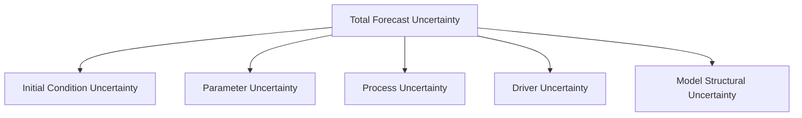
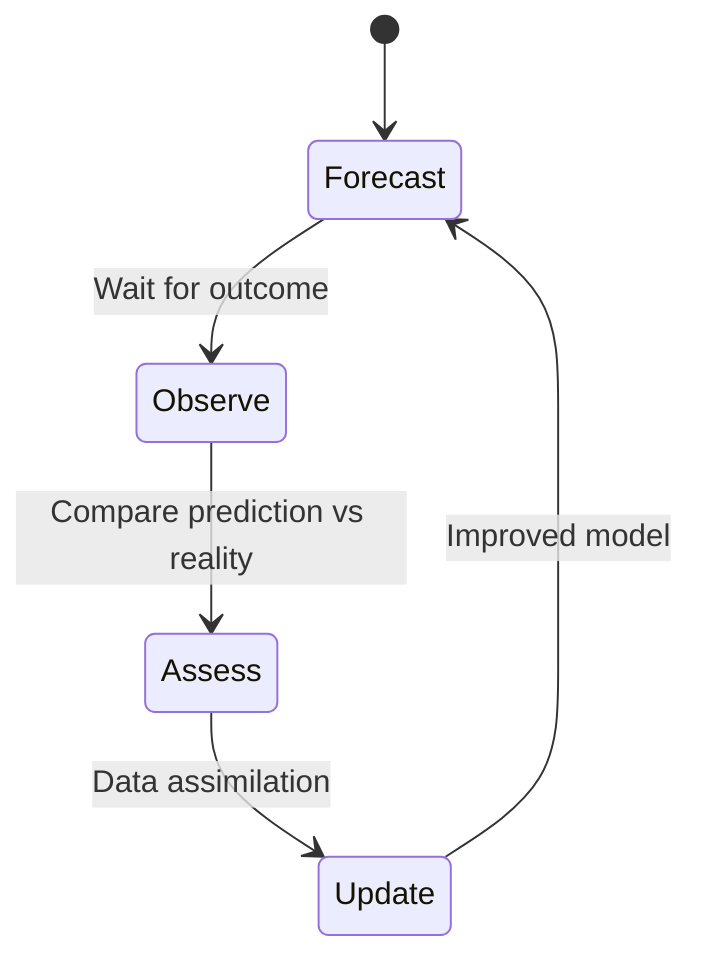

# Ecological Forecasting with Machine Learning

## Overview

Ecological forecasting predicts the future state of ecosystems — from population dynamics of individual species to community composition shifts across landscapes. Traditional approaches rely on mechanistic models like Lotka-Volterra dynamics or matrix population models. Machine learning complements these by learning complex nonlinear relationships from high-dimensional observational data, often with superior short-term predictive accuracy.

This lesson covers time-series forecasting for ecological systems, ensemble approaches for uncertainty quantification, and the interplay between data-driven and process-based models.

---

## Why Forecast Ecosystems?

Ecological forecasts serve critical functions:

- **Conservation planning**: Predicting population declines before species reach critical thresholds
- **Agriculture**: Forecasting pest outbreaks, pollinator activity, and crop disease
- **Public health**: Predicting vector-borne disease risk (mosquito populations, tick-borne disease)
- **Resource management**: Anticipating fish stock changes, timber yields, water availability

The Ecological Forecasting Initiative (EFI) defines a forecast as a probabilistic prediction of the future state of an ecological variable, made before the outcome is observed.

---

## Time-Series Methods for Ecology

### Classical Approaches

Before ML, ecologists used parametric time-series models:

- **ARIMA** for stationary univariate series
- **State-space models** separating process noise from observation error
- **Dynamic linear models** for non-stationary dynamics

These remain useful baselines but struggle with high-dimensional inputs and nonlinear interactions.

### ML Approaches

Modern ML methods for ecological time series include:

**Recurrent Neural Networks (RNNs / LSTMs).** Capture temporal dependencies in sequential data. Widely used for streamflow prediction, phenology forecasting, and population dynamics:

```python
import torch
import torch.nn as nn

class EcoLSTM(nn.Module):
    def __init__(self, input_dim, hidden_dim, output_dim, n_layers=2):
        super().__init__()
        self.lstm = nn.LSTM(input_dim, hidden_dim, n_layers, batch_first=True)
        self.fc = nn.Linear(hidden_dim, output_dim)

    def forward(self, x):
        # x: (batch, seq_len, input_dim)
        lstm_out, _ = self.lstm(x)
        return self.fc(lstm_out[:, -1, :])  # predict from last timestep
```

**Temporal Convolutional Networks (TCNs).** Use dilated causal convolutions to capture long-range dependencies without recurrence. Often faster to train than LSTMs.

**Transformer-based models.** Self-attention mechanisms handle variable-length sequences and capture long-range interactions. Models like Temporal Fusion Transformers excel at multi-horizon forecasting with mixed inputs (static site features + dynamic time series).

---

## Ensemble Forecasting and Uncertainty

Ecological forecasts must quantify uncertainty — decision-makers need to know not just "the population will decline" but "there is a 75% chance the population drops below the viability threshold."

### Sources of Uncertainty



- **Initial conditions**: Imprecise knowledge of current state
- **Parameters**: Uncertain model coefficients
- **Process noise**: Stochastic variability inherent in ecological dynamics
- **Driver uncertainty**: Future weather, land use, etc. are themselves uncertain
- **Structural uncertainty**: Wrong model structure

### Ensemble Methods

Multiple approaches quantify forecast uncertainty:

**Model ensembles.** Train $M$ different model architectures or configurations and combine predictions:

$$\hat{y}(t) = \frac{1}{M}\sum_{m=1}^{M} f_m(x_t), \quad \text{Var}[\hat{y}(t)] \approx \frac{1}{M}\sum_{m=1}^{M}(f_m(x_t) - \hat{y}(t))^2$$

**Monte Carlo Dropout.** Apply dropout at inference time to approximate Bayesian uncertainty:

```python
model.train()  # keep dropout active
predictions = torch.stack([model(x) for _ in range(100)])
mean_pred = predictions.mean(dim=0)
uncertainty = predictions.std(dim=0)
```

**Quantile regression.** Directly predict quantiles of the forecast distribution rather than point estimates.

---

## Phenology Forecasting: A Case Study

Phenology — the timing of seasonal biological events (leaf-out, migration, bloom) — is a key indicator of climate change impacts. ML models predict phenological events using temperature accumulation, photoperiod, and precipitation data.

**Thermal time (growing degree days)**:

$$GDD = \sum_{d=1}^{D} \max(T_d - T_{base}, 0)$$

where $T_d$ is daily mean temperature and $T_{base}$ is the species-specific base temperature. ML models learn nonlinear relationships between accumulated GDD, photoperiod, and phenological timing that simple thermal models miss.

The USA National Phenology Network provides standardized observations across thousands of sites, enabling continental-scale ML models.

---

## Iterative Ecological Forecasting

The near-term ecological forecasting paradigm emphasizes iterative cycles:



This cycle mirrors operational weather forecasting but applies to ecological variables. Key differences:

| Aspect | Weather | Ecology |
|--------|---------|---------|
| Update frequency | Hours | Days to seasons |
| Spatial resolution | km-scale grids | Irregular observation points |
| Process models | Well-constrained PDEs | Partially understood dynamics |
| Data volume | Massive (satellites, radar) | Sparse, noisy |

---

## Hybrid Models: Combining ML with Process Knowledge

Pure ML models can produce ecologically implausible predictions (negative populations, impossible growth rates). Hybrid approaches embed ecological constraints:

**Physics-informed loss functions** penalize predictions that violate conservation laws or biological constraints:

$$\mathcal{L} = \mathcal{L}_{data} + \lambda \cdot \mathcal{L}_{constraint}$$

where $\mathcal{L}_{constraint}$ might enforce non-negative populations or mass balance.

**Neural ODEs for population dynamics** learn the right-hand side of differential equations from data while preserving the dynamical systems framework:

$$\frac{dN}{dt} = f_\theta(N, \mathbf{x}_{env})$$

where $f_\theta$ is a neural network parameterized by $\theta$, $N$ is population state, and $\mathbf{x}_{env}$ are environmental covariates.

---

## Summary

Ecological forecasting with ML offers powerful tools for predicting ecosystem change, but requires careful attention to uncertainty quantification, spatial/temporal structure, and ecological plausibility. The most effective approaches combine data-driven learning with domain knowledge through hybrid modeling, ensemble methods, and iterative forecast-assess cycles.

---

## Further Reading

- Dietze, M. C. (2017). *Ecological Forecasting*. Princeton University Press.
- Thomas, R. Q. et al. (2023). "The NEON Ecological Forecasting Challenge." *Frontiers in Ecology and the Environment*.
- Willard, J. et al. (2022). "Integrating scientific knowledge with machine learning for engineering and environmental systems." *ACM Computing Surveys*.
