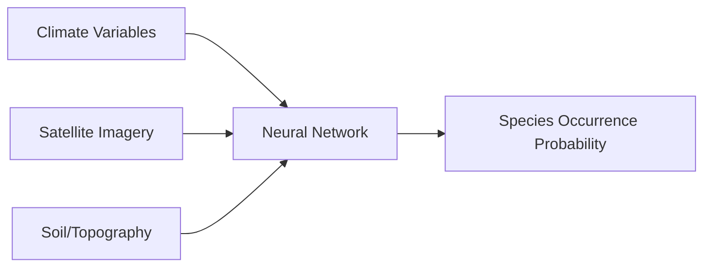
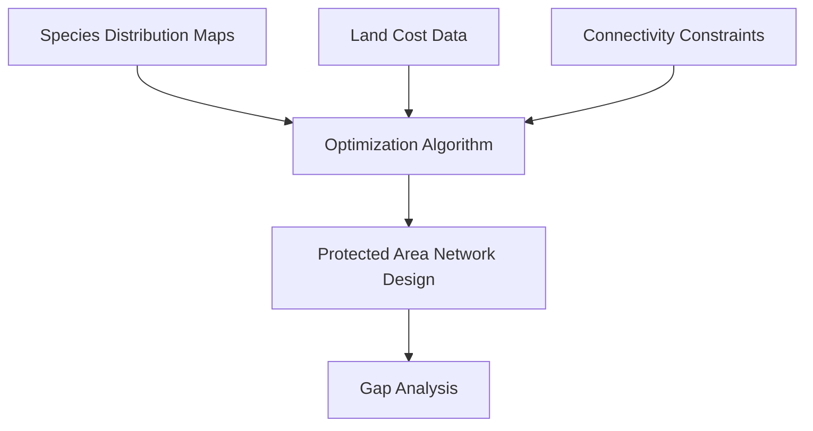

## AI for Biodiversity and Conservation

## Overview

Biodiversity — the variety of life at genetic, species, and ecosystem levels — is declining at unprecedented rates. The 2019 IPBES Global Assessment estimated that one million species face extinction. Monitoring and protecting biodiversity requires tracking millions of species across vast landscapes, a task where AI is becoming indispensable. From automated species identification to predicting extinction risk, machine learning is reshaping conservation science.

---

## Species Distribution Models (SDMs)

Species distribution models predict where species occur based on environmental conditions. These are foundational tools for conservation planning.

### MaxEnt

**Maximum Entropy modeling (MaxEnt)** is the most widely used SDM approach. It estimates the probability distribution of a species' occurrence by finding the distribution of maximum entropy subject to constraints from environmental covariates:

$$p(\mathbf{x}) = \frac{1}{Z} \exp\left(\sum_{j} \lambda_j f_j(\mathbf{x})\right)$$

where $f_j$ are feature functions derived from environmental layers (temperature, precipitation, elevation), $\lambda_j$ are learned weights, and $Z$ is a normalizing constant.

MaxEnt works with **presence-only data** — a critical advantage since systematic absence data is rarely available for most species.

### Modern ML Approaches

Gradient-boosted machines (GBMs) and deep neural networks increasingly outperform MaxEnt for SDMs:

```python
import lightgbm as lgb

# Environmental features at occurrence and background points
model = lgb.LGBMClassifier(
    n_estimators=500,
    max_depth=6,
    learning_rate=0.05,
    subsample=0.8
)
model.fit(X_env, y_presence_background,
          eval_set=[(X_val, y_val)],
          callbacks=[lgb.early_stopping(50)])
```

**Deep SDMs** use neural networks to learn nonlinear relationships and can incorporate multi-modal inputs (satellite imagery + climate + soil):



---

## Camera Trap Image Classification

Camera traps — motion-activated cameras deployed in the field — generate millions of images annually. Manual review is the bottleneck. AI automates species identification:

### Architecture

Most camera trap classifiers use **transfer learning** from ImageNet-pretrained CNNs:

1. **Backbone**: ResNet-50, EfficientNet, or Vision Transformer pretrained on ImageNet
2. **Fine-tuning**: Train on labeled camera trap datasets (e.g., Snapshot Serengeti with 7.1M images)
3. **Deployment**: Run inference on new images, flagging low-confidence predictions for human review

### Challenges

- **Class imbalance**: Common species dominate; rare species (often the ones of conservation interest) have few images
- **Empty frames**: 70-80% of triggered images contain no animal
- **Domain shift**: A model trained on African savanna cameras performs poorly on temperate forest cameras
- **Cryptic species**: Visually similar species require fine-grained classification

**MegaDetector**, developed by Microsoft AI for Earth, first detects whether an image contains an animal, then passes animal crops to species classifiers — dramatically reducing empty-frame processing.

---

## Bioacoustic Monitoring

Audio recorders capture vocalizations of birds, bats, frogs, whales, and insects. AI extracts species detections from spectrograms:

$$S(t, f) = |STFT\{x(t)\}|^2$$

where the short-time Fourier transform converts raw audio waveforms into time-frequency representations that CNNs can classify.

**BirdNET** identifies 6,000+ bird species from audio recordings. It uses an EfficientNet backbone on mel spectrograms and enables large-scale passive acoustic monitoring across entire landscapes.

---

## Biodiversity Indices and Metrics

AI helps compute and predict biodiversity metrics at scale:

| Metric | Definition | AI Application |
|--------|-----------|----------------|
| Species richness | Number of species in an area | Predict from satellite imagery |
| Shannon diversity | $H' = -\sum p_i \ln p_i$ | Map across landscapes using remote sensing |
| Beta diversity | Turnover between communities | Cluster communities with unsupervised learning |
| Functional diversity | Variety of ecological roles | Learn trait-environment relationships |

**Satellite-derived biodiversity maps** use the spectral variation hypothesis — areas with more spectral heterogeneity in satellite imagery tend to harbor more species. Deep learning models predict biodiversity indices directly from multispectral imagery.

---

## Extinction Risk Prediction

The IUCN Red List assesses extinction risk for ~150,000 species, but an estimated 8.7 million species exist. AI can predict which unassessed species are likely threatened:

**Features used:**
- Life history traits (body size, generation length, clutch size)
- Geographic range size and fragmentation
- Habitat type and land use change exposure
- Phylogenetic position

**Random forests and gradient-boosted models** predict IUCN categories with ~85% accuracy, helping prioritize assessment efforts for the most at-risk unassessed species.

---

## Conservation Planning with AI

### Systematic Conservation Planning

AI optimizes the design of protected area networks — selecting sites that maximize biodiversity representation while minimizing cost:



This is fundamentally a **combinatorial optimization** problem. Integer linear programming and reinforcement learning approaches select reserve networks that meet conservation targets at minimal cost.

### Anti-Poaching

ML models predict poaching hotspots using patrol data, environmental features, and temporal patterns. The **PAWS (Protection Assistant for Wildlife Security)** system uses game-theoretic models to optimize patrol routes, increasing detection rates while reducing predictability.

---

## eDNA and Molecular Monitoring

Environmental DNA (eDNA) — genetic material shed by organisms into water and soil — enables biodiversity surveys without capturing or observing animals. AI processes eDNA metabarcoding data:

1. **Sequence classification**: Neural networks assign taxonomic labels to DNA barcodes
2. **Community composition**: ML models infer species assemblages from mixed eDNA samples
3. **Occupancy modeling**: Statistical models account for imperfect detection in eDNA surveys

---

## Summary

AI is transforming biodiversity science from labor-intensive field surveys to automated, scalable monitoring systems. Species distribution models, camera trap classifiers, bioacoustic analyzers, and extinction risk predictors are enabling conservation at the pace and scale the biodiversity crisis demands. The challenge ahead is ensuring these tools work equitably across regions, taxa, and data-availability contexts.

---

## Further Reading

- Tuia, D. et al. (2022). "Perspectives in machine learning for wildlife conservation." *Nature Communications*, 13, 792.
- Christin, S. et al. (2019). "Applications for deep learning in ecology." *Methods in Ecology and Evolution*, 10, 1632–1644.
- Beery, S. et al. (2021). "Species distribution modeling for machine learning practitioners." *NeurIPS Workshop on Tackling Climate Change with ML*.
