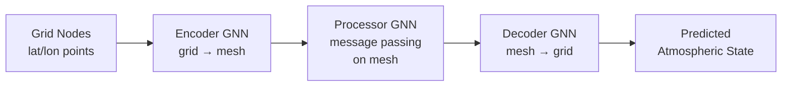
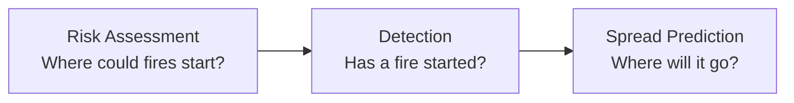
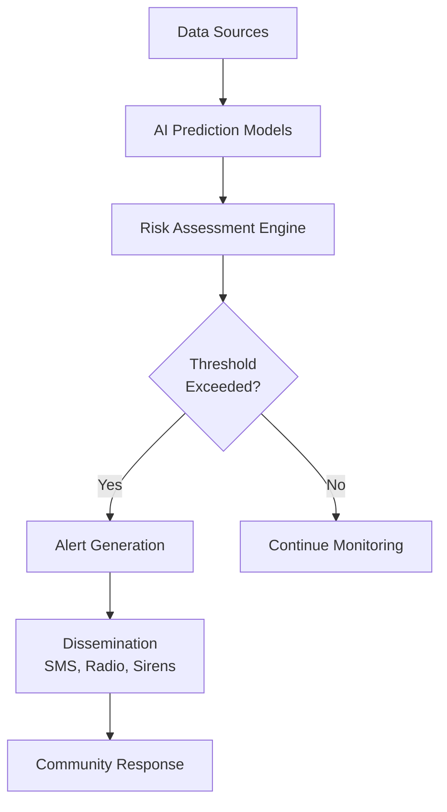

## AI for Extreme Weather and Natural Disasters

## Overview

Extreme weather events — floods, heatwaves, droughts, hurricanes, wildfires — cause thousands of deaths and billions of dollars in damage annually, and their frequency and intensity are increasing with climate change. Traditional numerical weather prediction (NWP) models solve atmospheric equations on supercomputers but have limitations: they're computationally expensive, struggle with sub-grid processes, and often lack the speed needed for real-time early warning. Deep learning is emerging as a powerful complement, offering faster inference, better pattern recognition in complex data, and improved skill for certain hazard types.

---

## AI for Weather Forecasting

### From NWP to Neural Weather Models

Traditional NWP solves the primitive equations of atmospheric dynamics on discretized grids:

$$\frac{\partial \mathbf{u}}{\partial t} + (\mathbf{u} \cdot \nabla)\mathbf{u} = -\frac{1}{\rho}\nabla p - 2\boldsymbol{\Omega} \times \mathbf{u} + \mathbf{g} + \mathbf{F}$$

These models require enormous computational resources and take hours to run. AI weather models learn the mapping from current atmospheric state to future state directly from reanalysis data:

$$\hat{\mathbf{X}}_{t+\Delta t} = f_\theta(\mathbf{X}_t)$$

**Key AI weather models:**

| Model | Organization | Architecture | Achievement |
|-------|-------------|--------------|-------------|
| GraphCast | DeepMind | Graph neural network | Outperformed ECMWF HRES at 90% of variables |
| Pangu-Weather | Huawei | 3D Vision Transformer | First AI model to beat NWP at multiple lead times |
| FourCastNet | NVIDIA | Adaptive Fourier Neural Operator | 45,000x faster than NWP |
| GenCast | DeepMind | Diffusion model | Probabilistic forecasts surpassing ENS |

### Graph Neural Networks for Weather

GraphCast treats the atmosphere as a graph where nodes represent grid points and edges encode spatial relationships:



The multi-mesh architecture enables efficient long-range interactions without the quadratic cost of full attention.

---

## Flood Prediction

Floods are the most common and costly natural disaster globally. AI improves prediction at multiple scales:

### River Flood Forecasting

Google's operational flood forecasting system uses LSTMs trained on hydrological data to predict river levels in ungauged basins:

```python
# Simplified flood prediction pipeline
class FloodLSTM(nn.Module):
    def __init__(self, n_meteo_features, n_static_features, hidden_size=256):
        super().__init__()
        self.lstm = nn.LSTM(
            input_size=n_meteo_features,
            hidden_size=hidden_size,
            num_layers=2,
            batch_first=True
        )
        # Static features (catchment area, slope, soil type)
        # injected via concatenation before final layer
        self.fc = nn.Linear(hidden_size + n_static_features, 1)

    def forward(self, meteo_seq, static_features):
        lstm_out, _ = self.lstm(meteo_seq)
        combined = torch.cat([lstm_out[:, -1, :], static_features], dim=1)
        return self.fc(combined)
```

### Flash Flood Detection

Satellite-based models detect flooding in near real-time using Sentinel-1 SAR imagery. U-Net segmentation models classify water vs. non-water pixels:

$$\text{IoU} = \frac{|Predicted \cap Ground Truth|}{|Predicted \cup Ground Truth|}$$

SAR imagery penetrates clouds, enabling flood mapping even during storms when optical satellites are blocked.

---

## Heatwave and Drought Prediction

### Heatwave Forecasting

ML models predict heatwave onset, duration, and intensity weeks ahead — critical for public health response. Features include sea surface temperatures, soil moisture, and atmospheric circulation patterns.

Extreme heatwaves are rare events, making them a classic **imbalanced classification** problem. Techniques include:

- Focal loss to upweight rare extreme events
- Synthetic oversampling of extreme cases
- Treating prediction as anomaly detection

### Drought Monitoring

The U.S. Drought Monitor combines multiple indicators into a single drought severity index. ML models can predict drought conditions months in advance using:

- Satellite-derived vegetation indices (NDVI)
- Soil moisture estimates (SMAP satellite)
- Sea surface temperature anomalies (ENSO, PDO)
- Precipitation and temperature forecasts

---

## Wildfire Prediction and Monitoring

AI addresses wildfires across three phases:



**Risk assessment** models predict fire probability from vegetation dryness (fuel moisture content), weather, topography, and historical ignition patterns.

**Early detection** uses satellite hotspot data (MODIS, VIIRS) and ground-based camera networks with computer vision to detect smoke plumes within minutes of ignition.

**Spread prediction** combines physics-based fire behavior models with ML. Neural networks learn correction factors for simplified fire spread models, improving accuracy without the computational cost of full combustion simulations.

---

## Early Warning Systems

Effective early warning systems integrate AI predictions with communication infrastructure:



**Key principles:**
- **Lead time vs. accuracy tradeoff**: Longer warnings save more lives but are less accurate
- **False alarm tolerance**: Too many false alarms erode trust; too few mean missed events
- **Last-mile delivery**: AI predictions are useless if vulnerable populations don't receive warnings

The Global Flood Monitoring System (GloFAS) and FEMA's Hazus loss estimation framework increasingly incorporate ML components for improved hazard and impact prediction.

---

## Compound Events and Cascading Hazards

Climate change increases compound events — multiple hazards occurring simultaneously or sequentially (e.g., heat + drought + wildfire, or hurricane + storm surge + riverine flooding). AI helps model these interactions:

- **Copula models** capture dependence structures between hazard variables
- **Graph neural networks** model causal chains between cascading hazards
- **Scenario generation** with generative models produces plausible compound event sequences for stress testing

---

## Summary

AI is transforming natural hazard prediction from computationally expensive physics simulations to fast, data-driven systems that can provide earlier warnings with better spatial resolution. Graph neural networks for weather, LSTMs for flood forecasting, and computer vision for wildfire detection are already operational. The frontier lies in probabilistic forecasting, compound event modeling, and ensuring equitable access to AI-powered early warnings.

---

## Further Reading

- Lam, R. et al. (2023). "Learning skillful medium-range global weather forecasting." *Science*, 382, 1416–1421.
- Nearing, G. et al. (2024). "Global prediction of extreme floods in ungauged watersheds." *Nature*, 627, 559–563.
- Price, I. et al. (2024). "GenCast: Diffusion-based ensemble forecasting for medium-range weather." *Nature*.
