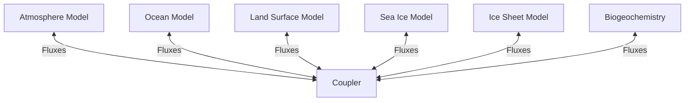

# AI for Earth System Modeling

## Overview

Earth system models (ESMs) simulate the interactions between atmosphere, ocean, land surface, ice, and biogeochemistry to project future climate and environmental change. These models are among the most computationally expensive scientific simulations, running on the world's largest supercomputers. AI is transforming ESMs by replacing or augmenting expensive sub-grid parameterizations, accelerating simulations, and enabling new forms of model-data fusion. This lesson explores how neural networks couple with process-based Earth system components.

---

## Earth System Model Architecture

An ESM couples multiple component models:



Each component solves governing equations on its own grid at its own timestep. The coupler exchanges fluxes (energy, mass, momentum) between components. Typical grid resolution is 50-100 km — too coarse to resolve clouds, turbulence, convection, and other sub-grid processes.

---

## The Parameterization Problem

Processes smaller than the grid scale must be **parameterized** — approximated as functions of resolved-scale variables. These parameterizations are major sources of uncertainty:

$$F_{subgrid} = P(\bar{T}, \bar{q}, \bar{u}, ...)$$

where $P$ is a parameterization function mapping resolved-scale variables (temperature $\bar{T}$, humidity $\bar{q}$, wind $\bar{u}$) to sub-grid effects.

Traditional parameterizations use simplified physics with tunable parameters. **ML parameterizations** learn these mappings from high-resolution simulations or observations.

### ML for Cloud Parameterization

Clouds are the largest source of uncertainty in climate projections. Neural network parameterizations trained on cloud-resolving model output can replace conventional schemes:

```python
class CloudParameterization(nn.Module):
    """Learn subgrid cloud effects from resolved-scale variables."""
    def __init__(self, n_levels=30):
        super().__init__()
        # Input: temperature, humidity, wind profiles (n_levels each)
        self.net = nn.Sequential(
            nn.Linear(n_levels * 3, 512),
            nn.ReLU(),
            nn.Linear(512, 256),
            nn.ReLU(),
            nn.Linear(256, n_levels * 2)  # heating + moistening tendencies
        )

    def forward(self, T, q, u):
        x = torch.cat([T, q, u], dim=-1)
        out = self.net(x)
        dT_dt, dq_dt = out.chunk(2, dim=-1)
        return dT_dt, dq_dt
```

**Key challenge:** ML parameterizations trained offline (on snapshots) often crash when coupled online with the climate model due to distribution shift and feedback instabilities.

---

## Neural Operators for ESM Components

Neural operators learn mappings between function spaces, making them natural surrogates for PDE-based ESM components:

### Fourier Neural Operators (FNO)

The FNO learns in spectral space, efficiently capturing global spatial patterns:

$$v_{l+1}(x) = \sigma\left(W_l v_l(x) + \mathcal{F}^{-1}(R_l \cdot \mathcal{F}(v_l))(x)\right)$$

where $\mathcal{F}$ is the Fourier transform and $R_l$ are learnable spectral filters.

Applications in ESMs:
- **Ocean circulation**: FNOs emulate ocean general circulation models 1000x faster
- **Atmospheric dynamics**: Spherical FNOs handle global atmospheric fields on the sphere
- **Sea ice**: Neural operators predict sea ice concentration and thickness evolution

### Advantages over Direct ML

| Approach | Pros | Cons |
|----------|------|------|
| Direct NN surrogate | Fast, flexible | Resolution-dependent, no PDE structure |
| Neural operator | Resolution-invariant, learns operators | More complex training, larger data requirements |
| Hybrid (ML + physics) | Physically consistent, data-efficient | Engineering complexity |

---

## Land Surface Modeling with AI

Land surface models simulate vegetation, soil, snow, and carbon/water cycles. AI enhances several components:

**Evapotranspiration (ET)**: ML models predict ET from meteorological and satellite data, bypassing complex land surface schemes. The Penman-Monteith equation provides a physics baseline:

$$ET = \frac{\Delta(R_n - G) + \rho_a c_p \frac{(e_s - e_a)}{r_a}}{\Delta + \gamma(1 + r_s/r_a)}$$

Neural networks trained on eddy covariance flux tower data often outperform process models for ET prediction, especially in heterogeneous landscapes.

**Carbon cycle**: ML models estimate gross primary productivity (GPP) and ecosystem respiration from remote sensing and meteorological inputs, complementing bottom-up process models with top-down constraints.

---

## Emulators for Climate Projections

Full ESM simulations of 21st-century climate take weeks to months on supercomputers. ML emulators enable:

- **Rapid scenario exploration**: Test hundreds of emission pathways in minutes instead of months
- **Uncertainty quantification**: Run thousands of ensemble members
- **Parameter calibration**: Optimize ESM parameters against observations


**ClimateBench** provides a standardized benchmark for comparing climate model emulators, using CMIP6 ESM output as ground truth.

---

## Data Assimilation with ML

Data assimilation combines observations with model predictions to produce optimal state estimates. Traditional methods (EnKF, 4D-Var) are computationally expensive. ML-enhanced approaches include:

**Learned observation operators**: Neural networks map between observation space (satellite radiances, in-situ measurements) and model state space.

**Neural data assimilation**: End-to-end differentiable frameworks that jointly learn the model dynamics and assimilation operator:

$$\mathbf{x}^{a}_t = \mathbf{x}^{f}_t + K_\theta(\mathbf{y}_t - H_\phi(\mathbf{x}^{f}_t))$$

where $K_\theta$ is a learned gain matrix and $H_\phi$ is a learned observation operator.

---

## Challenges and Open Problems

### Stability and Conservation

ML components must respect physical constraints when coupled with ESMs:
- **Energy conservation**: Neural parameterizations must not create or destroy energy
- **Mass conservation**: Water and carbon budgets must close
- **Numerical stability**: ML outputs must not cause integration blowups

Constraint enforcement strategies include adding penalty terms to losses, using architectures with built-in conservation (e.g., antisymmetric networks), and post-hoc projection.

### Generalization Under Climate Change

ML models trained on present-day climate must extrapolate to conditions never observed. This is fundamentally challenging — climate projections require predicting outside the training distribution. Hybrid approaches that embed known physics provide better extrapolation than pure data-driven methods.

---

## Summary

AI is transforming Earth system modeling by replacing expensive parameterizations with learned surrogates, building fast emulators for scenario exploration, and enhancing data assimilation. The key tension is between the speed and flexibility of ML and the physical consistency and extrapolation capability of process-based models. The most promising path forward combines both — physics-informed neural networks and hybrid architectures that leverage the strengths of each.

---

## Further Reading

- Schneider, T. et al. (2023). "Harnessing AI and computing to advance climate modelling and prediction." *Nature Climate Change*.
- Gentine, P. et al. (2021). "Deep learning for the parametrization of subgrid processes in climate models." *iScience*.
- Watson-Parris, D. (2021). "Machine learning for weather and climate are worlds apart." *Phil. Trans. R. Soc. A*.
