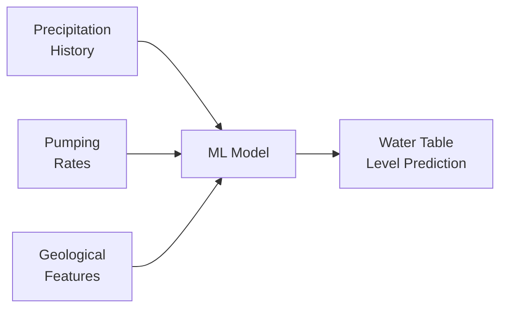
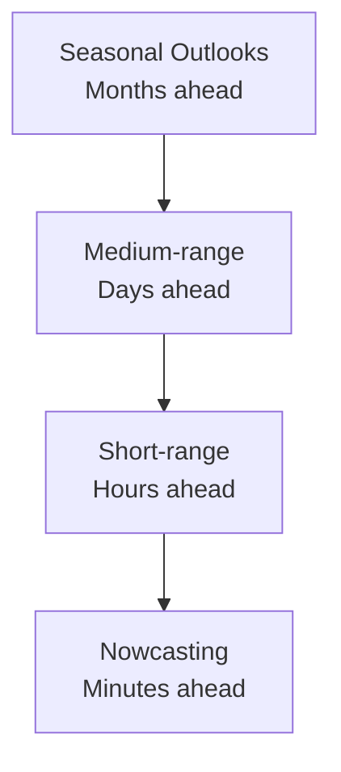
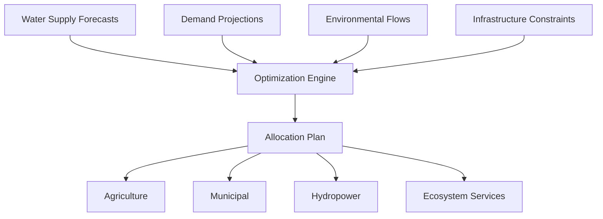

# AI for Water Resource Management

## Overview

Water is Earth's most critical resource, yet its availability is unevenly distributed and increasingly stressed by population growth, agricultural demand, and climate change. Hydrological modeling — predicting where water goes, when, and in what quantity — has traditionally relied on conceptual and physics-based models. Deep learning is achieving remarkable results in streamflow prediction, groundwater modeling, water quality assessment, and flood/drought forecasting, often surpassing decades of hydrological model development.

---

## Hydrological Modeling with Deep Learning

### The LSTM Revolution in Hydrology

The watershed moment for AI in hydrology came when LSTM networks were shown to outperform traditional hydrological models for streamflow prediction across diverse catchments. The key insight: a single LSTM trained on data from many catchments can generalize to ungauged basins.

**CAMELS dataset**: The Catchment Attributes and Meteorology for Large-sample Studies dataset provides standardized data for 671 US catchments with meteorological forcing, streamflow, and static attributes.

```python
class CatchmentLSTM(nn.Module):
    def __init__(self, n_dynamic=5, n_static=27, hidden_size=256):
        super().__init__()
        # Dynamic inputs: precipitation, temperature, radiation, etc.
        self.lstm = nn.LSTM(n_dynamic, hidden_size, batch_first=True)
        # Static attributes: area, slope, soil, geology, land cover
        self.static_embedding = nn.Linear(n_static, hidden_size)
        self.head = nn.Linear(hidden_size, 1)

    def forward(self, dynamic_seq, static_attrs):
        lstm_out, (h_n, _) = self.lstm(dynamic_seq)
        # Inject static features via concatenation
        static_emb = self.static_embedding(static_attrs).unsqueeze(1)
        combined = lstm_out + static_emb
        return self.head(combined).squeeze(-1)
```

**Performance**: Regional LSTM models achieve median Nash-Sutcliffe Efficiency (NSE) > 0.86 across hundreds of catchments, exceeding the performance of calibrated conceptual models like SAC-SMA:

$$NSE = 1 - \frac{\sum_t (Q_{obs}(t) - Q_{pred}(t))^2}{\sum_t (Q_{obs}(t) - \bar{Q}_{obs})^2}$$

An NSE of 1.0 indicates perfect prediction; 0.0 means the model is no better than predicting the mean.

---

## Groundwater Modeling

Groundwater — stored in subsurface aquifers — supplies drinking water for billions and irrigation for agriculture. AI applications include:

### Water Table Prediction

ML models predict groundwater levels from precipitation history, pumping rates, river stages, and geological features:



### Aquifer Characterization

Neural networks estimate hydraulic conductivity fields from sparse borehole data and pumping test results. Physics-informed neural networks (PINNs) solve the groundwater flow equation while honoring observed heads:

$$\nabla \cdot (K \nabla h) = S_s \frac{\partial h}{\partial t} - W$$

where $K$ is hydraulic conductivity, $h$ is hydraulic head, $S_s$ is specific storage, and $W$ represents sources/sinks.

---

## Water Quality Monitoring

AI models predict and monitor water quality parameters across surface and groundwater systems:

| Parameter | ML Methods | Data Sources |
|-----------|-----------|--------------|
| Dissolved oxygen | LSTM, random forest | Sensor networks, satellite |
| Turbidity | CNN on satellite imagery | Sentinel-2, Landsat |
| Nutrient loading (N, P) | GBM, neural networks | Watershed monitoring stations |
| Harmful algal blooms | CNN + LSTM | Satellite color, temperature |
| Contaminants | Ensemble methods | Well sampling, land use data |

### Harmful Algal Bloom Prediction

Harmful algal blooms (HABs) produce toxins that contaminate drinking water and kill aquatic life. ML models predict bloom occurrence from:

- Water temperature and stratification
- Nutrient concentrations (nitrogen, phosphorus)
- Wind patterns and water residence time
- Historical bloom records

Satellite remote sensing detects chlorophyll-a and cyanobacteria pigments, enabling basin-wide monitoring:

$$\text{Chl-a} \propto \frac{R_{rs}(\lambda_{red})}{R_{rs}(\lambda_{green})}$$

where $R_{rs}$ is remote sensing reflectance at specific wavelengths.

---

## Flood Prediction

AI for flood prediction spans multiple timescales:



**NOAA Advanced Hydrologic Prediction Service (AHPS)** provides operational flood forecasts across the US. ML-enhanced versions improve forecast skill, especially for:

- **Flash floods**: Where rapid response is critical and process models are too slow
- **Urban flooding**: Complex drainage networks poorly represented in traditional models
- **Compound flooding**: Coastal + riverine + pluvial flooding interactions

Google's AI flood forecasting system provides real-time warnings in 80+ countries, covering populations previously without any flood forecasting infrastructure.

---

## Drought Forecasting

Droughts develop slowly but cause enormous economic and ecological damage. AI models predict drought indices at multiple lead times:

**Standardized Precipitation Index (SPI)**:

$$SPI = \frac{P - \bar{P}}{\sigma_P}$$

where $P$ is precipitation over a specified period, normalized by historical statistics.

ML models predict SPI and other drought indices (PDSI, SPEI) using:
- Teleconnection indices (ENSO, NAO, PDO)
- Soil moisture satellite observations (SMAP, SMOS)
- Vegetation health indices from MODIS/VIIRS
- Antecedent precipitation and temperature

**Subseasonal-to-seasonal (S2S) drought prediction** is particularly challenging — too long for weather models, too short for climate models. ML models that combine atmospheric initial conditions with slow-varying boundary conditions (SST, soil moisture) show promise in this gap.

---

## Integrated Water Resource Management

AI supports decision-making for water allocation across competing demands:



**Reinforcement learning** for reservoir operations learns optimal release policies that balance flood control, water supply, hydropower generation, and downstream environmental flows — often finding strategies that outperform rule-based operating curves developed over decades.

---

## Summary

Deep learning has achieved breakthrough results in hydrology, with LSTM-based streamflow models outperforming decades of traditional model development. AI is equally transforming groundwater monitoring, water quality prediction, flood forecasting, and drought early warning. The combination of expanding sensor networks, satellite observations, and increasingly powerful ML models is enabling water resource management at scales and accuracies previously impossible.

---

## Further Reading

- Nearing, G. et al. (2021). "What role does hydrological science play in the age of machine learning?" *Water Resources Research*.
- Kratzert, F. et al. (2019). "Toward improved predictions in ungauged basins: exploiting the power of machine learning." *Water Resources Research*.
- Shen, C. (2018). "A transdisciplinary review of deep learning research and its relevance for water resources scientists." *Water Resources Research*.
