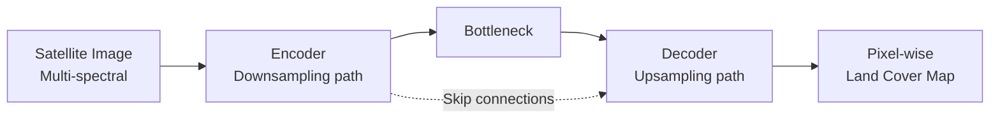
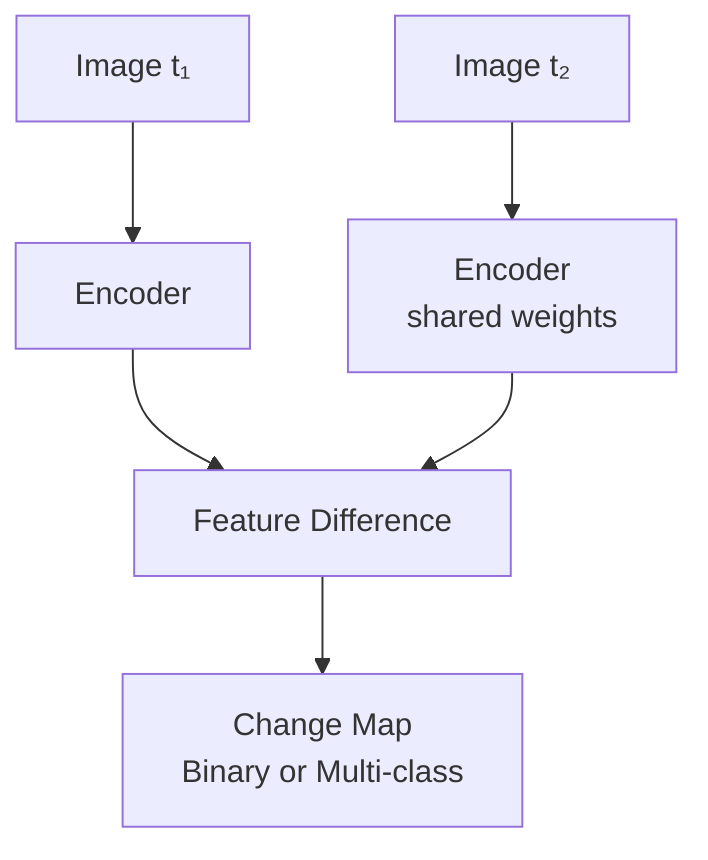

# AI for Deforestation and Land Use Monitoring

## Overview

Forests cover 31% of Earth's land surface and store roughly 50% of terrestrial carbon. Deforestation — driven by agriculture, logging, mining, and urbanization — releases 4.8 billion tonnes of CO₂ annually and is the primary driver of habitat loss. Monitoring deforestation and land use change at global scale requires analyzing petabytes of satellite imagery — a task where AI, particularly convolutional neural networks and semantic segmentation models, has become essential.

---

## Satellite Remote Sensing Fundamentals

### Key Satellite Systems

| Satellite | Sensor | Resolution | Revisit | Bands | Access |
|-----------|--------|-----------|---------|-------|--------|
| Landsat 8/9 | OLI/TIRS | 30m | 16 days | 11 | Free (USGS) |
| Sentinel-2 | MSI | 10m | 5 days | 13 | Free (ESA) |
| Planet | PlanetScope | 3m | Daily | 4-8 | Commercial |
| MODIS | Terra/Aqua | 250m-1km | Daily | 36 | Free (NASA) |

**Trade-offs**: Higher spatial resolution captures finer details but covers less area and costs more. Higher temporal resolution enables faster change detection but often at lower spatial resolution.

### Spectral Indices

Vegetation health is commonly assessed through spectral indices:

$$NDVI = \frac{NIR - Red}{NIR + Red}$$

$$EVI = 2.5 \cdot \frac{NIR - Red}{NIR + 6 \cdot Red - 7.5 \cdot Blue + 1}$$

where NIR is near-infrared reflectance. Healthy vegetation has high NDVI (0.6-0.9); bare soil and cleared land have low values (0.1-0.2).

---

## Deep Learning for Land Cover Classification

### Semantic Segmentation with U-Net

U-Net and its variants are the workhorses of satellite image segmentation:



```python
import segmentation_models_pytorch as smp

model = smp.Unet(
    encoder_name="resnet50",
    encoder_weights="imagenet",
    in_channels=13,          # Sentinel-2 bands
    classes=10,              # land cover classes
    activation=None
)

# Classes: forest, cropland, grassland, wetland, urban,
#          water, bare soil, shrubland, snow/ice, cloud
```

### Multi-temporal Classification

Single-date imagery can confuse crops with grassland or deciduous forest with bare land. **Multi-temporal approaches** use image sequences across seasons:

- **Temporal CNNs**: 3D convolutions over time-stacked imagery
- **LSTM + CNN hybrids**: CNN encodes spatial features per timestep; LSTM captures temporal dynamics
- **Temporal attention**: Transformer-based models weight different dates by importance

---

## Change Detection

### Deforestation Alert Systems

Real-time deforestation detection compares new satellite images against a baseline forest map:

**Two-stage approach:**
1. **Baseline classification**: Establish current forest cover from cloud-free composite
2. **Change detection**: Flag pixels where forest probability drops below threshold

**Global Forest Watch (GFW)** — operated by the World Resources Institute — provides near-real-time deforestation alerts using:
- **GLAD alerts**: Landsat-based, 30m resolution, weekly updates
- **RADD alerts**: Sentinel-1 radar-based, penetrates clouds, 10m resolution

### Deep Learning for Change Detection

Modern change detection uses **Siamese networks** — twin encoders processing before/after images with a shared architecture:



The network learns to distinguish genuine land cover change from noise sources (atmospheric effects, seasonal variation, sensor differences).

---

## Deforestation Driver Classification

Not all deforestation is equal — distinguishing drivers is critical for policy response:

| Driver | Signature | AI Approach |
|--------|-----------|-------------|
| Industrial agriculture | Large, geometric clearings | Object detection + shape analysis |
| Smallholder farming | Small, irregular patches | Fine-resolution segmentation |
| Selective logging | Canopy gaps, road networks | Change detection + road extraction |
| Mining | Exposed soil, water ponds | Spectral anomaly detection |
| Fire | Burn scars, smoke plumes | Time-series analysis |
| Urban expansion | Impervious surface growth | Multi-temporal classification |

ML models trained on labeled deforestation events classify drivers with ~80% accuracy, helping enforcement agencies target illegal activities.

---

## Cloud Computing for Global Analysis

Processing global satellite data requires cloud computing infrastructure:

**Google Earth Engine (GEE)** provides:
- Petabytes of satellite imagery (Landsat, Sentinel, MODIS) accessible via API
- Parallel computation on Google's infrastructure
- JavaScript and Python APIs

```python
import ee
ee.Initialize()

# Compute annual NDVI composite for Amazon basin
sentinel2 = (ee.ImageCollection('COPERNICUS/S2_SR')
    .filterDate('2024-01-01', '2024-12-31')
    .filterBounds(amazon_geometry)
    .filter(ee.Filter.lt('CLOUDY_PIXEL_PERCENTAGE', 20)))

ndvi = sentinel2.map(lambda img:
    img.normalizedDifference(['B8', 'B4']).rename('NDVI'))
annual_ndvi = ndvi.median()
```

**Microsoft Planetary Computer** and **Amazon SageMaker with Open Data** provide similar capabilities with tighter ML integration.

---

## SAR for Tropical Forest Monitoring

Optical satellites are frequently blocked by clouds in tropical regions. Synthetic Aperture Radar (SAR) penetrates clouds and works day/night:

**Sentinel-1 C-band SAR** detects deforestation through backscatter changes:
- Intact forest has high, stable backscatter due to volume scattering
- Cleared land has low backscatter due to surface scattering
- Regrowing vegetation shows gradually increasing backscatter

**ALOS-2 PALSAR L-band SAR** penetrates deeper into canopy, detecting degradation and selective logging missed by C-band.

ML models combining optical and SAR data achieve higher accuracy than either alone, especially in persistently cloudy regions like the Congo Basin.

---

## Carbon Stock Estimation

Deforestation releases stored carbon. AI estimates above-ground biomass (AGB) from:

- **Lidar** (GEDI satellite): Directly measures canopy height → biomass allometry
- **SAR**: Backscatter correlates with biomass up to ~150 Mg/ha
- **Optical + environmental features**: ML models predict biomass from spectral, topographic, and climate variables

$$AGB = a \cdot H^b \cdot D^c$$

where $H$ is canopy height, $D$ is canopy density, and $a, b, c$ are learned coefficients. Deep learning models that directly regress biomass from multi-sensor inputs increasingly outperform allometric equations.

---

## Summary

AI-powered satellite monitoring has made deforestation visible in near real-time at global scale. U-Net segmentation, Siamese change detection networks, and multi-sensor fusion (optical + SAR) enable detection, classification, and quantification of forest loss. Cloud computing platforms like Google Earth Engine make planetary-scale analysis accessible. The challenge ahead is moving from detection to prevention — using AI predictions to anticipate and halt deforestation before it occurs.

---

## Further Reading

- Hansen, M. C. et al. (2013). "High-resolution global maps of 21st-century forest cover change." *Science*, 342, 850–853.
- Reiche, J. et al. (2021). "Forest disturbance alerts for the Congo Basin using Sentinel-1." *Environmental Research Letters*.
- Rußwurm, M. & Körner, M. (2020). "Self-attention for raw optical satellite time series classification." *ISPRS Journal*.
