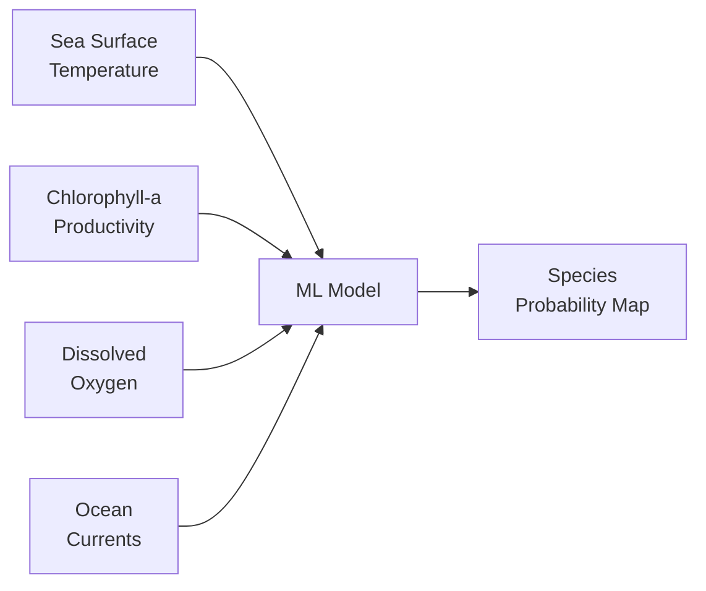
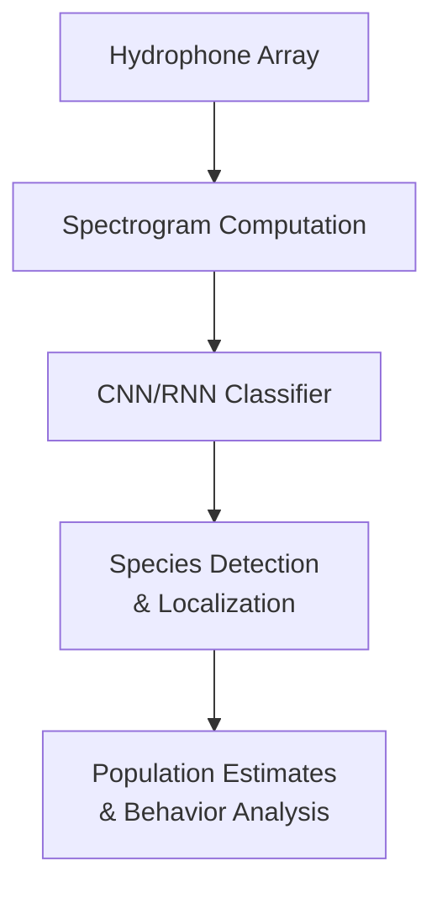

# AI for Ocean and Marine Systems

## Overview

Oceans cover 71% of Earth's surface, regulate climate, produce half of global oxygen, and sustain billions of people through fisheries and coastal livelihoods. Yet oceans remain vastly under-observed — we have better maps of Mars than of the ocean floor. AI is filling this gap by extracting information from sparse observations, satellite imagery, acoustic data, and autonomous underwater vehicles, enabling advances in marine ecosystem management, ocean modeling, and pollution monitoring.

---

## Marine Ecosystem Modeling

### Fisheries Stock Assessment

Sustainable fisheries management requires estimating fish population size and maximum sustainable yield. Traditional stock assessment uses age-structured models:

$$N_{a+1,t+1} = N_{a,t} \cdot e^{-Z_{a,t}}$$

where $N_{a,t}$ is the number of fish at age $a$ in year $t$, and $Z_{a,t}$ is total mortality (natural + fishing).

**ML enhancements:**
- Neural networks predict recruitment (new fish entering the population) from environmental variables (SST, upwelling, prey abundance)
- Deep learning processes fishery-independent survey data (trawl catches, acoustic surveys)
- Computer vision counts and measures fish from underwater camera footage

### Species Distribution in the Ocean

Ocean species distributions shift with temperature, currents, and oxygen levels. Dynamic SDMs for marine species incorporate:



These models are critical for predicting how fish stocks will shift geographically under climate change — potentially crossing national boundaries and disrupting existing fisheries agreements.

---

## Ocean Parameterization with ML

Ocean general circulation models (OGCMs) face similar parameterization challenges as atmospheric models. Key sub-grid processes requiring parameterization:

### Mesoscale Eddies

Ocean eddies (10-300 km diameter) transport heat, salt, and nutrients but are unresolved in most climate models. ML parameterizations learn eddy effects from high-resolution simulations:

$$\nabla \cdot (\overline{u'T'}) \approx f_\theta(\bar{T}, \bar{S}, \nabla\bar{T}, ...)$$

where primed quantities represent eddy-scale fluctuations and bars indicate resolved-scale means.

**Results**: Neural network parameterizations of mesoscale eddies reduce sea surface temperature biases by 50% compared to traditional Gent-McWilliams schemes.

### Vertical Mixing

Turbulent mixing in the ocean interior controls nutrient supply to the surface. ML models predict mixing coefficients from local stratification and shear:

$$K_z = g_\theta(N^2, S^2, \text{depth})$$

where $N^2$ is the buoyancy frequency (stratification) and $S^2$ is the velocity shear.

---

## Plastic and Pollution Detection

### Marine Plastic Detection from Satellites

An estimated 8 million tonnes of plastic enter oceans annually. AI detects floating plastic from satellite imagery:

**Spectral detection**: Plastics have distinctive spectral signatures in shortwave infrared (SWIR):

| Material | Peak Absorption |
|----------|----------------|
| PET plastic | 1730 nm |
| Sargassum seaweed | 1250 nm |
| Clean water | Broad NIR absorption |

**Challenges:**
- Plastic patches are often smaller than satellite pixel size (sub-pixel detection)
- Spectral confusion with seaweed, foam, and oil
- Most plastic is submerged or fragmented (microplastics invisible to satellites)

CNN classifiers trained on labeled satellite scenes and in-situ validation achieve ~85% precision for aggregated floating debris.

### Oil Spill Detection

SAR satellite imagery detects oil spills as dark patches (dampened wave roughness). Deep learning models distinguish oil from natural look-alikes (biogenic films, low-wind areas):

```python
class OilSpillDetector(nn.Module):
    def __init__(self):
        super().__init__()
        self.backbone = models.resnet34(pretrained=True)
        self.backbone.conv1 = nn.Conv2d(2, 64, 7, 2, 3)  # dual-pol SAR
        self.backbone.fc = nn.Linear(512, 2)  # oil vs. look-alike

    def forward(self, sar_image):
        return self.backbone(sar_image)
```

---

## Coral Reef Health Monitoring

Coral reefs support 25% of marine species but are rapidly degrading from ocean warming, acidification, and pollution. AI monitors reef health at scale:

### Underwater Image Classification

Autonomous underwater vehicles (AUVs) and diver-operated cameras collect thousands of benthic images. ML classifies substrate types:

- Live coral (by genus/morphology)
- Dead coral / coral rubble
- Macroalgae
- Sand / sediment
- Other invertebrates

**CoralNet** — an online platform — uses deep learning to automate benthic image annotation, processing millions of point classifications that would take human experts years.

### Satellite-Based Reef Mapping

High-resolution satellites (Planet, WorldView) map shallow reef structure through clear water. Water column correction removes depth effects:

$$R_{bottom}(\lambda) = \frac{R_{surface}(\lambda) - R_{\infty}(\lambda)}{e^{-2K_d(\lambda) \cdot z}}$$

where $R_{\infty}$ is deep water reflectance, $K_d$ is diffuse attenuation, and $z$ is depth.

### Bleaching Prediction

Coral bleaching is triggered by sustained thermal stress. The Degree Heating Weeks (DHW) metric accumulates thermal anomalies:

$$DHW = \sum_{i=1}^{12} HS_i, \quad HS_i = \begin{cases} SST_i - MMM & \text{if } SST_i - MMM > 1°C \\ 0 & \text{otherwise} \end{cases}$$

where $MMM$ is the maximum monthly mean SST. ML models improve bleaching predictions by incorporating additional variables: wind, currents, cloud cover, and reef-specific resilience factors.

---

## Acoustic Monitoring of Marine Life

Passive acoustic monitoring records underwater soundscapes to detect and track marine animals:



**Applications:**
- **Whale detection**: CNN classifiers on spectrograms identify whale species from calls, enabling ship-strike avoidance
- **Fish choruses**: Dawn and dusk fish vocalizations indicate reef health
- **Anthropogenic noise**: Quantifying shipping noise impact on marine mammals
- **Illegal fishing**: Detecting trawler engine signatures in marine protected areas

---

## Autonomous Ocean Observation

AI enables autonomous platforms that adaptively sample the ocean:

| Platform | Range | Endurance | AI Role |
|----------|-------|-----------|---------|
| Argo floats | Fixed profile | Years | Data QC, anomaly detection |
| Saildrones | Thousands of km | Months | Adaptive sampling, hazard avoidance |
| AUVs (Gliders) | Hundreds of km | Weeks | Path planning, target detection |
| ROVs | Tethered | Hours | Object recognition, mapping |

**Adaptive sampling**: RL agents plan observation paths that maximize information gain about target variables (e.g., locating ocean fronts, tracking harmful algal blooms) while satisfying energy and communication constraints.

---

## Summary

AI is transforming ocean science from a data-sparse to a data-rich domain. From ML-enhanced fisheries models and neural ocean parameterizations to satellite plastic detection and coral reef monitoring, AI tools are enabling marine management at scales matching the vastness of the ocean. Autonomous platforms guided by AI are beginning to fill the enormous gaps in ocean observation — the least explored frontier on our planet.

---

## Further Reading

- Beaulieu, C. et al. (2020). "Machine learning in marine ecology." *Limnology and Oceanography Letters*.
- Malde, K. et al. (2020). "Machine intelligence and the data-driven future of marine science." *ICES Journal of Marine Science*.
- Biermann, L. et al. (2020). "Finding plastic patches in coastal waters using optical satellite data." *Scientific Reports*.
