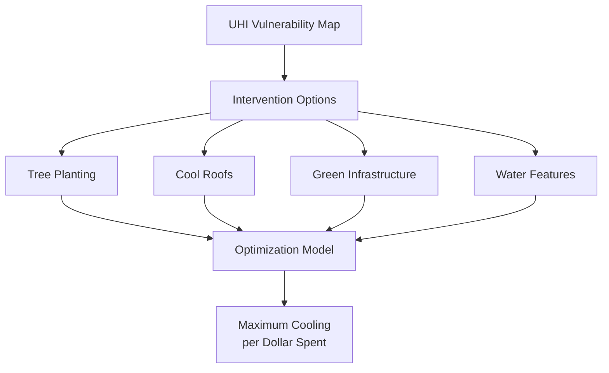
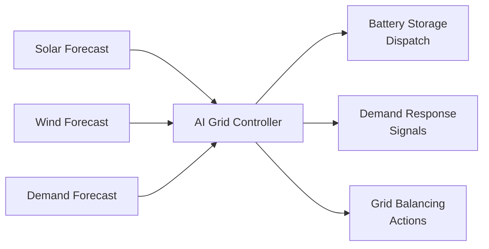
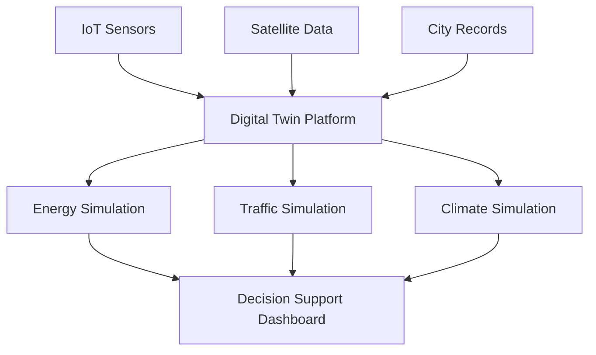

# AI for Sustainable Cities and Infrastructure

## Overview

Cities house over 55% of the world's population and produce 70% of global CO₂ emissions. As urbanization accelerates — projected to reach 68% by 2050 — making cities sustainable is one of the most impactful environmental challenges. AI is enabling smarter energy systems, optimized transportation, climate-resilient infrastructure, and data-driven urban planning that can reduce environmental footprints while improving quality of life.

---

## Urban Heat Islands

Cities are typically 1-3°C warmer than surrounding rural areas due to impervious surfaces, waste heat, and reduced vegetation — a phenomenon called the **urban heat island (UHI) effect**. During heatwaves, UHI amplification can reach 5-10°C, causing excess mortality.

### Mapping UHI with AI

Satellite thermal imagery (Landsat TIRS, ECOSTRESS) measures land surface temperature (LST). ML models predict UHI intensity from urban morphology:

```python
features = [
    'building_density',       # from building footprint data
    'impervious_fraction',    # from land cover classification
    'vegetation_cover',       # NDVI from satellite
    'building_height',        # from lidar or shadow analysis
    'sky_view_factor',        # obstruction of sky hemisphere
    'distance_to_water',      # proximity to cooling water bodies
    'population_density',     # from census / mobile data
    'anthropogenic_heat'      # estimated from energy consumption
]
```

**Results**: Gradient-boosted models explain 70-85% of intra-urban temperature variation, identifying that vegetation cover and sky view factor are the strongest predictors of local cooling.

### Mitigation Planning

AI optimizes placement of cooling interventions:



---

## Energy Consumption Forecasting

Buildings account for ~40% of energy consumption in most cities. AI forecasts energy demand at multiple scales:

### Building-Level Forecasting

LSTM and transformer models predict hourly energy consumption from:
- Weather forecasts (temperature, humidity, solar radiation)
- Occupancy patterns (work schedules, holidays)
- Building characteristics (age, size, insulation, HVAC type)

$$E_{t+h} = f_\theta(E_{t-w:t}, \mathbf{W}_{t:t+h}, \mathbf{C}_{building}, \mathbf{T}_{calendar})$$

where $E$ is energy consumption, $\mathbf{W}$ is weather, $\mathbf{C}$ is building characteristics, and $\mathbf{T}$ encodes time features (hour, day of week, season).

### Grid-Level Demand Response

AI enables demand response — dynamically adjusting energy consumption to match supply:

| Application | AI Method | Impact |
|------------|-----------|--------|
| Peak shaving | RL for HVAC scheduling | 15-30% peak reduction |
| Load forecasting | LSTM ensembles | 2-5% MAPE at city scale |
| Solar/wind integration | Probabilistic forecasting | Reduced curtailment |
| EV charging optimization | Multi-agent RL | Grid stability + user satisfaction |

---

## Smart Grid Integration

Renewable energy integration requires AI to manage variability:



**Reinforcement learning for battery dispatch** learns optimal charge/discharge policies that minimize cost while maintaining grid stability. The state space includes current storage level, forecasted supply and demand, and electricity prices.

---

## Transportation and Emissions

### Traffic Optimization

Urban transportation produces ~25% of city emissions. AI optimizes traffic flow:

**Adaptive traffic signal control** uses RL to minimize intersection delays and emissions. Each intersection is an agent that observes queue lengths, phase timing, and upstream traffic to choose optimal signal phases.

**Route optimization** for delivery fleets minimizes total distance and emissions using graph neural networks and combinatorial optimization.

### Emissions Monitoring

AI quantifies urban emissions from multiple data sources:

- **Satellite CO₂ mapping**: OCO-2/3 and TROPOMI measure column-averaged CO₂ and NO₂ — ML downscales these to city-block resolution
- **Street-level sensing**: Mobile sensors on vehicles map air quality at street resolution
- **Emission inventories**: ML disaggregates national inventories to building/road-level estimates

$$\text{Emission}_{pixel} = f_\theta(\text{building density}, \text{traffic volume}, \text{industry}, \text{vegetation})$$

---

## Green Infrastructure Optimization

Green infrastructure — parks, street trees, green roofs, bioswales — provides ecosystem services: cooling, stormwater management, air quality improvement, and carbon sequestration. AI optimizes placement:

### Urban Tree Canopy Analysis

Computer vision on aerial imagery detects and classifies individual trees:

```python
# Instance segmentation for tree detection
from detectron2 import model_zoo
from detectron2.config import get_cfg

cfg = get_cfg()
cfg.merge_from_file(model_zoo.get_config_file(
    "COCO-InstanceSegmentation/mask_rcnn_R_50_FPN_3x.yaml"))
cfg.MODEL.ROI_HEADS.NUM_CLASSES = 5  # tree species groups
cfg.INPUT.MIN_SIZE_TEST = 1024       # high-res aerial imagery
```

**Applications:**
- Tree inventory mapping (species, size, health)
- Canopy cover gap analysis
- Prioritizing planting locations for maximum ecosystem services
- Monitoring tree health over time (stress detection from spectral changes)

### Stormwater Management

Urban flooding from intense rainfall is increasing. AI models predict runoff and optimize green infrastructure placement to maximize water retention:

- **CNN + hydrological models**: Predict runoff from land cover and rainfall
- **Optimization**: Place bioswales, rain gardens, and permeable pavement to minimize peak flow at minimum cost

---

## Climate-Resilient Urban Planning

### Climate Risk Assessment

AI assesses climate risks at building and neighborhood scale:

| Risk | Data Sources | AI Method |
|------|-------------|-----------|
| Flood exposure | DEM, drainage, rainfall | Physics-informed ML |
| Heat vulnerability | LST, demographics, AC prevalence | Ensemble models |
| Sea level rise | Elevation, tidal data | Spatial regression |
| Air quality | Traffic, industry, meteorology | Spatiotemporal GNN |

### Digital Twins for Cities

Urban digital twins integrate real-time data streams with simulation models:



Cities like Singapore, Helsinki, and Zurich use digital twins for scenario planning — testing the impact of new buildings, green infrastructure, or policy changes before implementation.

---

## Summary

AI is enabling cities to reduce their environmental footprint through smarter energy systems, optimized transportation, targeted green infrastructure, and data-driven climate adaptation planning. From predicting building energy consumption with LSTMs to optimizing traffic signals with reinforcement learning to mapping urban heat islands with satellite data, AI tools are making urban sustainability measurable and actionable. The challenge is moving from pilot projects to city-wide deployment while ensuring equitable access to benefits across all neighborhoods.

---

## Further Reading

- Milojevic-Dupont, N. & Creutzig, F. (2021). "Machine learning for geographically differentiated climate change mitigation in urban areas." *Sustainable Cities and Society*.
- Ketzler, G. et al. (2020). "Digital twins for cities: A state of the art review." *Built Environment*.
- Rolnick, D. et al. (2022). "Tackling Climate Change with Machine Learning." Sections on buildings, transport, and cities.
