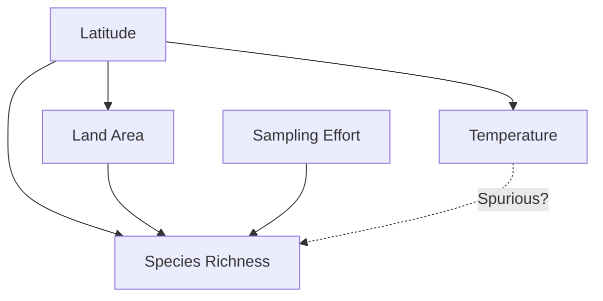
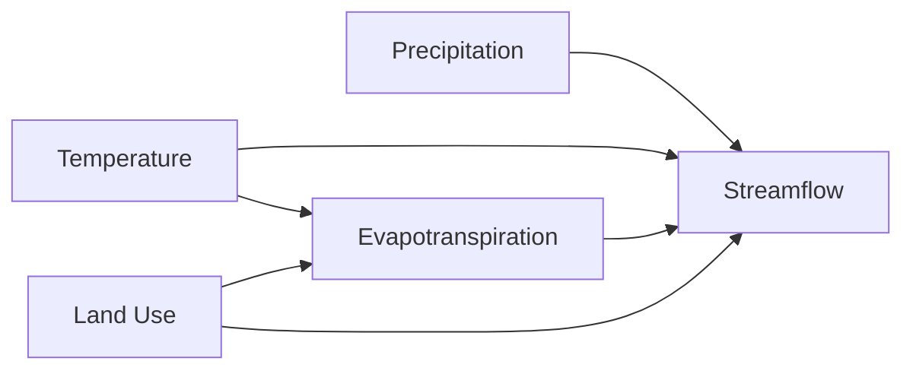

# Causal AI for Environmental Science

## Overview

Standard machine learning excels at prediction — learning correlations in data to forecast outcomes. But environmental policy requires **causal reasoning**: understanding not just what will happen, but what *would* happen under different interventions. Will banning a pesticide recover pollinator populations? Does a reforestation program actually reduce downstream flooding? Causal AI provides the mathematical framework to answer these questions from observational data, going beyond correlation to quantify the effects of actions.

---

## Correlation vs. Causation in Ecology

Environmental data is observational, not experimental. Confounders lurk everywhere:

**Example**: Species richness correlates positively with temperature across European countries. But this doesn't mean warming increases biodiversity — both are confounded by latitude, land area, sampling effort, and historical biogeography.



A predictive model using temperature to forecast species richness would perform well on held-out data but give wrong answers about the effect of climate change on biodiversity.

---

## Structural Causal Models

Structural Causal Models (SCMs) formalize causal relationships as a system of equations:

$$X_i = f_i(PA_i, U_i), \quad i = 1, ..., n$$

where $PA_i$ are the parents (direct causes) of variable $X_i$, $f_i$ is a deterministic function, and $U_i$ represents exogenous noise.

**Directed Acyclic Graphs (DAGs)** visualize causal structure:



The DAG encodes assumptions about which variables directly affect which others. Once specified, it determines what can and cannot be estimated from observational data.

---

## The Do-Calculus

Pearl's **do-calculus** distinguishes observation from intervention. The probability of streamflow given that we *observe* high precipitation:

$$P(Q | P_{precip} = high)$$

differs from the probability if we *intervene* to increase precipitation (e.g., cloud seeding):

$$P(Q | do(P_{precip} = high))$$

The difference matters because observation conditions on all correlated variables, while intervention only changes the target variable and its downstream effects.

### The Adjustment Formula

When confounders $\mathbf{Z}$ satisfy the **back-door criterion** (they block all non-causal paths), the causal effect is:

$$P(Y | do(X = x)) = \sum_{\mathbf{z}} P(Y | X = x, \mathbf{Z} = \mathbf{z}) \cdot P(\mathbf{Z} = \mathbf{z})$$

This allows estimating causal effects from observational data by adjusting for the right set of confounders.

---

## Causal Discovery from Environmental Data

When the causal graph is unknown, **causal discovery algorithms** learn it from data:

### Constraint-Based Methods

**PC algorithm** tests conditional independencies to orient edges:

1. Start with a fully connected undirected graph
2. Remove edges between conditionally independent variables
3. Orient edges using v-structures and propagation rules

```python
from causallearn.search.ConstraintBased.PC import pc

# Environmental variables: temperature, precipitation,
# NDVI, soil moisture, streamflow, groundwater
data = load_environmental_data()
cg = pc(data, alpha=0.05, indep_test='fisherz')
cg.draw_pydot_graph()  # visualize discovered causal graph
```

### Score-Based Methods

**GES (Greedy Equivalence Search)** and **NOTEARS** optimize a score function over possible graphs:

$$\min_{W} \frac{1}{2n}\|X - XW\|_F^2 + \lambda\|W\|_1 \quad \text{s.t. } h(W) = 0$$

where $h(W) = \text{tr}(e^{W \circ W}) - d = 0$ enforces the acyclicity constraint and $W$ is the weighted adjacency matrix.

### Granger Causality for Time Series

For environmental time series, **Granger causality** tests whether past values of $X$ improve predictions of $Y$ beyond past values of $Y$ alone:

$$Y_t = \sum_{k=1}^{p} a_k Y_{t-k} + \sum_{k=1}^{p} b_k X_{t-k} + \epsilon_t$$

If the $b_k$ coefficients are jointly significant, $X$ Granger-causes $Y$. Neural Granger causality extends this to nonlinear relationships using neural networks.

---

## Counterfactual Analysis

Counterfactuals answer "what would have happened if...?" questions:

- *What would river discharge have been if the upstream dam had not been built?*
- *How much deforestation would have occurred without the payment-for-ecosystem-services program?*

### Synthetic Control Method

For evaluating policy interventions, the **synthetic control method** constructs a counterfactual from weighted combinations of untreated units:

$$\hat{Y}_{treated, post} = \sum_{j \in \text{donors}} w_j \cdot Y_{j, post}$$

where weights $w_j$ are chosen to match the treated unit's pre-intervention trajectory.

**Application**: Evaluating whether a protected area reduced deforestation by comparing its post-designation forest loss to a synthetic control constructed from similar unprotected areas.

---

## Policy Intervention Estimation

### Average Treatment Effects

The **Average Treatment Effect (ATE)** quantifies the expected outcome difference between treated and untreated populations:

$$\text{ATE} = E[Y(1) - Y(0)]$$

where $Y(1)$ and $Y(0)$ are potential outcomes under treatment and control. Since we only observe one outcome per unit (the fundamental problem of causal inference), estimation requires assumptions.

### Methods for Environmental Policy Evaluation

| Method | Assumption | Environmental Example |
|--------|-----------|----------------------|
| Matching | Similar units comparable | Comparing deforestation in matched protected vs. unprotected areas |
| Difference-in-differences | Parallel trends | Evaluating air quality regulation impact |
| Regression discontinuity | Sharp threshold | Effect of flood zone designation on land use |
| Instrumental variables | Exclusion restriction | Using weather shocks to estimate crop insurance effects |

### Causal Forests

**Causal forests** (generalized random forests) estimate heterogeneous treatment effects — how an intervention's impact varies across contexts:

```python
from econml.dml import CausalForestDML

# Estimate heterogeneous effects of conservation program
est = CausalForestDML(
    model_y=LGBMRegressor(),  # outcome model
    model_t=LGBMClassifier(), # treatment model
    n_estimators=1000,
    random_state=42
)
est.fit(Y=deforestation_rate, T=program_enrollment,
        X=covariates, W=confounders)

# Treatment effect varies by local context
effects = est.effect(X_new)
```

This reveals, for example, that a conservation payment program prevents more deforestation in areas with high agricultural profitability (where the opportunity cost of conservation is highest).

---

## Challenges in Environmental Causal Inference

### Spatial Interference

Standard causal inference assumes no interference between units — one unit's treatment doesn't affect another's outcome. In environmental systems, this assumption often fails: protecting one forest patch affects deforestation pressure on neighboring patches (leakage).

### Temporal Dynamics

Environmental effects unfold over years to decades. Short evaluation windows may miss delayed effects or incorrectly attribute outcomes to recent interventions rather than historical causes.

### Unmeasured Confounding

In observational environmental data, unmeasured confounders are the rule, not the exception. Sensitivity analysis quantifies how strong unmeasured confounding would need to be to overturn causal conclusions.

---

## Summary

Causal AI moves environmental science beyond prediction to understanding — answering the interventional and counterfactual questions that policy demands. Structural causal models, do-calculus, causal discovery algorithms, and treatment effect estimators provide the toolkit. The challenges are real — spatial interference, temporal dynamics, and unmeasured confounding complicate every environmental application — but causal reasoning is essential for evidence-based conservation, pollution regulation, and climate policy.

---

## Further Reading

- Pearl, J. (2009). *Causality: Models, Reasoning, and Inference*. 2nd ed. Cambridge University Press.
- Runge, J. et al. (2019). "Inferring causation from time series in Earth system sciences." *Nature Communications*, 10, 2553.
- Ferraro, P. J. & Hanauer, M. M. (2014). "Advances in measuring the environmental and social impacts of environmental programs." *Annual Review of Environment and Resources*.
