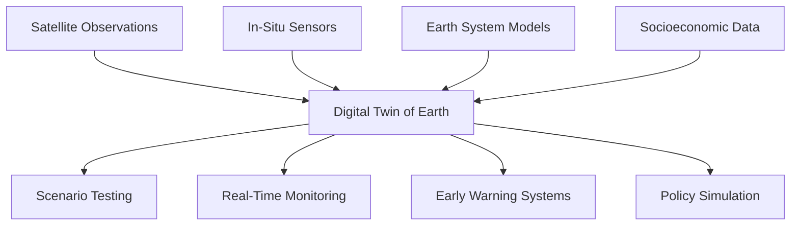
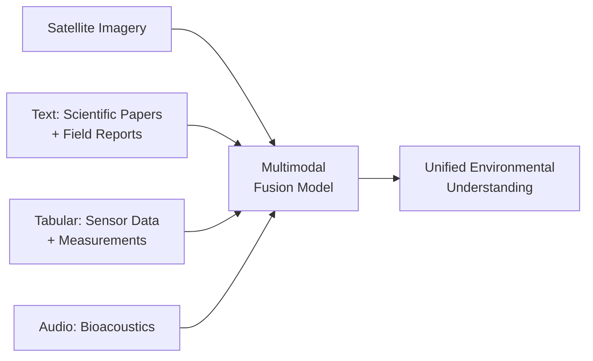

## Frontiers in AI for Environmental Science

## Overview

The previous lessons covered established applications of AI in environmental science. This lesson looks ahead to the frontiers — emerging approaches that promise to reshape how we monitor, model, and manage Earth's environment. From digital twins of the entire planet to foundation models pretrained on Earth observation data, from AI-driven climate solutions to critical ethical questions about who benefits, these frontiers represent where the field is heading.

---

## Digital Twins for Earth

A **digital twin** is a continuously updated virtual replica of a physical system. For Earth, this means integrating all available data streams — satellites, sensors, models, socioeconomic data — into a living simulation that can be queried, tested, and projected forward:



### Destination Earth (DestinE)

The European Commission's **Destination Earth** initiative aims to build a high-fidelity digital twin of Earth by 2030:

- **Climate adaptation twin**: Simulate regional climate impacts at 1 km resolution
- **Weather extremes twin**: Predict extreme events with unprecedented detail
- **On-demand twins**: User-configurable simulations for specific regions and scenarios

### NVIDIA Earth-2

NVIDIA's Earth-2 platform combines GPU-accelerated physics simulations with AI:
- **FourCastNet**: AI weather model running 45,000x faster than traditional NWP
- **CorrDiff**: Diffusion model for super-resolution — upscaling coarse predictions to fine resolution
- **Interactive visualization**: Real-time exploration of climate scenarios

### Technical Challenges

- **Data assimilation at scale**: Integrating millions of heterogeneous data streams in real time
- **Multi-scale coupling**: Connecting global climate to local weather to individual ecosystems
- **Uncertainty propagation**: Tracking uncertainty through coupled models
- **Computational cost**: Even with AI acceleration, full digital twins require exascale computing

---

## Foundation Models for Earth Observation

Foundation models — large pretrained models fine-tuned for downstream tasks — are entering environmental AI:

### Prithvi (NASA/IBM)

A geospatial foundation model pretrained on NASA's Harmonized Landsat Sentinel-2 data:

- **Architecture**: Vision Transformer with temporal and spectral position encodings
- **Pretraining**: Masked autoencoder objective on multi-temporal satellite imagery
- **Fine-tuning tasks**: Flood mapping, wildfire scar detection, crop classification, multi-temporal cloud gap imputation

### Clay Foundation Model

An open-source Earth observation foundation model:
- Trained on Sentinel-1 (SAR), Sentinel-2 (optical), and DEM data
- Encodes spatial, temporal, and spectral context
- State-of-the-art on multiple downstream benchmarks with minimal fine-tuning data

### Why Foundation Models Matter

Traditional environmental ML requires task-specific labeled datasets — expensive and scarce for many environmental applications. Foundation models learn general representations from abundant unlabeled satellite data, then transfer to specific tasks with few labels:

| Approach | Labeled Data Needed | Performance |
|----------|-------------------|-------------|
| Train from scratch | Thousands of samples | Good |
| ImageNet pretrained | Hundreds of samples | Better |
| Earth observation foundation model | Tens of samples | Best |

---

## AI for Climate Change Mitigation

### Carbon Capture and Storage

ML optimizes carbon capture processes:
- **Sorbent design**: Generative models propose novel materials for direct air capture
- **Reservoir simulation**: Neural operators accelerate CO₂ storage simulations in geological formations
- **Monitoring**: Satellite detection of CO₂ leaks from storage sites

### Renewable Energy Optimization

AI accelerates the clean energy transition:
- **Solar/wind forecasting**: Probabilistic models reduce balancing costs
- **Grid optimization**: RL manages variable renewable integration
- **Materials discovery**: ML accelerates discovery of next-generation solar cell and battery materials

### Agricultural Emissions Reduction

Agriculture produces ~25% of greenhouse gas emissions. AI helps through:
- **Precision agriculture**: ML-optimized fertilizer application reduces N₂O emissions
- **Methane monitoring**: Satellite detection of methane plumes from rice paddies and livestock
- **Alternative proteins**: ML-guided development of plant-based and cultivated meat

---

## AI for Climate Change Adaptation

### Climate Risk Analytics

AI quantifies climate risks for infrastructure, agriculture, and communities:

```python
# Simplified climate risk scoring
def compute_climate_risk(location, scenario='ssp245', horizon=2050):
    hazards = {
        'heat_stress': predict_heat_days(location, scenario, horizon),
        'flood_risk': predict_flood_probability(location, scenario, horizon),
        'drought_risk': predict_drought_frequency(location, scenario, horizon),
        'sea_level': predict_sea_level_rise(location, scenario, horizon),
        'wildfire': predict_fire_risk(location, scenario, horizon)
    }
    vulnerability = assess_vulnerability(location)  # socioeconomic factors
    exposure = assess_exposure(location)  # assets at risk

    return {h: hazards[h] * vulnerability * exposure for h in hazards}
```

### Climate-Resilient Agriculture

ML identifies crop varieties and management practices adapted to future climate conditions:
- **Crop modeling**: Neural networks predict yields under climate scenarios
- **Variety selection**: Genomic prediction models match crop genotypes to future climates
- **Adaptive management**: RL optimizes planting dates, irrigation, and harvesting under climate uncertainty

### Migration and Displacement

Climate change is already driving displacement. ML models predict climate migration patterns using:
- Projected climate hazards (drought, flooding, sea level rise)
- Economic vulnerability and adaptive capacity
- Historical migration patterns and network effects

---

## Ethical Considerations

### Who Benefits from Environmental AI?

Environmental AI risks reproducing existing inequalities:

**Data bias**: Satellite coverage, sensor networks, and training data are concentrated in wealthy nations. Models trained on North American or European data may fail in tropical developing countries — precisely where environmental pressures are greatest.

**Benefit distribution**: AI tools developed by tech companies and research institutions in the Global North may not reach communities most affected by environmental change.

**Computational costs**: Training large environmental AI models has its own carbon footprint. The irony of burning energy to build climate models is not lost on researchers.

### Indigenous Knowledge and AI

Indigenous communities hold millennia of environmental knowledge. Ethical environmental AI should:
- Incorporate traditional ecological knowledge with community consent
- Respect data sovereignty — communities control their own environmental data
- Ensure AI tools serve community-defined priorities, not external research agendas

### Dual-Use Concerns

Environmental monitoring AI can be repurposed: satellite deforestation detection could enable illegal logging (by revealing enforcement gaps), and precision agriculture AI could optimize resource extraction. Responsible deployment requires considering misuse vectors.

---

## Emerging Technical Directions

### Self-Supervised Learning for Environmental Data

Most environmental data is unlabeled. Self-supervised methods learn useful representations without labels:

- **Contrastive learning**: Learn invariances from augmented views of the same location/time
- **Masked image modeling**: Reconstruct masked patches of satellite imagery
- **Temporal prediction**: Predict future states from past observations

### Physics-Informed Foundation Models

Combining foundation model architectures with physical constraints:

$$\mathcal{L} = \mathcal{L}_{self-supervised} + \alpha \mathcal{L}_{physics} + \beta \mathcal{L}_{conservation}$$

These models learn general environmental representations while respecting known physical laws.

### Multimodal Environmental AI

Integrating diverse data types in unified models:



---

## The Path Forward

The most impactful environmental AI will be:

1. **Actionable**: Providing decision-relevant outputs, not just academic metrics
2. **Equitable**: Accessible to communities most affected by environmental change
3. **Trustworthy**: Transparent, uncertainty-aware, and validated against ground truth
4. **Sustainable**: Computationally efficient, with carbon costs justified by environmental benefits
5. **Interdisciplinary**: Built by teams combining ML expertise with deep domain knowledge in ecology, hydrology, atmospheric science, and environmental policy

The environmental crisis is the defining challenge of our era. AI alone won't solve it — but applied thoughtfully, ethically, and at scale, it can provide the monitoring, prediction, and optimization tools that evidence-based environmental action demands.

---

## Summary

The frontiers of environmental AI include digital twins that simulate the entire Earth system, foundation models that transfer across environmental tasks with minimal labeled data, AI-driven climate mitigation and adaptation strategies, and critical ethical questions about equity, data sovereignty, and responsible deployment. The field is moving from isolated applications to integrated systems that combine physical knowledge, massive data streams, and powerful ML in service of planetary stewardship.

---

## Further Reading

- Camps-Valls, G. et al. (2023). "Discovering causal relations and equations from data." *Physics Reports*.
- Jakubik, J. et al. (2023). "Foundation models for generalist geospatial artificial intelligence." *arXiv:2310.18660*.
- Rolnick, D. et al. (2022). "Tackling Climate Change with Machine Learning." *ACM Computing Surveys*.
- European Commission (2024). "Destination Earth." *digital-strategy.ec.europa.eu*.
