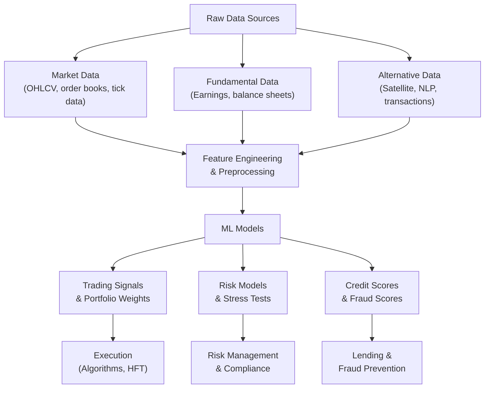

# Introduction to AI for Finance

## Overview

Finance is one of the oldest and most data-rich domains in human history — ledgers, prices, and transaction records stretch back millennia. Yet the last four decades have seen finance transform more radically than in all prior centuries combined, driven by computers, the internet, and now artificial intelligence. **AI is not a future possibility for finance — it is already its operational backbone.**

The story begins in the 1980s, when quantitative analysts ("quants") at firms like Renaissance Technologies and D.E. Shaw began applying statistical models to systematically trade markets. These early algorithmic trading systems were rule-based: buy when the 50-day moving average crossed the 200-day moving average, sell when volatility exceeded a threshold. They were profitable because markets were inefficient and human traders were slow to react. By the 1990s, high-frequency trading (HFT) firms were co-locating servers next to exchange matching engines to shave microseconds off trade execution. Speed became the primary edge.

The 2010s marked a second inflection: machine learning entered finance in earnest. Hedge funds began training gradient boosting models on hundreds of features derived from price data, earnings reports, and satellite imagery of retail parking lots. Credit card companies deployed neural networks to detect fraud in real time. Banks used NLP to extract signals from earnings call transcripts before the human analyst community could read them. Regulators began using ML to scan for market manipulation patterns across billions of trades.

Today, AI permeates every layer of the financial system:

**Algorithmic and Quantitative Trading**: Machine learning models predict short-term price movements, optimize execution to minimize market impact, and construct portfolios that balance expected return against risk. Reinforcement learning agents learn to execute large orders without moving the market against themselves.

**Robo-Advisors**: Platforms like Betterment and Wealthfront use optimization algorithms to allocate client portfolios across asset classes, automatically rebalancing when drift exceeds a threshold and harvesting tax losses. They have democratized access to sophisticated portfolio management that once required a human advisor.

**Credit Scoring and Lending**: Traditional FICO scores use a small number of features (payment history, credit utilization, length of credit history). ML models trained on thousands of features — including transaction-level spending patterns and mobile device metadata — can predict default with much higher accuracy, enabling lenders to extend credit to thin-file borrowers who would have been rejected under legacy scoring.

**Fraud Detection**: Banks process hundreds of millions of card transactions daily. Each transaction must be scored for fraud in under 100 milliseconds. Graph neural networks that model transaction networks, combined with anomaly detection on spending patterns, catch fraudsters that rule-based systems miss. Real-time models have reduced credit card fraud losses by billions of dollars annually.

**NLP for Market Intelligence**: Earnings calls, SEC filings, central bank speeches, and news articles move markets. LLMs fine-tuned on financial text can parse these documents, extract sentiment, identify forward-looking statements, and compare management guidance against actual results — at a scale and speed no human analyst can match.

This course introduces the AI toolkit for finance. We cover financial data and representations, time series analysis, machine learning for price prediction, risk modeling, portfolio optimization, and NLP for finance. Each lesson builds toward practical skills: writing code that loads real data, builds models, and evaluates them honestly.

---

## Key Concepts

- **Algorithmic trading**: Using computer programs to execute trades based on pre-defined rules or learned models, removing human emotion and latency from execution.
- **Quantitative finance**: Applying mathematical and statistical models to financial markets, risk management, and derivative pricing.
- **Fintech**: The broad category of technology companies applying software and AI to financial services — payments, lending, insurance, wealth management.
- **Robo-advisor**: An automated digital platform that provides financial planning and portfolio management with minimal human intervention, using optimization and ML algorithms.
- **High-frequency trading (HFT)**: Algorithmic trading strategies that execute thousands to millions of trades per second, exploiting tiny price discrepancies across venues. Latency (measured in microseconds) is the primary competitive dimension.
- **Alternative data**: Non-traditional data sources used to generate trading signals — satellite imagery, credit card transaction aggregates, web scraping, app download statistics, shipping container tracking.

---

## The AI in Finance Ecosystem

**AI in Finance Ecosystem**



---

## Core Mathematics

Two quantities underpin virtually all of quantitative finance. The first is **expected return**: given a probability distribution over outcomes, what return do we expect on average?

$$\mathbb{E}[R] = \sum_{i=1}^{n} p_i \cdot r_i$$

where $p_i$ is the probability of scenario $i$ and $r_i$ is the return in that scenario. In the continuous case with a returns distribution $f(r)$:

$$\mathbb{E}[R] = \int_{-\infty}^{\infty} r \cdot f(r) \, dr$$

The second is the **Sharpe ratio**, the foundational measure of risk-adjusted return introduced by William Sharpe in 1966:

$$S = \frac{\mathbb{E}[R_p] - R_f}{\sigma_p}$$

where $R_p$ is portfolio return, $R_f$ is the risk-free rate (e.g., 3-month T-bill yield), and $\sigma_p$ is the standard deviation of portfolio returns. A Sharpe ratio above 1.0 is generally considered good; above 2.0 is excellent. Most ML-based strategies target Sharpe ratios of 1.5–3.0 after transaction costs.

The annualized Sharpe ratio (assuming daily returns with 252 trading days per year) is:

$$S_{\text{annual}} = \sqrt{252} \cdot \frac{\mu_{\text{daily}} - r_f}{\sigma_{\text{daily}}}$$

---

## Code Example: Stock Data Retrieval and Moving Averages

The `yfinance` library provides free access to historical price data from Yahoo Finance — a natural starting point for any finance ML project.

```python
import yfinance as yf
import pandas as pd
import numpy as np
import matplotlib.pyplot as plt

# Download historical daily price data for Apple
ticker = "AAPL"
df = yf.download(ticker, start="2020-01-01", end="2024-01-01", auto_adjust=True)

print(df.head())
print(f"\nShape: {df.shape}")
print(f"Columns: {df.columns.tolist()}")

# Compute daily returns
df["return"] = df["Close"].pct_change()

# Simple moving averages — two of the most common technical indicators
df["SMA_50"]  = df["Close"].rolling(window=50).mean()   # 50-day SMA
df["SMA_200"] = df["Close"].rolling(window=200).mean()  # 200-day SMA

# Compute Sharpe ratio from the full return history
risk_free_rate_daily = 0.04 / 252  # 4% annual rate converted to daily
excess_returns = df["return"].dropna() - risk_free_rate_daily
sharpe_daily = excess_returns.mean() / excess_returns.std()
sharpe_annual = sharpe_daily * np.sqrt(252)

print(f"\nAnnualized Sharpe Ratio (buy-and-hold): {sharpe_annual:.2f}")
print(f"Total Return: {((df['Close'].iloc[-1] / df['Close'].iloc[0]) - 1) * 100:.1f}%")
print(f"Annualized Volatility: {df['return'].std() * np.sqrt(252) * 100:.1f}%")

# Golden cross / death cross signals
# A "golden cross" (SMA_50 crosses above SMA_200) is a bullish signal
df["signal"] = 0
df.loc[df["SMA_50"] > df["SMA_200"], "signal"] = 1   # Long
df.loc[df["SMA_50"] < df["SMA_200"], "signal"] = -1  # Short / flat

# Strategy returns: hold when signal is 1, flat otherwise
df["strategy_return"] = df["signal"].shift(1) * df["return"]

strategy_sharpe = (df["strategy_return"].mean() / df["strategy_return"].std()) * np.sqrt(252)
print(f"Moving Average Strategy Sharpe: {strategy_sharpe:.2f}")
```

Running this code downloads four years of Apple daily data (Open, High, Low, Close, Volume), computes the 50-day and 200-day simple moving averages, implements a simple golden cross trading signal, and evaluates the strategy using the Sharpe ratio. In practice, transaction costs, slippage, and market impact would further reduce returns — but this illustrates the full pipeline from data download to strategy evaluation.

---

## Exercises

1. **Download and explore stock data**: Using `yfinance`, download 5 years of daily data for three different stocks (e.g., AAPL, MSFT, TSLA). Compute and compare the annualized Sharpe ratio for each. Which had the best risk-adjusted returns?

2. **Compute basic statistics**: For the same three stocks, compute the daily mean return, annualized volatility, maximum drawdown (the peak-to-trough decline), and skewness of returns. What do these statistics tell you about each stock's risk profile?

3. **Benchmark comparison**: Download SPY (the S&P 500 ETF) for the same period. Compute the "information ratio" — the Sharpe ratio of the excess return of each stock relative to SPY. Which stocks outperformed the benchmark on a risk-adjusted basis?

---

## Further Reading

- Lopez de Prado, Marcos. *Advances in Financial Machine Learning*. Wiley, 2018. The definitive ML-for-finance textbook.
- Cartea, Álvaro, Sebastian Jaimungal, and José Penalva. *Algorithmic and High-Frequency Trading*. Cambridge University Press, 2015.
- Chinco, Alex, Adam Clark-Joseph, and Mao Ye. "Sparse Signals in the Cross-Section of Returns." *Journal of Finance* 74, no. 1 (2019).
- Numerai Tournament: [https://numer.ai/](https://numer.ai/) — a hedge fund that runs a continuous ML competition on obfuscated financial data.
- yfinance documentation: [https://pypi.org/project/yfinance/](https://pypi.org/project/yfinance/)
