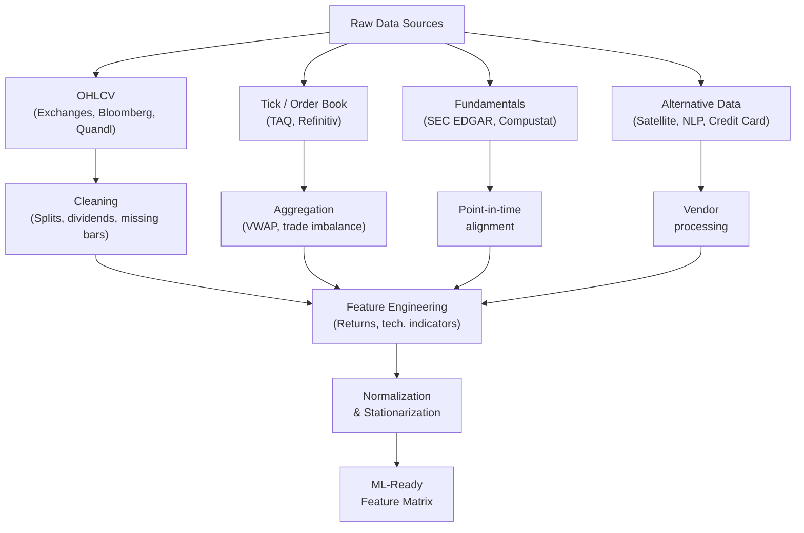

# Financial Data and Representations

## Overview

Every machine learning model is only as good as the data it learns from. In finance, this truism cuts especially deep: the choice of what data to use, how to represent it, and how to engineer features from it often matters more than the choice of model architecture. A well-engineered feature set with a simple linear model frequently outperforms a deep neural network trained on raw price data without care.

Financial data is extraordinarily diverse. Consider what happened in a single day of trading: billions of individual transactions executed across hundreds of exchanges worldwide, each with a price, a quantity, a timestamp, a buyer, and a seller. Company executives held an earnings call that moved the stock 8%. The Federal Reserve released meeting minutes that shifted the yield curve. A satellite image of a chip fabrication plant was processed by an alternative data vendor and sold to hedge funds. A Reddit thread on WallStreetBets accumulated 50,000 upvotes discussing a small-cap stock. Each of these generates structured or unstructured data that practitioners mine for predictive signals.

Understanding the taxonomy of financial data — and the pipeline from raw bytes to ML-ready features — is the foundation of quantitative research.

### OHLCV Data

The most fundamental type of market data is **OHLCV**: for each time period (daily, hourly, minute-level), record the Open, High, Low, Close price and total traded Volume. This format, compact yet information-rich, has been standard since the era of paper ticker tape.

- **Open**: The first transaction price of the period, heavily influenced by overnight news and pre-market activity.
- **High / Low**: The extremes of intraday price movement, capturing intraday volatility.
- **Close**: The last transaction price, used most commonly as the "canonical" price. For equities, the **adjusted close** corrects for dividends and stock splits, making long time series comparable.
- **Volume**: Total shares (or contracts) traded. Volume is a proxy for market participation and conviction — a large price move on thin volume is less meaningful than the same move on heavy volume.

### Order Book Data

Beneath the OHLCV summary lies the **limit order book** (LOB): the real-time collection of all outstanding buy and sell orders at each price level. The book has a bid side (buyers) and an ask side (sellers); the spread between the best bid and best ask is the bid-ask spread, a direct measure of market liquidity.

Order book data is extremely high-frequency — the S&P 500 futures order book updates millions of times per day. ML models trained directly on order book snapshots can predict very short-term price movements, but these signals decay in milliseconds and require co-located infrastructure to exploit.

### Tick Data

**Tick data** records every individual transaction: timestamp (nanosecond resolution at major exchanges), price, and size. A liquid equity like AAPL generates tens of millions of ticks per day. Tick data is the raw material for microstructure research — understanding how information incorporates into prices, how market makers manage inventory, and how HFT strategies profit from order flow.

### Fundamental Data

**Fundamental data** refers to financial statements: income statements (revenue, earnings, margins), balance sheets (assets, liabilities, equity), and cash flow statements. Publicly traded companies in the US file quarterly (10-Q) and annual (10-K) reports with the SEC. This data drives traditional value investing — buying stocks with low price-to-earnings ratios, high return on equity, and strong cash flow generation.

For ML, fundamental data requires careful alignment: the information in a filing is only available after the filing date, not on the date the period ended. Using a fiscal year 2022 earnings figure to train a model on 2022 price data is **look-ahead bias** — a form of data leakage that produces spuriously high backtest performance.

### Alternative Data

The frontier of quantitative finance is **alternative data**: non-traditional information sources that provide economic signals before they show up in official statistics. Examples include:

- Satellite imagery of retail parking lots (estimated same-store sales)
- Credit card transaction aggregates (consumer spending by merchant category)
- Mobile device location data (foot traffic to stores)
- Web scraping of job postings (hiring trends signal business momentum)
- Earnings call transcripts (tone analysis, forward guidance extraction)
- App download rankings and ratings (product adoption signals)

Alternative data is expensive ($10,000–$1,000,000 per dataset per year is common), alpha decays quickly as more buyers obtain the same data, and cleaning it requires significant engineering.

---

## Data Pipeline

**Financial Data Pipeline: Raw Sources to ML-Ready Features**



---

## Mathematics: Log Returns and Volatility

Raw prices are non-stationary — they trend and cannot be compared across stocks at different price levels. The standard transformation is the **log return**:

$$r_t = \ln\left(\frac{P_t}{P_{t-1}}\right) = \ln(P_t) - \ln(P_{t-1})$$

Log returns have three key properties. First, they are approximately equal to simple returns for small values: $\ln(1+r) \approx r$ when $r$ is small. Second, multi-period log returns are additive: the log return over $k$ periods is $\sum_{i=1}^{k} r_{t-k+i}$. Third, they are more normally distributed than simple returns, which matters for many statistical tests.

**Realized volatility** over a window of $n$ periods is the standard deviation of log returns, annualized by multiplying by $\sqrt{252}$ (trading days per year):

$$\sigma_{\text{annual}} = \sqrt{252} \cdot \sqrt{\frac{1}{n-1} \sum_{t=1}^{n} (r_t - \bar{r})^2}$$

For **intraday volatility** estimation with tick data, a common robust estimator is the **Parkinson volatility**, which uses the high-low range:

$$\sigma_{\text{Parkinson}} = \sqrt{\frac{1}{4 \ln 2} \cdot \frac{1}{n} \sum_{t=1}^{n} \left(\ln\frac{H_t}{L_t}\right)^2}$$

This estimator is 5x more efficient than close-to-close volatility because it uses intraday information, and it does not require estimating the drift term.

---

## Code Example: OHLCV Preprocessing and Technical Indicators

```python
import yfinance as yf
import pandas as pd
import numpy as np

def load_ohlcv(ticker: str, start: str, end: str) -> pd.DataFrame:
    """Download and clean OHLCV data."""
    df = yf.download(ticker, start=start, end=end, auto_adjust=True)
    df.index = pd.to_datetime(df.index)
    df = df.dropna()  # Remove any missing bars
    df.columns = [c.lower() for c in df.columns]  # lowercase column names
    return df

def compute_log_returns(df: pd.DataFrame) -> pd.DataFrame:
    """Add log return and realized volatility columns."""
    df = df.copy()
    df["log_return"] = np.log(df["close"] / df["close"].shift(1))
    # 20-day rolling realized volatility, annualized
    df["rv_20"] = df["log_return"].rolling(20).std() * np.sqrt(252)
    return df

def compute_rsi(series: pd.Series, period: int = 14) -> pd.Series:
    """Relative Strength Index (RSI): momentum oscillator, range 0-100."""
    delta = series.diff()
    gain = delta.clip(lower=0).rolling(window=period).mean()
    loss = (-delta.clip(upper=0)).rolling(window=period).mean()
    rs = gain / loss.replace(0, np.nan)
    return 100 - (100 / (1 + rs))

def compute_macd(series: pd.Series,
                 fast: int = 12,
                 slow: int = 26,
                 signal: int = 9) -> pd.DataFrame:
    """
    MACD (Moving Average Convergence Divergence).
    Returns MACD line, signal line, and histogram.
    """
    ema_fast   = series.ewm(span=fast, adjust=False).mean()
    ema_slow   = series.ewm(span=slow, adjust=False).mean()
    macd_line  = ema_fast - ema_slow
    signal_line = macd_line.ewm(span=signal, adjust=False).mean()
    histogram   = macd_line - signal_line
    return pd.DataFrame({
        "macd": macd_line,
        "signal": signal_line,
        "histogram": histogram
    })

def build_feature_matrix(ticker: str,
                         start: str = "2018-01-01",
                         end: str = "2024-01-01") -> pd.DataFrame:
    """Full pipeline: raw OHLCV -> ML-ready feature matrix."""
    df = load_ohlcv(ticker, start, end)
    df = compute_log_returns(df)

    # Technical indicators
    df["rsi_14"] = compute_rsi(df["close"], period=14)
    macd_df = compute_macd(df["close"])
    df = pd.concat([df, macd_df], axis=1)

    # Trend features: price relative to moving averages
    df["sma_20"]  = df["close"].rolling(20).mean()
    df["sma_50"]  = df["close"].rolling(50).mean()
    df["close_over_sma20"] = df["close"] / df["sma_20"] - 1  # % above/below 20d MA
    df["close_over_sma50"] = df["close"] / df["sma_50"] - 1

    # Volume features
    df["volume_ratio"] = df["volume"] / df["volume"].rolling(20).mean()  # volume Z relative to avg

    # Parkinson volatility (intraday high-low range estimator)
    df["parkinson_vol"] = np.sqrt(
        (1 / (4 * np.log(2))) *
        (np.log(df["high"] / df["low"]) ** 2).rolling(20).mean()
    ) * np.sqrt(252)

    # Target: 5-day forward log return (for supervised learning)
    df["target_5d"] = df["log_return"].shift(-5).rolling(5).sum()

    # Drop rows with NaN (from rolling windows and shift)
    df = df.dropna()

    feature_cols = [
        "log_return", "rv_20", "rsi_14",
        "macd", "signal", "histogram",
        "close_over_sma20", "close_over_sma50",
        "volume_ratio", "parkinson_vol"
    ]
    print(f"Feature matrix shape: {df[feature_cols].shape}")
    print(df[feature_cols].describe().round(4))
    return df

# Run the pipeline
feature_df = build_feature_matrix("AAPL")
```

This pipeline produces a feature matrix with 10 predictors ready for ML training. Notice the forward-looking target (`target_5d`) is created with `.shift(-5)` — it is critical to ensure this column is excluded from the feature set when training, and that the dataset is split strictly by time (no shuffling) to prevent look-ahead bias.

---

## Exercises

1. **Build a feature matrix**: Using the code above, run `build_feature_matrix` for three tickers of your choice. Check the correlation matrix of features — which pairs are highly correlated? Highly correlated features add no independent information and can destabilize models.

2. **Explore the return distribution**: Plot a histogram of daily log returns and overlay a normal distribution with the same mean and standard deviation. Notice how financial returns have **fat tails** (more extreme events than a Gaussian predicts) and are slightly left-skewed. Compute the kurtosis.

3. **Missing data handling**: Deliberately introduce 5% random missing values into the close price series, then compare three imputation strategies: forward-fill, linear interpolation, and rolling mean. Which strategy preserves the distributional properties of returns best?

---

## Further Reading

- Harris, Larry. *Trading and Exchanges: Market Microstructure for Practitioners*. Oxford University Press, 2003. The canonical textbook on order books and market structure.
- Cont, Rama. "Empirical properties of asset returns: stylized facts and statistical issues." *Quantitative Finance* 1, no. 2 (2001). The foundational survey of the statistical properties of financial return series.
- Lopez de Prado, Marcos. "The 7 Reasons Most Machine Learning Funds Fail." (2018). A practitioner's guide to data pitfalls, including look-ahead bias and selection bias.
- Quandl / Nasdaq Data Link: [https://data.nasdaq.com/](https://data.nasdaq.com/) — one of the most accessible sources of financial datasets.
- SEC EDGAR full-text search: [https://efts.sec.gov/LATEST/search-index?q=](https://efts.sec.gov/LATEST/search-index?q=)
