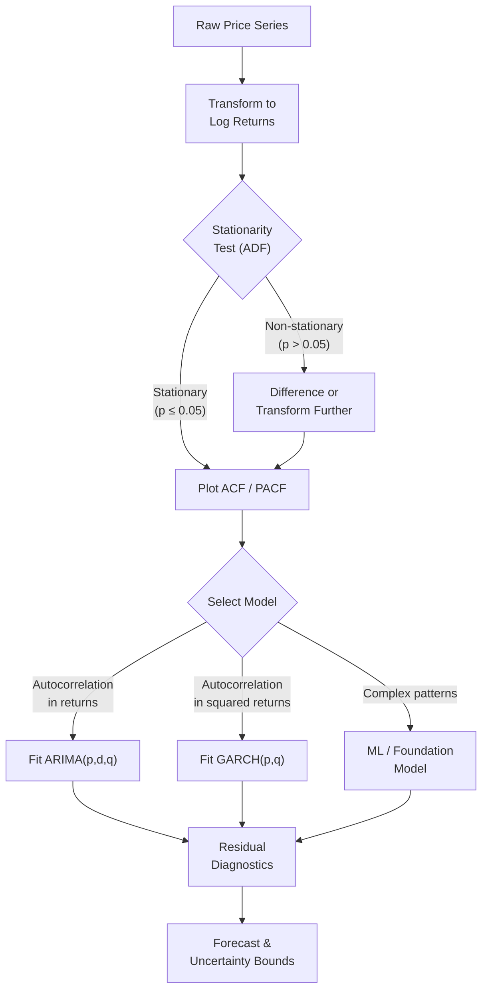

## Time Series Analysis for Financial Markets

## Overview

A time series is a sequence of observations indexed by time. Financial markets generate time series at every scale: tick-by-tick transaction prices arriving millions of times per day, daily OHLCV bars, monthly economic releases, and quarterly earnings figures. Understanding the statistical structure of these series — whether they are predictable, whether they have memory, how their volatility evolves — is the foundation of all quantitative modeling.

Classical time series analysis was developed largely in the mid-20th century for economic forecasting. The Box-Jenkins methodology (1970) systematized the process of identifying, estimating, and diagnosing ARIMA models. Engle's ARCH model (1982) and Bollerslev's GARCH extension (1986) formalized the observation that financial volatility clusters — large moves tend to cluster together in time. These models won their inventors Nobel Prizes and remain the industry standard for volatility modeling today.

The core challenge in financial time series analysis is **non-stationarity**. A stationary time series has constant mean, variance, and autocovariance structure over time. Asset prices are definitively non-stationary: they trend, their volatility changes regime, and their statistical properties shift with macroeconomic conditions. Most classical ML models assume stationarity — applying them naively to raw price data leads to spurious correlations and models that fail out-of-sample.

### Stationarity

A time series $\{y_t\}$ is **weakly stationary** if:
1. $\mathbb{E}[y_t] = \mu$ (constant mean)
2. $\text{Var}(y_t) = \sigma^2 < \infty$ (constant, finite variance)
3. $\text{Cov}(y_t, y_{t-k}) = \gamma(k)$ depends only on the lag $k$, not on $t$

Stock prices violate all three conditions. Log returns, however, are approximately stationary — their mean is near zero, their variance is roughly constant within a regime, and their autocorrelation decays quickly. This is why all serious quantitative work operates on returns, not prices.

### Autocorrelation

The **autocorrelation function (ACF)** measures the linear correlation between a series and its own lagged values:

$$\rho(k) = \frac{\text{Cov}(y_t, y_{t-k})}{\text{Var}(y_t)} = \frac{\gamma(k)}{\gamma(0)}$$

The **partial autocorrelation function (PACF)** measures the correlation between $y_t$ and $y_{t-k}$ after removing the linear effect of the intermediate lags $y_{t-1}, \ldots, y_{t-k+1}$. Together, the ACF and PACF are the primary diagnostic tools for identifying the order of ARIMA models.

A well-known empirical finding: the ACF of daily log returns is near zero at all lags (returns are largely unpredictable), but the ACF of squared returns or absolute returns is significantly positive for many lags (volatility is persistent). This asymmetry — return unpredictability but volatility predictability — is one of the most replicated findings in empirical finance.

### Volatility Clustering and Mean Reversion

Financial markets exhibit two stylized facts that define their time series structure:

**Volatility clustering**: Large price changes (in either direction) tend to be followed by more large changes, and small changes by small changes. This was first documented by Mandelbrot (1963) and formalized by Engle's ARCH model. It means that if the market was turbulent yesterday, it will likely remain turbulent today.

**Mean reversion**: Many financial quantities — yield spreads, price-to-earnings ratios, volatility itself — tend to revert toward their long-run average after deviating from it. Short-term equity returns, however, show weak momentum (positive autocorrelation) over 1-12 month horizons before mean-reverting over longer periods (the value effect).

### ARIMA Models

An **ARIMA(p, d, q)** model combines three components:
- **AR(p)**: Autoregressive — current value depends on $p$ past values
- **I(d)**: Integrated — the series is differenced $d$ times to achieve stationarity
- **MA(q)**: Moving average — current value depends on $q$ past forecast errors

For a stationary series (after $d$ differences), the ARMA(p,q) model is:

$$y_t = c + \sum_{i=1}^{p} \phi_i y_{t-i} + \varepsilon_t + \sum_{j=1}^{q} \theta_j \varepsilon_{t-j}$$

where $\varepsilon_t \sim \mathcal{N}(0, \sigma^2)$ is white noise, $\phi_i$ are the autoregressive coefficients, and $\theta_j$ are the moving average coefficients.

For daily equity log returns, the typical finding is ARIMA(0,0,0) or ARIMA(1,0,0) — the series has very little linear structure. ARIMA is much more useful for interest rates, macroeconomic series, and certain commodity markets.

### GARCH Models

The **GARCH(1,1)** (Generalized Autoregressive Conditional Heteroskedasticity) model is the workhorse of financial volatility modeling. It models the conditional variance $h_t$ as a function of the squared return and the previous conditional variance:

$$r_t = \mu + \varepsilon_t, \quad \varepsilon_t = \sqrt{h_t} \cdot z_t, \quad z_t \sim \mathcal{N}(0, 1)$$

$$h_t = \omega + \alpha \varepsilon_{t-1}^2 + \beta h_{t-1}$$

where $\omega > 0$, $\alpha \geq 0$, $\beta \geq 0$, and $\alpha + \beta < 1$ (stationarity condition). The parameter $\alpha$ captures how much a large shock today increases tomorrow's variance; $\beta$ captures how persistent volatility is. Typical estimates for equity indices: $\alpha \approx 0.05$–$0.10$, $\beta \approx 0.85$–$0.92$, meaning volatility is highly persistent ($\alpha + \beta \approx 0.95$).

The long-run (unconditional) variance is:

$$\sigma^2_{\infty} = \frac{\omega}{1 - \alpha - \beta}$$

Modern extensions include **EGARCH** (captures the leverage effect — volatility increases more after negative returns than positive ones), **GJR-GARCH**, and **Realized GARCH** (incorporates high-frequency realized volatility measures).

### Foundation Models for Time Series

The 2020s have brought a new class of models to time series forecasting: large **time series foundation models** trained on diverse datasets across many domains. Models like **TimesFM** (Google), **Chronos** (Amazon), and **Moirai** (Salesforce) are pretrained transformers that can perform zero-shot forecasting on new time series without task-specific training. In finance, these models show promise for short-horizon forecasting of macroeconomic series and volatility regimes, though they have not yet displaced specialized financial models for trading applications.

---

## Analysis Workflow

**Time Series Analysis Workflow for Financial Data**



---

## Code Example: ARIMA and Stationarity Testing

```python
import yfinance as yf
import pandas as pd
import numpy as np
import matplotlib.pyplot as plt

from statsmodels.tsa.stattools import adfuller, acf, pacf
from statsmodels.tsa.arima.model import ARIMA
from statsmodels.graphics.tsaplots import plot_acf, plot_pacf

# ── 1. Download data ──────────────────────────────────────────────────────────
df = yf.download("SPY", start="2018-01-01", end="2024-01-01", auto_adjust=True)
prices = df["Close"].squeeze()
log_returns = np.log(prices / prices.shift(1)).dropna()

# ── 2. Augmented Dickey-Fuller stationarity test ──────────────────────────────
def adf_report(series: pd.Series, name: str) -> None:
    """Run ADF test and print a human-readable summary."""
    result = adfuller(series.dropna(), autolag="AIC")
    print(f"\nADF Test: {name}")
    print(f"  Test statistic : {result[0]:.4f}")
    print(f"  p-value        : {result[1]:.4f}")
    print(f"  Critical values: {result[4]}")
    conclusion = "STATIONARY (reject unit root)" if result[1] < 0.05 else "NON-STATIONARY (fail to reject unit root)"
    print(f"  Conclusion     : {conclusion}")

adf_report(prices, "SPY Close Prices")
adf_report(log_returns, "SPY Log Returns")

# ── 3. ACF and PACF of log returns ───────────────────────────────────────────
fig, axes = plt.subplots(2, 2, figsize=(12, 8))

plot_acf(log_returns, lags=30, ax=axes[0, 0], title="ACF of Log Returns")
plot_pacf(log_returns, lags=30, ax=axes[0, 1], title="PACF of Log Returns")

# ACF of squared returns reveals volatility clustering
plot_acf(log_returns**2, lags=30, ax=axes[1, 0], title="ACF of Squared Returns (Volatility Clustering)")
plot_pacf(log_returns**2, lags=30, ax=axes[1, 1], title="PACF of Squared Returns")

plt.tight_layout()
plt.savefig("acf_pacf.png", dpi=150)

# ── 4. Fit ARIMA(1,0,1) to log returns ──────────────────────────────────────
# For most equity return series, a low-order ARIMA is appropriate
model = ARIMA(log_returns, order=(1, 0, 1))
result = model.fit()
print(result.summary())

# ── 5. Walk-forward forecasting (expanding window) ───────────────────────────
# Proper out-of-sample evaluation: retrain on all data up to each point
n_test = 252  # last year as test set
train = log_returns.iloc[:-n_test]
test  = log_returns.iloc[-n_test:]

one_step_forecasts = []
for i in range(len(test)):
    # Fit on expanding window
    history = log_returns.iloc[:-(n_test - i)] if i < n_test else log_returns
    m = ARIMA(history, order=(1, 0, 1))
    r = m.fit()
    forecast = r.forecast(steps=1)
    one_step_forecasts.append(forecast.iloc[0])

forecasts = pd.Series(one_step_forecasts, index=test.index)

# Directional accuracy: does the sign of the forecast match the sign of the actual?
directional_accuracy = (np.sign(forecasts) == np.sign(test)).mean()
print(f"\nWalk-forward ARIMA(1,0,1) directional accuracy: {directional_accuracy:.1%}")
# Expect ~50% — ARIMA rarely beats a coin flip on equity returns
```

This code demonstrates the full diagnostic workflow: testing for stationarity (prices are non-stationary, returns are stationary), visualizing ACF/PACF patterns, fitting an ARIMA model, and evaluating it with a walk-forward procedure. The directional accuracy near 50% confirms the classical finding: short-term equity returns have minimal linear structure, which motivates the GARCH approach for volatility rather than returns.

---

## Exercises

1. **ADF test exploration**: Run the ADF test on SPY prices, log prices, and log returns. Also try running it on 10-year US Treasury yields (ticker: `^TNX` on Yahoo Finance). Do yields behave more like prices (non-stationary) or returns (stationary)?

2. **Fit ARIMA to stock returns**: Choose a stock and use the `auto_arima` function from the `pmdarima` library (`pip install pmdarima`) to automatically select the best ARIMA order based on AIC. Is the selected order larger or smaller than you expected? What does this tell you about the predictability of returns?

3. **Volatility clustering visualization**: Download 5 years of daily returns for any index (SPY, QQQ, IWM). Plot the rolling 20-day realized volatility and identify at least two periods of elevated volatility. Which market events correspond to these periods? How long did it take for volatility to revert to its long-run average?

---

## Further Reading

- Engle, Robert F. "Autoregressive Conditional Heteroscedasticity with Estimates of the Variance of United Kingdom Inflation." *Econometrica* 50, no. 4 (1982). The original ARCH paper.
- Bollerslev, Tim. "Generalized Autoregressive Conditional Heteroskedasticity." *Journal of Econometrics* 31, no. 3 (1986). The GARCH(1,1) extension.
- Tsay, Ruey S. *Analysis of Financial Time Series*. 3rd ed. Wiley, 2010. The standard textbook for financial time series — rigorous and finance-focused.
- Hyndman, Rob J., and George Athanasopoulos. *Forecasting: Principles and Practice*. 3rd ed. OTexts, 2021. Free online at [https://otexts.com/fpp3/](https://otexts.com/fpp3/). Excellent introduction to exponential smoothing and ARIMA.
- Das, Srinjoy, et al. "A decoder-only foundation model for time-series forecasting." Google Research, 2024 (TimesFM). [https://arxiv.org/abs/2310.10688](https://arxiv.org/abs/2310.10688)
