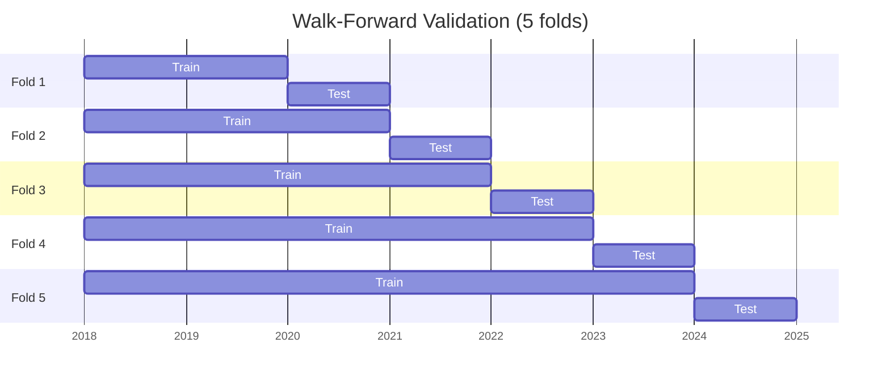

# Machine Learning for Stock Prediction

## Overview

Predicting stock prices is one of the most researched and most difficult problems in machine learning. Thousands of academic papers, hundreds of hedge funds, and countless individual practitioners have attacked it from every angle. The results are humbling: reliable, risk-adjusted alpha (return above a benchmark) is rare and ephemeral. Understanding why this is hard — and how practitioners carefully structure the problem to make honest progress — is as important as understanding the models themselves.

This lesson covers the full pipeline of ML-based stock prediction: framing the problem correctly, selecting and engineering features, choosing models (from linear regression to LSTMs), evaluating properly with time-series cross-validation, and understanding the core failure modes.

### Regression vs. Classification

There are two primary ways to frame stock prediction as a supervised learning problem:

**Regression**: Predict the actual magnitude of future returns (e.g., next week's log return). This is harder because returns are noisy, and MSE loss treats all errors symmetrically even though a model that says "+2%" when the actual is "-3%" is far more economically harmful than one that says "+2%" when the actual is "+1.5%".

**Classification**: Predict the direction of future price movement — up or down. This is more tractable and maps naturally to trading signals (long or short). A common variant is a three-class problem: predict whether the return will be in the top quintile (strong buy), middle three quintiles (hold/flat), or bottom quintile (strong sell).

Most practitioners start with classification. A classifier that achieves 53–55% directional accuracy is economically significant — even a small edge, applied consistently with proper position sizing, compounds into substantial returns.

### Key Failure Modes

Three failure modes destroy most academic and practitioner ML strategies:

**Look-ahead bias**: Using information at time $t$ that was not available at time $t$ to build features or labels. A subtle example: using the "adjusted close" price that incorporates future dividend announcements, or aligning quarterly earnings with the quarter end date rather than the filing date (which comes 45–90 days later). Any leakage from the future to the past produces spectacularly high backtest performance that evaporates immediately in live trading.

**Overfitting**: With thousands of potential features and a limited history (a decade of daily data is only ~2,500 observations), it is trivially easy to find patterns that fit the training set perfectly but have zero predictive power out-of-sample. Standard cross-validation (random splits) makes this dramatically worse, because shuffled financial data has no look-ahead bias by accident — the model sees test-period information indirectly.

**Non-stationarity**: The relationships between features and returns change over time. A momentum strategy that worked in the 2010s may underperform in the 2020s as crowding increases. Models trained on pre-2008 data fail catastrophically during the financial crisis. This is the "regime change" problem — the data-generating process shifts in ways that invalidate historical training distributions.

### Walk-Forward Validation

The correct evaluation methodology for financial ML is **walk-forward (expanding or rolling window) validation**:

1. Train on observations from $t_0$ to $t_k$.
2. Generate predictions for the period $[t_k + 1, t_k + h]$.
3. Advance the window by one step; re-train on $[t_0, t_{k+1}]$.
4. Aggregate out-of-sample predictions across all windows to evaluate.

This mimics how a live strategy would have been deployed: each prediction is made using only information available at that point in time.

**Walk-Forward Validation Diagram**



---

## Models for Stock Prediction

### Linear Models

**Linear regression** and **logistic regression** are the natural baselines. Despite their simplicity, regularized linear models (ridge, lasso, elastic net) are competitive with more complex models on financial data, because the signal-to-noise ratio is so low that complex models tend to overfit.

### Ensemble Methods: Random Forests and Gradient Boosting

**Random forests** construct many decision trees on bootstrapped samples of the training data and random subsets of features, then average their predictions. The randomization decorrelates the trees, reducing variance without increasing bias. They handle nonlinear feature interactions naturally and provide **feature importance** scores that are invaluable for understanding which signals drive predictions.

**Gradient boosting** (XGBoost, LightGBM, CatBoost) sequentially fits trees to the residuals of the current ensemble. It typically outperforms random forests on tabular data, at the cost of more hyperparameters and more risk of overfitting. Both are the most widely used ML models in quantitative finance today.

### LSTMs for Sequential Data

**Long Short-Term Memory (LSTM)** networks are recurrent neural networks with gated memory cells that can, in principle, learn dependencies across long sequences. For stock prediction, the input sequence is typically a rolling window of daily feature vectors; the LSTM processes the sequence and outputs a prediction.

In practice, LSTMs on financial data rarely outperform well-tuned gradient boosting on tabular features, for two reasons. First, financial return series have very weak temporal structure (as seen in Lesson 3). Second, LSTMs are harder to train and more prone to overfitting on the relatively short financial time series available. Transformer-based architectures (temporal fusion transformers, PatchTST) have recently shown more promise.

---

## Mathematics

### Cross-Entropy Loss

For a binary classification problem (up vs. down), the **cross-entropy loss** for $n$ samples is:

$$\mathcal{L} = -\frac{1}{n} \sum_{i=1}^{n} \left[ y_i \log(\hat{p}_i) + (1 - y_i) \log(1 - \hat{p}_i) \right]$$

where $y_i \in \{0, 1\}$ is the true label and $\hat{p}_i \in (0, 1)$ is the model's predicted probability of a positive (up) outcome. Minimizing cross-entropy is equivalent to maximizing the log-likelihood under a Bernoulli model.

### Information Ratio

The **information ratio (IR)** measures the consistency of alpha generation relative to the risk taken to generate it:

$$\text{IR} = \frac{\mathbb{E}[R_p - R_b]}{\sigma(R_p - R_b)} = \frac{\bar{\alpha}}{\text{TE}}$$

where $R_p$ is portfolio return, $R_b$ is benchmark return, $\bar{\alpha}$ is mean active return (alpha), and $\text{TE}$ is tracking error (standard deviation of active return). The IR is analogous to the Sharpe ratio but measures skill relative to a benchmark rather than relative to the risk-free rate. An IR above 0.5 is considered good; above 1.0 is excellent and rare.

The **Fundamental Law of Active Management** (Grinold, 1989) relates the IR to the **information coefficient** (IC, the correlation between predictions and outcomes) and the **breadth** (number of independent bets per year):

$$\text{IR} \approx \text{IC} \cdot \sqrt{\text{Breadth}}$$

An ML strategy that makes 252 independent daily predictions with an IC of 0.05 (modest but positive skill) achieves IR $\approx 0.05 \cdot \sqrt{252} \approx 0.79$ — a respectable result.

---

## Code Example: Random Forest Direction Classifier

```python
import yfinance as yf
import pandas as pd
import numpy as np
from sklearn.ensemble import RandomForestClassifier
from sklearn.metrics import accuracy_score, classification_report
from sklearn.preprocessing import StandardScaler

# ── 1. Build feature matrix ───────────────────────────────────────────────────
def build_features(ticker: str, start: str, end: str) -> pd.DataFrame:
    df = yf.download(ticker, start=start, end=end, auto_adjust=True)
    df.columns = [c.lower() for c in df.columns]
    df = df.dropna()

    # Log returns
    df["ret"]      = np.log(df["close"] / df["close"].shift(1))
    df["ret_2"]    = df["ret"].shift(1)     # yesterday's return
    df["ret_5"]    = df["ret"].rolling(5).sum().shift(1)   # last week
    df["ret_20"]   = df["ret"].rolling(20).sum().shift(1)  # last month

    # Volatility
    df["vol_20"]   = df["ret"].rolling(20).std().shift(1) * np.sqrt(252)

    # RSI
    delta = df["close"].diff()
    gain = delta.clip(lower=0).rolling(14).mean()
    loss = (-delta.clip(upper=0)).rolling(14).mean()
    df["rsi"] = 100 - 100 / (1 + gain / loss.replace(0, np.nan))
    df["rsi"] = df["rsi"].shift(1)  # shift to avoid look-ahead bias

    # MACD histogram
    ema12 = df["close"].ewm(span=12).mean()
    ema26 = df["close"].ewm(span=26).mean()
    macd  = ema12 - ema26
    df["macd_hist"] = (macd - macd.ewm(span=9).mean()).shift(1)

    # Distance from moving averages
    df["above_sma50"]  = (df["close"] / df["close"].rolling(50).mean() - 1).shift(1)
    df["above_sma200"] = (df["close"] / df["close"].rolling(200).mean() - 1).shift(1)

    # Volume relative to 20-day average
    df["vol_ratio"] = (df["volume"] / df["volume"].rolling(20).mean()).shift(1)

    # Target: 1 if next day's return is positive, 0 otherwise
    df["target"] = (df["ret"].shift(-1) > 0).astype(int)

    df = df.dropna()
    return df

FEATURE_COLS = [
    "ret_2", "ret_5", "ret_20", "vol_20",
    "rsi", "macd_hist", "above_sma50", "above_sma200", "vol_ratio"
]

df = build_features("SPY", start="2010-01-01", end="2024-01-01")

# ── 2. Walk-forward validation ────────────────────────────────────────────────
def walk_forward_eval(df: pd.DataFrame,
                      feature_cols: list,
                      n_test_days: int = 252,
                      n_folds: int = 4) -> pd.DataFrame:
    """
    Expanding-window walk-forward evaluation.
    Returns a DataFrame of out-of-sample predictions and actuals.
    """
    total = len(df)
    fold_size = n_test_days
    results = []

    for fold in range(n_folds):
        # Test set: the last (n_folds - fold) * fold_size days
        test_end   = total - fold * fold_size
        test_start = test_end - fold_size
        if test_start <= 500:  # need at least 500 training samples
            break

        train_df = df.iloc[:test_start]
        test_df  = df.iloc[test_start:test_end]

        X_train = train_df[feature_cols].values
        y_train = train_df["target"].values
        X_test  = test_df[feature_cols].values
        y_test  = test_df["target"].values

        # Normalize features using training statistics only
        scaler = StandardScaler()
        X_train_s = scaler.fit_transform(X_train)
        X_test_s  = scaler.transform(X_test)

        # Fit Random Forest
        rf = RandomForestClassifier(
            n_estimators=200,
            max_depth=5,         # shallow trees reduce overfitting
            min_samples_leaf=20, # require enough samples per leaf
            max_features=0.5,    # random subset of features per split
            random_state=42,
            n_jobs=-1
        )
        rf.fit(X_train_s, y_train)

        preds = rf.predict(X_test_s)
        probs = rf.predict_proba(X_test_s)[:, 1]

        fold_result = pd.DataFrame({
            "date":   test_df.index,
            "actual": y_test,
            "pred":   preds,
            "prob":   probs,
            "ret":    test_df["ret"].shift(-1).values,  # next-day return
            "fold":   fold + 1
        })
        results.append(fold_result)
        print(f"Fold {fold+1}: accuracy = {accuracy_score(y_test, preds):.3f}")

    return pd.concat(results, ignore_index=True)

results = walk_forward_eval(df, FEATURE_COLS, n_test_days=252, n_folds=4)

# ── 3. Evaluation metrics ─────────────────────────────────────────────────────
overall_acc = accuracy_score(results["actual"], results["pred"])
print(f"\nOverall directional accuracy: {overall_acc:.1%}")
print(classification_report(results["actual"], results["pred"],
                            target_names=["Down", "Up"]))

# Information coefficient: correlation between prob forecast and actual direction
ic = results["prob"].corr(results["actual"])
print(f"Information Coefficient (IC): {ic:.4f}")
ir_estimate = ic * np.sqrt(252)
print(f"Estimated annualized IR:      {ir_estimate:.3f}")

# ── 4. Feature importance ─────────────────────────────────────────────────────
# Re-fit on full dataset for feature importance (for interpretation only)
scaler_full = StandardScaler()
X_full = scaler_full.fit_transform(df[FEATURE_COLS])
rf_full = RandomForestClassifier(n_estimators=200, max_depth=5,
                                  min_samples_leaf=20, random_state=42)
rf_full.fit(X_full, df["target"])

importances = pd.Series(rf_full.feature_importances_, index=FEATURE_COLS)
print("\nFeature importances (mean decrease in impurity):")
print(importances.sort_values(ascending=False).round(4))
```

This code implements the full walk-forward evaluation pipeline. Key design choices that prevent data leakage: (1) all features are shifted by one period before building the dataset, (2) the `StandardScaler` is fit only on training data and applied to test data, and (3) evaluation uses expanding windows that never look forward. The expected directional accuracy is 51–54% — slightly above chance, which is meaningful in finance but far below what you would see if look-ahead bias were present.

---

## Exercises

1. **Build and evaluate a stock classifier**: Using the code above, run the walk-forward evaluation on three different tickers (e.g., AAPL, GLD, TLT). Compare the directional accuracy, IC, and estimated IR across them. Which asset class appears most predictable?

2. **Implement proper time-series cross-validation**: The `TimeSeriesSplit` class in scikit-learn implements walk-forward splits. Use it with a `Pipeline` to tune random forest hyperparameters (`max_depth`, `n_estimators`, `min_samples_leaf`) via `GridSearchCV`. Make sure the split object is passed correctly so no future data leaks into training.

3. **Detect look-ahead bias**: Deliberately introduce a subtle look-ahead bias by removing the `.shift(1)` from one feature. How dramatically does the in-sample accuracy change? Does this change propagate to out-of-sample results? This exercise builds intuition for why look-ahead bias produces spuriously good backtests.

---

## Further Reading

- Lopez de Prado, Marcos. "The Deflated Sharpe Ratio: Correcting for Selection Bias, Backtest Overfitting, and Non-Normality." *The Journal of Portfolio Management* 40, no. 5 (2014). Essential reading on overfitting in finance.
- Grinold, Richard C. "The Fundamental Law of Active Management." *The Journal of Portfolio Management* 15, no. 3 (1989). The theoretical foundation for measuring ML-based alpha.
- Chen, Tianqi, and Carlos Guestrin. "XGBoost: A Scalable Tree Boosting System." *KDD 2016*. The most widely used model in quantitative finance.
- Gu, Shihao, Bryan Kelly, and Dacheng Xiu. "Empirical Asset Pricing via Machine Learning." *Review of Financial Studies* 33, no. 5 (2020). A landmark academic study applying ML to cross-sectional return prediction with proper methodology.
- Numerai Signals: [https://signals.numer.ai/](https://signals.numer.ai/) — a live tournament where practitioners submit stock-level predictions and receive feedback on real market performance.
