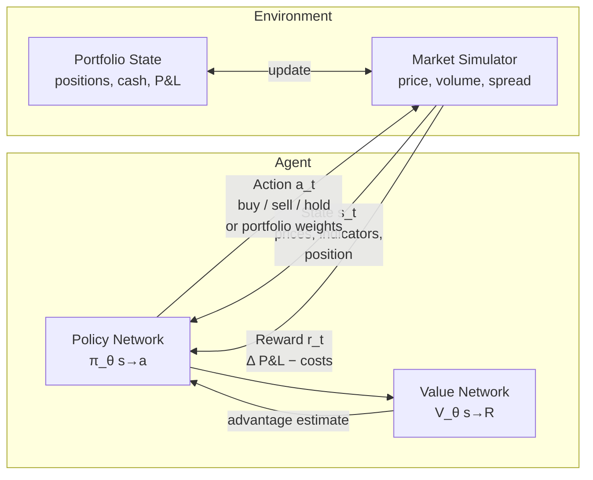

# Reinforcement Learning for Trading

## Overview

Reinforcement learning (RL) offers a fundamentally different paradigm for algorithmic trading compared to supervised prediction. Rather than training a model to forecast tomorrow's price and then hand-writing rules to act on those forecasts, RL trains an **agent** that directly learns a trading policy through trial-and-error interaction with a market environment. The agent takes actions (buy, sell, hold), observes the resulting portfolio state and profit/loss, and receives a reward signal — iterating until it discovers strategies that maximize cumulative returns.

The appeal is clear: RL can discover non-obvious strategies that a human might not program explicitly, can adapt to different market regimes, and naturally handles sequential decision-making under uncertainty. DeepMind's success in games like Go and StarCraft, where long-horizon planning is essential, inspired a wave of RL applications in finance.

The **Markov Decision Process (MDP)** provides the formal framework. A trading MDP consists of states describing the current market, actions the agent can take, a transition function governing how states evolve, a reward signal measuring the desirability of outcomes, and a discount factor balancing immediate vs. future rewards. The agent learns a **policy** — a mapping from states to actions — that maximizes expected discounted cumulative reward.

**State design** is the most consequential decision. Typical state representations include: recent price returns (log-returns over multiple lookback windows), technical indicators (RSI, MACD, Bollinger bands), order book features (bid-ask spread, depth imbalance), portfolio state (current position, unrealized P&L, cash), and macro features (VIX, sector momentum). The state must satisfy the Markov property: the current state should contain enough information to make an optimal decision without needing to remember arbitrary history.

**Action spaces** differ by strategy. Discrete action spaces — Buy, Sell, Hold — are natural for single-asset trading and are handled by algorithms like **Deep Q-Networks (DQN)**. Continuous action spaces — portfolio weights $w_1, w_2, \ldots, w_n$ that sum to 1 — are needed for multi-asset allocation and require policy gradient methods like **Proximal Policy Optimization (PPO)** or **Soft Actor-Critic (SAC)**.

**Reward shaping** is where much of the engineering lies. The naive reward of realized P&L leads agents that take excessive risk. Practitioners use risk-adjusted rewards — the Sharpe ratio over a rolling window, for instance — penalize large drawdowns, and explicitly subtract **transaction costs** (commissions, market impact, bid-ask spread). If transaction costs are not included in the reward, learned policies will trade at extremely high frequency, generating costs that would wipe out real-world profitability.

The **non-stationarity** of financial markets is the central challenge for RL in trading. Unlike a video game where the rules are fixed, market dynamics shift continuously: volatility regimes change, correlations break down, market microstructure evolves. An RL agent trained on 2018 data may perform well in backtesting but fail catastrophically when deployed in 2022's rate-hike environment. The **sim-to-real gap** compounds this — realistic simulation of order book dynamics, slippage, and market impact is extremely difficult, so agents trained in simulation often underperform in live trading.

Practical techniques to improve robustness include: training across multiple market regimes and asset classes, domain randomization of simulator parameters, ensemble policies that hedge against model uncertainty, and online adaptation where the policy is updated continuously from live trading data.

Despite these challenges, RL has found genuine success in specific niches: **execution optimization** (learning to execute large orders while minimizing market impact) is arguably the most deployed application, with companies like Virtu and JPMorgan using RL for optimal order execution. Portfolio rebalancing under transaction costs, options hedging under model uncertainty, and market-making are other areas where the sequential decision-making framework provides clear advantages over supervised approaches.

---

## Key Concepts

- **Markov Decision Process (MDP)**: Formal framework $(S, A, P, R, \gamma)$ for sequential decision-making; the Markov property requires that state $s_t$ captures all information needed to predict future states
- **Reward shaping**: Designing reward functions that align with true objectives — e.g., Sharpe-penalized returns, drawdown penalties, transaction cost subtraction
- **Experience replay**: Storing past $(s, a, r, s')$ transitions in a replay buffer and sampling random mini-batches for training, breaking temporal correlations and improving sample efficiency
- **Policy gradient**: A family of RL algorithms that directly optimize a parameterized policy $\pi_\theta$ by gradient ascent on expected return
- **Proximal Policy Optimization (PPO)**: A stable policy gradient algorithm that clips the objective to prevent large destructive updates, well-suited for continuous action spaces like portfolio weights
- **Transaction cost modeling**: Subtracting realistic costs (fixed commission, proportional spread, quadratic market impact) from rewards to prevent high-frequency overtrading

---

## Math

The **Bellman equation** expresses the value of state $s$ under policy $\pi$ as:

$$V^\pi(s) = \mathbb{E}_\pi\left[r_t + \gamma V^\pi(s_{t+1}) \mid s_t = s\right]$$

The optimal Q-function satisfies:

$$Q^*(s, a) = \mathbb{E}\left[r_t + \gamma \max_{a'} Q^*(s_{t+1}, a') \mid s_t = s, a_t = a\right]$$

DQN minimizes the temporal difference loss:

$$\mathcal{L}(\theta) = \mathbb{E}_{(s,a,r,s') \sim \mathcal{D}}\left[\left(r + \gamma \max_{a'} Q_{\theta^-}(s', a') - Q_\theta(s, a)\right)^2\right]$$

where $\theta^-$ denotes a periodically updated target network and $\mathcal{D}$ is the replay buffer.

The **policy gradient theorem** states that:

$$\nabla_\theta J(\theta) = \mathbb{E}_{\pi_\theta}\left[\nabla_\theta \log \pi_\theta(a \mid s) \cdot A^\pi(s, a)\right]$$

where $A^\pi(s, a) = Q^\pi(s, a) - V^\pi(s)$ is the **advantage function** — how much better action $a$ is compared to the average action in state $s$.

---

## Diagrams

**RL trading loop (environment, agent, state, action, reward)**



---

## Code Examples

A minimal DQN trading agent with a gym-compatible environment:

```python
import numpy as np
import torch
import torch.nn as nn
import torch.optim as optim
from collections import deque
import random

# ── Environment ──────────────────────────────────────────────────────────────

class TradingEnv:
    """Single-asset discrete trading environment."""
    
    ACTIONS = {0: "hold", 1: "buy", 2: "sell"}
    TRANSACTION_COST = 0.001  # 10 bps per trade

    def __init__(self, prices: np.ndarray, window: int = 20):
        self.prices = prices
        self.window = window
        self.reset()

    def reset(self):
        self.t = self.window
        self.position = 0      # -1, 0, or 1
        self.cash = 1.0
        self.shares = 0.0
        return self._get_state()

    def _get_state(self):
        window_prices = self.prices[self.t - self.window: self.t]
        log_returns = np.diff(np.log(window_prices))  # (window-1,) features
        state = np.append(log_returns, [self.position])  # include position
        return state.astype(np.float32)

    def step(self, action: int):
        price = self.prices[self.t]
        prev_portfolio = self.cash + self.shares * price

        # Execute action
        cost = 0.0
        if action == 1 and self.position <= 0:   # buy
            cost = self.TRANSACTION_COST * price
            self.shares = (self.cash - cost) / price
            self.cash = 0.0
            self.position = 1
        elif action == 2 and self.position >= 0: # sell
            proceeds = self.shares * price
            cost = self.TRANSACTION_COST * proceeds
            self.cash = proceeds - cost
            self.shares = 0.0
            self.position = -1

        self.t += 1
        done = self.t >= len(self.prices) - 1
        portfolio = self.cash + self.shares * self.prices[self.t]
        reward = (portfolio - prev_portfolio) / prev_portfolio  # return, net of costs
        return self._get_state(), reward, done

# ── DQN Network ───────────────────────────────────────────────────────────────

class DQN(nn.Module):
    def __init__(self, state_dim: int, n_actions: int = 3):
        super().__init__()
        self.net = nn.Sequential(
            nn.Linear(state_dim, 128), nn.ReLU(),
            nn.Linear(128, 128),       nn.ReLU(),
            nn.Linear(128, n_actions),
        )

    def forward(self, x):
        return self.net(x)

# ── Training Loop ─────────────────────────────────────────────────────────────

class DQNAgent:
    def __init__(self, state_dim, n_actions=3, lr=1e-3, gamma=0.99,
                 epsilon=1.0, epsilon_min=0.05, epsilon_decay=0.995,
                 buffer_size=10_000, batch_size=64):
        self.n_actions = n_actions
        self.gamma = gamma
        self.epsilon = epsilon
        self.epsilon_min = epsilon_min
        self.epsilon_decay = epsilon_decay
        self.batch_size = batch_size

        self.policy_net = DQN(state_dim, n_actions)
        self.target_net = DQN(state_dim, n_actions)
        self.target_net.load_state_dict(self.policy_net.state_dict())
        self.optimizer = optim.Adam(self.policy_net.parameters(), lr=lr)
        self.replay_buffer = deque(maxlen=buffer_size)

    def select_action(self, state):
        if random.random() < self.epsilon:
            return random.randint(0, self.n_actions - 1)
        with torch.no_grad():
            q = self.policy_net(torch.tensor(state).unsqueeze(0))
        return q.argmax().item()

    def push(self, s, a, r, s_, done):
        self.replay_buffer.append((s, a, r, s_, done))

    def train_step(self):
        if len(self.replay_buffer) < self.batch_size:
            return
        batch = random.sample(self.replay_buffer, self.batch_size)
        s, a, r, s_, done = map(np.array, zip(*batch))

        S  = torch.FloatTensor(s)
        A  = torch.LongTensor(a)
        R  = torch.FloatTensor(r)
        S_ = torch.FloatTensor(s_)
        D  = torch.FloatTensor(done)

        q_vals = self.policy_net(S).gather(1, A.unsqueeze(1)).squeeze()
        with torch.no_grad():
            next_q = self.target_net(S_).max(1)[0]
            target = R + self.gamma * next_q * (1 - D)

        loss = nn.functional.mse_loss(q_vals, target)
        self.optimizer.zero_grad()
        loss.backward()
        self.optimizer.step()
        self.epsilon = max(self.epsilon_min, self.epsilon * self.epsilon_decay)

    def sync_target(self):
        self.target_net.load_state_dict(self.policy_net.state_dict())


# ── Example Usage ─────────────────────────────────────────────────────────────

# Simulate prices (replace with real OHLCV data)
np.random.seed(42)
prices = 100 * np.cumprod(1 + np.random.normal(0.0005, 0.01, 1500))

env = TradingEnv(prices, window=20)
state_dim = env.window  # 19 log-returns + 1 position feature = 20
agent = DQNAgent(state_dim=state_dim)

for episode in range(200):
    state = env.reset()
    total_reward = 0.0
    done = False
    while not done:
        action = agent.select_action(state)
        next_state, reward, done = env.step(action)
        agent.push(state, action, reward, next_state, float(done))
        agent.train_step()
        state = next_state
        total_reward += reward
    if episode % 10 == 0:
        agent.sync_target()
    if episode % 50 == 0:
        print(f"Episode {episode:3d} | Total return: {total_reward:.4f} | ε={agent.epsilon:.3f}")
```

---

## Exercises

1. **Trading environment**: Extend `TradingEnv` to support short selling (position in $\{-1, 0, +1\}$) and a maximum holding period. Add a Sharpe ratio-based reward computed over a rolling 20-step window instead of step-by-step returns.
2. **DQN agent**: Train the DQN agent on real daily close prices for a single stock (e.g., SPY ETF). Compare the agent's cumulative return and Sharpe ratio against a buy-and-hold baseline. Plot the agent's trade signals overlaid on the price chart.
3. **PPO for portfolio weights**: Replace the discrete action space with continuous portfolio weights over 3 assets using the `stable-baselines3` PPO implementation. Add a transaction cost penalty proportional to portfolio turnover.

---

## Further Reading

- Mnih, V. et al. (2015). "Human-level control through deep reinforcement learning." *Nature* — original DQN paper
- Schulman, J. et al. (2017). "Proximal Policy Optimization Algorithms." *arXiv:1707.06347* — PPO algorithm
- Almahdi, S. & Yang, S.Y. (2017). "An adaptive portfolio trading system: A risk-return portfolio optimization using recurrent reinforcement learning." *Expert Systems with Applications*
- FinRL Library: open-source RL for quantitative finance — `github.com/AI4Finance-Foundation/FinRL`
