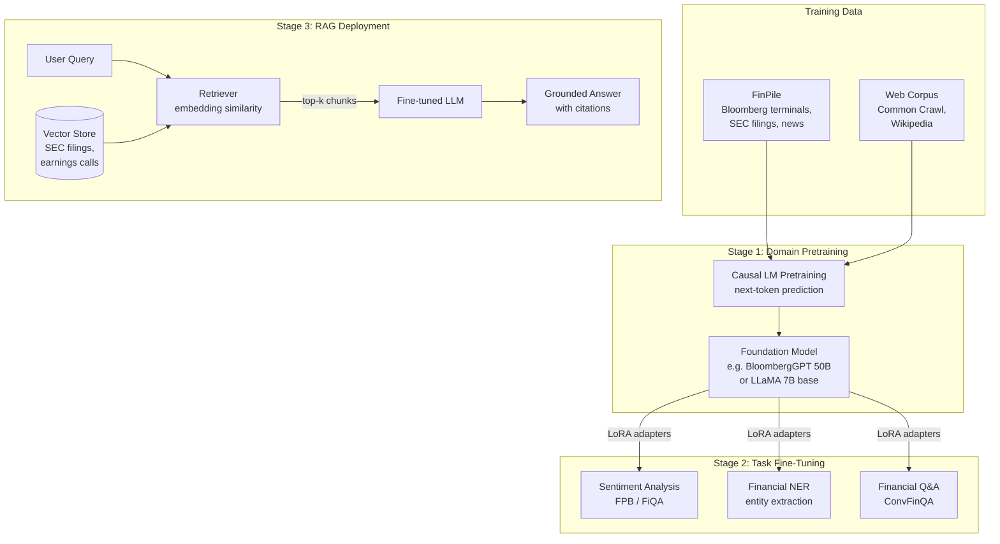

## Large Language Models for Finance (FinLLMs)

## Overview

Language is the native medium of finance. Earnings calls, SEC filings, analyst reports, central bank minutes, news wire services, and social media commentary collectively generate millions of words of market-moving text every day. For decades, processing this text required specialized NLP pipelines — rule-based systems, bag-of-words classifiers, or domain-specific sentiment lexicons like the **Loughran-McDonald dictionary**. Large language models (LLMs) have transformed this landscape by providing a unified, general-purpose architecture capable of reading and reasoning about financial text with remarkable proficiency.

The first dedicated financial LLM to attract widespread attention was **BloombergGPT**, described in a 2023 paper by Bloomberg researchers. Trained on a 363-billion-token dataset — roughly half general web text and half Bloomberg's proprietary financial corpus (FinPile) — BloombergGPT outperformed general-purpose LLMs of comparable size on five financial NLP benchmarks: FPB (sentiment), FiQA-SA (sentiment), Headline (news classification), NER (named entity recognition), and ConvFinQA (financial question answering). The key insight was that **domain-specific pretraining on in-domain text** improves performance on downstream financial tasks even before any fine-tuning.

**FinGPT**, introduced by the open-source AI4Finance Foundation, takes a different approach: rather than training from scratch at enormous cost, FinGPT applies **parameter-efficient fine-tuning** (specifically, LoRA — Low-Rank Adaptation) to existing open-source LLMs like LLaMA and Falcon. By training only a small set of adapter parameters on financial text, FinGPT achieves competitive performance at a fraction of the compute cost. This democratization is significant: BloombergGPT required training infrastructure available only to the largest tech companies; FinGPT can be fine-tuned on a single GPU cluster.

The canonical financial NLP tasks that FinLLMs address are:

**Sentiment analysis** — classifying text (news headline, earnings call statement, tweet) as positive, negative, or neutral with respect to a financial entity. Financial sentiment differs subtly from general sentiment: "the company is cutting costs aggressively" is positive for shareholders but might be neutral or negative in general language models. Domain-specific training corrects for these misalignments.

**Named entity recognition (NER)** — extracting financial entities from unstructured text: company names, ticker symbols, dollar amounts, dates, regulatory filings. Accurate NER is a prerequisite for downstream tasks like event-driven trading and knowledge graph construction.

**Document summarization** — condensing 200-page 10-K filings or 90-minute earnings call transcripts into structured summaries. The risk factors section of a 10-K, for instance, often runs 30+ pages; an LLM can extract the three most material risks mentioned for the first time relative to prior filings.

**Financial Q&A** — answering questions that require numerical reasoning over financial tables and text. ConvFinQA benchmarks conversational QA over earnings reports; it requires multi-hop reasoning combining text passages and financial tables.

**Retrieval-Augmented Generation (RAG)** for finance extends FinLLM capabilities beyond the training cutoff. A RAG pipeline embeds recent SEC filings, earnings transcripts, or news articles into a vector store; at query time, the system retrieves relevant chunks and provides them as context to the LLM. This allows the model to answer questions about Q3 2025 earnings without retraining, and grounds responses in source documents — reducing hallucination risk, which is especially dangerous in regulated financial contexts.

**SEC filing analysis** is a compelling RAG application. An analyst can query "What are the three biggest changes in risk factors between Apple's 2023 and 2024 10-K?" The RAG system retrieves the relevant sections from both filings, and the LLM generates a structured comparison grounded in the actual text. This compresses hours of analyst work into seconds.

Key challenges remain. **Hallucination** in financial contexts can be costly — a model that confidently states the wrong quarterly revenue figure creates liability. **Temporal grounding** is difficult: LLMs trained on historical data may treat outdated information as current. **Regulatory risk** around AI-generated financial advice is evolving rapidly. And **evaluation** is hard: unlike FPB sentiment labels, real financial utility requires measuring whether acting on LLM outputs generates alpha — a much higher bar than benchmark accuracy.

---

## Key Concepts

- **Domain-specific pretraining**: Continued pretraining of a base LLM on a large in-domain corpus (financial news, filings, reports) to shift the model's language priors toward financial vocabulary and conventions before any task-specific fine-tuning
- **Financial sentiment**: Positive/negative/neutral classification specific to financial markets — differs from general sentiment because financial language is often technical, hedged, and context-dependent
- **SEC filing analysis**: Automated processing of 10-K, 10-Q, 8-K filings for risk factor extraction, change detection, and compliance monitoring
- **RAG for finance**: Retrieval-Augmented Generation pipelines that ground LLM responses in retrieved financial documents, reducing hallucination and extending knowledge beyond training cutoff
- **FinGPT**: Open-source family of financial LLMs using LoRA fine-tuning on top of open base models; maintained by AI4Finance Foundation
- **BloombergGPT**: 50B-parameter LLM trained on a 363B-token mixed corpus (FinPile + general); first large-scale demonstration of financial domain pretraining benefits

---

## Math

**Cross-entropy loss** for fine-tuning a sentiment classifier:

$$\mathcal{L}_{CE} = -\frac{1}{N}\sum_{i=1}^{N}\sum_{c=1}^{C} y_{ic} \log \hat{p}_{ic}$$

where $y_{ic} \in \{0,1\}$ is the true label and $\hat{p}_{ic}$ is the model's predicted probability for class $c$.

**Perplexity** measures how well a language model predicts a held-out corpus:

$$\text{PPL} = \exp\left(-\frac{1}{T}\sum_{t=1}^{T} \log P_\theta(w_t \mid w_1, \ldots, w_{t-1})\right)$$

Lower perplexity indicates the model assigns higher probability to the actual text — BloombergGPT achieves dramatically lower perplexity on financial text than general models of the same size.

For **LoRA fine-tuning**, the weight update is decomposed as:

$$W = W_0 + \Delta W = W_0 + BA$$

where $B \in \mathbb{R}^{d \times r}$ and $A \in \mathbb{R}^{r \times k}$ with rank $r \ll \min(d, k)$. Only $A$ and $B$ are trained; $W_0$ is frozen. This reduces trainable parameters by ~99% for large models.

---

## Diagrams

**FinLLM architecture and training pipeline**



---

## Code Examples

Sentiment analysis on financial news headlines using the Hugging Face transformers library, then a minimal RAG pipeline for SEC filings:

```python
# ── Part 1: Financial Sentiment with a Fine-tuned Transformer ──────────────

from transformers import pipeline, AutoTokenizer, AutoModelForSequenceClassification
import torch

# ProsusAI/finbert is a BERT model fine-tuned on Financial PhraseBank
MODEL = "ProsusAI/finbert"

tokenizer = AutoTokenizer.from_pretrained(MODEL)
model = AutoModelForSequenceClassification.from_pretrained(MODEL)
sentiment_pipe = pipeline(
    "text-classification",
    model=model,
    tokenizer=tokenizer,
    device=0 if torch.cuda.is_available() else -1,
    top_k=None,  # return all class scores
)

headlines = [
    "Apple reports record quarterly revenue, beats analyst estimates by 8%",
    "Fed signals further rate hikes amid persistent inflation concerns",
    "Startup raises $200M Series B to expand AI-powered credit scoring",
    "Regional bank collapses after deposit run, FDIC takes control",
]

for headline in headlines:
    results = sentiment_pipe(headline)[0]
    # Sort by score for readability
    top = max(results, key=lambda x: x["score"])
    scores = {r["label"]: f"{r['score']:.3f}" for r in results}
    print(f"[{top['label'].upper():8s}] {headline[:60]}")
    print(f"           scores: {scores}\n")

# ── Part 2: Minimal RAG pipeline for SEC filing Q&A ──────────────────────

# Requirements: pip install sentence-transformers faiss-cpu openai
from sentence_transformers import SentenceTransformer
import numpy as np

class FinancialRAG:
    """Simple RAG over financial documents using dense retrieval."""

    def __init__(self, embed_model: str = "all-MiniLM-L6-v2"):
        self.embedder = SentenceTransformer(embed_model)
        self.chunks: list[str] = []
        self.embeddings: np.ndarray | None = None

    def add_documents(self, texts: list[str], chunk_size: int = 300):
        """Split texts into overlapping chunks and embed."""
        for text in texts:
            words = text.split()
            for i in range(0, len(words), chunk_size // 2):
                chunk = " ".join(words[i: i + chunk_size])
                if len(chunk) > 50:
                    self.chunks.append(chunk)
        self.embeddings = self.embedder.encode(self.chunks, normalize_embeddings=True)

    def retrieve(self, query: str, top_k: int = 3) -> list[str]:
        """Return top-k most relevant chunks for the query."""
        q_emb = self.embedder.encode([query], normalize_embeddings=True)
        scores = (self.embeddings @ q_emb.T).squeeze()
        top_idx = np.argsort(scores)[::-1][:top_k]
        return [self.chunks[i] for i in top_idx]

    def answer(self, query: str, top_k: int = 3) -> str:
        """Retrieve context and format prompt for an LLM."""
        context_chunks = self.retrieve(query, top_k)
        context = "\n\n---\n\n".join(context_chunks)
        prompt = (
            f"You are a financial analyst. Answer based only on the provided context.\n\n"
            f"CONTEXT:\n{context}\n\n"
            f"QUESTION: {query}\n\n"
            f"ANSWER:"
        )
        return prompt  # Pass this prompt to your LLM of choice (GPT-4, Claude, etc.)

# Example usage (with dummy filing text)
filing_excerpt = """
Risk Factors: The company faces significant competition from established players.
Our revenue grew 23% year-over-year to $4.2 billion in fiscal 2024, driven by
cloud services which now represent 61% of total revenue. We expect capital
expenditures of $800 million in fiscal 2025, primarily for data center expansion.
Gross margin improved to 72% from 68% in the prior year.
"""

rag = FinancialRAG()
rag.add_documents([filing_excerpt])
prompt = rag.answer("What percentage of revenue comes from cloud services?")
print(prompt[:500])
```

---

## Exercises

1. **Sentiment classifier**: Fine-tune `bert-base-uncased` on the **Financial PhraseBank** dataset (available on Hugging Face as `financial_phrasebank`) using LoRA adapters via the `peft` library. Compare accuracy to zero-shot `ProsusAI/finbert` on a held-out test set.
2. **RAG for earnings calls**: Download a publicly available earnings call transcript (e.g., from Motley Fool or The Motley Fool's earnings database). Build a `FinancialRAG` pipeline over the full transcript and test it with 10 analyst-style questions. Evaluate the quality of retrieved chunks with a keyword precision metric.
3. **Perplexity comparison**: Using Hugging Face `evaluate`, compute perplexity of `gpt2` vs. `ProsusAI/finbert` (as a masked LM) on a held-out set of financial news sentences. Observe how domain mismatch manifests in perplexity scores.

---

## Further Reading

- Wu, S. et al. (2023). "BloombergGPT: A Large Language Model for Finance." *arXiv:2303.17564*
- Yang, H. et al. (2023). "FinGPT: Open-Source Financial Large Language Models." *arXiv:2306.06031*
- Loughran, T. & McDonald, B. (2011). "When Is a Liability Not a Liability?" *Journal of Finance* — foundational financial sentiment lexicon
- Lewis, P. et al. (2020). "Retrieval-Augmented Generation for Knowledge-Intensive NLP Tasks." *NeurIPS* — RAG methodology
