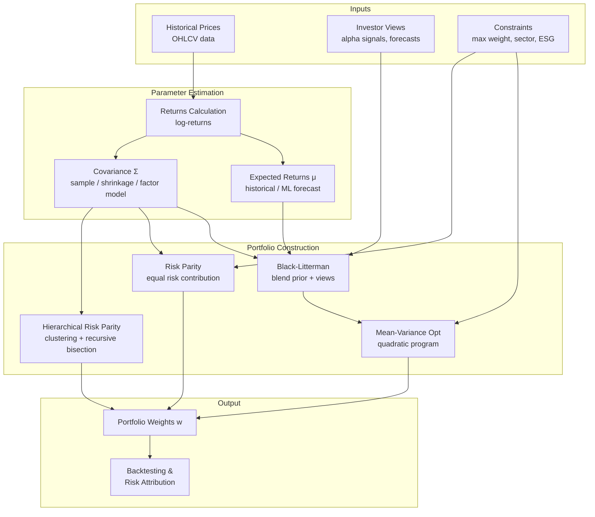

## Portfolio Optimization with AI

## Overview

Modern portfolio theory, introduced by Harry Markowitz in 1952, gave investors a rigorous mathematical framework for constructing portfolios that maximize expected return for a given level of risk. The insight — that diversification reduces portfolio variance without necessarily reducing expected return — seems obvious in retrospect, but formalizing it into an optimization problem was revolutionary. Today, Markowitz's mean-variance framework remains the conceptual foundation of portfolio management, even as machine learning techniques increasingly augment or replace its classical components.

The **mean-variance optimization (MVO)** problem asks: given a universe of $n$ assets with expected returns $\mu$ and covariance matrix $\Sigma$, find portfolio weights $w$ that maximize expected return subject to a constraint on portfolio variance. In practice, MVO is notoriously fragile. Small changes in estimated expected returns $\mu$ — which are extremely noisy in financial data — lead to wildly different optimal portfolios. This **estimation error** problem means that MVO portfolios constructed from historical data often perform worse out-of-sample than a naive equal-weight portfolio.

The **Black-Litterman model** (1992) addresses this by combining a market equilibrium prior (the CAPM-implied returns, which favor market-cap weights) with an investor's subjective views. Instead of estimating $\mu$ purely from historical data, Black-Litterman blends prior views with data using Bayesian inference. The result is a more stable, diversified portfolio that tilts toward the investor's high-conviction bets while anchoring to the market equilibrium.

**Risk parity** takes a completely different approach: rather than optimizing returns, it allocates capital so that each asset contributes equally to total portfolio risk. In a traditional 60/40 equity-bond portfolio, equities dominate risk (typically contributing 90%+ of variance) even though they represent only 60% of capital. Risk parity equalizes risk contributions, typically resulting in portfolios that are more diversified across economic regimes — Bridgewater's **All Weather** fund is the canonical example.

**Hierarchical Risk Parity (HRP)**, introduced by Marcos López de Prado in 2016, is a machine learning-inspired portfolio construction method that avoids inverting the covariance matrix — the step that amplifies estimation error in classical MVO. HRP uses hierarchical clustering to group assets by correlation structure, then allocates capital recursively within and across clusters. It is more robust to covariance estimation error and performs better out-of-sample than classical MVO in simulation studies.

Machine learning improves portfolio optimization at multiple levels. **Covariance estimation** is a key bottleneck: with $n$ assets and $T$ observations, the sample covariance matrix is rank-deficient when $n > T$ and is dominated by noise when $n \approx T$. Techniques like **Ledoit-Wolf shrinkage** and factor models (PCA-based or Barra-style) produce better-conditioned covariance estimates. Deep learning approaches — including graph neural networks that model asset correlation structure as a graph — can learn covariance representations that generalize better across market regimes.

**Deep learning for direct portfolio allocation** attempts to bypass the two-step (forecast returns, then optimize) pipeline entirely. Models like the **Deep Portfolio Theory** of Heaton, Polson, and Witte use autoencoders to learn asset representations and then construct portfolios end-to-end. Recurrent networks (LSTMs) and Transformer-based models can learn time-varying portfolio weights that adapt to changing market conditions.

**Behavioral finance** insights increasingly inform RL-based portfolio managers. Classical portfolio theory assumes agents maximize expected utility with rational preferences; empirically, investors exhibit **loss aversion** (losses hurt roughly twice as much as equivalent gains, per Kahneman and Tversky's Prospect Theory) and **myopic loss aversion** (short evaluation horizons make risky assets less attractive). RL agents can be designed with utility functions that encode these behavioral biases — for instance, using an asymmetric reward function that penalizes negative returns more than it rewards equivalent positive returns — producing portfolios that better match actual investor preferences.

Despite these advances, the fundamental challenge of portfolio optimization remains: financial markets are non-stationary, and the optimal portfolio today may be far from optimal tomorrow. No ML technique eliminates the need for judgment about what regime the market is in, what the investment horizon is, and what constraints (liquidity, regulatory, ESG) must be satisfied. The most successful practitioners use ML as one tool among many, embedded in a robust investment process with careful risk controls.

---

## Key Concepts

- **Efficient frontier**: The set of portfolios with maximum expected return for each level of portfolio variance; no rational investor should hold a portfolio below the frontier
- **Mean-variance optimization (MVO)**: Markowitz's quadratic programming formulation — maximize $\mu^T w - \frac{\lambda}{2} w^T \Sigma w$ subject to $\mathbf{1}^T w = 1$, $w \geq 0$
- **Risk parity**: Portfolio construction that equalizes each asset's marginal contribution to total portfolio risk; leverage is used to bring risk parity portfolios to target volatility
- **Black-Litterman**: Bayesian framework combining market equilibrium returns (CAPM prior) with investor views; produces more stable and diversified portfolios than raw MVO
- **Hierarchical risk parity (HRP)**: Clustering-based portfolio construction that avoids covariance matrix inversion; more robust to estimation error
- **Covariance shrinkage**: Regularization techniques (Ledoit-Wolf, Oracle approximating shrinkage) that shrink the sample covariance toward a structured target, reducing estimation error

---

## Math

The **portfolio variance** for weights $w \in \mathbb{R}^n$ and covariance matrix $\Sigma$ is:

$$\sigma_p^2 = w^T \Sigma w = \sum_{i=1}^n \sum_{j=1}^n w_i w_j \sigma_{ij}$$

The **Markowitz optimization objective** (mean-variance, with risk aversion $\lambda$):

$$\max_w \; \mu^T w - \frac{\lambda}{2} w^T \Sigma w \quad \text{subject to} \quad \mathbf{1}^T w = 1, \; w \geq 0$$

**Sharpe ratio maximization** — the portfolio with maximum Sharpe ratio lies on the efficient frontier:

$$\text{SR} = \frac{\mu_p - r_f}{\sigma_p} = \frac{w^T \mu - r_f}{\sqrt{w^T \Sigma w}}$$

The **risk contribution** of asset $i$ to total portfolio risk is:

$$RC_i = w_i \cdot \frac{(\Sigma w)_i}{\sqrt{w^T \Sigma w}}$$

Risk parity requires $RC_i = RC_j$ for all $i, j$ — equal risk contribution from each asset.

**Ledoit-Wolf shrinkage** estimates the covariance as a convex combination:

$$\hat{\Sigma}_{LW} = (1 - \alpha) \hat{\Sigma}_{sample} + \alpha \mu_{\text{target}} I$$

where $\alpha \in [0,1]$ is the shrinkage intensity and $\mu_{\text{target}}$ is the mean of the sample eigenvalues.

---

## Diagrams

**Portfolio optimization pipeline**



---

## Code Examples

Mean-variance efficient frontier and risk parity allocation:

```python
import numpy as np
import scipy.optimize as sco
import matplotlib.pyplot as plt

# ── Simulate asset universe ───────────────────────────────────────────────────

np.random.seed(42)
n_assets = 5
asset_names = ["US Equity", "Intl Equity", "Bonds", "Real Estate", "Commodities"]

# Annualized expected returns and realistic covariance (illustrative)
mu = np.array([0.10, 0.09, 0.04, 0.07, 0.05])   # expected annual returns
vol = np.array([0.18, 0.20, 0.07, 0.15, 0.22])   # annual volatilities

corr = np.array([
    [1.00, 0.80, -0.10,  0.50,  0.15],
    [0.80, 1.00, -0.05,  0.45,  0.20],
    [-0.10,-0.05, 1.00, -0.10, -0.20],
    [0.50, 0.45,-0.10,  1.00,  0.10],
    [0.15, 0.20,-0.20,  0.10,  1.00],
])
sigma = np.diag(vol) @ corr @ np.diag(vol)   # covariance matrix

# ── Efficient Frontier ────────────────────────────────────────────────────────

def portfolio_stats(w, mu, sigma):
    ret = w @ mu
    std = np.sqrt(w @ sigma @ w)
    return ret, std

def negative_sharpe(w, mu, sigma, rf=0.04):
    ret, std = portfolio_stats(w, mu, sigma)
    return -(ret - rf) / std

constraints = {"type": "eq", "fun": lambda w: np.sum(w) - 1}
bounds = [(0, 1)] * n_assets
w0 = np.ones(n_assets) / n_assets

# Trace efficient frontier by varying target return
target_returns = np.linspace(mu.min(), mu.max(), 40)
frontier_vols, frontier_rets = [], []

for target in target_returns:
    cons = [
        {"type": "eq", "fun": lambda w: np.sum(w) - 1},
        {"type": "eq", "fun": lambda w, t=target: w @ mu - t},
    ]
    result = sco.minimize(
        lambda w: w @ sigma @ w,  # minimize variance
        w0, method="SLSQP", bounds=bounds, constraints=cons,
    )
    if result.success:
        r, v = portfolio_stats(result.x, mu, sigma)
        frontier_rets.append(r)
        frontier_vols.append(v)

# Maximum Sharpe ratio portfolio
max_sr_result = sco.minimize(
    negative_sharpe, w0, args=(mu, sigma),
    method="SLSQP", bounds=bounds, constraints=constraints,
)
max_sr_w = max_sr_result.x
max_sr_ret, max_sr_vol = portfolio_stats(max_sr_w, mu, sigma)
print("Max Sharpe weights:")
for name, w in zip(asset_names, max_sr_w):
    print(f"  {name}: {w:.1%}")
print(f"  Expected return: {max_sr_ret:.1%}, Volatility: {max_sr_vol:.1%}")
print(f"  Sharpe ratio: {(max_sr_ret - 0.04)/max_sr_vol:.2f}")

# ── Risk Parity ───────────────────────────────────────────────────────────────

def risk_contributions(w, sigma):
    portfolio_vol = np.sqrt(w @ sigma @ w)
    marginal_risk = sigma @ w
    return w * marginal_risk / portfolio_vol  # RC_i for each asset

def risk_parity_objective(w, sigma):
    """Minimize sum of squared differences in risk contributions."""
    rc = risk_contributions(w, sigma)
    target_rc = np.sum(rc) / len(w)
    return np.sum((rc - target_rc) ** 2)

rp_result = sco.minimize(
    risk_parity_objective, w0, args=(sigma,),
    method="SLSQP", bounds=bounds, constraints=constraints,
)
rp_w = rp_result.x
rp_rc = risk_contributions(rp_w, sigma)
rp_ret, rp_vol = portfolio_stats(rp_w, mu, sigma)
print("\nRisk Parity weights & risk contributions:")
for name, w, rc in zip(asset_names, rp_w, rp_rc):
    print(f"  {name}: weight={w:.1%}, risk contrib={rc:.1%}")
print(f"  Expected return: {rp_ret:.1%}, Volatility: {rp_vol:.1%}")

# ── Plot Efficient Frontier ───────────────────────────────────────────────────

plt.figure(figsize=(9, 6))
plt.plot(frontier_vols, frontier_rets, "b-", lw=2, label="Efficient Frontier")
plt.scatter(max_sr_vol, max_sr_ret, marker="*", s=300, color="gold",
            zorder=5, label="Max Sharpe")
plt.scatter(rp_vol, rp_ret, marker="D", s=150, color="green",
            zorder=5, label="Risk Parity")
# Individual assets
for i, name in enumerate(asset_names):
    plt.scatter(vol[i], mu[i], s=80, zorder=4)
    plt.annotate(name, (vol[i], mu[i]), textcoords="offset points", xytext=(6, 3))
plt.xlabel("Annualized Volatility")
plt.ylabel("Annualized Return")
plt.title("Efficient Frontier with Max Sharpe and Risk Parity Portfolios")
plt.legend()
plt.tight_layout()
plt.savefig("efficient_frontier.png", dpi=150)
plt.show()
```

---

## Exercises

1. **Efficient frontier**: Using the code above, extend the asset universe to 10 assets by adding US Small Cap, EM Equity, High Yield, TIPS, and Gold. Re-compute the efficient frontier and compare it to the 5-asset frontier. How does adding uncorrelated assets improve the frontier?
2. **Risk parity**: Implement a naive inverse-volatility portfolio (weights $\propto 1/\sigma_i$) and compare it to the proper risk parity solution. Report the risk contributions of each asset for both approaches.
3. **Ledoit-Wolf shrinkage**: Use `sklearn.covariance.LedoitWolf` to estimate the covariance matrix from 60 months of simulated returns (where $n_assets > 30$ so the sample covariance is ill-conditioned). Compare portfolio weights using the sample vs. shrunk covariance and observe the stabilization effect.

---

## Further Reading

- Markowitz, H. (1952). "Portfolio Selection." *Journal of Finance* — the original mean-variance framework
- Black, F. & Litterman, R. (1992). "Global Portfolio Optimization." *Financial Analysts Journal* — the Black-Litterman model
- López de Prado, M. (2016). "Building Diversified Portfolios that Outperform Out-of-Sample." *Journal of Portfolio Management* — Hierarchical Risk Parity
- Ledoit, O. & Wolf, M. (2004). "A well-conditioned estimator for large-dimensional covariance matrices." *Journal of Multivariate Analysis*
