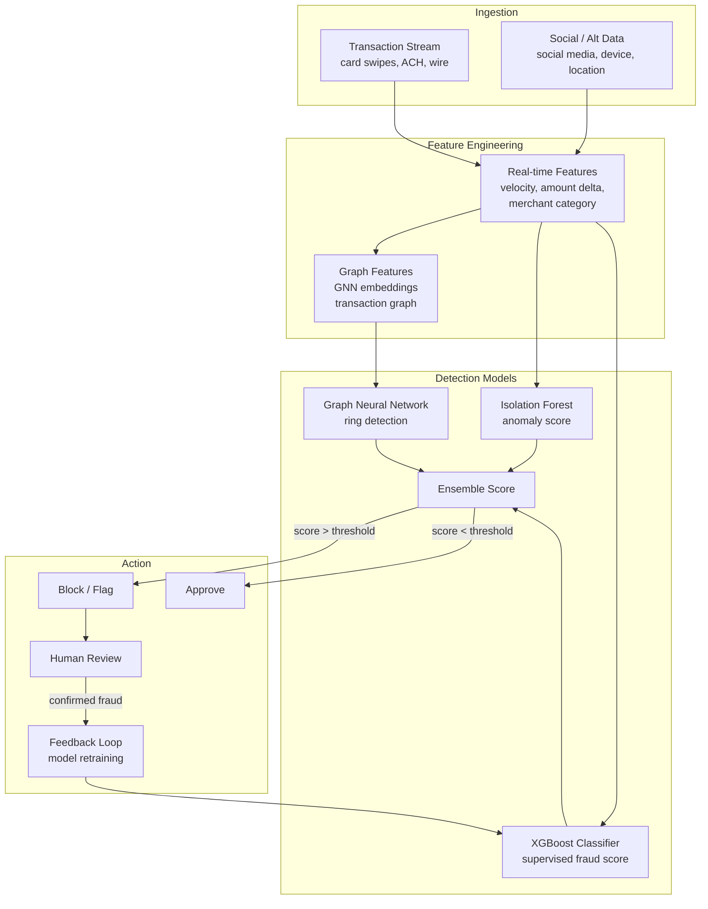

# Risk Management and Fraud Detection

## Overview

Financial institutions operate in an environment of compounding risks: credit risk (borrowers defaulting), market risk (portfolio value declining), operational risk (system failures, fraud), and systemic risk (cascading failures across institutions). Managing these risks accurately and efficiently is existential — the 2008 financial crisis demonstrated what happens when risk models fail catastrophically at scale. Machine learning has become central to all four risk categories, replacing brittle rule-based systems with adaptive models that can process thousands of features and detect subtle patterns in real time.

**Credit scoring** is arguably the most mature application of ML in finance. The traditional FICO score, introduced in 1989, aggregates payment history, credit utilization, length of credit history, credit mix, and new credit inquiries into a single three-digit number using a hand-crafted formula. ML models go far beyond this. Gradient boosting models like **XGBoost** and **LightGBM** routinely outperform logistic regression and scorecard-based approaches on standard AUC metrics by incorporating hundreds of features — transaction patterns, income stability, geographic factors, behavioral signals — and capturing complex non-linear interactions. The performance gap is especially large for thin-file consumers (those with limited credit history) where traditional FICO scores are uninformative and ML can leverage alternative data.

**Value-at-Risk (VaR)** is the primary tool for quantifying market risk. Regulatory frameworks (Basel III, the Fundamental Review of the Trading Book) require banks to report VaR: the maximum loss that a portfolio is expected to exceed with probability $\alpha$ (typically 1%) over a given horizon (typically 1 or 10 days). Classical VaR estimation methods — Historical Simulation, Parametric (delta-normal), and Monte Carlo — each have limitations. ML approaches, including quantile regression networks and deep learning-based conditional VaR estimators, can capture the fat tails and volatility clustering that classical methods miss, producing more accurate risk estimates during market stress.

**Fraud detection** presents a radically different ML problem from credit scoring. Where credit scoring operates offline on structured application data, fraud detection must operate in near real-time (card transactions are approved or declined in milliseconds), on highly imbalanced data (fraud rates are often below 0.1%), in an adversarial setting where fraudsters continuously adapt to evade detection systems.

**Anomaly detection** approaches — including **Isolation Forest**, **Autoencoder reconstruction error**, and **Local Outlier Factor** — identify transactions that look unusual relative to a customer's baseline behavior without requiring labeled fraud examples. This is valuable because labeled fraud data is scarce, expensive to generate, and always lags the most recent fraud patterns. Supervised approaches using XGBoost or neural networks achieve higher precision when labels are available, but must be retrained as fraud patterns evolve.

**Graph Neural Networks (GNNs)** have emerged as a powerful tool for detecting fraud in transaction networks. Financial transactions form a graph: customers and merchants are nodes, transactions are edges. Fraudulent behavior often involves coordinated rings — groups of seemingly unrelated accounts that are actually controlled by the same fraudster and make coordinated transactions to extract value. GNNs can learn embeddings that capture this graph structure, flagging suspicious nodes even when their individual transaction history looks legitimate. PayPal, Alibaba's Ant Financial, and major banks have deployed GNN-based fraud detection systems.

**Class imbalance** is the defining challenge for fraud detection. A dataset with 0.1% fraud rate means a model that predicts "legitimate" for every transaction achieves 99.9% accuracy — but catches zero fraud. Standard remedies include: **oversampling** minority class examples (SMOTE synthesizes new fraud examples by interpolating between existing ones), **undersampling** the majority class, **class-weight rebalancing** in the loss function, and **focal loss** (which down-weights easy negatives so the model focuses on hard-to-classify examples near the decision boundary). In practice, no single technique dominates; the best approach depends on the fraud rate, dataset size, and model architecture.

**Stock manipulation detection** is an emerging area where ML is applied to social media and trading data to identify coordinated pump-and-dump schemes. Patterns including sudden spikes in social media mentions, coordinated posting of bullish content by accounts with similar creation dates, and abnormal trading volume in small-cap stocks are strong signals. NLP models can detect coordinated inauthentic behavior in text, while time-series anomaly detectors flag suspicious volume patterns. Regulatory bodies including the SEC have begun deploying ML systems for market surveillance.

---

## Key Concepts

- **Value-at-Risk (VaR)**: The loss threshold exceeded with probability $\alpha$ over a given horizon; $\text{VaR}_\alpha = -Q_\alpha(L)$ where $Q_\alpha$ is the $\alpha$-quantile of the loss distribution
- **Credit scoring**: ML models that estimate probability of default (PD) from applicant and behavioral features; XGBoost is the dominant algorithm in production credit scoring systems
- **Anomaly detection**: Unsupervised or semi-supervised identification of unusual observations; Isolation Forest and autoencoder-based methods are widely deployed for fraud
- **Class imbalance**: The extreme rarity of fraud events relative to legitimate transactions; addressed by SMOTE, class weights, focal loss, and threshold tuning
- **Graph neural networks (GNNs)**: Neural networks that operate on graph-structured data by aggregating information from neighbors; used to detect fraud rings in transaction networks
- **Stock manipulation**: Coordinated illegal trading activity designed to artificially move prices; detected via NLP on social media and anomaly detection on trading data

---

## Math

**Value-at-Risk** at confidence level $1-\alpha$:

$$\text{VaR}_\alpha = -\inf\{l \in \mathbb{R} : P(L > l) \leq \alpha\}$$

**Expected Shortfall (CVaR)** — the expected loss given that the loss exceeds VaR:

$$\text{ES}_\alpha = \mathbb{E}[L \mid L > \text{VaR}_\alpha] = \frac{1}{\alpha}\int_0^\alpha \text{VaR}_u \, du$$

ES is a coherent risk measure (satisfies subadditivity); VaR is not, which is why Basel III shifted to ES for internal models.

**Logistic regression** for credit default prediction:

$$P(\text{default} = 1 \mid x) = \sigma(w^T x + b) = \frac{1}{1 + e^{-(w^T x + b)}}$$

The log-odds (credit score) is linear in features: $\log\frac{p}{1-p} = w^T x + b$.

**Focal loss** for class-imbalanced classification:

$$\mathcal{L}_{FL}(p_t) = -\alpha_t (1 - p_t)^\gamma \log(p_t)$$

where $p_t$ is the model's probability for the true class, $\gamma > 0$ is the focusing parameter (typically 2), and $\alpha_t$ is a class-balancing weight. The factor $(1-p_t)^\gamma$ down-weights easy examples (high $p_t$), focusing learning on hard negatives.

---

## Diagrams

**Fraud detection pipeline**



---

## Code Examples

Credit scoring with XGBoost and anomaly detection with Isolation Forest:

```python
import numpy as np
import pandas as pd
from sklearn.model_selection import train_test_split
from sklearn.metrics import (
    roc_auc_score, classification_report, average_precision_score
)
from sklearn.preprocessing import StandardScaler
from sklearn.ensemble import IsolationForest
from imblearn.over_sampling import SMOTE
import xgboost as xgb

# ── Part 1: Credit Scoring with XGBoost ──────────────────────────────────────

# Simulate credit application data (replace with real dataset, e.g., Home Credit)
np.random.seed(42)
N = 20_000

df = pd.DataFrame({
    "age":              np.random.randint(18, 75, N),
    "annual_income":    np.random.lognormal(10.8, 0.6, N),  # ~$50k median
    "debt_to_income":   np.random.beta(2, 5, N),
    "num_credit_lines": np.random.poisson(4, N),
    "credit_util_pct":  np.clip(np.random.beta(2, 4, N), 0, 1),
    "months_employed":  np.random.exponential(48, N),
    "num_delinquencies":np.random.poisson(0.3, N),
    "loan_amount":      np.random.lognormal(9.5, 0.8, N),
})

# Default probability is higher for high DTI, low income, delinquencies
log_odds = (
    -3.0
    + 2.5 * df["debt_to_income"]
    - 0.5 * np.log(df["annual_income"] / 50_000)
    + 1.2 * df["num_delinquencies"]
    + 0.8 * df["credit_util_pct"]
    - 0.01 * df["months_employed"]
)
default_prob = 1 / (1 + np.exp(-log_odds))
df["default"] = (np.random.rand(N) < default_prob).astype(int)
print(f"Default rate: {df['default'].mean():.1%}")  # ~10-15%

X = df.drop(columns=["default"])
y = df["default"]
X_train, X_test, y_train, y_test = train_test_split(X, y, test_size=0.2, random_state=42)

# Apply SMOTE to handle class imbalance in training set
smote = SMOTE(random_state=42)
X_train_res, y_train_res = smote.fit_resample(X_train, y_train)

# XGBoost credit scoring model
model = xgb.XGBClassifier(
    n_estimators=300,
    max_depth=5,
    learning_rate=0.05,
    subsample=0.8,
    colsample_bytree=0.8,
    eval_metric="auc",
    use_label_encoder=False,
    random_state=42,
)
model.fit(
    X_train_res, y_train_res,
    eval_set=[(X_test, y_test)],
    verbose=50,
)

y_prob = model.predict_proba(X_test)[:, 1]
print(f"\nTest AUC-ROC:  {roc_auc_score(y_test, y_prob):.4f}")
print(f"Test PR-AUC:   {average_precision_score(y_test, y_prob):.4f}")

# Feature importances
importances = pd.Series(
    model.feature_importances_, index=X.columns
).sort_values(ascending=False)
print("\nTop feature importances:")
print(importances.head(5))

# ── Part 2: Anomaly Detection with Isolation Forest ──────────────────────────

# Simulate transaction data with a small fraction of anomalous fraud
N_TRANS = 50_000
FRAUD_RATE = 0.005  # 0.5%

normal_transactions = pd.DataFrame({
    "amount":        np.abs(np.random.normal(80, 60, int(N_TRANS * (1 - FRAUD_RATE)))),
    "hour_of_day":   np.random.randint(7, 23, int(N_TRANS * (1 - FRAUD_RATE))),
    "merchant_risk": np.random.beta(1, 5, int(N_TRANS * (1 - FRAUD_RATE))),
    "velocity_24h":  np.random.poisson(3, int(N_TRANS * (1 - FRAUD_RATE))),
    "is_fraud":      0,
})

n_fraud = int(N_TRANS * FRAUD_RATE)
fraud_transactions = pd.DataFrame({
    "amount":        np.abs(np.random.normal(500, 200, n_fraud)),  # higher amounts
    "hour_of_day":   np.random.randint(0, 6, n_fraud),             # odd hours
    "merchant_risk": np.random.beta(5, 2, n_fraud),                # risky merchants
    "velocity_24h":  np.random.poisson(15, n_fraud),               # high velocity
    "is_fraud":      1,
})

transactions = pd.concat([normal_transactions, fraud_transactions]).sample(frac=1, random_state=42)
X_txn = transactions.drop(columns=["is_fraud"])
y_txn = transactions["is_fraud"]

scaler = StandardScaler()
X_scaled = scaler.fit_transform(X_txn)

# Isolation Forest — contamination ≈ expected fraud rate
iso_forest = IsolationForest(
    n_estimators=200,
    contamination=FRAUD_RATE,
    max_samples=256,
    random_state=42,
)
iso_forest.fit(X_scaled)
anomaly_scores = -iso_forest.score_samples(X_scaled)   # higher = more anomalous
predictions = iso_forest.predict(X_scaled)              # -1 = anomaly, 1 = normal

# Convert to binary (1 = predicted fraud)
pred_binary = (predictions == -1).astype(int)
print(f"\nIsolation Forest Anomaly Detection:")
print(f"AUC-ROC: {roc_auc_score(y_txn, anomaly_scores):.4f}")
print(classification_report(y_txn, pred_binary, target_names=["Legitimate", "Fraud"]))
```

---

## Exercises

1. **Credit scoring model**: Download the **Give Me Some Credit** dataset from Kaggle (10-year credit delinquency dataset). Train an XGBoost classifier and compare AUC against a logistic regression baseline. Analyze the impact of SMOTE vs. class-weight rebalancing on precision-recall at a 10% false positive rate threshold.
2. **Anomaly detection**: Using the simulated transaction data from the code above, compare Isolation Forest to an autoencoder-based anomaly detector (train only on legitimate transactions; score test examples by reconstruction error). Plot the Precision-Recall curve for both methods.
3. **VaR estimation**: Using 5 years of daily returns for a 3-asset portfolio (e.g., SPY, TLT, GLD), compute 1-day 99% VaR using: (a) Historical Simulation, (b) Parametric (assuming normality), and (c) a GARCH(1,1) model for time-varying volatility using the `arch` Python library. Compare how each method behaves during the March 2020 COVID crash.

---

## Further Reading

- Chen, T. & Guestrin, C. (2016). "XGBoost: A Scalable Tree Boosting System." *KDD* — foundational XGBoost paper
- Lin, T-Y. et al. (2017). "Focal Loss for Dense Object Detection." *ICCV* — focal loss for class imbalance
- Liu, F.T., Ting, K.M. & Zhou, Z-H. (2008). "Isolation Forest." *ICDM* — Isolation Forest anomaly detection
- Wang, D. et al. (2021). "Session-based Fraud Detection in Online E-Commerce Transactions Using Recurrent Neural Networks." — GNN for transaction fraud
- Chawla, N.V. et al. (2002). "SMOTE: Synthetic Minority Over-sampling Technique." *JAIR* — SMOTE for class imbalance
