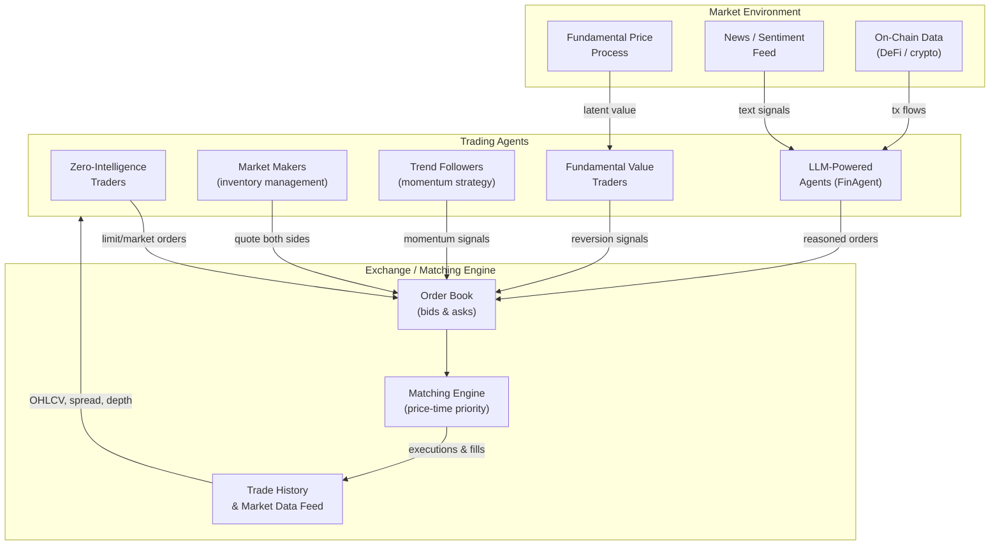

# AI Agents in Financial Markets

## Overview

Financial markets are not passive data sources — they are complex adaptive systems where the act of participating changes the system itself. Understanding this requires moving beyond supervised learning and into the domain of **agent-based modeling**: building computational agents that make decisions, interact, and produce collective behavior that no single agent intended.

AI agents in finance span a wide spectrum. At one end are **zero-intelligence (ZI) traders** — simulated agents that submit random orders within budget constraints. Despite their simplicity, ZI traders in a double-auction market produce price distributions remarkably close to those of real markets, a provocative finding that suggests much of market structure emerges from the institution (the order book), not from the intelligence of participants. At the other end are **LLM-powered financial agents** that read news, reason about macroeconomic conditions, and execute multi-step trading strategies — the kind of system explored in the Foresight Arena benchmark for on-chain forecasting.

**Agent-based modeling (ABM)** of markets treats every participant — retail investors, hedge funds, market makers, central banks — as an autonomous agent with its own decision rules. Aggregate phenomena such as volatility clustering, fat-tailed return distributions, and flash crashes emerge from the interactions of these agents, not from any exogenous shock. ABM has become a key tool for financial regulators who want to stress-test market structure before implementing new rules.

**Multi-agent reinforcement learning (MARL)** extends single-agent RL to competitive environments. In a MARL market simulator, agents learn trading strategies by playing against each other. This produces richer, more realistic dynamics than single-agent settings and reveals how algorithmic trading strategies can inadvertently coordinate to amplify volatility — a concern regulators now take seriously.

**LLM-powered financial agents** represent the newest wave. Systems like FinAgent, FinMem, and the agents evaluated on the **Foresight Arena** benchmark use LLMs as a reasoning engine: the LLM reads market data, news, and on-chain transaction flows, reasons about causal relationships, and outputs a trading decision. The Foresight Arena specifically benchmarks agents on cryptocurrency market forecasting using on-chain data — an environment where informational advantages are small and reasoning quality matters enormously.

**Flash crashes** — rapid, severe price dislocations followed by swift recovery — are perhaps the most striking emergent phenomenon produced by agent interactions. The 2010 Flash Crash saw the Dow Jones drop 1,000 points in minutes before recovering. Post-mortems identified a cascade: one large sell order triggered algorithmic responses, which triggered more responses, in a feedback loop that temporarily destroyed market liquidity. Modern exchanges use circuit breakers to halt trading when prices move too far too fast, but the underlying dynamics — densely coupled algorithmic agents — remain.

Understanding these dynamics is no longer purely academic. Regulatory bodies including the SEC and the European Securities and Markets Authority (ESMA) now require stress testing of algorithmic trading systems using agent-based simulations. Building realistic multi-agent market simulations is a core skill for quantitative researchers at hedge funds, exchanges, and central banks.

## Key Concepts

- **Agent-based modeling (ABM)**: Simulating a system as a collection of autonomous agents that interact according to local rules; aggregate behavior emerges from these interactions
- **Zero-intelligence (ZI) trader**: A simulated market participant that submits random orders within budget constraints; used as a baseline to separate institutional effects from agent rationality
- **Market microstructure**: The study of how trading mechanisms (order books, auction rules, tick sizes) affect price discovery and transaction costs
- **Emergent behavior**: Macro-level patterns (volatility clustering, flash crashes) that arise from micro-level agent interactions without being explicitly programmed
- **Multi-agent reinforcement learning (MARL)**: RL with multiple agents that learn simultaneously in a shared environment, creating non-stationary dynamics
- **Order book**: The queue of outstanding buy (bid) and sell (ask) limit orders; the central mechanism of modern financial exchanges
- **Price impact**: The effect of a trade on the subsequent price; large orders move prices adversely, raising the cost of execution
- **On-chain forecasting**: Predicting cryptocurrency prices or DeFi metrics using publicly available blockchain transaction data
- **Foresight Arena**: A benchmark for evaluating LLM-powered financial agents on on-chain cryptocurrency forecasting tasks
- **Flash crash**: A rapid, automated market dislocation driven by cascading algorithmic responses rather than fundamental information

## Mathematical Foundations

**Order book dynamics.** The mid-price $m_t$ is the average of the best bid $b_t$ and best ask $a_t$:

$$m_t = \frac{b_t + a_t}{2}$$

The bid-ask spread $s_t = a_t - b_t$ compensates market makers for adverse selection risk — the risk that the counterparty knows more than they do. In a competitive market-making equilibrium:

$$s^* = 2 \cdot \frac{\sigma \sqrt{\Delta t}}{\sqrt{2/\pi}}$$

where $\sigma$ is the volatility of the fundamental value and $\Delta t$ is the inventory holding period.

**Price impact model.** When an agent submits a market order of size $q$ shares, the resulting price impact follows the square-root law (an empirical regularity observed across virtually all liquid markets):

$$\Delta p = \sigma \cdot \lambda \cdot \text{sign}(q) \cdot \sqrt{\frac{|q|}{V}}$$

where $\sigma$ is daily volatility, $V$ is average daily volume, and $\lambda \approx 0.5$ is an empirically calibrated constant. This means that doubling position size does not double cost — it multiplies it by $\sqrt{2} \approx 1.41$.

**Agent utility in MARL.** Each agent $i$ maximizes expected utility:

$$U_i = \mathbb{E}\left[\sum_{t=0}^{T} \gamma^t r_t^i\right]$$

where $r_t^i$ is agent $i$'s per-step reward (e.g., profit and loss) and $\gamma$ is the discount factor. In a competitive multi-agent setting, the optimal policy for agent $i$ depends on the policies of all other agents, creating a Nash equilibrium problem rather than a single-agent optimization.

**Volatility clustering** in ABM is measured by the autocorrelation of squared returns:

$$\rho(\tau) = \text{Corr}(r_t^2, r_{t+\tau}^2) > 0 \quad \text{for } \tau = 1, 2, \ldots$$

Realistic ABMs reproduce this empirical regularity through heterogeneous agent trading horizons.

## Multi-Agent Market Architecture

**Multi-Agent Market Simulation Architecture**



## Code Examples

```python
"""
Agent-based market simulation with multiple heterogeneous trading agents.
Demonstrates emergent price dynamics, volatility clustering, and
the effect of algorithmic agent density on market stability.
"""
import numpy as np
import collections
from dataclasses import dataclass, field
from typing import Optional
import matplotlib.pyplot as plt

# ── Data structures ───────────────────────────────────────────────────────────

@dataclass
class Order:
    agent_id: int
    side: str           # 'buy' or 'sell'
    price: float
    quantity: int
    order_type: str     # 'limit' or 'market'

@dataclass
class OrderBook:
    bids: list = field(default_factory=list)   # sorted descending by price
    asks: list = field(default_factory=list)   # sorted ascending by price
    trade_prices: list = field(default_factory=list)

    def best_bid(self) -> Optional[float]:
        return self.bids[0].price if self.bids else None

    def best_ask(self) -> Optional[float]:
        return self.asks[0].price if self.asks else None

    def mid_price(self) -> Optional[float]:
        b, a = self.best_bid(), self.best_ask()
        return (b + a) / 2.0 if b and a else None

    def submit(self, order: Order) -> list:
        """Submit an order; return list of (price, qty) trades executed."""
        trades = []
        if order.order_type == 'market' or order.side == 'buy':
            trades = self._match_buy(order)
        if order.order_type == 'market' or order.side == 'sell':
            trades = self._match_sell(order)
        return trades

    def _match_buy(self, order: Order) -> list:
        trades = []
        remaining = order.quantity
        while remaining > 0 and self.asks:
            best = self.asks[0]
            if order.order_type == 'limit' and order.price < best.price:
                break
            trade_qty = min(remaining, best.quantity)
            trades.append((best.price, trade_qty))
            self.trade_prices.append(best.price)
            remaining -= trade_qty
            best.quantity -= trade_qty
            if best.quantity == 0:
                self.asks.pop(0)
        if remaining > 0 and order.order_type == 'limit':
            order.quantity = remaining
            self.bids.append(order)
            self.bids.sort(key=lambda o: -o.price)
        return trades

    def _match_sell(self, order: Order) -> list:
        trades = []
        remaining = order.quantity
        while remaining > 0 and self.bids:
            best = self.bids[0]
            if order.order_type == 'limit' and order.price > best.price:
                break
            trade_qty = min(remaining, best.quantity)
            trades.append((best.price, trade_qty))
            self.trade_prices.append(best.price)
            remaining -= trade_qty
            best.quantity -= trade_qty
            if best.quantity == 0:
                self.bids.pop(0)
        if remaining > 0 and order.order_type == 'limit':
            order.quantity = remaining
            self.asks.append(order)
            self.asks.sort(key=lambda o: o.price)
        return trades


# ── Agent classes ─────────────────────────────────────────────────────────────

class ZeroIntelligenceTrader:
    """Submits random limit orders within budget constraints."""
    def __init__(self, agent_id: int, budget: float = 10_000.0):
        self.agent_id = agent_id
        self.budget = budget

    def act(self, book: OrderBook, fundamental: float) -> Order:
        spread = fundamental * 0.02
        side = np.random.choice(['buy', 'sell'])
        price = np.random.uniform(fundamental - spread, fundamental + spread)
        qty = np.random.randint(1, 10)
        return Order(self.agent_id, side, round(price, 2), qty, 'limit')


class TrendFollower:
    """Buys after recent up-moves, sells after down-moves."""
    def __init__(self, agent_id: int, lookback: int = 5, threshold: float = 0.001):
        self.agent_id = agent_id
        self.lookback = lookback
        self.threshold = threshold
        self.price_history: collections.deque = collections.deque(maxlen=lookback)

    def act(self, book: OrderBook, fundamental: float) -> Optional[Order]:
        mid = book.mid_price()
        if mid is None:
            return None
        self.price_history.append(mid)
        if len(self.price_history) < self.lookback:
            return None
        ret = (self.price_history[-1] - self.price_history[0]) / self.price_history[0]
        if ret > self.threshold:
            return Order(self.agent_id, 'buy', mid * 1.001, 5, 'limit')
        elif ret < -self.threshold:
            return Order(self.agent_id, 'sell', mid * 0.999, 5, 'limit')
        return None


class MarketMaker:
    """Quotes both sides of the book around the mid price."""
    def __init__(self, agent_id: int, spread: float = 0.002):
        self.agent_id = agent_id
        self.spread = spread

    def act(self, book: OrderBook, fundamental: float) -> list:
        mid = book.mid_price() or fundamental
        bid_price = round(mid * (1 - self.spread / 2), 2)
        ask_price = round(mid * (1 + self.spread / 2), 2)
        return [
            Order(self.agent_id, 'buy',  bid_price, 10, 'limit'),
            Order(self.agent_id, 'sell', ask_price, 10, 'limit'),
        ]


# ── Simulation ────────────────────────────────────────────────────────────────

def run_simulation(n_steps: int = 2000, seed: int = 42) -> dict:
    rng = np.random.default_rng(seed)
    book = OrderBook()
    fundamental = 100.0
    mid_prices, spreads = [], []

    # Initialise agents
    zi_traders  = [ZeroIntelligenceTrader(i) for i in range(30)]
    trend_traders = [TrendFollower(100 + i) for i in range(10)]
    market_makers = [MarketMaker(200 + i, spread=0.003) for i in range(5)]

    for t in range(n_steps):
        # Random walk fundamental value
        fundamental *= np.exp(rng.normal(0, 0.0005))

        # Market makers replenish liquidity
        for mm in market_makers:
            for order in mm.act(book, fundamental):
                book.submit(order)

        # ZI traders act
        for zi in rng.choice(zi_traders, size=5, replace=False):
            book.submit(zi.act(book, fundamental))

        # Trend followers act
        for tf in trend_traders:
            order = tf.act(book, fundamental)
            if order:
                book.submit(order)

        mid = book.mid_price()
        spread = (book.best_ask() or 0) - (book.best_bid() or 0)
        if mid:
            mid_prices.append(mid)
            spreads.append(max(spread, 0))

    returns = np.diff(np.log(mid_prices))
    return {
        "mid_prices": np.array(mid_prices),
        "returns": returns,
        "spreads": np.array(spreads),
        "autocorr_sq_returns": np.corrcoef(returns[:-1]**2, returns[1:]**2)[0, 1],
    }


results = run_simulation(n_steps=2000)
print(f"Final mid price:            {results['mid_prices'][-1]:.2f}")
print(f"Return std (annualised):    {results['returns'].std() * np.sqrt(252 * 390):.1%}")
print(f"Avg bid-ask spread (bps):   {results['spreads'].mean() * 10_000:.1f}")
print(f"Autocorr(r²_t, r²_t+1):     {results['autocorr_sq_returns']:.3f}  "
      f"(>0 = volatility clustering)")
```

## Exercises

1. **Build a multi-agent market simulator with flash crash dynamics.** Extend the simulation above to add a large "momentum shock" agent that submits a 500-share market sell order at step 1000. Observe how the mid price responds. Add circuit breakers that halt trading when the price moves more than 2% in 10 steps. Plot the price trajectory before, during, and after the shock.

2. **Analyze emergent price dynamics.** Run the simulation with varying mixes of agent types: (a) 40 ZI, 0 trend, 5 market makers; (b) 20 ZI, 20 trend, 5 market makers; (c) 10 ZI, 30 trend, 5 market makers. For each case, compute: return standard deviation, kurtosis (fat tails), and autocorrelation of squared returns (volatility clustering). Plot all three metrics as a function of trend-follower fraction and interpret the results.

3. **Implement a simple LLM-powered agent.** Replace one of the `TrendFollower` agents with an `LLMAgent` that receives a textual summary of the last 10 mid prices and bid-ask spreads, calls an LLM API to generate a trading decision ("buy N shares", "sell N shares", or "hold"), parses the response, and submits the order. Evaluate whether the LLM agent outperforms the trend-follower baseline on Sharpe ratio over 500 simulations.

## Further Reading

- [Zero-intelligence traders (Gode & Sunder, 1993, JPE)](https://www.journals.uchicago.edu/doi/10.1086/261868) — the original demonstration that market efficiency arises from institution structure, not agent intelligence
- [ABIDES: Agent-based interactive discrete event simulation (Byrd et al., 2020)](https://arxiv.org/abs/1904.12066) — open-source market simulator used for AI trading research
- [Foresight Arena: Benchmarking LLM Agents on On-Chain Forecasting (arXiv 2024)](https://arxiv.org/abs/2412.09565)
- [Flash crashes and agent-based models (Paddrik et al., 2012, CFTC Working Paper)](https://www.cftc.gov/sites/default/files/idc/groups/public/@economicanalysis/documents/file/oce_flashcrash0314.pdf)
- [Multi-agent reinforcement learning for market making (Spooner et al., 2018)](https://arxiv.org/abs/1804.04216)
