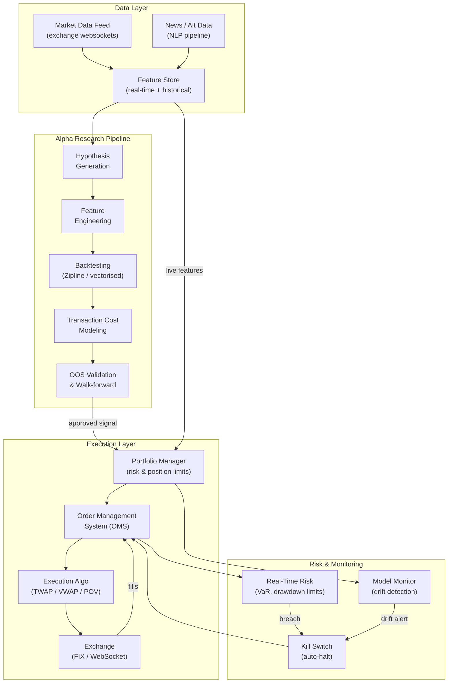

# Algorithmic Trading Systems

## Overview

An algorithmic trading system is a software pipeline that transforms raw market data into executed trades with minimal human intervention. Building one that actually works in production — not just in a backtest — requires solving a chain of hard engineering and statistical problems: acquiring clean data, designing signals with genuine predictive power, simulating historical performance without overfitting, executing efficiently in live markets, and managing risk so that a bad day does not become a bad year.

**Backtesting** is where most quant strategies live and die. A backtest replays historical market data through a trading strategy and calculates the profit and loss (P&L) the strategy would have generated. Done naively, backtesting produces wildly optimistic results through a set of well-documented biases: **look-ahead bias** (accidentally using future information), **survivorship bias** (testing only on stocks that survived to the present day), **overfitting** (tuning parameters to the historical period so thoroughly that the strategy memorizes noise rather than learning signal), and **transaction cost neglect** (ignoring commissions, slippage, and market impact that erode returns in practice).

Python frameworks like **Backtrader** and **Zipline** enforce clean separation between signal generation and order execution to reduce look-ahead bias. For high-frequency strategies, **vectorized backtesting** with NumPy avoids the per-bar Python loop overhead of event-driven frameworks, enabling rapid prototyping across thousands of parameter combinations.

**Execution algorithms** matter enormously. A strategy that generates an alpha signal of 10 basis points per trade loses most of it if the trade is executed carelessly. Two workhorses of institutional execution are **TWAP (Time-Weighted Average Price)** — splitting a large order evenly across a time window — and **VWAP (Volume-Weighted Average Price)** — sizing each slice proportional to the expected volume at that time. VWAP is the standard institutional benchmark; traders are judged on whether they beat it.

**Latency** is the delay from signal generation to order submission. In market-making and statistical arbitrage, latency is a primary competitive dimension — co-location services place servers physically inside exchange data centers to shave microseconds. For lower-frequency strategies (daily or weekly signals), latency is less critical, but infrastructure reliability matters: a system that drops orders during a volatile period can suffer catastrophic losses.

**Alpha decay** describes how quickly a trading signal loses its predictive power after it is generated. High-frequency signals decay in milliseconds. Daily rebalancing signals may retain value for days to weeks. Understanding alpha decay determines the minimum required turnover and hence the maximum tolerable transaction costs.

**The alpha research pipeline** is the systematic process of generating, testing, and deploying signals. Typical stages: hypothesis generation (economic intuition or ML discovery), feature engineering (constructing predictors from raw data), signal testing (IS / OOS validation, multiple-hypothesis correction), portfolio construction (combining signals, applying risk constraints), transaction cost modeling (slippage, market impact), and live deployment with ongoing monitoring. Most signal ideas die in testing — a healthy alpha pipeline generates far more hypotheses than it deploys.

**ML model deployment for trading** requires infrastructure that most ML practitioners do not encounter in other domains: streaming real-time data feeds, sub-second prediction latency, model versioning with instant rollback, and continuous monitoring for regime changes (the statistical distribution of returns shifts, and a model trained on one regime fails in another). Feature stores, model registries, and shadow deployment (running a new model in parallel with the live system before switching) are standard practices.

## Key Concepts

- **Backtesting**: Simulating a trading strategy on historical data to estimate its past performance, subject to multiple biases if done carelessly
- **Look-ahead bias**: Using data that would not have been available at the time of the simulated decision — the most common source of spurious backtest results
- **Survivorship bias**: Testing only on assets that survived to the present, excluding delisted stocks and bankrupt companies, which inflates apparent returns
- **TWAP (Time-Weighted Average Price)**: Execution algorithm that splits a large order into equal-sized slices across a time window
- **VWAP (Volume-Weighted Average Price)**: Execution algorithm that sizes each slice proportional to expected volume; the standard institutional execution benchmark
- **Slippage**: The difference between the expected trade price and the actual execution price, arising from market impact and bid-ask spread
- **Alpha decay**: The rate at which a predictive signal loses its edge; faster decay requires higher turnover and lower transaction costs
- **Market impact**: The adverse price movement caused by one's own trade; large orders move prices against the trader
- **Sharpe ratio**: Risk-adjusted return metric, $SR = (\bar{r} - r_f) / \sigma_r$; the primary metric for comparing strategies
- **Risk limits**: Hard constraints on position size, drawdown, and factor exposures that protect the portfolio from catastrophic loss

## Mathematical Foundations

**VWAP formula.** Given slices $q_1, \ldots, q_N$ executed at prices $p_1, \ldots, p_N$ with volumes $v_1, \ldots, v_N$, the volume-weighted average price is:

$$\text{VWAP} = \frac{\sum_{i=1}^{N} p_i \cdot v_i}{\sum_{i=1}^{N} v_i}$$

A VWAP execution algorithm aims to match this by scheduling $q_i \propto \hat{v}_i$, where $\hat{v}_i$ is the forecast volume in period $i$ derived from a historical intraday volume profile.

**Sharpe ratio with bootstrap confidence interval.** The annualised Sharpe ratio estimated from $T$ daily returns $r_1, \ldots, r_T$ is:

$$\widehat{SR} = \frac{\bar{r} - r_f}{\hat{\sigma}_r} \cdot \sqrt{252}$$

Because returns are autocorrelated and the Sharpe estimator has a non-trivial sampling distribution, confidence intervals are best computed via the block bootstrap (Ledoit & Wolf, 2008). Resample $B$ blocks of length $b = T^{1/3}$ with replacement, compute $\widehat{SR}^{(j)}$ for each bootstrap sample, and report:

$$\text{CI}_{95\%} = \left[\widehat{SR} - 1.96 \cdot \text{std}\left(\widehat{SR}^{(1)}, \ldots, \widehat{SR}^{(B)}\right),\ \widehat{SR} + 1.96 \cdot \text{std}\left(\widehat{SR}^{(1)}, \ldots, \widehat{SR}^{(B)}\right)\right]$$

**Alpha decay model.** If a signal $\alpha_t$ decays exponentially with half-life $\tau$ days, its predictive contribution at holding horizon $h$ is:

$$\alpha_t(h) = \alpha_t \cdot e^{-h \ln 2 / \tau}$$

The optimal holding period (ignoring risk) balances the decayed signal against linear transaction costs $c$ per unit of turnover:

$$h^* = \frac{\tau}{\ln 2} \cdot \ln\!\left(\frac{\alpha_t \tau}{c \cdot \ln 2}\right)$$

This shows that higher transaction costs push optimal holding periods longer — the key reason high-frequency strategies require ultra-low latency and co-location.

**Position sizing with Kelly criterion.** Given an edge $\mu$ (expected return per trade) and variance $\sigma^2$, the Kelly-optimal fraction of capital to risk is:

$$f^* = \frac{\mu}{\sigma^2}$$

In practice, fractional Kelly ($f = f^* / 4$) is used to reduce drawdown at the cost of lower long-run growth.

## Production Trading System Architecture

**Production Algorithmic Trading System**



## Code Examples

```python
"""
Vectorized backtester with transaction cost modeling.

Implements a simple momentum strategy on synthetic price data.
Demonstrates: signal generation, position sizing, slippage modeling,
Sharpe ratio with bootstrap CI, and alpha decay analysis.
"""
import numpy as np
from numpy.lib.stride_tricks import sliding_window_view

# ── Synthetic price series ────────────────────────────────────────────────────

rng = np.random.default_rng(42)
n_days = 1500
daily_vol = 0.015            # 1.5% daily vol
# Trending regime for first half, mean-reverting for second half
trend = np.concatenate([np.full(750, 0.0003), np.full(750, -0.0001)])
log_returns = trend + daily_vol * rng.standard_normal(n_days)
prices = 100.0 * np.exp(np.cumsum(log_returns))


# ── Signal generation: cross-sectional momentum ───────────────────────────────

def momentum_signal(prices: np.ndarray, lookback: int = 20) -> np.ndarray:
    """Signed momentum signal: recent return z-scored over rolling window."""
    log_p = np.log(prices)
    raw_signal = np.full(len(prices), np.nan)
    for t in range(lookback, len(prices)):
        window = log_p[t - lookback:t]
        ret = window[-1] - window[0]
        raw_signal[t] = ret
    # Z-score normalise (rolling)
    sig = np.full(len(prices), np.nan)
    for t in range(lookback * 2, len(prices)):
        w = raw_signal[lookback:t]
        sig[t] = (raw_signal[t] - np.nanmean(w)) / (np.nanstd(w) + 1e-8)
    return sig


signal = momentum_signal(prices, lookback=20)


# ── Position sizing ───────────────────────────────────────────────────────────

def signal_to_positions(signal: np.ndarray, max_pos: float = 1.0) -> np.ndarray:
    """Convert z-scored signal to target position weight in [-1, 1]."""
    pos = np.tanh(signal)                    # smooth clipping
    pos = np.where(np.isfinite(pos), pos, 0.0)
    return np.clip(pos, -max_pos, max_pos)


target_positions = signal_to_positions(signal)


# ── Transaction cost modeling ─────────────────────────────────────────────────

def vectorized_backtest(
    prices: np.ndarray,
    target_positions: np.ndarray,
    slippage_bps: float = 5.0,       # half-spread + market impact
    commission_bps: float = 1.0,
) -> dict:
    """
    Vectorized backtest.
    Returns gross & net returns, turnover, and trade log.
    """
    cost_per_unit = (slippage_bps + commission_bps) / 10_000.0

    # Forward-fill NaN positions
    positions = np.where(np.isfinite(target_positions), target_positions, 0.0)

    # Gross returns: position[t-1] * return[t]
    log_returns = np.diff(np.log(prices))
    gross_pnl = positions[:-1] * log_returns          # shape (n_days-1,)

    # Turnover: |change in position|
    turnover = np.abs(np.diff(positions))

    # Transaction costs
    cost_drag = turnover * cost_per_unit

    net_pnl = gross_pnl - cost_drag

    return {
        "gross_pnl":   gross_pnl,
        "net_pnl":     net_pnl,
        "turnover":    turnover,
        "cum_gross":   np.cumsum(gross_pnl),
        "cum_net":     np.cumsum(net_pnl),
    }


results = vectorized_backtest(prices, target_positions, slippage_bps=5, commission_bps=1)


# ── Sharpe ratio with block bootstrap ────────────────────────────────────────

def sharpe_with_bootstrap(
    daily_returns: np.ndarray,
    n_bootstrap: int = 1000,
    block_size: int | None = None,
    annualise: float = 252.0,
) -> tuple[float, float, float]:
    """
    Returns (sharpe, lower_95ci, upper_95ci) using block bootstrap.
    block_size defaults to T^{1/3}.
    """
    T = len(daily_returns)
    block_size = block_size or max(1, int(T ** (1/3)))

    def _sharpe(r):
        return (r.mean() / (r.std() + 1e-12)) * np.sqrt(annualise)

    point_est = _sharpe(daily_returns)

    bs_sharpes = []
    for _ in range(n_bootstrap):
        # Sample blocks with replacement
        n_blocks = T // block_size + 1
        starts = rng.integers(0, T - block_size, size=n_blocks)
        sample = np.concatenate([daily_returns[s:s + block_size] for s in starts])[:T]
        bs_sharpes.append(_sharpe(sample))

    bs_sharpes = np.array(bs_sharpes)
    lo, hi = np.percentile(bs_sharpes, [2.5, 97.5])
    return point_est, lo, hi


gross_sr, g_lo, g_hi = sharpe_with_bootstrap(results["gross_pnl"])
net_sr,   n_lo, n_hi = sharpe_with_bootstrap(results["net_pnl"])

print("=== Backtest Results ===")
print(f"Gross Sharpe: {gross_sr:+.2f}  95% CI [{g_lo:+.2f}, {g_hi:+.2f}]")
print(f"Net Sharpe:   {net_sr:+.2f}  95% CI [{n_lo:+.2f}, {n_hi:+.2f}]")
print(f"Avg daily turnover: {results['turnover'].mean():.3f}")
print(f"Cumulative gross P&L: {results['cum_gross'][-1]:.2%}")
print(f"Cumulative net P&L:   {results['cum_net'][-1]:.2%}")


# ── Alpha decay analysis ──────────────────────────────────────────────────────

def alpha_decay_analysis(
    signal: np.ndarray,
    prices: np.ndarray,
    max_horizon: int = 30,
) -> np.ndarray:
    """
    Compute signal IC (information coefficient = Spearman corr)
    at each forward horizon from 1 to max_horizon days.
    IC > 0 means signal predicts future returns at that horizon.
    """
    from scipy.stats import spearmanr
    ics = []
    valid = np.isfinite(signal)
    for h in range(1, max_horizon + 1):
        fwd_ret = np.log(prices[h:] / prices[:-h])
        min_len = min(len(signal) - h, len(fwd_ret))
        s = signal[:min_len][valid[:min_len]]
        r = fwd_ret[:min_len][valid[:min_len]]
        if len(s) > 20:
            ic, _ = spearmanr(s, r)
            ics.append(ic)
        else:
            ics.append(np.nan)
    return np.array(ics)


ics = alpha_decay_analysis(signal, prices)
half_life = np.argmax(ics < ics[0] / 2) + 1 if ics[0] > 0 else None
print(f"\nSignal IC at 1-day horizon:  {ics[0]:.3f}")
print(f"Signal IC at 5-day horizon:  {ics[4]:.3f}")
print(f"Signal IC at 20-day horizon: {ics[19]:.3f}")
print(f"Estimated alpha half-life:   {half_life} days" if half_life else "No decay detected")


# ── VWAP execution simulation ─────────────────────────────────────────────────

def simulate_vwap(
    order_qty: int,
    n_periods: int = 10,
    intraday_vol: float = 0.001,
    seed: int = 0,
) -> dict:
    """
    Simulate VWAP execution vs. naive market order.
    Returns execution prices and implementation shortfall.
    """
    rng2 = np.random.default_rng(seed)
    # Intraday volume profile (U-shaped: high at open/close)
    t = np.linspace(0, 1, n_periods)
    volume_profile = 0.5 + 0.5 * (2 * t - 1)**2
    volume_profile /= volume_profile.sum()

    # Simulated price path
    price_path = 100.0 * np.exp(np.cumsum(rng2.normal(0, intraday_vol, n_periods)))

    # VWAP: slice proportional to volume profile
    vwap_slices = (volume_profile * order_qty).astype(int)
    vwap_slices[-1] += order_qty - vwap_slices.sum()   # handle rounding
    vwap_price = np.sum(vwap_slices * price_path) / order_qty

    # Naive: dump entire order at open
    naive_price = price_path[0] * (1 + 0.001 * np.sqrt(order_qty / 1000))  # impact

    arrival_price = price_path[0]
    return {
        "vwap_exec_price":  vwap_price,
        "naive_exec_price": naive_price,
        "arrival_price":    arrival_price,
        "vwap_shortfall_bps":  (vwap_price  - arrival_price) / arrival_price * 10_000,
        "naive_shortfall_bps": (naive_price - arrival_price) / arrival_price * 10_000,
    }


vwap_results = simulate_vwap(order_qty=5000)
print(f"\n=== VWAP vs. Naive Execution (5000-share order) ===")
print(f"Arrival price:           ${vwap_results['arrival_price']:.2f}")
print(f"VWAP exec price:         ${vwap_results['vwap_exec_price']:.2f} "
      f"(shortfall: {vwap_results['vwap_shortfall_bps']:+.1f} bps)")
print(f"Naive exec price:        ${vwap_results['naive_exec_price']:.2f} "
      f"(shortfall: {vwap_results['naive_shortfall_bps']:+.1f} bps)")
```

## Exercises

1. **Implement a vectorized backtester with walk-forward validation.** Extend the backtester above to perform walk-forward analysis: train the signal parameters on the first 60% of data, test on the next 20%, retrain on 60%-80%, and test on 80%-100%. Compare the in-sample Sharpe to the out-of-sample Sharpe. If the ratio is greater than 2:1, the strategy is likely overfit.

2. **Add realistic transaction cost modeling.** Extend the `vectorized_backtest` function to implement: (a) market impact using the square-root law $\Delta p = \sigma \lambda \sqrt{|q|/V}$ where $V = 10^6$ shares/day; (b) a minimum tick size of \$0.01 (quantise all simulated prices); (c) short-selling cost of 50 bps/year on negative positions. Compare the net Sharpe under these realistic costs to the baseline slippage model.

3. **Build a VWAP scheduler with adaptive rebalancing.** Implement a VWAP execution algorithm that: (a) starts with the historical intraday volume profile (U-shaped); (b) updates the schedule in real time as actual volume deviates from forecast; (c) adds a participation rate limit (never exceed 10% of local market volume). Test it on synthetic intraday price data with volume shocks.

## Further Reading

- [Advances in Financial Machine Learning (López de Prado, 2018)](https://www.wiley.com/en-us/Advances+in+Financial+Machine+Learning-p-9781119482086) — the standard reference for ML in quantitative trading
- [Backtrader documentation](https://www.backtrader.com/docu/) — Python event-driven backtesting framework
- [Zipline-Reloaded (community fork)](https://github.com/stefan-jansen/zipline-reloaded) — Quantopian's backtesting engine, maintained
- [Optimal execution of portfolio transactions (Almgren & Chriss, 2000)](https://cims.nyu.edu/~almgren/papers/optliq.pdf) — foundational theory for execution algorithms
- [The Sharpe ratio and its estimation (Lo, 2002, Journal of Portfolio Management)](https://alo.mit.edu/wp-content/uploads/2017/06/The-Statistics-of-Sharpe-Ratios.pdf)
- [QuantLib: open-source library for quantitative finance](https://www.quantlib.org/)
