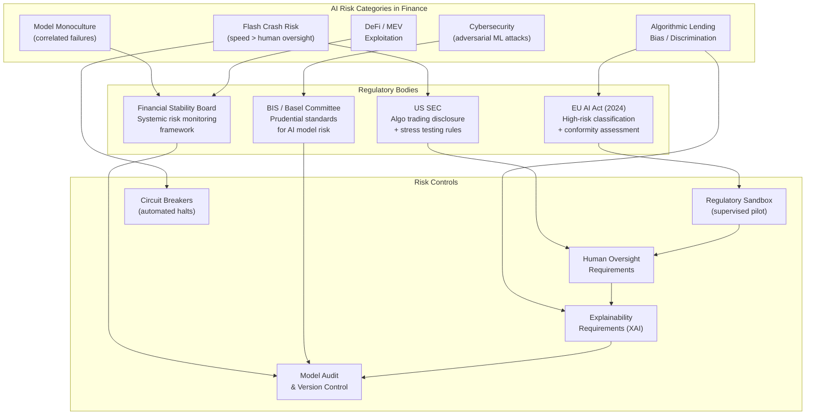

# Frontiers: AI and Financial Stability

## Overview

The widespread adoption of AI in finance is not merely an efficiency story — it is a systemic story. When thousands of institutions deploy similar ML models trained on overlapping datasets using similar architectures, they do not just share a toolkit; they share a failure mode. Understanding this is now one of the central challenges of financial regulation and macroprudential policy.

**Systemic risk** in the traditional sense refers to the risk that the failure of one institution propagates through the financial network to threaten the system as a whole. AI introduces a new mechanism: **model monoculture risk**. If the majority of trading algorithms condition on the same features, react to the same signals, and have been trained on the same historical crises, they will behave identically in novel stress scenarios — amplifying shocks rather than absorbing them. A shock that one diverse ecosystem of trading strategies might dampen becomes a coordinated stampede when strategies are homogeneous.

**The AI arms race in trading** compounds this. As more capital chases the same signals, alphas decay faster, pushing firms toward increasingly similar, data-hungry ML models. The competitive pressure to deploy faster models with less human oversight increases the probability of correlated failures. The 2010 Flash Crash and the August 2015 China market circuit breaker event both featured cascading algorithmic reactions. As AI systems grow more capable and autonomous, the speed and scale of such cascades will increase.

**Regulatory responses** are accelerating. The EU AI Act (2024) classifies AI systems used in credit scoring, insurance pricing, and financial market infrastructure as high-risk, requiring conformity assessments, human oversight mechanisms, and detailed logging. The US SEC has proposed rules requiring disclosure of algorithmic trading strategies and stress testing under adverse scenarios. The Financial Stability Board (FSB) has published frameworks for AI-specific systemic risk monitoring. Despite this, regulation lags deployment by years — the models running on exchanges today were not subject to ex-ante approval.

**AI for central banking** represents a genuinely positive frontier. Central banks including the Bank of England, the ECB, and the Federal Reserve now use ML for economic forecasting (replacing structural VAR models), real-time monitoring of financial conditions (using high-frequency transaction data), and supervisory stress testing (using agent-based models to simulate contagion). The challenge is interpretability: a central bank that uses a neural network to set interest rates faces a legitimacy problem if it cannot explain the decision.

**Decentralized Finance (DeFi)** and AI interact in novel ways. DeFi protocols — automated market makers (AMMs), lending protocols, and yield optimizers — are themselves algorithmic agents. AI bots exploit DeFi inefficiencies through maximal extractable value (MEV) — front-running transactions in the mempool. Flash loan attacks (borrowing millions of dollars with no collateral for the duration of a single transaction) are orchestrated by sophisticated AI agents. Simultaneously, AI is being deployed to audit smart contracts for vulnerabilities before deployment.

**Quantum ML for finance** remains speculative but plausible. Quantum computers can, in principle, accelerate certain optimization problems relevant to portfolio construction and option pricing. Near-term quantum advantage in finance is unlikely — current noisy intermediate-scale quantum (NISQ) devices cannot outperform classical hardware on realistic financial problems. But the medium-term outlook (5-10 years) is uncertain, and major financial institutions are investing in quantum readiness.

**Foundation models for financial time series** are maturing rapidly. Models like TimesFM (Google, 2024), Moirai (Salesforce, 2024), and Chronos (Amazon, 2024) are pretrained on billions of time-series observations and can zero-shot forecast financial series with competitive accuracy — an approach that could democratize quantitative finance by reducing the data requirements for strategy development.

The ethical stakes are high. AI-driven credit scoring has been shown to perpetuate and sometimes amplify historical discrimination. Algorithmic lending decisions affecting millions of individuals are made by models whose inner workings are opaque to those they affect. **Explainability, fairness, and accountability** are not optional features — they are increasingly legal requirements, and should be design principles.

## Key Concepts

- **Systemic risk**: The risk that the failure or disruption of one component of the financial system causes cascading failures across the broader system
- **Model monoculture**: The situation where a majority of market participants use similar models, creating correlated behavior and shared failure modes
- **Regulatory sandbox**: A controlled environment where financial regulators allow firms to test innovative AI products under supervision before full deployment
- **AI governance in finance**: Organizational and technical frameworks for oversight, accountability, and auditability of AI systems used in financial decision-making
- **DeFi (Decentralized Finance)**: Financial services built on blockchain smart contracts without traditional intermediaries; increasingly interacting with AI systems
- **MEV (Maximal Extractable Value)**: Profit extracted by reordering, inserting, or censoring transactions within a blockchain block, often using AI bots
- **Flash crash**: A rapid automated market dislocation caused by cascading algorithmic responses, typically recovering within minutes
- **AI ethics in finance**: The study and practice of ensuring AI systems in finance are fair, transparent, accountable, and do not cause disproportionate harm
- **Correlation breakdown**: During market stress, asset correlations rise toward 1, undermining diversification assumptions embedded in normal-period ML models
- **Quantum ML for finance**: Research into using quantum computing to accelerate ML algorithms for portfolio optimization, option pricing, and risk estimation

## Mathematical Foundations

**Systemic risk contagion model.** Consider a network of $N$ financial institutions with adjacency matrix $W_{ij}$ (exposure of institution $i$ to institution $j$). If institution $j$ suffers a loss $\ell_j$, the contagion to institution $i$ is:

$$\Delta L_i = \sum_j W_{ij} \cdot \ell_j \cdot \mathbf{1}[\ell_j > D_j]$$

where $D_j$ is the default threshold (equity buffer) of institution $j$. A cascade occurs when $\Delta L_i > D_i$ for some previously-solvent $i$, triggering a new round of defaults. The final cascade size depends critically on the network topology: denser, more uniform networks are more fragile.

**Correlation breakdown during stress.** In normal markets, a diversified portfolio with asset correlations $\rho_{ij}^{\text{normal}}$ has variance:

$$\sigma_P^2 = \mathbf{w}^T \Sigma^{\text{normal}} \mathbf{w}$$

Under stress, correlations shift toward $\rho^{\text{stress}} \to 1$:

$$\Sigma_{ij}^{\text{stress}} = \sigma_i \sigma_j \cdot \left[(1-\lambda)\rho_{ij}^{\text{normal}} + \lambda \cdot \rho^{\text{stress}}\right]$$

where $\lambda \in [0,1]$ is a stress intensity parameter. For $\lambda \to 1$, all correlations approach $\rho^{\text{stress}}$ and diversification collapses. ML models trained on normal-period covariance matrices systematically underestimate stress-period risk by the factor:

$$\frac{\sigma_P^{\text{stress}}}{\sigma_P^{\text{normal}}} \approx \sqrt{\frac{1 + (N-1)\rho^{\text{stress}}}{1 + (N-1)\rho^{\text{normal}}}}$$

For $N = 100$, $\rho^{\text{normal}} = 0.2$, $\rho^{\text{stress}} = 0.8$: this ratio is approximately $\sqrt{80.2 / 20.8} \approx 1.96$ — nearly doubling apparent risk.

**Model monoculture amplification.** If a fraction $\phi$ of market participants use the same strategy, the correlated selling pressure during a drawdown is:

$$Q_{\text{corr}} = \phi \cdot Q_{\text{total}} + (1-\phi) \cdot Q_{\text{diverse}}$$

For $\phi \to 1$, the market impact of correlated selling is:

$$\Delta p = -\sigma \lambda \sqrt{Q_{\text{corr}} / V} \approx -\sigma \lambda \sqrt{\phi \cdot Q_{\text{total}} / V}$$

demonstrating that doubling monoculture fraction ($\phi$) increases price impact by $\sqrt{2}$ — a non-linear amplification of systemic fragility.

## Regulatory Framework and AI Risk Taxonomy

**AI Systemic Risk Taxonomy and Regulatory Framework**



## Code Examples

```python
"""
Simulate correlated AI strategy failures causing a flash crash.

Models a market where a fraction of participants use the same
momentum-reversal strategy. A common adverse signal triggers
simultaneous selling, cascading into a flash crash.
Demonstrates: model monoculture amplification, contagion dynamics,
and the effect of circuit breakers.
"""
import numpy as np
from dataclasses import dataclass
from typing import Optional

rng = np.random.default_rng(2024)

# ── Market state ──────────────────────────────────────────────────────────────

@dataclass
class MarketState:
    price: float = 100.0
    daily_volume: float = 1_000_000.0
    circuit_breaker_active: bool = False
    circuit_breaker_threshold: float = 0.03   # 3% move triggers halt

# ── Agent types ───────────────────────────────────────────────────────────────

class MonocultureAgent:
    """
    AI momentum-reversal agent: identical model deployed by many firms.
    Sells aggressively when price drops below its entry trigger.
    """
    def __init__(self, capital: float, trigger_drop: float = 0.02):
        self.capital = capital
        self.trigger_drop = trigger_drop       # sell if price drops > X%
        self.entry_price: Optional[float] = None
        self.has_sold = False

    def reset(self, entry_price: float):
        self.entry_price = entry_price
        self.has_sold = False

    def decide(self, current_price: float) -> float:
        """Return sell quantity (shares) if trigger breached, else 0."""
        if self.has_sold or self.entry_price is None:
            return 0.0
        drop = (self.entry_price - current_price) / self.entry_price
        if drop > self.trigger_drop:
            self.has_sold = True
            return self.capital / current_price   # liquidate all
        return 0.0

class DiverseAgent:
    """
    Contrarian / value agent: buys on dips, providing stabilising liquidity.
    """
    def __init__(self, capital: float, buy_threshold: float = 0.03):
        self.capital = capital
        self.buy_threshold = buy_threshold

    def decide(self, current_price: float, entry_price: float) -> float:
        """Return buy quantity (negative = buying = price-stabilising) if dip."""
        drop = (entry_price - current_price) / entry_price
        if drop > self.buy_threshold:
            return -min(self.capital / current_price, 500)   # buy up to 500 shares
        return 0.0

# ── Price impact model ────────────────────────────────────────────────────────

def price_impact(
    net_sell_qty: float,
    price: float,
    daily_volume: float,
    daily_vol: float = 0.015,
    lambda_: float = 0.5,
) -> float:
    """Square-root market impact model: Δp = -σ·λ·√(|q|/V)."""
    if net_sell_qty <= 0:
        return 0.0
    return -daily_vol * lambda_ * np.sqrt(net_sell_qty / daily_volume) * price

# ── Flash crash simulation ────────────────────────────────────────────────────

def simulate_flash_crash(
    monoculture_fraction: float = 0.7,
    n_agents: int = 200,
    n_steps: int = 100,
    initial_shock: float = -0.015,   # 1.5% initial adverse move
    use_circuit_breaker: bool = True,
) -> dict:
    """
    Simulate a flash crash driven by correlated AI strategy failure.

    Parameters
    ----------
    monoculture_fraction : fraction of agents using identical ML strategy
    n_agents             : total number of market participants
    initial_shock        : initial adverse price move (fraction)
    use_circuit_breaker  : whether trading halts at threshold

    Returns
    -------
    Dictionary with price path, sell pressure, and recovery dynamics.
    """
    state = MarketState()
    entry_price = state.price

    n_mono  = int(n_agents * monoculture_fraction)
    n_div   = n_agents - n_mono

    mono_agents = [MonocultureAgent(
        capital=rng.uniform(500_000, 2_000_000),
        trigger_drop=rng.uniform(0.015, 0.025)   # slight heterogeneity in triggers
    ) for _ in range(n_mono)]
    div_agents  = [DiverseAgent(
        capital=rng.uniform(200_000, 800_000),
        buy_threshold=rng.uniform(0.025, 0.04)
    ) for _ in range(n_div)]

    for agent in mono_agents:
        agent.reset(entry_price)

    prices, sell_pressures, halted_steps = [state.price], [], []

    # Step 0: initial shock (e.g., macro news, large fundamental seller)
    state.price *= (1 + initial_shock)
    prices.append(state.price)

    for step in range(1, n_steps):
        if state.circuit_breaker_active:
            # Market halted; price stays flat; agents cannot act
            halted_steps.append(step)
            prices.append(state.price)
            sell_pressures.append(0.0)
            # Circuit breaker lifts after 5 steps
            if len(halted_steps) >= 5:
                state.circuit_breaker_active = False
                halted_steps.clear()
                # Reset agent triggers to current price (fresh start)
                for agent in mono_agents:
                    agent.reset(state.price)
            continue

        # Aggregate sell orders from monoculture agents
        mono_sell = sum(a.decide(state.price) for a in mono_agents)

        # Aggregate buy orders from diverse agents
        diverse_buy = sum(a.decide(state.price, entry_price) for a in div_agents)

        # Net sell pressure
        net_sell = max(0.0, mono_sell - abs(diverse_buy))
        sell_pressures.append(net_sell)

        # Compute price impact
        impact = price_impact(net_sell, state.price, state.daily_volume)

        # Background noise (fundamental process continues)
        noise = state.price * rng.normal(0, 0.001)

        state.price += impact + noise
        state.price = max(state.price, 1.0)   # floor at $1

        prices.append(state.price)

        # Check circuit breaker
        if use_circuit_breaker:
            drop_from_entry = (entry_price - state.price) / entry_price
            if drop_from_entry > state.circuit_breaker_threshold:
                state.circuit_breaker_active = True

    prices = np.array(prices)
    trough_idx = np.argmin(prices)
    trough_drop = (entry_price - prices[trough_idx]) / entry_price

    return {
        "prices":             prices,
        "sell_pressures":     sell_pressures,
        "trough_drop":        trough_drop,
        "trough_step":        trough_idx,
        "recovery_price":     prices[-1],
        "recovery_pct":       (prices[-1] - prices[trough_idx]) / prices[trough_idx],
    }

# ── Run experiments: vary monoculture fraction ────────────────────────────────

print("=== Flash Crash Severity vs. Model Monoculture Fraction ===\n")
print(f"{'Monoculture %':>15}  {'Trough Drop':>12}  {'Trough Step':>12}  "
      f"{'Recovery':>10}")
print("-" * 55)

fractions = [0.1, 0.3, 0.5, 0.7, 0.9]
for phi in fractions:
    result = simulate_flash_crash(
        monoculture_fraction=phi,
        n_agents=200,
        n_steps=100,
        use_circuit_breaker=True,
    )
    print(f"{phi:>14.0%}  {result['trough_drop']:>11.2%}  "
          f"{result['trough_step']:>12d}  {result['recovery_pct']:>9.2%}")

# ── Contagion model: network propagation ─────────────────────────────────────

def simulate_contagion(
    n_institutions: int = 20,
    exposure_density: float = 0.3,
    equity_buffers: np.ndarray | None = None,
    initial_shocked: list | None = None,
) -> dict:
    """
    Simulate loss contagion through a network of financial institutions.
    Uses the Eisenberg-Noe clearing mechanism (simplified).
    """
    if equity_buffers is None:
        equity_buffers = rng.uniform(0.05, 0.20, size=n_institutions)
    if initial_shocked is None:
        initial_shocked = [0]   # institution 0 suffers initial shock

    # Random exposure network (asymmetric)
    W = (rng.random((n_institutions, n_institutions)) < exposure_density).astype(float)
    np.fill_diagonal(W, 0)
    # Normalise rows so each row sums to ~0.5 (fraction of equity exposed)
    row_sums = W.sum(axis=1, keepdims=True) + 1e-8
    W = W / row_sums * 0.5

    losses = np.zeros(n_institutions)
    defaulted = set(initial_shocked)
    for i in initial_shocked:
        losses[i] = equity_buffers[i] * 1.5   # shock exceeds equity

    # Iterate until no new defaults
    round_num = 0
    new_defaults = set(initial_shocked)
    cascade_rounds = []
    while new_defaults:
        round_num += 1
        cascade_rounds.append(list(new_defaults))
        next_defaults = set()
        for j in new_defaults:
            # Contagion from defaulted institution j
            contagion = W[:, j] * losses[j]
            losses += contagion
            for i in range(n_institutions):
                if i not in defaulted and losses[i] > equity_buffers[i]:
                    next_defaults.add(i)
        defaulted |= next_defaults
        new_defaults = next_defaults

    return {
        "n_defaulted":    len(defaulted),
        "defaulted_set":  defaulted,
        "cascade_rounds": cascade_rounds,
        "total_loss":     losses.sum(),
    }

print("\n\n=== Network Contagion: Cascade Depth vs. Exposure Density ===\n")
print(f"{'Exposure Density':>18}  {'Institutions Defaulted':>22}  {'Cascade Rounds':>15}")
print("-" * 60)
for density in [0.1, 0.2, 0.3, 0.4, 0.5]:
    result = simulate_contagion(n_institutions=30, exposure_density=density)
    n_rounds = len(result["cascade_rounds"])
    print(f"{density:>17.0%}  {result['n_defaulted']:>22d}  {n_rounds:>15d}")
```

## Exercises

1. **Model systemic risk propagation.** Extend the `simulate_contagion` function to implement a two-layer network: layer 1 is bank-to-bank exposures; layer 2 is banks' shared exposures to common AI-driven funds (whose losses during a market shock are correlated with monoculture fraction $\phi$). Run a joint simulation where a flash crash triggered by monoculture AI agents causes mark-to-market losses at funds, which propagate to banks through the exposure network. Measure the total fraction of institutions defaulted as a function of $\phi$.

2. **Analyze a historical flash crash.** Using publicly available data from the 2010 Flash Crash (CFTC/SEC joint report data), or the 2015 US Treasury flash crash: (a) download 1-minute OHLCV data for the affected market; (b) fit an AR(1)-GARCH(1,1) model to pre-crash returns and compute its one-step-ahead VaR; (c) identify how many consecutive VaR breaches occurred during the crash; (d) compare with a student-t GARCH model that has fatter tails. What does this reveal about the limitation of normal-period risk models during algorithmic crises?

3. **Regulatory stress test design.** Design a stress test scenario for a hypothetical AI trading firm: (a) specify the adverse scenario (e.g., a 5% equity index move in 30 minutes); (b) estimate position losses under correlated selling using the square-root impact model; (c) compute the capital requirement under Basel III market risk rules (Standardised Approach); (d) assess whether a circuit breaker triggered at 3% would have prevented a default. Write up the results as a two-page regulatory report format.

## Further Reading

- [Financial Stability Board: Artificial Intelligence and Financial Stability (2022)](https://www.fsb.org/2022/11/fsb-report-on-artificial-intelligence-and-financial-stability/)
- [EU AI Act: High-risk AI systems in finance (EUR-Lex 2024)](https://eur-lex.europa.eu/legal-content/EN/TXT/?uri=CELEX:32024R1689)
- [The Flash Crash: High-frequency trading in an electronic market (Kirilenko et al., 2017)](https://onlinelibrary.wiley.com/doi/abs/10.1111/jofi.12498)
- [TimesFM: A decoder-only foundation model for time-series forecasting (Google, 2024)](https://arxiv.org/abs/2310.10688)
- [Moirai: Unified Training of Universal Time Series Forecasting Transformers (Salesforce, 2024)](https://arxiv.org/abs/2402.02592)
- [Model Risk Management guidance (Federal Reserve SR 11-7)](https://www.federalreserve.gov/supervisionreg/srletters/sr1107.htm) — foundational guidance on validating and governing quantitative models in finance
- [AI Ethics in Finance (Bartlett et al., 2022 — Racial Bias in Mortgage Lending AI)](https://www.nber.org/papers/w25943)
