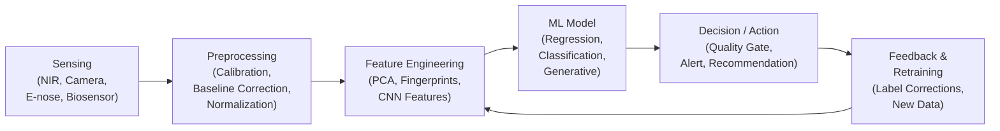
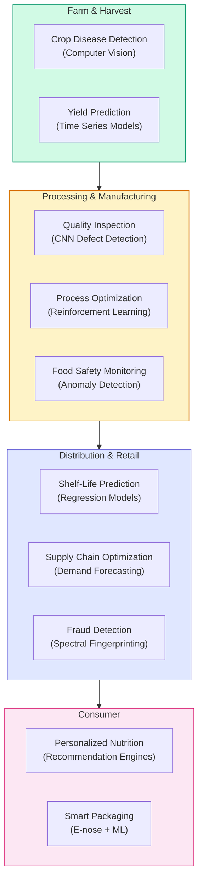

## Introduction to AI for Food Science

## Overview

Food science sits at the intersection of chemistry, biology, engineering, and nutrition — and increasingly, artificial intelligence. From the grain fields of Southeast Asia to the cold-chain logistics of a supermarket freezer, food touches nearly every aspect of human life. Yet the global food system faces enormous pressures: the United Nations estimates that approximately one-third of all food produced for human consumption is lost or wasted each year, equivalent to roughly 1.3 billion tonnes. Simultaneously, nearly 800 million people remain food insecure, and foodborne illnesses cause an estimated 600 million cases globally per year. AI offers food science a powerful new set of tools to address these challenges at scale.

The application of AI to food science has a history stretching back to the late 1980s, when early **expert systems** were deployed to assist with quality grading. Systems like FLAV-SYS encoded the knowledge of experienced flavor chemists into rule-based engines that could evaluate aroma profiles. In the 1990s and 2000s, statistical methods such as principal component analysis (PCA) and partial least squares (PLS) regression became standard tools for processing spectral data from near-infrared (NIR) sensors, enabling rapid compositional analysis without the need for destructive wet chemistry. The 2010s brought the deep learning revolution: convolutional neural networks (CNNs) made it practical to automate visual inspection of produce and packaged goods, while recurrent neural networks (RNNs) found use in modeling fermentation time series. Today, transformer-based large language models are being used to mine the scientific literature for flavor compound relationships, and graph neural networks (GNNs) are predicting molecular taste from chemical structure.

Key application areas span the entire food value chain. **Quality inspection** uses computer vision to detect defects in fresh produce, grading fruit and vegetables with speed and consistency no human inspector can match. **Food safety** applies anomaly detection models to sensor streams from processing lines, flagging contamination events before product ships. **Nutrition science** uses machine learning to predict glycemic response and micronutrient bioavailability from dietary records. **Food fraud detection** leverages spectroscopic fingerprints and chemometrics to identify adulterated olive oil or mislabeled fish species. **Smart packaging** combines sensor arrays (electronic noses) with ML classifiers to track freshness in real time. The economic stakes are significant: the global food technology market was valued at over $220 billion in 2023 and is growing rapidly, driven by automation, personalized nutrition, and sustainability imperatives.

The societal impact of AI in food science is equally profound. Precision fermentation — using AI-guided microorganism engineering to produce food proteins without livestock — is a nascent field with the potential to drastically reduce agriculture's carbon footprint. AI-assisted crop disease detection deployed via mobile apps is already extending the reach of agricultural expertise to smallholder farmers in sub-Saharan Africa. And AI-driven dietary recommendation engines are beginning to personalize nutrition advice at population scale.

## Key Concepts

- **Food security**: Reliable access to sufficient, safe, and nutritious food for all people — a global challenge that AI can help address through yield optimization, waste reduction, and supply chain intelligence.
- **Food fraud**: Deliberate misrepresentation of food composition, origin, or quality (e.g., adulterated honey, mislabeled fish); a target for AI-based authentication.
- **Electronic nose (e-nose)**: An array of chemical sensors combined with ML to mimic olfaction; used for freshness assessment and quality control.
- **Chemometrics**: The application of statistical and mathematical methods to chemical data, foundational to spectral analysis in food science.
- **Precision fermentation**: Engineering microorganisms with AI assistance to produce specific proteins, fats, or flavors without traditional animal agriculture.
- **The food AI pipeline**: A sequence of steps from sensing raw material properties, through data preprocessing, to ML model inference, to actionable decisions.

## Technical Details

The AI for Food Science pipeline follows a pattern analogous to other applied ML domains but with domain-specific considerations at each stage:

1. **Sensing**: Data is acquired from physical sensors (NIR spectrometers, cameras, e-noses, biosensors) or from databases (chemical registries, nutritional databases, regulatory filings). Sensor choice determines the information content available downstream.
2. **Preprocessing**: Raw signals are cleaned, calibrated, and transformed. NIR spectra undergo baseline correction and scatter correction (MSC, SNV). Images are white-balanced and normalized. Chromatographic peaks are aligned and integrated.
3. **Feature Engineering / Representation**: Spectra may be used raw (as input to CNNs) or reduced via PCA. Images yield CNN feature maps. Molecules are encoded as SMILES strings, fingerprints, or molecular graphs.
4. **ML Model**: Task-specific models are applied — regression for compositional prediction, classification for defect detection, generative models for flavor design.
5. **Decision / Action**: Model outputs feed into quality control gates, supply chain management systems, or recommendation engines. Uncertainty quantification is essential for high-stakes decisions.

Quantitative performance is typically measured using domain-relevant metrics. For compositional prediction, root mean square error of cross-validation (RMSECV) and root mean square error of prediction (RMSEP) from NIR calibrations are standard. For classification tasks (defect detection, fraud), precision, recall, and $F_1$ score are used. For shelf-life prediction, mean absolute error (MAE) in days is the natural unit.

## Diagrams

**The AI for Food Science Pipeline**



**AI Application Areas Across the Food Value Chain**



## Code Examples

```python
"""
Rule-based fruit freshness classifier — a baseline approach.
Demonstrates the kind of expert system that AI/ML now replaces.
"""
import numpy as np

# Simulated sensor readings for 5 fruit samples
# Columns: [color_index (0-10), firmness (0-10), days_since_harvest]
samples = np.array([
    [9.2, 8.5, 1],   # bright color, firm, just picked
    [7.0, 6.0, 4],   # slightly faded, softer
    [5.5, 4.0, 7],   # noticeable color loss
    [3.2, 2.1, 12],  # significant degradation
    [1.5, 0.8, 18],  # heavily degraded
])

def rule_based_classifier(color, firmness, days):
    """Classify fruit freshness using hand-crafted rules."""
    score = (color + firmness) / 2 - (days * 0.3)
    if score > 6:
        return "fresh"
    elif score > 3:
        return "acceptable"
    else:
        return "spoiled"

# Classify each sample
for i, (color, firmness, days) in enumerate(samples):
    label = rule_based_classifier(color, firmness, days)
    print(f"Sample {i+1}: color={color}, firmness={firmness}, "
          f"days={days} → {label}")
```

**Line-by-line walkthrough:**

- **Lines 7–13 (`samples = np.array(...)`)**: We create a small synthetic dataset simulating sensor readings from five fruit samples at different stages of freshness. In practice, these values would come from NIR spectrometers (for color index), texture analyzers (for firmness), and supply chain logs (for days since harvest).
- **Lines 15–21 (`rule_based_classifier`)**: This function encodes expert knowledge as explicit rules — a weighted combination of color, firmness, and age. The thresholds (6 and 3) were chosen to mimic how a human inspector might judge quality. This is the same approach used by 1980s expert systems like FLAV-SYS.
- **Lines 24–27 (classification loop)**: Each sample is classified and printed. Notice how the rule-based approach is transparent (you can see exactly why a decision was made) but rigid — it cannot adapt to new fruit varieties or account for nonlinear interactions between features. This is precisely the gap that ML models fill.

## Exercises and Projects

1. **Literature Survey**: Identify three recent papers (2022–2025) applying ML to food quality inspection. For each, note the sensing modality, ML method, and reported accuracy metric.
2. **Pipeline Mapping**: Choose a food product you know well (e.g., coffee, cheese, bread). Sketch a full AI pipeline for quality assessment of that product, identifying sensing options at each stage.
3. **Dataset Exploration**: Download the FooDD (Food Detection Dataset) from Kaggle and run a basic exploratory data analysis (EDA): class counts, image dimensions, sample visualization.
4. **Expert System Simulation**: Write a simple Python rule-based classifier that predicts "fresh," "acceptable," or "spoiled" for a fruit based on three input features (color index, firmness, days since harvest). What are the limitations of this approach versus a learned ML model?
5. **ML Upgrade**: Extend the rule-based classifier from Exercise 4 by training a scikit-learn `DecisionTreeClassifier` on a larger synthetic dataset (100+ samples). Compare its accuracy to the rule-based approach using a held-out test set. What advantages does the learned model offer?

## Further Reading

- FAO, "Global Food Losses and Food Waste" (2011) — foundational report on the scale of food waste: [https://www.fao.org/3/mb060e/mb060e00.htm](https://www.fao.org/3/mb060e/mb060e00.htm)
- Kamilaris, A. & Prenafeta-Boldú, F.X., "Deep learning in agriculture: A survey" (Computers and Electronics in Agriculture, 2018)
- Mehrotra, R. et al., "Artificial intelligence in food safety: A decade review and bibliometric analysis" (Foods, 2022)
- Sun, D.-W. (ed.), *Computer Vision Technology for Food Quality Evaluation*, Academic Press, 2nd ed. (2016)
- GoodFood Institute, "Precision Fermentation State of the Industry Report" (2023): [https://gfi.org](https://gfi.org)
- Zhou, L. et al., "Application of deep learning in food: A review" (Comprehensive Reviews in Food Science and Food Safety, 2019)
