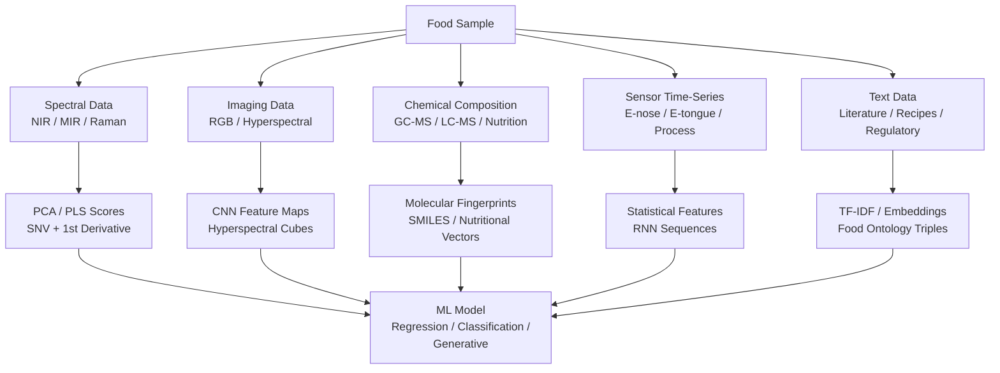

# Food Science Data Types, Representations, and Quality

## Overview

Every machine learning pipeline begins with data, and food science generates data in an unusually diverse array of forms. A single quality inspection task might simultaneously involve near-infrared spectra, RGB images, electronic nose signals, and chemical composition records. Understanding the nature of each data type — its information content, its failure modes, and its natural representation for ML — is the essential first step before any model is trained.

Food science data can be broadly divided into five categories: **spectral data**, **imaging data**, **chemical composition data**, **sensor time-series**, and **text data**. Each brings distinct challenges in preprocessing, feature engineering, and model selection. The goal of this lesson is to build a working vocabulary for all five, explore how food chemists and data scientists represent food-relevant information, and confront the real-world data quality problems that make food AI harder than textbook examples suggest.

## Key Concepts

- **Spectral data**: Measurements of how a food sample interacts with electromagnetic radiation across a range of wavelengths. Different spectral regions probe different molecular vibrations and electronic transitions.
- **Hyperspectral imaging**: Combining the spatial resolution of a camera with the spectral resolution of a spectrometer; produces a 3D data cube $(x, y, \lambda)$.
- **Molecular fingerprint**: A fixed-length binary or integer vector encoding the presence or count of structural subgraphs in a molecule; enables ML on chemical structures.
- **SMILES**: Simplified Molecular Input Line Entry System — a compact string encoding of molecular structure (e.g., the amino acid glycine is `NCC(=O)O`).
- **Sensory descriptors**: Human-generated or instrument-measured scores on perceptual attributes (sweetness, bitterness, crunchiness, color intensity).
- **Batch effects**: Systematic variation in data introduced by differences in instrument calibration, operator, day of measurement, or sample lot — unrelated to the biological signal of interest.
- **Sensor drift**: Gradual change in a sensor's response characteristics over time due to fouling, aging, or environmental exposure; a major challenge for e-nose systems.

## Technical Details

### Spectral Data

Near-infrared (NIR) spectroscopy operates in the wavelength range 780–2500 nm and detects overtone and combination bands of O–H, N–H, and C–H bonds. It is the workhorse of industrial food analysis: moisture, protein, fat, and starch content can all be predicted from a NIR spectrum in seconds without any sample preparation. Mid-infrared (MIR) spectroscopy (2500–25000 nm) provides more structurally specific information and is widely used for authentication and adulteration detection. Raman spectroscopy, based on inelastic light scattering, complements NIR/MIR and is particularly useful for aqueous samples where water absorption does not interfere.

Raw spectral data requires preprocessing before ML. The standard pipeline includes:

- **Baseline correction**: Removes additive offsets due to scatter or fluorescence.
- **Multiplicative scatter correction (MSC)** or **standard normal variate (SNV)**: Corrects for multiplicative scatter effects from particle size variation.
- **Savitzky-Golay smoothing and differentiation**: Reduces noise and enhances spectral features.

The dimensionality of spectral data is typically high (hundreds to thousands of wavelength channels) relative to the number of samples, motivating dimensionality reduction via PCA, partial least squares (PLS), or learned convolutional features.

### Imaging Data

RGB images are the most accessible food imaging modality: smartphone cameras and industrial line-scan cameras both produce them. Applications include defect detection in fruits, grading of meat marbling, and color uniformity assessment in baked goods. Hyperspectral imaging extends this to 100–300 spectral bands, enabling chemical mapping — for example, mapping the distribution of lycopene in a tomato slice or detecting fungal contamination invisible to the naked eye.

A hyperspectral data cube is a tensor of shape $(H \times W \times \lambda)$. ML models must account for both spatial and spectral structure; 3D-CNNs and attention-based architectures have been applied successfully.

### Chemical Composition Data

Nutritional profiles (macronutrients, micronutrients, energy density), flavor compound concentrations from GC-MS (gas chromatography–mass spectrometry), and metabolomics profiles from LC-MS are all examples of chemical composition data. These are typically stored as tabular feature vectors, but they can also be expressed at the molecular level using SMILES strings or molecular fingerprints.

A **Morgan fingerprint** (also called ECFP, Extended-Connectivity Fingerprint) encodes local chemical neighborhoods at increasing radii from each atom into a fixed-length bit vector. For example, ECFP4 uses neighborhoods up to radius 2 (4 bonds). These fingerprints enable simple Euclidean-distance or cosine-similarity comparisons between molecules, and they serve as input to random forests and SVMs for property prediction.

$$\text{Tanimoto similarity}(A, B) = \frac{|A \cap B|}{|A \cup B|}$$

where $A$ and $B$ are sets of active bits in the fingerprints of two molecules.

### Sensor Time-Series

Electronic tongues, electronic noses, and in-line process sensors produce time-series data. Fermentation monitoring produces time series of pH, dissolved oxygen, temperature, and optical density. These data require time-series feature extraction (mean, variance, slope, peak position) or direct sequence modeling with RNNs or temporal CNNs.

Sensor drift is a particularly serious challenge. An e-nose sensor array calibrated in January may give systematically different responses to the same sample by June due to sensor aging. Drift correction methods include component correction (CC), orthogonal signal correction (OSC), and domain adaptation techniques that align sensor responses across time points.

### Text Data

Food science text data spans regulatory documents (FDA GRAS notices, EU food additive lists), scientific literature, recipe databases, and consumer reviews. NLP applications include automated extraction of food-chemical relationships from papers, regulatory compliance checking, and recipe optimization. Food ontologies like FoodOn and the USDA FoodData Central taxonomy provide structured vocabularies that can be used to ground NLP models.

### Public Datasets

| Dataset | Description | Size | Link |
|---|---|---|---|
| FooDD | Food detection images, 3000 images across 10 classes | ~3k images | Kaggle |
| FIDS30 | Food ingredient detection, 30 ingredient classes | ~27k images | Kaggle |
| Open Food Facts | Nutritional profiles and ingredients for 3M+ products | 3M+ records | [https://world.openfoodfacts.org/](https://world.openfoodfacts.org/) |
| USDA FoodData Central | Comprehensive nutritional composition database | ~600k foods | [https://fdc.nal.usda.gov/](https://fdc.nal.usda.gov/) |
| Mendeley Food Spectra | NIR/Raman spectra for adulteration detection | varies | Mendeley Data |

### Data Quality Challenges

**Sampling bias** arises when the training set does not represent the full distribution of the target population — for example, a fruit defect detector trained only on one cultivar may fail on another. **Batch effects** are systematic shifts caused by day-to-day instrument variability or sample preparation differences; they can masquerade as biological signals. **Label noise** is common in sensory science, where trained panels disagree. **Class imbalance** is the norm in defect detection, where defective items are rare.

**Diagram**

**Food Science Data Types and Their ML Representations**



## Code Example

The following snippet demonstrates loading an Open Food Facts export, computing a simple nutritional feature vector, and finding the nearest neighbors among products using cosine similarity.

```python
import pandas as pd
import numpy as np
from sklearn.preprocessing import StandardScaler
from sklearn.metrics.pairwise import cosine_similarity

# Load a small slice of Open Food Facts (CSV export)
# Download from https://world.openfoodfacts.org/data
df = pd.read_csv("en.openfoodfacts.org.products.csv",
                 sep="\t", low_memory=False,
                 usecols=["product_name", "energy_100g", "fat_100g",
                          "carbohydrates_100g", "proteins_100g", "fiber_100g"])

# Drop rows with missing values in key nutritional columns
nutrient_cols = ["energy_100g", "fat_100g",
                 "carbohydrates_100g", "proteins_100g", "fiber_100g"]
df_clean = df.dropna(subset=nutrient_cols).copy()
df_clean = df_clean[df_clean["energy_100g"] < 4000]  # Remove implausible values

# Build nutritional feature matrix and scale
X = df_clean[nutrient_cols].values
scaler = StandardScaler()
X_scaled = scaler.fit_transform(X)

# Find the 5 nearest neighbors for the first product
query_idx = 0
sims = cosine_similarity(X_scaled[query_idx:query_idx+1], X_scaled)[0]
top5 = np.argsort(sims)[::-1][1:6]  # Exclude self

print(f"Query product: {df_clean.iloc[query_idx]['product_name']}")
print("Most nutritionally similar products:")
for idx in top5:
    print(f"  - {df_clean.iloc[idx]['product_name']} (similarity: {sims[idx]:.3f})")
```

## Exercises and Projects

1. **Spectral Preprocessing Pipeline**: Download a public NIR dataset (e.g., the Tecator meat dataset from the UCI repository). Apply SNV correction and first-derivative smoothing, then run PCA and plot the first two principal components colored by fat content. What structure do you see?
2. **Fingerprint Similarity Search**: Use the RDKit library (`pip install rdkit`) to compute Morgan fingerprints (radius=2, 2048 bits) for 10 flavor compounds of your choice (look up their SMILES strings on PubChem). Compute pairwise Tanimoto similarity and cluster the results. Do structurally similar compounds cluster together?
3. **Batch Effect Simulation**: Generate two synthetic spectral datasets (normal distributions with the same mean but slightly different variances). Train a PLS regression model on one and evaluate on the other. Then apply SNV correction and repeat. How much does correction improve the cross-batch error?
4. **Dataset Audit**: Pick any food dataset from the table above. Perform an audit: check class balance, identify missing values, flag potential outliers. Write a short report on the data quality issues you find and how you would address them.

## Further Reading

- Burns, D.A. & Ciurczak, E.W. (eds.), *Handbook of Near-Infrared Analysis*, 3rd ed. (CRC Press, 2007)
- Bro, R. & Smilde, A.K., "Principal component analysis" (Analytical Methods, 2014)
- Landrum, G., "RDKit: Open-source cheminformatics" — documentation at [https://www.rdkit.org/docs/](https://www.rdkit.org/docs/)
- Open Food Facts database: [https://world.openfoodfacts.org/](https://world.openfoodfacts.org/)
- Beullens, K. et al., "The use of sensor fusion for prediction of the sensory quality of apple" (Sensors and Actuators B: Chemical, 2006)
- Dissing, B.S. et al., "Using multispectral imaging for spoilage detection of pork" (Meat Science, 2011)
