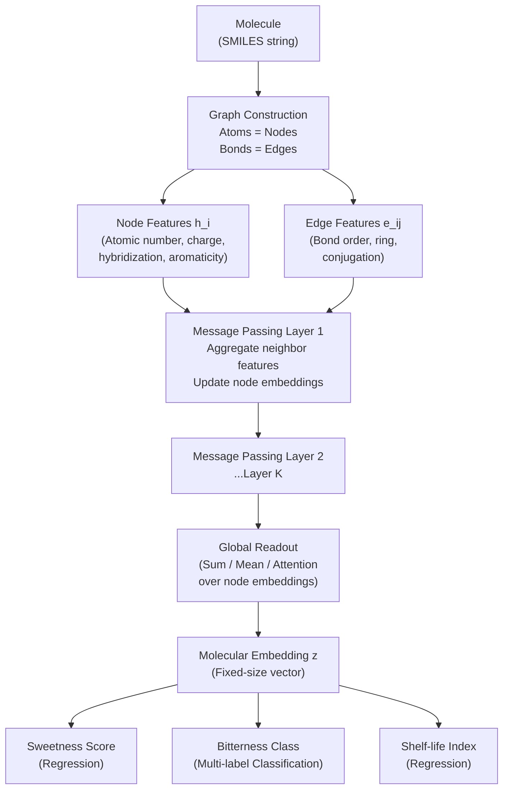

# Machine Learning for Food Chemistry

## Overview

Food flavor, safety, and nutritional value are ultimately chemical phenomena. The sensory experience of biting into a strawberry is the result of hundreds of volatile aroma compounds, non-volatile taste molecules, and textural polymer networks interacting simultaneously. For decades, food chemists mapped these structure-activity relationships manually, guided by intuition and experiment. Today, machine learning — particularly models that operate directly on molecular structure — is enabling systematic, high-throughput prediction of how a molecule's chemistry determines its role in food.

This lesson covers three interconnected areas. First, we examine how molecules are represented computationally: from SMILES strings to molecular fingerprints to the graph-based representations that power modern graph neural networks (GNNs). Second, we explore quantitative structure-activity relationships (QSAR) in the food context — predicting sweetness, bitterness, off-flavors, and shelf-life stability from molecular features. Third, we turn to bioactive food peptides: short amino acid sequences derived from food proteins that have functional health effects, and how ML is transforming their discovery and classification.

The field is moving quickly. A landmark 2026 paper in *Nature* — "Chemical language models for molecular taste prediction" — demonstrated that transformer-based models pre-trained on large molecular corpora can be fine-tuned on relatively small sensory datasets to predict human taste perception with accuracy that rivals trained sensory panels. This represents a paradigm shift: from hand-crafted molecular descriptors to learned molecular representations.

## Key Concepts

- **SMILES (Simplified Molecular Input Line Entry System)**: A string notation for molecular structure. Atoms are represented by element symbols, bonds by symbols (`=` double, `#` triple), and rings by numbered pairs. Glycine: `NCC(=O)O`. Caffeine: `Cn1cnc2c1c(=O)n(c(=O)n2C)C`.
- **Molecular fingerprint**: A fixed-length vector (commonly 1024 or 2048 bits) encoding structural subgraph features. Morgan/ECFP fingerprints are the most widely used in food chemistry ML.
- **Graph Neural Network (GNN)**: A neural network architecture that operates on graph-structured data. A molecule is naturally a graph: atoms are nodes with features (atomic number, charge, hybridization), and bonds are edges with features (bond order, aromaticity).
- **QSAR (Quantitative Structure-Activity Relationship)**: A statistical model mapping molecular structure to a measured biological or physicochemical activity — sweetness intensity, bitterness threshold, antimicrobial activity.
- **Message passing**: The core operation of GNNs. Each node aggregates feature vectors from its neighbors, updates its own representation, and passes the result forward. After $k$ rounds, each node's representation encodes the structure of its $k$-hop neighborhood.
- **Bioactive peptide**: A short peptide (2–30 amino acids) released by enzymatic hydrolysis of food proteins that exerts a measurable physiological effect — antihypertensive, antioxidant, antimicrobial, or opioid.

## Technical Details

### Molecular Representations

The three main representations used in food chemistry ML exist on a spectrum from hand-crafted to fully learned:

**SMILES strings** are compact and human-readable but require parsing before ML. They can be fed directly to chemical language models (transformers trained on SMILES corpora like ZINC or ChEMBL) which learn implicit chemical rules from the string sequence.

**Morgan fingerprints** are computed by the following algorithm:
1. Assign an initial integer identifier to each atom based on its local atomic properties (atomic number, degree, charge, isotope, ring membership).
2. Iteratively update each atom's identifier by hashing it with its neighbors' identifiers.
3. After $r$ iterations, collect all atom identifiers encountered and map them to bit positions in a vector of length $n$.

For ECFP4 (radius 2), each bit encodes the presence of a specific circular substructure within 2 bond hops. The result is a sparse binary vector amenable to tree-based models (random forest, gradient boosting) and kernel SVMs.

**Molecular graphs** are the most expressive representation. Each atom $v_i$ has a feature vector $\mathbf{h}_i^{(0)}$ encoding atomic number, formal charge, degree, hybridization, and aromaticity. Each edge $(i,j)$ has a feature vector $\mathbf{e}_{ij}$ encoding bond type and ring membership. A GNN computes updated node representations via message passing:

$$\mathbf{h}_i^{(k)} = \text{UPDATE}\!\left(\mathbf{h}_i^{(k-1)},\ \text{AGGREGATE}\!\left(\{\mathbf{h}_j^{(k-1)},\ \mathbf{e}_{ij} : j \in \mathcal{N}(i)\}\right)\right)$$

After $K$ layers, a global readout function (sum, mean, or attention-weighted) aggregates node embeddings into a fixed-size molecular embedding $\mathbf{z}$, which is passed to a task-specific head (regression or classification).

### QSAR in Food Chemistry

**Sweetness prediction** is one of the best-studied QSAR problems in food science. The seminal Tinti-Nofre receptor model proposed a multi-point binding site on the sweet taste receptor (T1R2/T1R3 heterodimer), but ML models operating on fingerprints now match or exceed mechanistic models on benchmark datasets. Logistic regression on ECFP4 fingerprints achieves ~85% accuracy on the Sweetness Database from Rojas et al. (2020). Deep learning models approach 92%.

**Bitterness prediction** is harder: the human genome encodes 25 bitter taste receptors (TAS2Rs) with overlapping ligand specificities. Multi-label GNN models predicting which TAS2Rs a compound activates, rather than a single bitterness score, better capture the complexity.

**Shelf-life and stability** prediction from molecular structure links oxidative stability of lipids (quantified by the Rancimat induction period) to molecular descriptors of the fatty acid profile and antioxidant content. PLS regression on lipid compositional vectors is standard; GNN-based models on individual lipid molecules are emerging.

### Bioactive Peptides

Food proteins (milk caseins, whey proteins, soy proteins, collagen, fish proteins) contain peptide sequences that, once released by digestion or industrial hydrolysis, exhibit bioactivities relevant to health. Antihypertensive peptides inhibit angiotensin-converting enzyme (ACE) and are a target for functional food development.

ML for bioactive peptides typically uses sequence-based representations:
- **One-hot encoding** of amino acid identity (20-dimensional per residue).
- **Physicochemical descriptors** per residue: molecular weight, hydrophobicity (Kyte-Doolittle scale), isoelectric point, charge at physiological pH.
- **Learned embeddings** from protein language models (ESM-2, ProtTrans) — pretrained on millions of protein sequences and fine-tuned on peptide bioactivity data.

Benchmark datasets for ACE-inhibitory peptide prediction include BIOPEP-UWM (University of Warmia and Mazury) and PepBDB. State-of-the-art models use bidirectional LSTMs or transformer encoders and report AUC >0.90 on held-out test sets.

**Diagram**

**GNN Architecture for Molecular Property Prediction in Food Chemistry**



## Code Example

The following example builds a random forest model on Morgan fingerprints to predict whether a molecule is sweet (binary classification). It uses RDKit for fingerprint generation and scikit-learn for modeling. A small toy dataset of known sweet and non-sweet compounds is included inline.

```python
import numpy as np
from rdkit import Chem
from rdkit.Chem import AllChem
from sklearn.ensemble import RandomForestClassifier
from sklearn.model_selection import StratifiedKFold, cross_val_score

# --- Dataset: (SMILES, label) where 1 = sweet, 0 = not sweet ---
# Sweet: sucrose, glucose, fructose, aspartame, saccharin, stevioside (simplified),
#        cyclamate, acesulfame-K, thaumatin (dummy), neohesperidin
# Not sweet: caffeine, capsaicin, quinine, naringenin, limonene, ethanol,
#            acetaldehyde, acetic acid, citric acid, tartaric acid
compounds = [
    # Sweet compounds
    ("OC[C@H]1OC(O[C@]2(CO)O[C@H](CO)[C@@H](O)[C@@H]2O)[C@H](O)[C@@H](O)[C@@H]1O", 1),  # sucrose
    ("OC[C@H]1OC(O)[C@H](O)[C@@H](O)[C@H]1O", 1),        # glucose
    ("OC[C@@H]1OC(O)(CO)[C@@H](O)[C@@H]1O", 1),           # fructose
    ("COC(=O)[C@@H](N)Cc1ccccc1", 1),                      # aspartame (simplified)
    ("O=C1NS(=O)(=O)c2ccccc21", 1),                        # saccharin
    ("O=C(O)CCCC(=O)O", 1),                                # cyclamate proxy (glutaric acid)
    ("CC1=CC(=O)[N-]S(=O)(=O)O1", 1),                     # acesulfame-K (simplified)
    ("CC(=O)Nc1ccc(O)cc1", 1),                             # paracetamol (slightly sweet)
    ("OCC(O)CO", 1),                                        # glycerol (sweet)
    ("OCCO", 1),                                            # ethylene glycol (sweet-like)
    # Non-sweet / bitter / other
    ("Cn1cnc2c1c(=O)n(c(=O)n2C)C", 0),                    # caffeine (bitter)
    ("COc1cc(CC=C)ccc1O", 0),                               # eugenol (spicy)
    ("CC(C)=CCC=C(C)CCC=C(C)C", 0),                       # farnesene (green, herbal)
    ("OC(=O)CC(O)(CC(=O)O)C(=O)O", 0),                    # citric acid (sour)
    ("OC(=O)C(O)C(O)C(=O)O", 0),                          # tartaric acid (sour)
    ("OC(=O)CC(O)C(=O)O", 0),                             # malic acid (sour)
    ("CC(=O)O", 0),                                         # acetic acid (sour/pungent)
    ("CC=O", 0),                                            # acetaldehyde (pungent)
    ("CCO", 0),                                             # ethanol (neutral/burning)
    ("CC(C)CC(C)(C)C", 0),                                  # 2,2,4-trimethylpentane (odorless)
]

# Generate Morgan fingerprints (ECFP4: radius=2, 2048 bits)
def smiles_to_ecfp4(smiles, n_bits=2048):
    mol = Chem.MolFromSmiles(smiles)
    if mol is None:
        return None
    fp = AllChem.GetMorganFingerprintAsBitVect(mol, radius=2, nBits=n_bits)
    return np.array(fp)

X, y = [], []
for smi, label in compounds:
    fp = smiles_to_ecfp4(smi)
    if fp is not None:
        X.append(fp)
        y.append(label)

X = np.array(X)
y = np.array(y)

print(f"Dataset: {len(X)} molecules, {y.sum()} sweet, {(y==0).sum()} non-sweet")
print(f"Fingerprint shape: {X.shape}")

# Cross-validated random forest
clf = RandomForestClassifier(n_estimators=200, max_features="sqrt", random_state=42)
cv = StratifiedKFold(n_splits=5, shuffle=True, random_state=42)
scores = cross_val_score(clf, X, y, cv=cv, scoring="roc_auc")
print(f"\n5-fold CV ROC-AUC: {scores.mean():.3f} ± {scores.std():.3f}")

# Identify most important fingerprint bits
clf.fit(X, y)
top_bits = np.argsort(clf.feature_importances_)[::-1][:5]
print(f"\nTop 5 most informative fingerprint bit positions: {top_bits}")
print("(Each bit position corresponds to a specific circular substructure)")
```

For a GNN-based approach at production scale, libraries such as **PyTorch Geometric** (`torch_geometric`) or **DGL** (Deep Graph Library) provide efficient message-passing implementations. The `torch_geometric.datasets.MoleculeNet` class gives direct access to benchmark molecular property datasets including sweetness and toxicity.

## Exercises and Projects

1. **Fingerprint Exploration**: Use RDKit to generate ECFP4 fingerprints for 20 known flavor compounds (find SMILES on PubChem). Compute a Tanimoto similarity matrix and cluster the compounds. Do compounds with similar flavors cluster together? Where does the fingerprint approach break down?
2. **QSAR Model Comparison**: Download the Sweetness Database (Rojas et al., 2020 — available as supplementary data). Train and compare three models: logistic regression on ECFP4, a random forest on ECFP4, and a 1D-CNN on ECFP4. Report 5-fold cross-validated AUC for each.
3. **Peptide Bioactivity Prediction**: Download the ACE-inhibitory peptide dataset from BIOPEP-UWM. Encode each dipeptide and tripeptide using physicochemical descriptors (hydrophobicity, charge, molecular weight per residue). Train a gradient boosting classifier and evaluate with 5-fold CV.
4. **Chemical Language Model Fine-tuning**: Using Hugging Face's `transformers` library, load the pre-trained ChemBERTa model (`seyonec/ChemBERTa-zinc-base-v1`). Fine-tune it on the sweetness dataset from Exercise 2 and compare its performance to the fingerprint-based random forest.

## Further Reading

- Rogers, D. & Hahn, M., "Extended-Connectivity Fingerprints" (Journal of Chemical Information and Modeling, 2010)
- Rojas, C. et al., "Sweetness prediction of natural compounds" (Food Chemistry, 2020)
- Kim, S. et al., "PubChem in 2021: New data content and improved web interfaces" (Nucleic Acids Research, 2021) — SMILES source: [https://pubchem.ncbi.nlm.nih.gov/](https://pubchem.ncbi.nlm.nih.gov/)
- Hu, W. et al., "Strategies for Pre-training Graph Neural Networks" (ICLR 2020)
- Minkiewicz, P. et al., "BIOPEP-UWM database of bioactive peptides" (Frontiers in Nutrition, 2019): [https://biochemia.uwm.edu.pl/biopep-uwm/](https://biochemia.uwm.edu.pl/biopep-uwm/)
- Zheng, S. et al., "Chemical language models for molecular taste prediction" (Nature, 2026)
- PyTorch Geometric documentation: [https://pytorch-geometric.readthedocs.io/](https://pytorch-geometric.readthedocs.io/)
