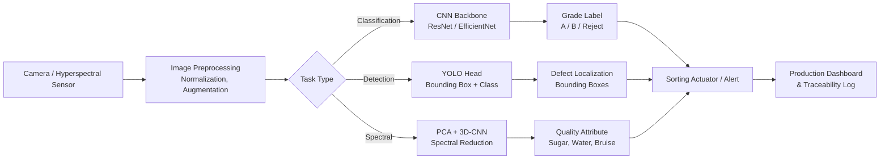

# Computer Vision for Food Quality Inspection

## Overview

Food quality inspection has historically depended on trained human graders — experts who visually assess color, size, shape, and surface defects on a production line. This approach is slow, expensive, inconsistent across shifts, and increasingly untenable as throughput demands rise. Computer vision now enables automated inspection systems that operate at line speed (hundreds of items per minute), with sub-millimeter precision and consistent grading 24/7.

Modern food CV systems address a range of tasks: detecting bruises on apples, grading marbling in beef cuts, classifying the rise and crust color of bread loaves, sorting shrimp by size, and flagging foreign objects embedded in processed food. Each task demands different spatial resolutions, spectral sensitivities, and latency budgets. The field has evolved from classical image processing (edge detection, color histograms) through shallow ML (SVM on handcrafted features) to deep learning, where convolutional neural networks learn hierarchical visual representations directly from labeled images.

The key challenge that distinguishes food CV from general object recognition is **domain shift**: the same apple photographed under incandescent versus LED lighting, against a white versus stainless-steel background, wet versus dry, can look entirely different to a model trained on a fixed distribution. Handling this requires careful data augmentation, domain randomization, and ideally multi-spectral imaging that encodes information independent of visible-light variability.

## Key Concepts

- **CNN Architectures**: ResNet introduces residual (skip) connections that allow gradients to flow through very deep networks, making 50–152-layer models trainable. EfficientNet uses a compound scaling method to jointly scale depth, width, and resolution, achieving better accuracy-per-FLOP than ResNet on food image benchmarks. Both serve as standard backbones for food classification and grading.
- **YOLO (You Only Look Once)**: A single-pass object detection framework that divides the image into a grid and predicts bounding boxes and class probabilities in one forward pass. YOLOv8 and later variants run at 30–120 FPS on GPU, enabling real-time conveyor-belt inspection.
- **Hyperspectral Imaging**: Captures dozens to hundreds of narrow spectral bands beyond RGB (400–2500 nm). Spatial features reveal surface texture; spectral features encode chemical composition — enabling detection of bruising, disease, or contamination invisible to RGB cameras.
- **Edge Inference**: Deploying trained models on embedded hardware (NVIDIA Jetson, Google Coral, Apple Neural Engine) co-located with the inspection point. Reduces latency to <10 ms and eliminates cloud data transfer of sensitive production footage.
- **Domain Shift**: The degradation in model performance caused by distribution mismatch between training data and deployment conditions (lighting variation, background clutter, seasonal appearance changes in produce).
- **Transfer Learning**: Using weights pretrained on ImageNet (or food-specific datasets) as initialization, then fine-tuning on a smaller domain-specific dataset. Typically reaches production-quality accuracy with 1,000–10,000 labeled food images rather than millions.

## Technical Details

### CNN Backbone Selection

For a **classification task** (e.g., "Grade A / Grade B / Reject" for tomatoes), EfficientNet-B3 or ResNet-50 fine-tuned on a labeled dataset of ~5,000 images per class typically achieves >95% accuracy in controlled lighting conditions. The choice between them depends on hardware constraints: EfficientNet is more parameter-efficient; ResNet has more mature deployment tooling.

For **real-time detection** (locate and classify multiple items simultaneously on a moving belt), YOLOv8n or YOLOv8s provides the best latency–accuracy tradeoff at inference resolutions of 640×640 pixels.

### Hyperspectral Pipeline

A hyperspectral cube $\mathbf{H} \in \mathbb{R}^{H \times W \times \lambda}$ combines spatial dimensions $(H, W)$ with $\lambda$ spectral channels. Principal Component Analysis reduces the spectral dimension:

$$\mathbf{H}_{reduced} = \mathbf{H} \cdot \mathbf{V}_k$$

where $\mathbf{V}_k$ contains the top $k$ eigenvectors of the spectral covariance matrix. The reduced cube is then passed to a 3D-CNN or a 2D-CNN operating on selected spectral bands chosen by domain experts (e.g., 970 nm for water content, 1450 nm for sugar).

### Edge Deployment

NVIDIA Jetson Orin NX (16 GB) can run YOLOv8m at ~60 FPS at 640×640. Quantizing the model to INT8 using TensorRT reduces latency by 2–4× with <1% accuracy drop, enabling throughputs matching industrial belt speeds of 0.5–1.5 m/s.

**Mermaid diagram — Food Quality Inspection Pipeline:**



## Code Example

YOLOv8 fine-tuning and inference for real-time fruit defect detection:

```python
from ultralytics import YOLO
import cv2
import numpy as np

# --- Training ---
# Load a pretrained YOLOv8 small model
model = YOLO("yolov8s.pt")

# Fine-tune on a custom food dataset
# dataset.yaml defines: path, train, val, nc (num classes), names
results = model.train(
    data="food_defects.yaml",   # dataset config
    epochs=50,
    imgsz=640,
    batch=16,
    device="cuda",              # or "mps" on Apple Silicon
    augment=True,               # mosaic, fliplr, hsv jitter
    project="food_inspection",
    name="yolov8s_fruit_v1",
)

# --- Export for Edge Deployment ---
model.export(format="engine", half=True)  # TensorRT FP16 for Jetson

# --- Real-Time Inference on Conveyor Belt Stream ---
deployed_model = YOLO("food_inspection/yolov8s_fruit_v1/weights/best.engine")

cap = cv2.VideoCapture(0)  # belt camera feed

CLASS_NAMES = ["Grade_A", "Grade_B", "Bruise", "Rot", "Foreign_Object"]
REJECT_CLASSES = {"Bruise", "Rot", "Foreign_Object"}

while cap.isOpened():
    ret, frame = cap.read()
    if not ret:
        break

    detections = deployed_model(frame, conf=0.45, verbose=False)[0]

    for box in detections.boxes:
        cls_id = int(box.cls[0])
        conf   = float(box.conf[0])
        label  = CLASS_NAMES[cls_id]
        x1, y1, x2, y2 = map(int, box.xyxy[0])

        color = (0, 0, 255) if label in REJECT_CLASSES else (0, 200, 0)
        cv2.rectangle(frame, (x1, y1), (x2, y2), color, 2)
        cv2.putText(frame, f"{label} {conf:.2f}",
                    (x1, y1 - 8), cv2.FONT_HERSHEY_SIMPLEX, 0.6, color, 2)

        if label in REJECT_CLASSES:
            trigger_reject_actuator(item_id=detections.path)

    cv2.imshow("Food Inspection", frame)
    if cv2.waitKey(1) & 0xFF == ord("q"):
        break

cap.release()
cv2.destroyAllWindows()
```

## Exercises and Projects

1. **Fruit Grading Pipeline**: Download the Fruits-360 dataset (131 classes, ~90,000 images). Fine-tune EfficientNet-B0 on a 5-class subset (apple grades + reject). Measure accuracy, confusion matrix, and inference latency on CPU vs. GPU.
2. **Defect Detection with YOLO**: Annotate 200 images of bread loaves with bounding boxes around burn marks, cracks, and underbaking. Train YOLOv8n and evaluate mAP@0.5. Compare with a ResNet-50 classification baseline.
3. **Domain Shift Experiment**: Train a strawberry quality classifier on images taken under standard lighting. Test it on images taken under different lighting (fluorescent vs. LED vs. natural). Quantify accuracy drop and then apply domain randomization during training to recover performance.
4. **Edge Deployment**: Export a trained YOLOv8 model to ONNX and run it with ONNX Runtime on a laptop CPU. Measure throughput (items/second) and compare to GPU inference.

## Further Reading

- Ultralytics YOLOv8 Documentation: https://docs.ultralytics.com
- Fruits-360 Dataset (Kaggle): https://www.kaggle.com/datasets/moltean/fruits
- Food-101 Dataset: https://data.vision.ee.ethz.ch/cvl/datasets_extra/food-101/
- Lorente et al., "Recent Advances and Applications of Hyperspectral Imaging for Fruit and Vegetable Quality Assessment", *Food and Bioprocess Technology*, 2012
- Mahawar & Jalgaonkar, "Machine Vision Systems for Quality Grading of Fruits and Vegetables", *Journal of Food Science and Technology*, 2023
- NVIDIA Jetson for Edge AI: https://developer.nvidia.com/embedded/jetson-modules
