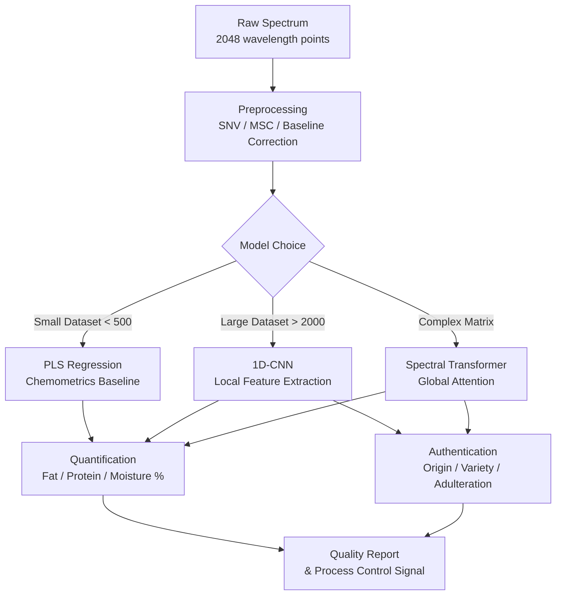

# Spectroscopic Analysis with Deep Learning

## Overview

Every food product carries a chemical fingerprint. Shine the right wavelength of light at a sample and the reflected or transmitted spectrum encodes fat content, moisture, protein concentration, sugar levels, and adulteration markers — all without destroying the sample, adding reagents, or even touching it. This is the promise of **vibrational spectroscopy**: near-infrared (NIR), mid-infrared (MIR), and Raman techniques that have become workhorses of food quality laboratories for decades.

The traditional workflow is slow: collect a spectrum, export a CSV, run a PLS regression model in MATLAB, interpret the loadings against a reference library. The 2025 inflection point in the field is the convergence of **miniaturized handheld spectrometers** (some costing under $500) and **deep learning models** that can process raw spectral data end-to-end. A winery worker can now point a pocket-sized NIR device at a grape cluster and receive an instant Brix reading from a neural network running on their phone. A grain elevator operator can authenticate wheat variety and detect mycotoxin risk at the intake hopper with no laboratory delay.

This lesson covers the spectroscopic principles, the classical chemometrics baseline, and the deep learning architectures — 1D-CNNs and transformers — that are replacing it for both quantification and authentication tasks.

## Key Concepts

- **Near-Infrared Spectroscopy (NIR)**: Measures overtone and combination bands of O–H, N–H, and C–H bonds in the 780–2500 nm region. Excellent for moisture, fat, protein, and sugar quantification. Minimal sample preparation required; amenable to online process monitoring.
- **Mid-Infrared Spectroscopy (MIR)**: Measures fundamental molecular vibrations (4000–400 cm⁻¹). Provides richer chemical information than NIR but is more sensitive to water absorption, requiring attenuated total reflectance (ATR) accessories for liquid foods.
- **Raman Spectroscopy**: Measures inelastic light scattering; complementary to MIR (active modes differ). Excellent for aqueous samples because water is a weak Raman scatterer. Applied to olive oil adulteration detection, fish freshness, and packaging contamination.
- **Chemometrics**: The classical statistical toolkit for spectral data. PCA reduces hundreds of collinear wavelength variables to a small number of orthogonal principal components. PLSR (Partial Least Squares Regression) builds a regression model by finding latent variables that maximize covariance between spectral and reference data.
- **1D-CNN for Spectra**: Treats the spectrum as a 1D signal and applies convolutional filters of varying kernel widths to extract local spectral features (peak shapes, shoulder patterns), then global average pooling and dense layers for prediction.
- **Spectral Transformer**: Applies self-attention across spectral wavelength positions, learning long-range dependencies between absorption bands. Particularly effective for complex matrices where multiple overlapping peaks interact.
- **Food Authentication**: Verifying declared origin, variety, or composition. Classic tasks: detecting extra-virgin olive oil adulteration with sunflower oil, classifying honey botanical origin, verifying geographic PDO claims for cheese or wine.

## Technical Details

### Classical Chemometrics Baseline

Given a spectral matrix $\mathbf{X} \in \mathbb{R}^{n \times p}$ ($n$ samples, $p$ wavelengths) and reference values $\mathbf{y} \in \mathbb{R}^n$, PLS finds $k$ latent variables by maximizing the covariance between $\mathbf{X}$ and $\mathbf{y}$. The optimal number of components $k$ is chosen by cross-validation to minimize the Root Mean Square Error of Cross Validation (RMSECV):

$$\text{RMSECV} = \sqrt{\frac{1}{n} \sum_{i=1}^{n} (\hat{y}_i^{(-i)} - y_i)^2}$$

where $\hat{y}_i^{(-i)}$ is the prediction for sample $i$ when it is left out of training. PLSR remains the gold standard for small datasets (<500 samples) and is required for regulatory submissions in grain trading.

### 1D-CNN Architecture

A 1D-CNN for spectral data treats wavelength channels as the temporal dimension. A typical architecture:

- **Input**: $(B, 1, \lambda)$ where $B$ is batch size and $\lambda$ is number of wavelength points (e.g., 2048 for NIR)
- **Conv blocks**: 3–5 blocks of `Conv1d → BatchNorm → ReLU → MaxPool1d`, with increasing filter counts (32 → 64 → 128) and decreasing kernel sizes (21 → 11 → 5)
- **Global Average Pooling**: Collapses the spectral dimension to a fixed-length vector regardless of input length
- **Head**: Dense(256) → Dropout(0.3) → Dense(num_classes) for classification, or Dense(1) for regression

The receptive field of stacked convolutions must be large enough to capture full absorption peaks. For NIR, peaks span 20–100 nm, so kernel sizes of 11–21 data points (at 2 nm resolution) are appropriate.

**Mermaid diagram — Spectral Analysis with Deep Learning:**



### Spectral Preprocessing

Raw spectra are corrupted by scattering artefacts from particle size variation. Standard preprocessing steps applied before modeling:

- **SNV (Standard Normal Variate)**: Centers and scales each spectrum individually — $x_{snv} = (x - \bar{x}) / \sigma_x$
- **MSC (Multiplicative Scatter Correction)**: Regresses each spectrum against a reference (mean) spectrum, removing additive and multiplicative scatter
- **Savitzky-Golay derivative**: Sharpens peaks and removes baseline drift; first derivative emphasizes peak positions, second derivative resolves overlapping peaks

## Code Example

1D-CNN for food authentication from NIR spectra (classifying olive oil adulteration level):

```python
import torch
import torch.nn as nn
import torch.optim as optim
from torch.utils.data import DataLoader, TensorDataset
import numpy as np
from sklearn.preprocessing import StandardScaler
from sklearn.model_selection import train_test_split

# --- Spectral Preprocessing ---
def standard_normal_variate(X: np.ndarray) -> np.ndarray:
    """Apply SNV to each spectrum (row) independently."""
    mean = X.mean(axis=1, keepdims=True)
    std  = X.std(axis=1, keepdims=True)
    return (X - mean) / (std + 1e-8)

# --- 1D-CNN Model ---
class SpectralCNN(nn.Module):
    def __init__(self, n_wavelengths: int, n_classes: int):
        super().__init__()
        self.features = nn.Sequential(
            nn.Conv1d(1, 32, kernel_size=21, padding=10),
            nn.BatchNorm1d(32),
            nn.ReLU(),
            nn.MaxPool1d(2),

            nn.Conv1d(32, 64, kernel_size=11, padding=5),
            nn.BatchNorm1d(64),
            nn.ReLU(),
            nn.MaxPool1d(2),

            nn.Conv1d(64, 128, kernel_size=5, padding=2),
            nn.BatchNorm1d(128),
            nn.ReLU(),
            nn.AdaptiveAvgPool1d(1),  # Global average pooling
        )
        self.classifier = nn.Sequential(
            nn.Flatten(),
            nn.Linear(128, 256),
            nn.ReLU(),
            nn.Dropout(0.3),
            nn.Linear(256, n_classes),
        )

    def forward(self, x: torch.Tensor) -> torch.Tensor:
        # x shape: (batch, 1, n_wavelengths)
        return self.classifier(self.features(x))

# --- Training Pipeline ---
def train_spectral_classifier(
    X_raw: np.ndarray,    # shape (n_samples, n_wavelengths)
    y: np.ndarray,        # integer class labels
    n_classes: int = 4,   # e.g. pure, 5%, 10%, 20% adulteration
    epochs: int = 80,
    lr: float = 1e-3,
):
    # Preprocess
    X = standard_normal_variate(X_raw)
    X_train, X_val, y_train, y_val = train_test_split(
        X, y, test_size=0.2, stratify=y, random_state=42
    )

    # Convert to tensors — add channel dim for Conv1d
    to_tensor = lambda a: torch.tensor(a, dtype=torch.float32)
    X_tr = to_tensor(X_train).unsqueeze(1)
    X_v  = to_tensor(X_val).unsqueeze(1)
    y_tr = torch.tensor(y_train, dtype=torch.long)
    y_v  = torch.tensor(y_val,   dtype=torch.long)

    train_loader = DataLoader(TensorDataset(X_tr, y_tr), batch_size=32, shuffle=True)
    val_loader   = DataLoader(TensorDataset(X_v, y_v),   batch_size=64)

    device = "cuda" if torch.cuda.is_available() else "cpu"
    model  = SpectralCNN(n_wavelengths=X_raw.shape[1], n_classes=n_classes).to(device)
    opt    = optim.AdamW(model.parameters(), lr=lr, weight_decay=1e-4)
    loss_fn = nn.CrossEntropyLoss()

    for epoch in range(1, epochs + 1):
        model.train()
        for xb, yb in train_loader:
            xb, yb = xb.to(device), yb.to(device)
            loss = loss_fn(model(xb), yb)
            opt.zero_grad(); loss.backward(); opt.step()

        if epoch % 10 == 0:
            model.eval()
            correct = 0
            with torch.no_grad():
                for xb, yb in val_loader:
                    preds = model(xb.to(device)).argmax(1)
                    correct += (preds.cpu() == yb).sum().item()
            acc = correct / len(y_val)
            print(f"Epoch {epoch:3d} | Val Accuracy: {acc:.3f}")

    return model
```

## Exercises and Projects

1. **PLSR Baseline**: Using the publicly available wheat NIR dataset from the `sklearn` extras or a Kaggle NIR dataset, fit a PLSR model to predict protein content. Plot RMSECV vs. number of components and identify the optimal model.
2. **1D-CNN vs. PLSR Comparison**: Train the `SpectralCNN` above on the same dataset. Compare RMSEP (Root Mean Square Error of Prediction) on a held-out test set. Under what dataset size does PLSR outperform 1D-CNN?
3. **Preprocessing Ablation**: Train three 1D-CNN models on raw spectra, SNV-preprocessed spectra, and first-derivative spectra. Compare validation accuracy and training stability. Visualize the learned first-layer filters.
4. **Adulteration Detection**: Find or simulate NIR spectra of pure olive oil mixed with sunflower oil at 0%, 5%, 10%, 20%, 50% levels. Build both a classification model (pure vs. adulterated) and a regression model (predict adulteration percentage) using the 1D-CNN architecture.

## Further Reading

- Williams & Norris (eds.), *Near-Infrared Technology in the Agricultural and Food Industries*, 2nd ed., AACC, 2001
- Mishra et al., "Deep Chemometrics: Validation and Transfer of a Global Deep Near-Infrared Fruit Model to Smartphones", *Journal of Chemometrics*, 2022
- Acquarelli et al., "Convolutional Neural Networks for Vibrational Spectroscopic Data Analysis", *Analytica Chimica Acta*, 2017
- Chen et al., "Transformer-Based Deep Learning for Spectral Classification", *Food Chemistry*, 2024
- Consumer Physics SCiO Sensor: https://www.consumerphysics.com
- Special Issue: "AI Turning Point for Vibrational Spectroscopy" — *TrAC Trends in Analytical Chemistry*, 2025
