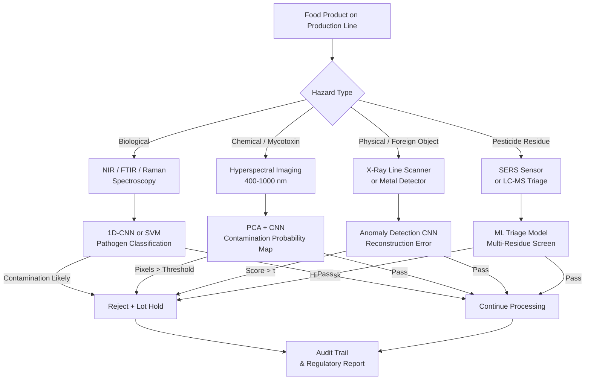

# AI for Food Safety Inspection and Contamination Detection

## Overview

A single contamination incident can kill people, trigger multi-country recalls, and erase a brand built over decades. The 2011 German EHEC outbreak (contaminated fenugreek sprouts, 53 deaths), the 2008 Chinese melamine milk scandal (six infant deaths, 300,000 affected), and recurring Salmonella outbreaks in peanut butter and leafy greens illustrate the catastrophic consequences of failed food safety systems. Regulatory bodies — the FDA in the United States, EFSA in Europe — mandate Hazard Analysis and Critical Control Points (HACCP) frameworks, but traditional inspection methods struggle to keep pace with modern processing volumes and the diversity of hazards.

Food hazards are classified into three categories: **biological** (bacteria, viruses, parasites), **chemical** (mycotoxins, pesticide residues, heavy metals, allergens), and **physical** (glass, metal fragments, bone, plastic). Each demands different detection modalities, and each has seen rapid AI integration in the 2020s — accelerating further in 2025–2026 as miniaturized sensors and real-time edge ML converge.

This lesson maps each hazard category to its primary detection technologies, explains how ML models are integrated into each pipeline, and addresses the regulatory context that shapes how AI tools can be deployed in certified food production.

## Key Concepts

- **Biological Hazards**: Pathogens such as *Salmonella*, *Listeria monocytogenes*, *E. coli* O157:H7, and norovirus. Traditional culture-based methods take 24–72 hours. ML-accelerated spectroscopic methods (NIR, Raman, FTIR + classification models) achieve preliminary screening in minutes.
- **Mycotoxins**: Secondary metabolites produced by molds (*Aspergillus*, *Fusarium*, *Penicillium*) — including aflatoxins, fumonisins, deoxynivalenol (DON). Occur in grains, nuts, spices, and dried fruits. Regulated at ppb levels. Hyperspectral imaging + CNN is the leading AI approach for grain-level screening; 2026 research demonstrates real-time mycotoxin prediction at conveyor speed.
- **Pesticide Residues**: Surface residues on fresh produce detectable with SERS (Surface-Enhanced Raman Spectroscopy) combined with ML classification. Multi-residue panels (>100 compounds) require chromatography (GC-MS/LC-MS) as confirmation — AI accelerates sample triage.
- **Foreign Object Detection (FOD)**: Physical contaminants embedded in food products. X-ray line scanners are the industry standard; CNN-based anomaly detection distinguishes foreign objects from expected product texture variations (bones in chicken, pits in olives) with false-positive rates <0.1%.
- **Transfer Learning for Limited Data**: Contamination events are rare, so labeled datasets for defect classes are small. Transfer learning from large image datasets (ImageNet, Food-101) or pretrained spectral models provides a strong initialization that converges with as few as 100–500 contamination examples.
- **Smart Monitoring Systems**: IoT sensors (temperature, humidity, CO₂, ethylene) integrated with ML anomaly detection to flag conditions conducive to microbial growth or mycotoxin production in storage and processing environments.
- **Regulatory AI Guidelines**: FDA's Digital Health Center of Excellence (DHCoE) and EFSA's 2024 "Guidance on the Use of Artificial Intelligence in Scientific Assessments" define requirements for AI validation, model documentation, and audit trails in safety-critical food applications.

## Technical Details

### Pathogen Detection via Spectroscopy + ML

Culture-free rapid detection relies on the principle that bacterial contamination changes the spectral signature of a food matrix. FTIR spectra of contaminated vs. clean chicken breast differ in amide I/II bands (1600–1700 cm⁻¹) and carbohydrate regions (1000–1200 cm⁻¹). A support vector machine or 1D-CNN trained on these spectral differences achieves sensitivity >90% for *Salmonella* at $10^4$ CFU/g in controlled studies. Combining with principal component analysis reduces the spectral dimension from 3000+ wavenumbers to 20–50 components before classification.

### Mycotoxin Detection with Hyperspectral Imaging

Aflatoxin B1 (AFB1) in maize is regulated at 2 ppb (EU) and 20 ppb (US). Hyperspectral imaging in the 400–1000 nm (VNIR) range captures fluorescence and reflectance changes associated with mold growth. A classification pipeline:

1. **Acquire**: hyperspectral cube $\mathbf{H} \in \mathbb{R}^{H \times W \times \lambda}$ at 640×480 spatial, 256 spectral bands
2. **Reduce**: PCA to retain 10–15 components explaining >99% variance
3. **Classify**: pixel-level CNN or Random Forest to produce a contamination probability map
4. **Threshold**: flag kernels with mean probability > 0.7 as contaminated

Sensitivity reaches 95–98% for aflatoxin levels above 10 ppb in published studies; 2025–2026 work pushes toward continuous belt operation at grain handling speeds.

### X-Ray Foreign Object Detection

X-ray transmission imaging is the mature industrial standard. A CNN (typically ResNet-18 or a lightweight custom architecture) is trained to classify $128 \times 128$ px patches of the X-ray image as "normal product" or "foreign object". Challenging cases include:

- Bone fragments in deboned poultry (density close to meat)
- Glass shards with density similar to dense sauce components
- Thin rubber gaskets in bagged produce

Anomaly detection approaches (autoencoders, PatchCore) are preferred when labeled contamination data is scarce: the model learns the distribution of "normal" X-ray texture and flags deviations exceeding a learned threshold $\tau$.

Formally, for an autoencoder with encoder $f$ and decoder $g$, the anomaly score for an image patch $\mathbf{x}$ is:

$$s(\mathbf{x}) = \| \mathbf{x} - g(f(\mathbf{x})) \|_2^2$$

Patches with $s(\mathbf{x}) > \tau$ (chosen at the operating point on the ROC curve) trigger rejection.

**Mermaid diagram — AI Food Safety Inspection System:**



## Code Example

Autoencoder-based anomaly detection for X-ray foreign object inspection:

```python
import torch
import torch.nn as nn
import torch.optim as optim
from torch.utils.data import DataLoader, Dataset
import torchvision.transforms as T
from PIL import Image
import numpy as np
import os

# --- Convolutional Autoencoder ---
class XRayAutoencoder(nn.Module):
    def __init__(self):
        super().__init__()
        # Encoder: 1×128×128 → latent 64×8×8
        self.encoder = nn.Sequential(
            nn.Conv2d(1, 16, 3, stride=2, padding=1),  # 64×64
            nn.ReLU(),
            nn.Conv2d(16, 32, 3, stride=2, padding=1), # 32×32
            nn.ReLU(),
            nn.Conv2d(32, 64, 3, stride=2, padding=1), # 16×16
            nn.ReLU(),
            nn.Conv2d(64, 64, 3, stride=2, padding=1), # 8×8
            nn.ReLU(),
        )
        # Decoder: 64×8×8 → 1×128×128
        self.decoder = nn.Sequential(
            nn.ConvTranspose2d(64, 64, 3, stride=2, padding=1, output_padding=1),
            nn.ReLU(),
            nn.ConvTranspose2d(64, 32, 3, stride=2, padding=1, output_padding=1),
            nn.ReLU(),
            nn.ConvTranspose2d(32, 16, 3, stride=2, padding=1, output_padding=1),
            nn.ReLU(),
            nn.ConvTranspose2d(16, 1,  3, stride=2, padding=1, output_padding=1),
            nn.Sigmoid(),
        )

    def forward(self, x):
        return self.decoder(self.encoder(x))

# --- Anomaly Scoring ---
def compute_anomaly_scores(
    model: nn.Module,
    loader: DataLoader,
    device: str = "cpu",
) -> np.ndarray:
    model.eval()
    scores = []
    with torch.no_grad():
        for (x,) in loader:
            x = x.to(device)
            x_hat = model(x)
            # Per-image MSE reconstruction error
            mse = ((x - x_hat) ** 2).mean(dim=[1, 2, 3])
            scores.extend(mse.cpu().numpy())
    return np.array(scores)

# --- Training on Normal (Clean) X-Ray Images ---
def train_autoencoder(normal_image_dir: str, epochs: int = 40) -> nn.Module:
    transform = T.Compose([
        T.Grayscale(),
        T.Resize((128, 128)),
        T.ToTensor(),
    ])

    class NormalDataset(Dataset):
        def __init__(self, root, transform):
            self.paths = [
                os.path.join(root, f) for f in os.listdir(root)
                if f.endswith((".png", ".jpg", ".tif"))
            ]
            self.transform = transform

        def __len__(self): return len(self.paths)
        def __getitem__(self, i):
            return (self.transform(Image.open(self.paths[i])),)

    loader = DataLoader(
        NormalDataset(normal_image_dir, transform),
        batch_size=32, shuffle=True, num_workers=2,
    )

    device = "cuda" if torch.cuda.is_available() else "cpu"
    model = XRayAutoencoder().to(device)
    opt = optim.Adam(model.parameters(), lr=1e-3)
    loss_fn = nn.MSELoss()

    for epoch in range(1, epochs + 1):
        epoch_loss = 0.0
        for (x,) in loader:
            x = x.to(device)
            loss = loss_fn(model(x), x)
            opt.zero_grad(); loss.backward(); opt.step()
            epoch_loss += loss.item() * x.size(0)
        if epoch % 10 == 0:
            print(f"Epoch {epoch:3d} | Loss: {epoch_loss / len(loader.dataset):.5f}")

    return model

# --- Determine Threshold from Normal Validation Set ---
# threshold = mean_normal_score + 3 * std_normal_score
# Flag images with anomaly_score > threshold as contaminated
```

## Exercises and Projects

1. **Pathogen Spectroscopy Simulation**: Obtain the publicly available FTIR spectra dataset for bacterial-contaminated meat (e.g., from the Journal of Food Engineering supplementary data). Train a PCA + SVM classifier and report sensitivity, specificity, and AUC.
2. **Autoencoder FOD Detector**: Use clean X-ray food images (simulated as normal product texture; add small bright patches to simulate metal fragments as "contaminated"). Train the `XRayAutoencoder` on clean images only and evaluate detection performance using ROC-AUC.
3. **Transfer Learning for Mycotoxin Images**: Download a hyperspectral maize image dataset. Fine-tune a pretrained EfficientNet-B0 (on RGB bands extracted from the hyperspectral cube) for aflatoxin presence classification. Compare with a Random Forest baseline on PCA features.
4. **Regulatory Audit Trail Design**: Design a Python data model (using Pydantic or dataclasses) that captures the required fields for an AI-assisted inspection event log: sample ID, timestamp, sensor type, model version, prediction, confidence, operator override, and final disposition. Discuss how this log satisfies HACCP critical control point documentation requirements.

## Further Reading

- FDA Digital Health Center of Excellence — AI/ML Action Plan: https://www.fda.gov/medical-devices/digital-health-center-excellence
- EFSA, "Guidance on the Use of Artificial Intelligence in Scientific Assessments within EFSA's Remit", *EFSA Journal*, 2024
- Sendin et al., "Hyperspectral Image Analysis for the Detection and Identification of Mycotoxin-Contaminated Maize Kernels", *Food Chemistry*, 2018
- Blazquez-Moreno et al., "Real-Time Mycotoxin Detection Using AI and Hyperspectral Sensing", *Biosensors and Bioelectronics*, 2026
- Yang et al., "Application of Raman Spectroscopy and Surface-Enhanced Raman Spectroscopy for Detection of Pesticide Residues in Fruit and Vegetables", *Food Analytical Methods*, 2021
- Codex Alimentarius HACCP Guidelines: https://www.fao.org/fao-who-codexalimentarius/codex-texts/guidelines/en/
