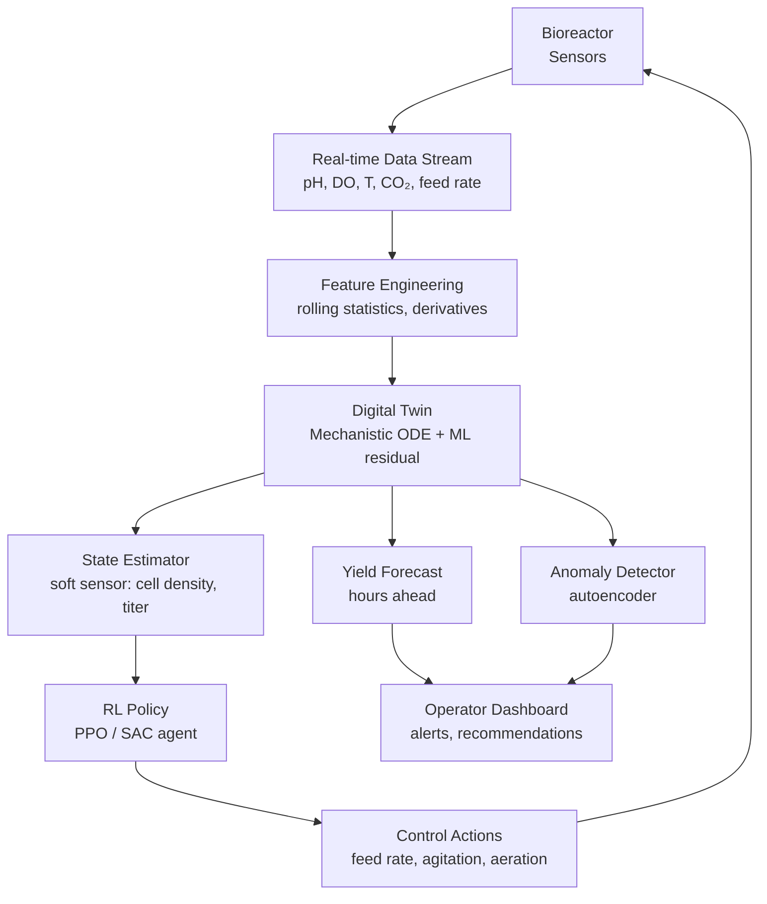

# AI for Fermentation Science and Process Optimization

## Overview

Fermentation is one of humanity's oldest biotechnologies — used for millennia to produce wine, beer, cheese, kimchi, miso, and bread — yet the underlying biology is extraordinarily complex. Microorganisms consuming sugars, producing acids, alcohols, and CO₂, competing or cooperating in dynamic ecological communities, all while responding to temperature, pH, oxygen availability, and substrate concentrations. Traditional process control relied on heuristic recipes and the intuition of experienced craftspeople. Modern AI is enabling a new era of precision fermentation, where ML models predict outcomes from sensor streams, reinforcement learning agents tune bioreactor conditions in real time, and digital twins simulate entire fermentation runs before a single batch is started.

The economic stakes are significant. Industrial enzyme production, pharmaceutical fermentation (insulin, antibiotics), and craft beverage quality all depend on process consistency and yield. A 1–2% yield improvement in a large-scale ethanol fermentation translates to millions of dollars annually. AI-driven optimization is moving from research labs into production facilities worldwide.

## Key Concepts

- **Microbial kinetics**: Mathematical models describing how microorganisms grow and produce metabolites as a function of substrate concentration and environmental conditions
- **Metabolic pathways**: Biochemical reaction networks inside cells; ML can infer pathway activity from extracellular measurements
- **Fed-batch fermentation**: A common industrial mode where substrate is added over time to control cell growth and avoid substrate inhibition
- **Digital twin**: A computational model that mirrors a physical process in real time, enabling prediction, anomaly detection, and what-if scenario testing
- **Dissolved oxygen (DO)**: A critical parameter in aerobic fermentation; $\text{DO} < 20\%$ saturation often triggers metabolic shifts
- **Metabolite titer**: The concentration of a target compound (e.g., ethanol, lactic acid, enzyme) — the primary optimization target

## Technical Details

### Microbial Growth Kinetics

The Monod equation describes specific growth rate $\mu$ as a function of substrate concentration $S$:

$$\mu = \mu_{\max} \frac{S}{K_s + S}$$

where $\mu_{\max}$ is the maximum specific growth rate and $K_s$ is the half-saturation constant. Coupled with mass balances on biomass $X$, substrate $S$, and product $P$:

$$\frac{dX}{dt} = \mu X - D X$$

$$\frac{dS}{dt} = -\frac{\mu X}{Y_{X/S}} + D(S_{\text{in}} - S)$$

$$\frac{dP}{dt} = q_P X - D P$$

Here $D$ is the dilution rate (for continuous culture), $Y_{X/S}$ is the biomass yield on substrate, and $q_P$ is the specific product formation rate. ML approaches learn $\mu$, $Y_{X/S}$, and $q_P$ as nonlinear functions of measured variables, bypassing the need for first-principles parameter estimation.

### ML for Fermentation Monitoring

Modern bioreactors are instrumented with continuous sensor arrays: pH probes, dissolved oxygen electrodes, temperature sensors, off-gas analyzers (CO₂, O₂ evolution rates), and increasingly, inline spectroscopy (Raman, NIR). These generate high-frequency time-series data that can be used to:

1. **Soft-sense unmeasured variables**: Predict cell density, substrate concentration, or metabolite titer from easily measured proxies. A random forest or LSTM trained on historical batches can predict ethanol concentration from pH, temperature, and CO₂ evolution rate, avoiding the need for slow offline HPLC measurements.

2. **Detect anomalies**: Autoencoders trained on normal batch profiles flag deviations early, enabling intervention before a contaminated or stuck fermentation produces off-spec product.

3. **Predict final yield**: At the halfway point of a batch, predict the final titer using the trajectory so far. Gradient boosted trees using batch summary statistics achieve R² > 0.90 on industrial datasets.

### Reinforcement Learning for Bioreactor Control

Fermentation control is a sequential decision problem: at each timestep, the operator chooses feed rates, agitation speed, and aeration to maximize final yield while respecting constraints (avoid oxygen depletion, maintain pH in range). This maps naturally to reinforcement learning (RL):

- **State** $s_t$: sensor readings (pH, DO, temperature, CO₂ rate, current time in batch)
- **Action** $a_t$: feed pump rate, agitation RPM, aeration flow rate
- **Reward** $r_t$: shaped toward maximum final metabolite titer with penalties for constraint violations

Proximal Policy Optimization (PPO) and Soft Actor-Critic (SAC) agents trained in simulation (using a physics-informed digital twin as the environment) and then transferred to the real bioreactor have demonstrated 10–20% yield improvements over PID controllers in academic studies of penicillin and lysine fermentation.

### Digital Twins for Fermentation

A fermentation digital twin combines a mechanistic ODE model (Monod-type kinetics) with ML correction terms that account for phenomena the first-principles model cannot capture:

$$\frac{dX}{dt} = \underbrace{\mu_{\text{Monod}}(S, T) X}_{\text{mechanistic}} + \underbrace{f_\theta(X, S, P, T, \text{pH})}_{\text{ML residual}}$$

The ML residual $f_\theta$ is a neural network trained on the discrepancy between the mechanistic model and observed data. This **physics-informed ML** approach generalizes better than pure black-box models, especially for batches with conditions outside the training distribution.

**Diagram: Fermentation Digital Twin Pipeline**



## Code Example: LSTM Soft Sensor for Fermentation Monitoring

```python
import numpy as np
import torch
import torch.nn as nn
from torch.utils.data import DataLoader, TensorDataset

# ── Simulated fermentation batch data ──
# In practice, load from historian (OSIsoft PI, InfluxDB, etc.)
# Features: [pH, dissolved_oxygen, temperature, co2_evolution_rate, feed_rate]
# Target: ethanol concentration (g/L) — expensive to measure offline

def simulate_batch(n_steps=200, noise_std=0.05):
    """Simulate a simple fermentation trajectory."""
    t = np.linspace(0, 48, n_steps)  # 48-hour batch
    X = 0.1 * np.exp(0.15 * t) / (1 + 0.1 * np.exp(0.15 * t) / 50)  # logistic growth
    S = np.maximum(100 - 2 * t, 0)                                    # substrate depletion
    P = 0.45 * (100 - S)                                               # ethanol production

    pH    = 5.5 - 0.01 * P + np.random.normal(0, noise_std, n_steps)
    DO    = 80  - 1.5 * X  + np.random.normal(0, 2 * noise_std, n_steps)
    T     = 30  + 0.5 * np.sin(t / 10) + np.random.normal(0, noise_std, n_steps)
    CO2   = 0.05 * X * S / (S + 5) + np.random.normal(0, noise_std, n_steps)
    feed  = np.clip(5 - 0.05 * t, 0, 5) + np.random.normal(0, noise_std, n_steps)

    features = np.stack([pH, DO, T, CO2, feed], axis=1).astype(np.float32)
    target   = P.astype(np.float32)
    return features, target

# Generate synthetic dataset: 100 batches
n_batches, seq_len, n_features = 100, 200, 5
X_all, y_all = zip(*[simulate_batch(seq_len) for _ in range(n_batches)])
X_all = np.array(X_all)  # (100, 200, 5)
y_all = np.array(y_all)  # (100, 200)

# Normalize
X_mean, X_std = X_all.mean((0, 1)), X_all.std((0, 1))
X_norm = (X_all - X_mean) / (X_std + 1e-8)

# Train/test split
split = 80
X_train = torch.tensor(X_norm[:split])
y_train = torch.tensor(y_all[:split]).unsqueeze(-1)
X_test  = torch.tensor(X_norm[split:])
y_test  = torch.tensor(y_all[split:]).unsqueeze(-1)

# ── LSTM Soft Sensor ──
class FermentationLSTM(nn.Module):
    def __init__(self, input_size=5, hidden_size=64, num_layers=2):
        super().__init__()
        self.lstm = nn.LSTM(input_size, hidden_size, num_layers,
                            batch_first=True, dropout=0.2)
        self.head = nn.Sequential(
            nn.Linear(hidden_size, 32),
            nn.ReLU(),
            nn.Linear(32, 1)
        )

    def forward(self, x):
        out, _ = self.lstm(x)        # (batch, seq, hidden)
        return self.head(out)        # (batch, seq, 1)

model = FermentationLSTM()
optimizer = torch.optim.Adam(model.parameters(), lr=1e-3)
criterion = nn.MSELoss()

dataset = TensorDataset(X_train, y_train)
loader  = DataLoader(dataset, batch_size=16, shuffle=True)

# Training loop
for epoch in range(30):
    model.train()
    train_loss = 0.0
    for xb, yb in loader:
        pred = model(xb)
        loss = criterion(pred, yb)
        optimizer.zero_grad()
        loss.backward()
        optimizer.step()
        train_loss += loss.item()

    if (epoch + 1) % 10 == 0:
        model.eval()
        with torch.no_grad():
            val_pred = model(X_test)
            val_rmse = torch.sqrt(criterion(val_pred, y_test)).item()
        print(f"Epoch {epoch+1:3d} | Train loss: {train_loss/len(loader):.4f} | Val RMSE: {val_rmse:.2f} g/L")
```

## Applications

**Wine quality prediction**: Sensor data during alcoholic fermentation (temperature, SO₂, YAN) predicts final wine quality scores. Gradient boosted models trained on Vinho Verde datasets achieve competitive performance against expert sensory panels.

**Sake fermentation optimization**: ML models correlate koji enzyme activity (amylase, protease) profiles with final sake flavor compounds (ethyl caproate, isoamyl acetate). Bayesian optimization has been applied to koji cultivation schedules to maximize target aroma profiles.

**Industrial enzyme production**: Fed-batch control of *Aspergillus* and *Bacillus* fermentations for cellulase, protease, and lipase production uses RL-based feed rate optimization to maximize volumetric productivity while minimizing substrate waste.

**Kombucha and kimchi**: The succession of microbial communities (yeasts → bacteria) in spontaneous fermentations is modeled using community ecology-inspired ML to predict flavor development timelines.

## Exercises

1. **Monod fitting**: Generate synthetic batch fermentation data using the Monod model with known parameters. Add Gaussian noise, then use `scipy.optimize.curve_fit` to recover $\mu_{\max}$ and $K_s$. How does noise level affect estimation accuracy?

2. **Soft sensor with random forest**: Using the `simulate_batch` function above, train a random forest regressor to predict ethanol from only pH and CO₂ at each timestep (ignoring temporal context). Compare RMSE to the LSTM. What does this reveal about the value of temporal modeling?

3. **RL environment**: Implement a simple gym environment wrapping the Monod ODE model. Let the agent control the feed rate $D$ (dilution) at each step, with reward = final product concentration $P$. Train a PPO agent using `stable-baselines3`.

4. **Digital twin residual**: Train a neural ODE correction term on top of the Monod model. Does it improve multi-step prediction accuracy for batches with different initial conditions?

## Further Reading

- [Bioreactor Process Control Review (Mears et al., 2017)](https://www.sciencedirect.com/science/article/pii/S0006291X17302899)
- [Machine Learning for Bioprocess Optimization (Narayanan et al., 2020)](https://doi.org/10.1021/acs.iecr.0c01523)
- [DeepBioprocess: LSTM for fermentation (Glassey & von Stosch, 2018)](https://doi.org/10.1002/bit.26529)
- [Reinforcement Learning for Bioprocess Control (Treloar et al., 2020)](https://doi.org/10.1016/j.bej.2020.107659)
- [Physics-Informed ML for Fermentation (Psichogios & Ungar, 1992)](https://doi.org/10.1002/aic.690381003)
- [Open Fermentation Dataset — DECHEMA BioProcess Library](https://www.dechema.de/)
