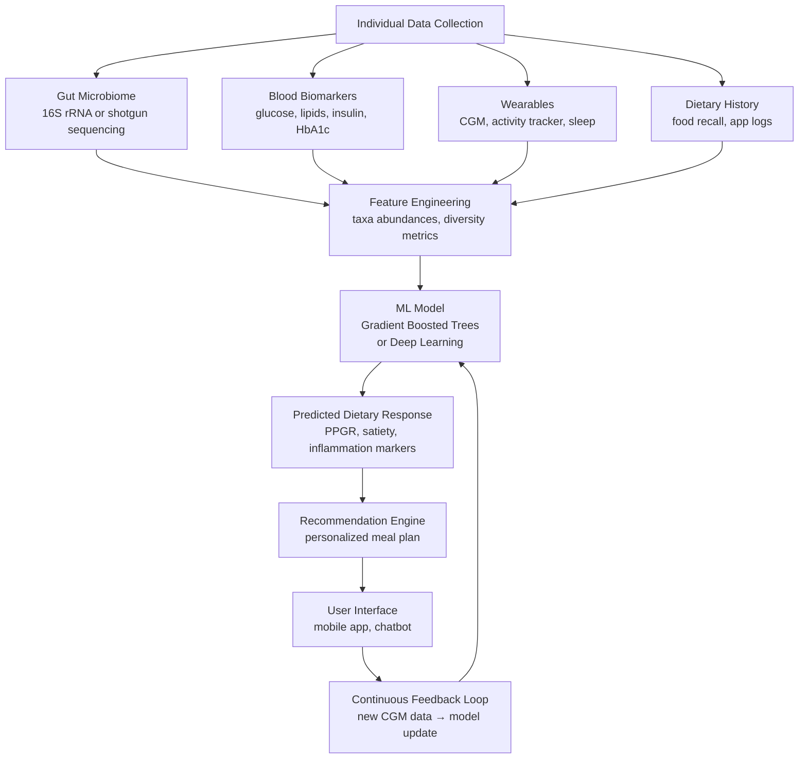

# AI for Nutrition Science and Personalized Diet

## Overview

Nutrition science sits at the intersection of biochemistry, epidemiology, behavioral science, and individual biology. For decades, dietary guidelines were derived from population-level studies — average recommendations applied uniformly despite the fact that individuals respond to the same foods in dramatically different ways. The postprandial blood glucose response to identical meals can vary by a factor of four between individuals with similar demographics. This variability, driven by gut microbiome composition, genetics, metabolic state, and lifestyle factors, has motivated a new paradigm: **personalized nutrition**, where AI integrates multi-modal individual data to deliver recommendations tailored to the individual rather than the average.

Simultaneously, AI is transforming the upstream data infrastructure of nutrition science. Nutritional databases are being extended with ML-predicted values for unmeasured compounds. Food composition is being estimated from spectral and image data. Large food language models are enabling natural language interfaces to nutritional information. And multi-modal models combining food photos, ingredient lists, preparation methods, and tabular nutrient data are making dietary tracking both more accurate and dramatically less burdensome.

## Key Concepts

- **Nutritional databases**: Structured repositories of food composition data; foundational to all nutrition AI systems
- **USDA FoodData Central**: The primary US nutritional database with >650,000 food items and thousands of nutrient values per item
- **Postprandial glycemic response (PPGR)**: The blood glucose trajectory after eating; highly individualized and a central target for personalized nutrition models
- **Gut microbiome**: The ~38 trillion bacteria colonizing the human gut; composition strongly predicts dietary response and is itself shaped by diet
- **Dietary recall**: The gold-standard method for measuring food intake (24-hour recall interview), increasingly automated with AI
- **Multi-modal nutrition AI**: Models that jointly process food images, text descriptions, ingredient lists, and tabular nutrient data

## Technical Details

### Nutritional Databases and Their Limitations

The USDA FoodData Central, Chinese Food Composition Table (FCT), and EuroFir databases provide the ground-truth nutritional data that ML models are trained on and evaluated against. These databases contain:

- Macronutrients: protein, fat, carbohydrate, fiber (g per 100 g)
- Micronutrients: vitamins A, C, D, E, K, B-complex, calcium, iron, zinc, etc.
- Bioactive compounds: polyphenols, carotenoids, phytosterols

A major limitation is **incompleteness**: most foods are missing values for rare nutrients (specific polyphenols, minor fatty acids), and many real-world foods (restaurant dishes, ethnic cuisines) are absent entirely. ML prediction of missing nutritional values from molecular structure, taxonomic class, or spectral proxies is an active research area.

### Food Composition Prediction from Spectral Data

Near-infrared (NIR) and Raman spectroscopy measure molecular vibrations that encode chemical composition. A spectrum measured in seconds can predict macronutrient content with accuracy comparable to wet chemistry. The mapping from spectrum to composition is learned via:

$$\hat{y} = f_\theta(\mathbf{x}_{\text{spectrum}})$$

where $\mathbf{x} \in \mathbb{R}^{d}$ ($d \approx 1000$–$10000$ wavelengths) and $f_\theta$ is typically a 1D CNN or partial least squares regression (PLS-R) model. PLS-R finds latent factors that maximize covariance between spectral and nutritional variables — a simpler baseline that often outperforms deep learning on small datasets.

### Personalized Nutrition: Predicting Individual Dietary Response

The landmark **Weizmann Institute study** (Zeevi et al., 2015, *Cell*) showed that a gradient boosted model trained on gut microbiome composition, dietary habits, blood parameters, anthropometrics, and physical activity could predict individualized PPGR to specific meals with AUC > 0.70 — substantially better than standard nutritional indices (glycemic index, glycemic load).

Features driving predictions included:
- Gut microbiome diversity (Shannon index, specific taxa abundances)
- Meal fiber content, meal glycemic load
- Body mass index, waist-to-hip ratio
- Fasting blood glucose, HbA1c
- Physical activity preceding the meal

This work launched a new research paradigm where AI-generated dietary advice is conditioned on individual biomarkers rather than population averages.

**Diagram: Personalized Nutrition AI Pipeline**



### Large Food Language Models

The emergence of large language models has enabled new capabilities in food and nutrition AI:

**FoodPrompt** adapts LLMs to the food domain via instruction fine-tuning on nutritional databases, recipe corpora, and dietary guidelines. It can answer complex queries ("What are high-potassium, low-sodium breakfast options for a patient on ACE inhibitors?") and generate personalized meal plans.

**NutriGPT** is a GPT-based model fine-tuned on USDA FoodData Central and clinical nutrition literature. It demonstrates improved accuracy on nutritional Q&A benchmarks compared to general-purpose LLMs, though hallucination of specific nutrient values remains a challenge that requires retrieval-augmented generation (RAG) from verified databases.

### Multi-Modal Food Understanding

State-of-the-art food logging systems combine:
- **Vision**: CNNs or Vision Transformers for food recognition from photos
- **Text**: BERT/GPT encoders for ingredient lists, menu descriptions
- **Tabular**: Embeddings of nutritional features from databases

These are fused via cross-modal attention mechanisms or late fusion:

$$\hat{y} = \text{MLP}([\mathbf{z}_{\text{vision}}, \mathbf{z}_{\text{text}}, \mathbf{z}_{\text{tabular}}])$$

Datasets like **Food-101** (101 categories, 101K images), **VIREO Food-172**, and **Nutrition5k** (with 3D depth images and detailed nutrition labels) drive progress on this task.

## Code Example: Predicting Nutritional Content from Food Images

```python
import torch
import torch.nn as nn
import torchvision.transforms as transforms
import torchvision.models as models
from PIL import Image
import numpy as np

# ── Nutritional Regression Head on top of a pretrained CNN ──
# Target: predict [calories, protein, fat, carbs, fiber] per 100g serving
# Fine-tuned on Nutrition5k or similar labeled image dataset

class NutritionPredictor(nn.Module):
    """
    Transfer learning: EfficientNet-B0 backbone → regression head
    predicting 5 macronutrient values per food image.
    """
    NUTRIENT_NAMES = ['calories', 'protein_g', 'fat_g', 'carbs_g', 'fiber_g']

    def __init__(self, freeze_backbone=False):
        super().__init__()
        backbone = models.efficientnet_b0(weights='IMAGENET1K_V1')
        in_features = backbone.classifier[1].in_features
        backbone.classifier = nn.Identity()  # remove classification head
        self.backbone = backbone

        if freeze_backbone:
            for param in self.backbone.parameters():
                param.requires_grad = False

        # Regression head with dropout
        self.regressor = nn.Sequential(
            nn.Dropout(0.3),
            nn.Linear(in_features, 256),
            nn.ReLU(),
            nn.Dropout(0.2),
            nn.Linear(256, len(self.NUTRIENT_NAMES)),
            nn.ReLU()  # nutrients are non-negative
        )

    def forward(self, x):
        features = self.backbone(x)
        return self.regressor(features)


# ── Preprocessing transform ──
val_transform = transforms.Compose([
    transforms.Resize(256),
    transforms.CenterCrop(224),
    transforms.ToTensor(),
    transforms.Normalize(mean=[0.485, 0.456, 0.406],
                         std=[0.229, 0.224, 0.225])
])

# ── Inference demonstration ──
def predict_nutrition(image_path: str, model: NutritionPredictor) -> dict:
    """Predict macronutrients for a food image (per 100g serving)."""
    model.eval()
    img = Image.open(image_path).convert('RGB')
    tensor = val_transform(img).unsqueeze(0)  # (1, 3, 224, 224)

    with torch.no_grad():
        pred = model(tensor).squeeze().numpy()

    return dict(zip(NutritionPredictor.NUTRIENT_NAMES, pred))


# ── Training loop outline (with a real dataset) ──
def train_nutrition_predictor(train_loader, val_loader, epochs=20):
    model = NutritionPredictor(freeze_backbone=True)
    optimizer = torch.optim.AdamW(model.regressor.parameters(), lr=3e-4)
    # Unfreeze backbone after initial head training
    scheduler = torch.optim.lr_scheduler.CosineAnnealingLR(optimizer, T_max=epochs)

    # Smooth L1 (Huber) loss is robust to outlier nutrient values
    criterion = nn.SmoothL1Loss()

    for epoch in range(epochs):
        if epoch == 5:  # unfreeze backbone for fine-tuning
            for param in model.backbone.parameters():
                param.requires_grad = True
            optimizer.add_param_group({'params': model.backbone.parameters(), 'lr': 1e-5})

        model.train()
        total_loss = 0.0
        for images, nutrients in train_loader:
            pred = model(images)
            loss = criterion(pred, nutrients.float())
            optimizer.zero_grad()
            loss.backward()
            torch.nn.utils.clip_grad_norm_(model.parameters(), 1.0)
            optimizer.step()
            total_loss += loss.item()

        scheduler.step()

        # Validation: per-nutrient Mean Absolute Error (MAE)
        model.eval()
        maes = torch.zeros(5)
        n = 0
        with torch.no_grad():
            for images, nutrients in val_loader:
                pred = model(images)
                maes += (pred - nutrients.float()).abs().sum(0)
                n += len(images)
        maes /= n
        nutrient_str = " | ".join(
            f"{name}: {mae:.1f}" for name, mae in
            zip(NutritionPredictor.NUTRIENT_NAMES, maes.tolist())
        )
        print(f"Epoch {epoch+1:3d} | Loss: {total_loss/len(train_loader):.4f} | MAE — {nutrient_str}")
```

## Exercises

1. **Database exploration**: Load the USDA FoodData Central Foundation Foods JSON (available free at [fdc.nal.usda.gov](https://fdc.nal.usda.gov/)). Compute the top 10 foods by protein-to-calorie ratio, fiber density, and potassium-to-sodium ratio. Visualize correlations between nutrients with a heatmap.

2. **NIR spectrum emulation**: Generate synthetic NIR spectra for mixtures of known macronutrient concentrations (use random linear combinations of basis spectra). Train a PLS regression model and a 1D CNN. Compare performance on held-out mixtures.

3. **PPGR feature importance**: Using the publicly available [Zeevi 2015 dataset](https://www.cell.com/cell/fulltext/S0092-8674(15)01481-6) (supplementary data), reproduce the gradient boosted model for PPGR prediction. Use SHAP values to explain which features drive high vs. low glycemic responses.

4. **Multi-modal fusion**: Fine-tune CLIP on 500 food image-caption pairs (e.g., "grilled salmon with roasted vegetables, high in omega-3"). Evaluate zero-shot food category retrieval on Food-101.

## Further Reading

- [Personalized Nutrition by Prediction of Glycemic Responses (Zeevi et al., 2015)](https://doi.org/10.1016/j.cell.2015.11.001)
- [Deep Learning for Food Recognition (Martinel et al., 2018)](https://arxiv.org/abs/1805.10422)
- [Nutrition5k Dataset (Thames et al., 2021)](https://arxiv.org/abs/2103.03375)
- [USDA FoodData Central](https://fdc.nal.usda.gov/)
- [EuroFir Food Composition Database](https://www.eurofir.org/)
- [NutriGPT and Food LLMs (He et al., 2023)](https://arxiv.org/abs/2306.15874)
- [Gut Microbiome and Dietary Response (Dahl et al., 2023)](https://doi.org/10.1038/s41591-023-02195-4)
