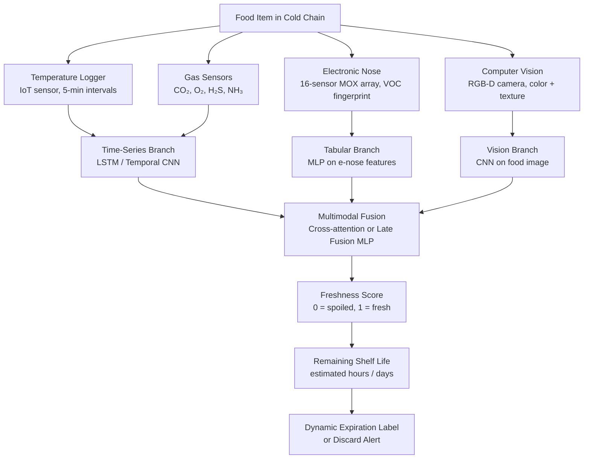

# AI for Shelf Life Prediction and Food Freshness

## Overview

Food spoilage costs the global economy an estimated $940 billion annually, with roughly one-third of all food produced for human consumption lost or wasted. Much of this waste is preventable: it stems from imprecise shelf life labeling, poor cold chain management, and the inability to assess actual food quality in real time. Traditional shelf life dates are determined through expensive, time-consuming accelerated shelf life testing (ASLT) under controlled conditions, and they represent conservative population-level estimates that ignore the variability in individual food items, supply chain conditions, and storage environments.

Machine learning is enabling a shift from **calendar-based** to **condition-based** freshness assessment. By integrating data from electronic noses (e-noses), electronic tongues (e-tongues), computer vision systems, temperature loggers, and gas sensors into predictive models, it is now possible to estimate the remaining shelf life of individual food items with high accuracy — enabling dynamic expiration dates, optimized cold chain routing, and reduced food waste.

## Key Concepts

- **Accelerated shelf life testing (ASLT)**: Storing food at elevated temperatures and/or humidity to artificially accelerate spoilage, then using Arrhenius kinetics to extrapolate to normal storage conditions
- **Quality index method (QIM)**: A demerit-point scoring system for sensory assessment of fish and seafood freshness, widely used as a ground-truth label for ML models
- **Electronic nose (e-nose)**: An array of chemical sensors (metal oxide semiconductors, conducting polymers) that produces a fingerprint pattern of volatile organic compounds (VOCs) associated with spoilage
- **Electronic tongue (e-tongue)**: An array of electrochemical sensors measuring dissolved compounds in liquid food; sensitive to bitterness, sourness, saltiness related to spoilage metabolites
- **Sensor fusion**: Combining heterogeneous sensor modalities into a unified feature representation for improved prediction accuracy
- **Time-temperature integrator (TTI)**: A physical or chemical indicator that records thermal history of a food package throughout the supply chain

## Technical Details

### Kinetic Shelf Life Modeling

The classical approach to shelf life prediction uses the **Arrhenius equation** to relate the rate of a quality-degrading reaction $k$ to temperature $T$:

$$k(T) = A \cdot e^{-E_a / (RT)}$$

where $A$ is the pre-exponential factor, $E_a$ is the activation energy (J/mol), and $R = 8.314$ J/(mol·K). For a first-order quality decay model:

$$Q(t) = Q_0 \cdot e^{-k(T) \cdot t}$$

The shelf life $\tau$ is the time at which quality falls below an acceptable threshold $Q_{\min}$:

$$\tau = -\frac{\ln(Q_{\min} / Q_0)}{k(T)}$$

This model assumes constant temperature — a poor approximation for the real cold chain, where temperature fluctuates continuously. ML approaches learn the nonlinear mapping from time-varying temperature and sensor profiles to quality state, without requiring the Arrhenius assumption.

### Quality Indices by Food Category

Different food categories degrade through different mechanisms, each requiring tailored quality indices:

| Category | Primary Spoilage Mechanism | Key Indicators |
|---|---|---|
| Fish / Seafood | Bacterial growth, lipid oxidation, autolysis | Total Volatile Basic Nitrogen (TVB-N), Trimethylamine (TMA), QIM score |
| Red Meat | Myoglobin oxidation, bacterial growth | Color (L\*a\*b\*), TBARS (lipid oxidation), microbial count |
| Leafy Produce | Senescence, yellowing, wilting | Chlorophyll content, firmness, visual discoloration |
| Dairy | Lactic acid bacteria growth, lipolysis | pH, titratable acidity, off-flavor VOCs |
| Bakery | Moisture migration, mold growth | Water activity ($a_w$), hardness, mold colony count |

### Sensor Fusion Architecture

A state-of-the-art freshness monitoring system fuses multiple sensor streams:

**Diagram: Sensor Fusion Pipeline for Freshness Prediction**



### LSTM for Time-Series Freshness Prediction

Temperature abuse is the single largest driver of accelerated spoilage in the cold chain. An LSTM that reads the full temperature and gas sensor history up to the present can predict the current freshness state and remaining shelf life — accounting for the cumulative damage from past temperature excursions in a way that a simple Arrhenius model cannot.

The model maps a variable-length sensor sequence $(\mathbf{x}_1, \ldots, \mathbf{x}_t)$ to a scalar quality index $q_t \in [0, 1]$:

$$h_t, c_t = \text{LSTM}(h_{t-1}, c_{t-1}, \mathbf{x}_t)$$

$$q_t = \sigma(W_o h_t + b_o)$$

The quality index is trained against ground-truth microbial counts or sensory scores collected at multiple timepoints during shelf life experiments.

## Code Example: LSTM for Time-Series Freshness Prediction

```python
import numpy as np
import torch
import torch.nn as nn
from torch.utils.data import DataLoader, TensorDataset
import matplotlib
matplotlib.use('Agg')
import matplotlib.pyplot as plt

# ── Simulate cold chain data for fish fillet freshness ──
# Sensors: temperature (°C), CO₂ %, H₂S (ppm), NH₃ (ppm)
# Target: freshness score 1.0 (fresh) → 0.0 (spoiled)

def arrhenius_rate(temp_c, Ea=75000, A=1e12):
    """Compute spoilage rate constant at given temperature (°C)."""
    T_K = temp_c + 273.15
    R = 8.314
    return A * np.exp(-Ea / (R * T_K))

def simulate_cold_chain(n_samples=500, seq_len=96, dt_hours=1.0, seed=None):
    """
    Simulate n_samples cold chain trajectories.
    Each trajectory: seq_len hourly measurements.
    Returns:
        X: (n_samples, seq_len, 4)  — [temperature, CO2, H2S, NH3]
        y: (n_samples, seq_len)     — freshness score [0, 1]
    """
    rng = np.random.default_rng(seed)
    X = np.zeros((n_samples, seq_len, 4), dtype=np.float32)
    y = np.zeros((n_samples, seq_len), dtype=np.float32)

    for i in range(n_samples):
        # Temperature profile: base cold chain + random excursions
        base_temp = rng.uniform(0, 4)
        temp = base_temp + rng.normal(0, 0.5, seq_len)
        # Add 0–2 random warm excursions (logistics breaks)
        for _ in range(rng.integers(0, 3)):
            t_start = rng.integers(0, seq_len - 4)
            duration = rng.integers(2, 6)
            excursion_temp = rng.uniform(8, 20)
            temp[t_start:t_start + duration] += (excursion_temp - base_temp)
        temp = np.clip(temp, -2, 25)

        # Cumulative quality degradation via integrated Arrhenius
        k_values = np.array([arrhenius_rate(t) for t in temp])
        cum_damage = np.cumsum(k_values) * dt_hours / 3600  # normalize
        freshness = np.exp(-cum_damage / 50)  # scale so tau ~ 5 days at 4°C
        freshness = np.clip(freshness, 0, 1)

        # Gas sensor signals: increase as freshness decreases
        spoilage = 1 - freshness
        co2  = 400  + 5000  * spoilage + rng.normal(0, 50, seq_len)
        h2s  = 0    + 20    * spoilage + rng.normal(0, 0.5, seq_len)
        nh3  = 0    + 30    * spoilage + rng.normal(0, 1.0, seq_len)

        X[i, :, 0] = temp
        X[i, :, 1] = co2
        X[i, :, 2] = h2s
        X[i, :, 3] = nh3
        y[i] = freshness

    return X, y

# Generate dataset
X, y = simulate_cold_chain(n_samples=800, seq_len=96, seed=42)

# Normalize features
X_mean = X.mean((0, 1), keepdims=True)
X_std  = X.std((0, 1), keepdims=True) + 1e-8
X_norm = (X - X_mean) / X_std

split = 640
X_train = torch.tensor(X_norm[:split])
y_train = torch.tensor(y[:split]).unsqueeze(-1)   # (N, T, 1)
X_val   = torch.tensor(X_norm[split:])
y_val   = torch.tensor(y[split:]).unsqueeze(-1)

# ── Freshness LSTM ──
class FreshnessLSTM(nn.Module):
    def __init__(self, input_size=4, hidden_size=64, num_layers=2):
        super().__init__()
        self.lstm = nn.LSTM(input_size, hidden_size, num_layers,
                            batch_first=True, dropout=0.2)
        self.fc = nn.Sequential(
            nn.Linear(hidden_size, 32),
            nn.ReLU(),
            nn.Linear(32, 1),
            nn.Sigmoid()   # freshness ∈ [0, 1]
        )

    def forward(self, x):
        out, _ = self.lstm(x)
        return self.fc(out)

model = FreshnessLSTM()
optimizer = torch.optim.Adam(model.parameters(), lr=1e-3)
# Combine MSE loss and monotonicity penalty
# (freshness should be non-increasing over time)
mse_loss = nn.MSELoss()

def freshness_loss(pred, target, lambda_mono=0.1):
    """MSE + penalty for non-monotonic freshness predictions."""
    regression = mse_loss(pred, target)
    diff = pred[:, 1:, :] - pred[:, :-1, :]        # should be <= 0
    monotonicity = torch.clamp(diff, min=0).mean()
    return regression + lambda_mono * monotonicity

loader = DataLoader(TensorDataset(X_train, y_train), batch_size=32, shuffle=True)

print("Training Freshness LSTM...")
for epoch in range(25):
    model.train()
    total_loss = 0.0
    for xb, yb in loader:
        pred = model(xb)
        loss = freshness_loss(pred, yb)
        optimizer.zero_grad()
        loss.backward()
        torch.nn.utils.clip_grad_norm_(model.parameters(), 1.0)
        optimizer.step()
        total_loss += loss.item()

    if (epoch + 1) % 5 == 0:
        model.eval()
        with torch.no_grad():
            val_pred = model(X_val)
            val_mae = (val_pred - y_val).abs().mean().item()
            # Convert MAE in freshness score to hours (approx)
            shelf_life_hours = 5 * 24  # ~5 days at 4°C
            mae_hours = val_mae * shelf_life_hours
        print(f"Epoch {epoch+1:3d} | Loss: {total_loss/len(loader):.4f} "
              f"| Val MAE: {val_mae:.4f} (≈ {mae_hours:.1f} h shelf life error)")

# ── Remaining shelf life estimation ──
def remaining_shelf_life_hours(freshness_trajectory, threshold=0.3, dt_hours=1.0):
    """Estimate hours until freshness drops below threshold."""
    below = np.where(freshness_trajectory < threshold)[0]
    if len(below) == 0:
        return len(freshness_trajectory) * dt_hours  # still fresh at end
    return below[0] * dt_hours

model.eval()
with torch.no_grad():
    sample_pred = model(X_val[:1]).squeeze().numpy()
sample_true = y_val[0].squeeze().numpy()
rsl_pred = remaining_shelf_life_hours(sample_pred)
rsl_true = remaining_shelf_life_hours(sample_true)
print(f"\nSample item — predicted remaining shelf life: {rsl_pred:.0f} h, "
      f"true: {rsl_true:.0f} h")
```

## Applications

**Fish and seafood**: TVB-N (total volatile basic nitrogen) correlates with spoilage in fish. E-nose + LSTM models tracking ammonia and trimethylamine sensor responses predict TVB-N within ASLT accuracy bounds, enabling real-time quality labeling at the fish counter.

**Meat in MAP packaging**: Modified atmosphere packaging (MAP) uses CO₂/N₂/O₂ mixtures to retard microbial growth. Gas sensors monitoring headspace composition combined with color analysis (myoglobin oxidation from red to brown) drive ML models predicting remaining shelf life with MAE < 0.5 days.

**Produce in smart cold chain**: IoT temperature loggers in refrigerated trucks transmit time-temperature histories to cloud ML models that update dynamic expiration predictions for each pallet. Routing algorithms use these predictions to prioritize distribution to nearby stores for items with shorter predicted shelf life.

**Bakery and dairy**: Water activity ($a_w$) is the key predictor of mold growth and staling. Resistance-based sensors tracking moisture vapor, combined with temperature history, feed Gaussian process models that provide probabilistic shelf life estimates with calibrated uncertainty bounds.

## Exercises

1. **Arrhenius parameter fitting**: Generate synthetic shelf life data for a food product at three temperatures (4°C, 10°C, 20°C) using known $E_a$ and $A$ values. Add measurement noise, then use nonlinear least squares to recover the parameters. How does sample size at each temperature affect estimation uncertainty?

2. **E-nose classification**: The [UCI Machine Learning Repository](https://archive.ics.uci.edu/) contains gas sensor array datasets for wine and beer classification. Train a random forest and an MLP classifier. Apply PCA to the 8-dimensional sensor array response and visualize the class separability.

3. **LSTM vs. Arrhenius**: Using the `simulate_cold_chain` function, generate 200 trajectories with realistic temperature excursions. Compare prediction accuracy of the LSTM vs. a simple cumulative Arrhenius model (without ML). Under what conditions does the LSTM outperform the kinetic model?

4. **Dynamic expiration labeling**: Implement a simulation of a supermarket cold chain where 100 fish items arrive with random initial freshness levels and experience varying storage temperatures. Use the trained LSTM to compute daily remaining shelf life estimates and calculate waste reduction (items discarded at end of stated shelf life vs. items discarded at model-predicted expiry).

## Further Reading

- [Review of ML for Shelf Life Prediction (Mittal et al., 2022)](https://doi.org/10.1016/j.tifs.2022.03.025)
- [E-Nose for Food Quality (Peris & Escuder-Gilabert, 2016)](https://doi.org/10.1016/j.tifs.2016.01.018)
- [Time-Temperature Indicators for Food (Taoukis & Labuza, 1989)](https://doi.org/10.1016/0260-8774(89)90024-4)
- [Deep Learning for Fish Freshness (Zhao et al., 2021)](https://doi.org/10.1016/j.foodchem.2021.129868)
- [Smart Cold Chain Monitoring with IoT (Mercier et al., 2017)](https://doi.org/10.1016/j.tifs.2017.03.004)
- [LSTM for Cold Chain Temperature Abuse (Badia-Melis et al., 2018)](https://doi.org/10.1016/j.postharvbio.2018.04.004)
- [OpenFoodFacts Database (open-source)](https://world.openfoodfacts.org/)
