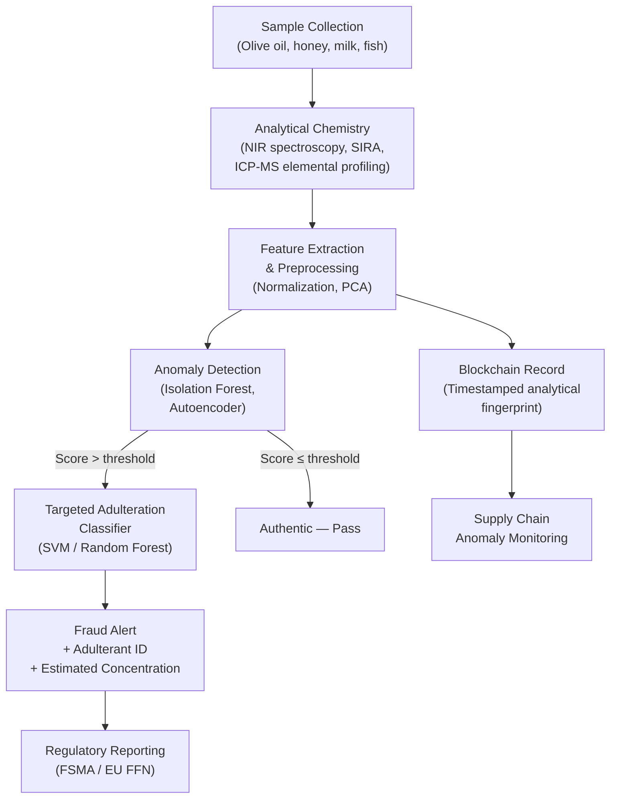

# AI for Food Fraud Detection and Supply Chain Traceability

## Overview

Food fraud is a multi-billion-dollar global problem. The European Commission estimates that fraud costs the food industry upward of $40 billion annually, and high-profile incidents — melamine-contaminated infant formula, horse meat sold as beef, diluted honey, and adulterated olive oil — expose both the economic and public health stakes. At its core, food fraud exploits the information asymmetry between producers and consumers: a buyer cannot easily verify that an olive oil labeled "extra virgin" from a specific Greek region is actually what it claims to be.

Artificial intelligence is rapidly changing this calculus. By combining analytical chemistry techniques with machine learning, regulators and food companies can now screen hundreds of samples for authenticity signals with far greater sensitivity and throughput than traditional laboratory methods alone allow. Simultaneously, blockchain-anchored supply chain platforms enriched with AI anomaly detection are making it possible to trace a product's journey from farm to shelf in near-real time, flagging suspicious deviations before they reach consumers.

### Types of Food Fraud

Food fraud falls into four major categories. **Adulteration** involves adding a foreign substance to increase volume or reduce cost — diluting olive oil with cheaper sunflower oil, or stretching honey with corn syrup. **Mislabeling** misrepresents origin, species, or organic status — selling farmed salmon as wild-caught, or Spanish olives as Italian. **Counterfeiting** produces fake versions of premium branded products. **Substitution** replaces an expensive ingredient with a cheaper one entirely — substituting horse meat for beef, or using a low-grade fish species labeled as a premium one.

Each category requires different detection strategies. Mislabeling and substitution often yield to species identification via DNA barcoding or mass spectrometry. Adulteration is best detected by profiling the chemical composition of a sample and comparing it to reference databases of authentic products. Counterfeiting may require visual inspection combined with chemical fingerprinting.

### ML for Food Authentication: Stable Isotopes, Elemental Profiling, and Chemometrics

The bedrock of AI-powered food authentication is analytical chemistry. **Stable isotope ratio analysis (SIRA)** measures the ratios of heavy-to-light isotopes (e.g., $^{13}\text{C}/^{12}\text{C}$, $^{18}\text{O}/^{16}\text{O}$, $^{2}\text{H}/^{1}\text{H}$) in a food sample. These ratios are determined by the plant's photosynthetic pathway, local climate, soil composition, and water source — making them a natural geographic fingerprint. An olive oil from Crete will have a measurably different isotopic signature than one from Tunisia.

**Elemental profiling** uses inductively coupled plasma mass spectrometry (ICP-MS) to measure trace-mineral concentrations across dozens of elements. The resulting high-dimensional feature vector is then processed by ML classifiers.

**Chemometric methods** are the statistical and ML techniques applied to these chemical data. Principal Component Analysis (PCA) reduces dimensionality and reveals clustering by origin or adulterant. Linear Discriminant Analysis (LDA) maximizes class separability. More powerful are ensemble tree models (Random Forests, gradient boosting) and support vector machines (SVMs), which routinely achieve >95% classification accuracy on controlled authentication datasets. The challenge is generalization: a model trained on a 2022 harvest may not perform as well on a 2024 harvest due to natural year-to-year variability in authentic samples.

**Economically Motivated Adulteration (EMA)** is the regulatory term for fraud driven by financial incentive. Chemometric detection of EMA typically follows a two-stage pipeline: first an anomaly score flags samples that deviate from the authentic distribution, then a targeted classifier identifies the specific adulterant type and its approximate concentration.

### Blockchain + AI for Supply Chain Traceability

Blockchain provides an immutable, distributed ledger where supply chain events (harvest, processing, packaging, shipping, retail receipt) are recorded as timestamped transactions. Each participant — farmer, processor, transporter, retailer — appends records to the chain. Crucially, because the ledger is distributed and cryptographically secured, no single party can alter a historical record without detection.

AI augments blockchain traceability in three key ways. First, **anomaly detection** models monitor the stream of blockchain-logged events for patterns inconsistent with legitimate supply chains: unusually fast transit times, volume inconsistencies between receiving and shipping records, or temperature exceedances in cold chain logs. Second, **natural language processing** extracts structured data from unstructured shipping documents, certificates of analysis, and customs declarations, automatically populating the blockchain. Third, **computer vision** at receiving docks can verify product identity and condition from images, matching visual attributes against expected specifications.

Platforms like IBM Food Trust (built on Hyperledger Fabric) and the FoodLogiQ platform have demonstrated that end-to-end traceability reduces the time to identify the source of a contamination event from days to seconds. During the 2018 romaine lettuce E. coli outbreak, tracing contamination back to a specific irrigation canal took the FDA weeks. With a blockchain-enabled system, the equivalent trace has been demonstrated in under a minute in pilot programs.

### Authenticity Verification with Multi-Modal AI

The most robust authentication systems fuse multiple evidence streams. A single spectroscopic method may be fooled by a sophisticated adulterant; a multi-modal system combining near-infrared (NIR) spectroscopy, stable isotope ratios, elemental profiles, and visual hyperspectral imaging is far harder to deceive. Deep learning models — typically late-fusion architectures that process each modality with a specialized encoder before combining representations — have achieved state-of-the-art results on authentication benchmarks.

### Regulatory Frameworks

In the United States, the **Food Safety Modernization Act (FSMA)** of 2011 mandates preventive controls and traceability records across the food supply chain. The FDA's FSMA Section 204 specifically requires enhanced traceability records for high-risk foods such as leafy greens, shell eggs, and nut butters. In the European Union, **Regulation (EU) 2017/625** established a unified framework for official controls, and the EU's **Food Fraud Network (FFN)** coordinates cross-border fraud investigations. AI tools that generate auditable authentication records are increasingly used to demonstrate compliance with both regimes.

## Key Concepts

- **Food fraud taxonomy**: Adulteration, mislabeling, counterfeiting, and substitution — each requiring distinct detection strategies
- **Stable isotope ratio analysis (SIRA)**: Geographic and metabolic fingerprinting via heavy/light isotope ratios
- **Elemental profiling + ICP-MS**: Trace-mineral fingerprints processed by ML classifiers
- **Chemometrics**: PCA, LDA, SVM, and ensemble methods applied to high-dimensional chemical feature vectors
- **Economically Motivated Adulteration (EMA)**: Fraud driven by financial gain, detected via anomaly scoring followed by targeted classification
- **Blockchain + AI traceability**: Immutable ledgers enriched by anomaly detection, NLP, and computer vision
- **Multi-modal fusion**: Late-fusion deep learning combining NIR, SIRA, elemental, and visual data for robust authentication
- **FSMA / EU FFN**: Regulatory frameworks driving adoption of AI-powered authentication and traceability

## Technical Details

A food authentication pipeline typically proceeds as follows. Raw analytical chemistry data (spectra, isotope ratios, elemental concentrations) are preprocessed with standard normalization and outlier removal. Dimensionality reduction with PCA is applied for visualization and to remove collinear features. A supervised classifier is trained on a reference database of authenticated samples, with hyperparameters tuned via cross-validation. At inference, a query sample is scored for authenticity, and samples above an anomaly threshold trigger further targeted analysis.

The standard performance metric is the **false non-conformance rate** (FNCR) — the fraction of fraudulent samples that escape detection — which regulators target below 5% for high-risk commodities.

**Diagram: Food Fraud Detection Pipeline**



## Code Examples

A minimal implementation of the two-stage EMA detection pipeline using scikit-learn:

```python
import numpy as np
from sklearn.ensemble import IsolationForest, RandomForestClassifier
from sklearn.preprocessing import StandardScaler
from sklearn.decomposition import PCA
from sklearn.metrics import classification_report

# Simulate reference database: 300 authentic olive oil samples, 5 features
# (δ13C, δ18O, [K], [Mg], NIR_index)
rng = np.random.default_rng(42)
authentic = rng.multivariate_normal(
    mean=[-28.5, 12.0, 3.2, 1.8, 0.74],
    cov=np.diag([0.4, 0.6, 0.1, 0.05, 0.02]),
    size=300,
)

# Simulate 60 adulterated samples (sunflower oil dilution shifts δ13C and NIR)
adulterated = rng.multivariate_normal(
    mean=[-26.0, 12.5, 3.1, 1.75, 0.68],
    cov=np.diag([0.5, 0.7, 0.12, 0.06, 0.03]),
    size=60,
)

X = np.vstack([authentic, adulterated])
# Labels: 0 = authentic, 1 = adulterated (for the classifier stage)
y = np.array([0] * 300 + [1] * 60)

# Stage 1: Anomaly detection — trained only on authentic samples
scaler = StandardScaler()
X_scaled = scaler.fit_transform(X)
pca = PCA(n_components=3)
X_pca = pca.fit_transform(X_scaled)

iso_forest = IsolationForest(contamination=0.15, random_state=42)
iso_forest.fit(X_pca[:300])  # fit on authentic only

anomaly_labels = iso_forest.predict(X_pca)  # -1 = anomaly, 1 = normal
flagged_mask = anomaly_labels == -1
print(f"Stage 1 — Flagged as anomalous: {flagged_mask.sum()} / {len(X)} samples")

# Stage 2: Classifier on flagged samples to identify adulteration type
X_flagged = X_scaled[flagged_mask]
y_flagged = y[flagged_mask]

if len(np.unique(y_flagged)) > 1:
    clf = RandomForestClassifier(n_estimators=200, random_state=42)
    clf.fit(X_flagged, y_flagged)
    y_pred = clf.predict(X_flagged)
    print("\nStage 2 — Adulteration classification on flagged samples:")
    print(classification_report(y_flagged, y_pred,
                                target_names=["Authentic (FP)", "Adulterated"]))

# Feature importance from the classifier
importances = clf.feature_importances_
feature_names = ["delta13C", "delta18O", "[K]", "[Mg]", "NIR_index"]
for name, imp in sorted(zip(feature_names, importances), key=lambda x: -x[1]):
    print(f"  {name}: {imp:.3f}")
```

## Exercises / Projects

1. **Olive Oil Authentication**: Download the publicly available olive oil NMR dataset from the UCI Machine Learning Repository. Train an SVM and a Random Forest to classify geographic origin (Spain, Italy, Greece). Compare performance with and without PCA preprocessing. Report FNCR and false positive rate.

2. **Honey Adulteration Detection**: Using stable isotope reference data for authentic and corn-syrup-adulterated honey (publicly available from AOAC research), implement the two-stage pipeline (Isolation Forest + Random Forest) shown in the code example above. Experiment with the `contamination` hyperparameter and analyze its effect on FNCR.

3. **Blockchain Traceability Simulation**: Using Python's `hashlib` library, implement a simplified append-only supply chain ledger. Simulate a 5-step cold chain (harvest → packing → warehouse → distribution → retail) with temperature logs. Add an anomaly rule that flags any block where the delta between consecutive temperature readings exceeds 8°C.

4. **Multi-Modal Fusion**: Combine two simulated modalities (NIR spectral features and elemental profiles) using a late-fusion architecture in PyTorch. Implement a separate `nn.Linear` encoder for each modality, concatenate the embeddings, and train a joint classifier. Compare accuracy to single-modality baselines.

## Further Reading

- Ellis, D.I. et al., "Fingerprinting food: current technologies for the detection of food adulteration and contamination" (*Chemical Society Reviews*, 2012)
- Cordella, C. et al., "Recent Developments in Food Characterization and Adulteration Detection: Technique-Oriented Perspectives" (*Journal of Agricultural and Food Chemistry*, 2002)
- Manning, L. & Soon, J.M., "Developing systems thinking in the context of food safety, fraud and integrity" (*Trends in Food Science & Technology*, 2016)
- FDA FSMA Traceability Rule (Section 204): https://www.fda.gov/food/food-safety-modernization-act-fsma/fsma-final-rule-requirements-additional-traceability-records-certain-foods
- IBM Food Trust on Hyperledger Fabric: https://www.ibm.com/food-trust
- European Commission Food Fraud Network: https://food.ec.europa.eu/safety/food-fraud_en
