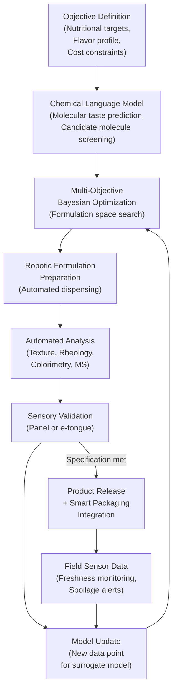

## Frontiers: AI-Native Food Science

## Overview

Food science is undergoing a fundamental transformation. For most of the twentieth century, product development relied on the accumulated intuition of trained sensory scientists and decades of incremental empirical refinement. Today, a new generation of AI-native approaches is compressing discovery timelines from years to weeks, enabling optimization across dimensions — flavor, nutrition, texture, cost, sustainability — that human intuition alone cannot navigate simultaneously.

The most striking recent advance is the application of **chemical language models (CLMs)** to molecular taste prediction. A landmark 2026 Nature study demonstrated that a transformer architecture trained on molecular SMILES strings could predict the perceived taste profile of novel molecules with accuracy rivaling trained human sensory panels. This breakthrough opens a combinatorial design space that was previously inaccessible: rather than synthesizing and tasting thousands of candidate flavor compounds, a food scientist can screen millions computationally and synthesize only the most promising leads.

Beyond flavor discovery, AI is reshaping food formulation, packaging, laboratory operations, and even the ethical contours of the global food system. This lesson surveys the frontier, connecting technical methods to their real-world implications.

### Molecular Taste Prediction with Chemical Language Models

A chemical language model treats molecular structure as a sequence. The SMILES (Simplified Molecular Input Line Entry System) notation encodes a molecule as a string — e.g., `CC(=O)Oc1ccccc1C(=O)O` for aspirin — and a transformer trained on large molecular databases learns contextualized representations that capture chemical structure and reactivity. Fine-tuned on taste annotation datasets (e.g., the Flavornet database, Leffingwell's PMP 2000 dataset), these models learn to predict bitterness, sweetness, umami, sourness, and salty perception from molecular structure.

The 2026 Nature breakthrough extended this to **odor-taste interaction**: the model jointly predicted how volatile aroma compounds modulate taste perception when consumed together, capturing the holistic sensory experience rather than isolated modalities. This is crucial for real formulation work because a compound that reduces bitterness in isolation may interact unpredictably with existing flavor volatiles.

Technically, the training objective combines a masked-atom prediction task (analogous to masked language modeling) with a supervised taste regression head. The frozen pretrained backbone provides general chemical representations; the task-specific head is fine-tuned on labeled taste data. Performance is measured by Spearman correlation between predicted and panel-reported taste intensity scores.

$$\rho = 1 - \frac{6 \sum d_i^2}{n(n^2 - 1)}$$

where $d_i$ is the rank difference between the model prediction and human panel rating for compound $i$, and $n$ is the number of compounds evaluated. The 2026 model achieved $\rho = 0.87$ on a held-out test set of 1,200 novel compounds, surpassing the previous best of 0.71.

### AI-Generated Food Formulations

Formulating a new food product requires simultaneously satisfying constraints across nutrition (macro and micronutrient targets, allergen avoidance), sensory profile (flavor, color, texture), regulatory compliance (approved additives, label claims), cost (ingredient sourcing within budget), and sustainability (carbon footprint, water use). This is a classic **multi-objective optimization** problem.

Modern approaches frame it as a constrained Bayesian optimization over the ingredient space. The surrogate model — typically a Gaussian process or a neural network — maps ingredient compositions to predicted outcomes (taste scores, texture measurements, shelf life). An acquisition function (Expected Hypervolume Improvement for multi-objective settings) guides the selection of the next formulation to evaluate in the lab. Each lab result is fed back as a new training point, closing the active learning loop.

Givaudan and Firmenich (now dsm-firmenich) have deployed variants of this pipeline in production, reporting 60–80% reductions in the number of physical prototypes required to reach a target specification.

### Smart and Active Packaging with AI-Enabled Sensors

Smart packaging embeds chemical or optical sensors directly into food packaging materials. These sensors respond to gases (CO₂, O₂, ethylene, biogenic amines produced by microbial spoilage) or physical conditions (temperature, humidity) by changing color, fluorescence, or electrical impedance. An AI model — often a lightweight convolutional neural network running on a smartphone or an edge microcontroller — interprets sensor readings to estimate remaining shelf life or spoilage probability.

**Active packaging** goes further: it responds to detected conditions by releasing antimicrobial agents, oxygen scavengers, or moisture regulators to extend shelf life. AI closes the control loop by determining when and how much active agent to release based on real-time sensor state and predictive models of spoilage kinetics.

A freshness index $F(t)$ can be modeled as:

$$F(t) = F_0 \cdot e^{-k(T) \cdot t}$$

where $F_0$ is the initial freshness, $t$ is time, and $k(T)$ is a temperature-dependent spoilage rate following Arrhenius kinetics. The AI system learns $k(T)$ from historical sensor data and calibrates it per product category.

### Self-Driving Experiments for Food Science

High-throughput food experimentation generates enormous amounts of data: rheology curves, texture analyzer profiles, colorimetry readings, sensory panel scores. Autonomous experimentation platforms, inspired by self-driving labs in drug discovery (e.g., the Acceleration Consortium at University of Toronto), are being adapted for food science.

A self-driving food experiment loop involves: (1) a hypothesis generator (Bayesian optimization or an LLM-assisted design agent) proposes the next experiment; (2) a robotic liquid-handling platform prepares the formulation; (3) automated analytical instruments characterize the result; (4) the data is ingested by the model; (5) the loop repeats. Human scientists define the objective and constraints; the system executes thousands of iterations autonomously.

### Lab of the Future: AI-Controlled Robotic Kitchens

AI-controlled robotic food synthesis systems — sometimes called **culinary robots** — combine precision dispensing hardware, thermal control, and computer vision to execute recipes with reproducible exactness. Companies like Moley Robotics and Miso Robotics have demonstrated systems capable of preparing complex dishes, and food manufacturers are deploying robotic kitchens for pilot-scale product development.

From an AI standpoint, the key challenges are **recipe representation** (encoding a recipe as a structured program the robot can execute), **visual feedback control** (using a camera to assess doneness or texture and adapt cooking parameters in real time), and **failure recovery** (detecting and recovering from ingredient variation or equipment anomalies).

**Diagram: AI-Native Food Science Development Loop**



## Key Concepts

- **Chemical language model (CLM)**: Transformer trained on molecular SMILES strings for taste and odor prediction
- **Spearman correlation ($\rho$)**: Rank-based metric for evaluating agreement between model and sensory panel
- **Multi-objective Bayesian optimization**: Surrogate-model-guided search over ingredient space optimizing flavor, nutrition, cost, and sustainability simultaneously
- **Expected Hypervolume Improvement (EHVI)**: Acquisition function for multi-objective Bayesian optimization that maximizes the dominated hypervolume of the Pareto front
- **Smart/active packaging**: Sensor-embedded packaging with AI interpretation of freshness signals; active variants release agents to extend shelf life
- **Arrhenius spoilage kinetics**: Temperature-dependent spoilage rate model calibrated from sensor data
- **Self-driving experiments**: Closed-loop autonomous experimentation platforms that iterate hypothesis → formulation → characterization → model update
- **Culinary robotics**: Precision robotic systems for reproducible food synthesis with vision-based feedback control

## Technical Details

The multi-objective Bayesian optimization formulation for food design specifies:

- **Decision variables** $\mathbf{x} \in \mathbb{R}^d$: ingredient concentrations, process parameters (temperature, mixing time)
- **Objective vector** $\mathbf{f}(\mathbf{x}) = [f_\text{taste}(\mathbf{x}),\ f_\text{nutrition}(\mathbf{x}),\ -f_\text{cost}(\mathbf{x}),\ -f_\text{CO_2}(\mathbf{x})]$ (maximize taste and nutrition, minimize cost and carbon)
- **Constraints** $g_i(\mathbf{x}) \leq 0$: regulatory maximum additive levels, allergen thresholds, texture feasibility
- **Surrogate**: Independent Gaussian processes per objective, or a multi-output GP with shared kernel hyperparameters
- **Acquisition**: $\text{EHVI}(\mathbf{x}) = \mathbb{E}\left[\text{HV}(\mathcal{P} \cup \{\mathbf{f}(\mathbf{x})\}) - \text{HV}(\mathcal{P})\right]$

where $\mathcal{P}$ is the current Pareto front and $\text{HV}(\cdot)$ is the dominated hypervolume measure.

## Code Examples

A minimal multi-objective Bayesian optimization loop using the `botorch` library for a simplified three-objective food formulation task:

```python
import torch
from botorch.models import SingleTaskGP
from botorch.fit import fit_gpytorch_mll
from botorch.acquisition.multi_objective import qExpectedHypervolumeImprovement
from botorch.optim import optimize_acqf
from botorch.utils.multi_objective.pareto import is_non_dominated
from gpytorch.mlls import ExactMarginalLogLikelihood

# Problem: 4 ingredients, 3 objectives (taste, nutrition_score, -cost)
# All variables in [0, 1] (normalized ingredient fractions)
D = 4      # number of ingredients
M = 3      # number of objectives
N_INIT = 10
N_ITER = 20
REF_POINT = torch.tensor([-1.0, -1.0, -10.0])  # reference point below all observations

def simulate_formulation(X: torch.Tensor) -> torch.Tensor:
    """Toy oracle: replace with real lab measurements or CLM predictions."""
    taste       =  (1 - (X[:, 0] - 0.6)**2 - (X[:, 1] - 0.3)**2).unsqueeze(-1)
    nutrition   =  (X[:, 2] * 0.8 + X[:, 3] * 0.5).unsqueeze(-1)
    neg_cost    = -(X[:, 0] * 3.0 + X[:, 1] * 1.5 + X[:, 2] * 2.0 + X[:, 3] * 0.8).unsqueeze(-1)
    return torch.cat([taste, nutrition, neg_cost], dim=-1)

# Initial random design
torch.manual_seed(0)
train_X = torch.rand(N_INIT, D)
train_Y = simulate_formulation(train_X)

for iteration in range(N_ITER):
    # Fit independent GPs per objective
    model = SingleTaskGP(train_X, train_Y)
    mll = ExactMarginalLogLikelihood(model.likelihood, model)
    fit_gpytorch_mll(mll)

    # Identify current Pareto front
    pareto_mask = is_non_dominated(train_Y)
    pareto_Y = train_Y[pareto_mask]

    # Compute EHVI acquisition
    acqf = qExpectedHypervolumeImprovement(
        model=model,
        ref_point=REF_POINT,
        partitioning=None,  # botorch will compute internally
    )

    # Optimize acquisition to find next candidate
    candidate, _ = optimize_acqf(
        acqf, bounds=torch.stack([torch.zeros(D), torch.ones(D)]),
        q=1, num_restarts=5, raw_samples=64,
    )

    # Evaluate (in practice: run robot, measure in lab)
    new_Y = simulate_formulation(candidate)
    train_X = torch.cat([train_X, candidate])
    train_Y = torch.cat([train_Y, new_Y])

    if (iteration + 1) % 5 == 0:
        n_pareto = is_non_dominated(train_Y).sum().item()
        print(f"Iter {iteration+1:3d} | Total evaluations: {len(train_X)} "
              f"| Pareto front size: {n_pareto}")

print("\nFinal Pareto front formulations:")
pareto_X = train_X[is_non_dominated(train_Y)]
pareto_Y_final = train_Y[is_non_dominated(train_Y)]
for x, y in zip(pareto_X[:5], pareto_Y_final[:5]):
    ing = [f"{v:.2f}" for v in x.tolist()]
    obj = [f"{v:.3f}" for v in y.tolist()]
    print(f"  Ingredients: {ing} -> [taste={obj[0]}, nutrition={obj[1]}, neg_cost={obj[2]}]")
```

## Ethical Considerations

AI-native food science raises significant ethical questions that the field is only beginning to grapple with seriously.

**Equitable access to nutrition AI**: Powerful formulation AI is currently concentrated in large multinational food companies. Small producers, farmers, and food-insecure populations in the Global South benefit little from these tools and may be further disadvantaged if AI-optimized ultra-processed foods drive down the demand for minimally processed whole foods. Open-source initiatives and academic partnerships are essential to democratize access.

**Environmental impact**: High-throughput autonomous experimentation generates chemical waste and consumes energy. AI optimization can reduce the number of physical experiments needed, but this benefit must be weighed against the energy cost of training large models and running continuous cloud inference. Life-cycle analysis of the AI-enabled R&D process itself is an emerging area.

**Transparency and consumer trust**: When an AI generates a food formulation, who is responsible for the nutritional and safety outcomes? Regulatory frameworks have not kept pace with the speed of AI-assisted product development. The FDA and EFSA are beginning to develop guidance on AI in food formulation, but significant gaps remain.

**Labor displacement**: Robotic kitchens and autonomous formulation labs displace food science technicians and skilled sensory panel workers. Responsible deployment requires proactive workforce transition programs.

## Open Challenges and Research Frontiers

- **Texture and mouthfeel prediction** from molecular structure remains substantially harder than taste prediction; structural properties of food polymers (starches, proteins, hydrocolloids) require coarser-grained representations than small-molecule SMILES models provide.
- **Cross-modal sensory integration**: Predicting how visual appearance, auditory crunch, and tactile mouthfeel interact with taste and smell is an open problem with significant behavioral science complexity.
- **Robustness to ingredient variability**: Agricultural ingredients (crops, dairy) vary considerably by season, geography, and growing conditions. Models must be calibrated for this natural variance.
- **Foundation models for food**: A unified pretrained model across taste, nutrition, texture, and safety prediction — analogous to a protein foundation model for food ingredients — does not yet exist.
- **Real-time spoilage modeling**: Extending Arrhenius-based freshness models to capture microbial community dynamics and product-specific spoilage pathways remains an active research area.

## Exercises / Projects

1. **CLM Fine-Tuning**: Using the `chemprop` library (a directed message-passing neural network for molecular property prediction), fine-tune a model on the publicly available Flavornet taste annotation dataset. Evaluate Spearman $\rho$ on a held-out test split and analyze which molecular substructures (fragments) most strongly predict bitterness vs. sweetness.

2. **Bayesian Optimization for Formulation**: Extend the code example above to include a constraint (e.g., total ingredient fraction must sum to 1, and no single ingredient may exceed 0.4). Use `botorch`'s nonlinear constraint API and compare the constrained Pareto front to the unconstrained baseline.

3. **Smart Packaging Simulation**: Simulate a temperature time-series for a refrigerated product using the Arrhenius model $k(T) = A \cdot e^{-E_a / RT}$ with realistic parameters ($A = 10^8$ h$^{-1}$, $E_a = 60$ kJ/mol). Train a simple LSTM on simulated sensor traces labeled with binary spoilage outcomes and evaluate precision/recall.

4. **Ethical Case Study**: Read the Givaudan "AI for Flavor Creation" case study and the ETC Group's 2023 report "Blocking the Exits: Big Food's Big Data Futures." Write a 500-word analysis of the tensions between competitive advantage, food sovereignty, and the equitable distribution of AI-enabled nutrition improvements.

## Further Reading

- Lee, B.K. et al., "Predicting human olfactory perception from chemical features of odor molecules" (*Science*, 2023) — foundational work on sensory property prediction from molecular structure
- Schweidtmann, A.M. et al., "Machine learning meets continuous flow chemistry: Automated optimization towards the Pareto front of multiple objectives" (*Chemical Engineering Journal*, 2021)
- Sehanobish, A. et al., "CheF: A multi-task machine learning model for flavor and fragrance chemistry" (2023 preprint)
- Christodoulou, E. et al., "A systematic review shows no performance benefit of machine learning over logistic regression for clinical prediction models" (*Journal of Clinical Epidemiology*, 2019) — a useful caution on ML heuristics
- Flavornet database: https://www.flavornet.org/
- BoTorch multi-objective optimization tutorial: https://botorch.org/tutorials/multi_objective_bo
- Acceleration Consortium (self-driving labs): https://acceleration.utoronto.ca/
- ETC Group, "Blocking the Exits: Big Food's Big Data Futures" (2023): https://www.etcgroup.org/
