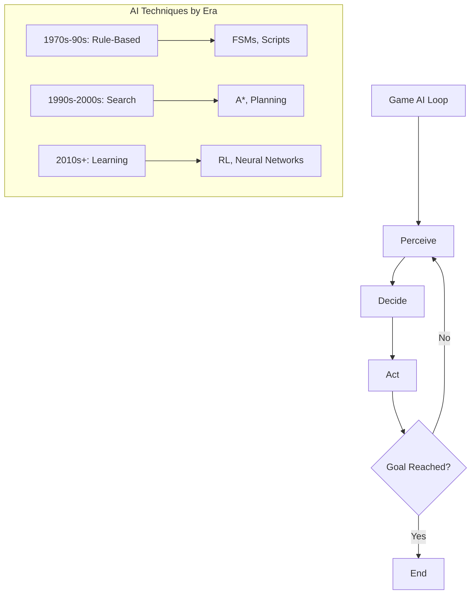

# Introduction to AI for Game Development

## Overview

Games have been one of the most important proving grounds for artificial intelligence since the field's inception. In 1950, Claude Shannon published his seminal paper on chess-playing programs, and Alan Turing hand-simulated a chess algorithm before any computer could run it. Since then, games have served as benchmarks, sandboxes, and inspiration for AI breakthroughs — from IBM Deep Blue defeating Garry Kasparov in 1997 to DeepMind's AlphaGo conquering the ancient game of Go in 2016.

Why do games matter so much for AI? First, games provide well-defined environments with clear rules, measurable objectives, and quantifiable success metrics — ideal for training and evaluating agents. Second, games span an enormous range of complexity: from deterministic, perfect-information games like chess to stochastic, partially observable, multi-agent environments like real-time strategy games. Third, games demand real-time performance, forcing researchers to develop efficient algorithms that work under strict time constraints.

Beyond research, AI is transforming the game industry itself. Modern game studios use AI for procedural content generation (creating levels, textures, and narratives), NPC behavior (making non-player characters believable), player modeling (adapting difficulty and experiences to individual players), automated testing (finding bugs and balance issues), and generative AI (producing art, music, and dialogue). The global games market exceeds $180 billion annually, and AI is becoming a critical competitive advantage.

This track covers the full spectrum of AI in game development — from classic algorithms like A* pathfinding and finite state machines to cutting-edge techniques like deep reinforcement learning, Monte Carlo tree search, and generative models. Whether you want to build smarter NPCs, generate infinite worlds, or train superhuman game agents, this track provides the foundations.

## Key Concepts

- **Game AI vs. Academic AI**: Game AI prioritizes the *appearance* of intelligence and real-time performance, while academic AI pursues optimal decision-making regardless of computational cost. Game developers often use "good enough" heuristics, while researchers seek provably optimal solutions.

- **Deterministic vs. Stochastic Games**: Deterministic games (chess, Go) have no randomness — the same actions always produce the same outcomes. Stochastic games (poker, backgammon) involve chance elements that require probabilistic reasoning.

- **Perfect vs. Imperfect Information**: In perfect-information games (chess), all players see the full game state. In imperfect-information games (poker, StarCraft with fog of war), players must reason under uncertainty.

- **Real-Time vs. Turn-Based**: Turn-based games allow unlimited computation per decision. Real-time games demand decisions within milliseconds, requiring efficient algorithms and time-budgeted search.

- **The AI Stack in Games**: Modern game AI operates at multiple levels — strategic (long-term planning), tactical (mid-level decisions), and reactive (immediate responses). Each level uses different algorithms and techniques.

- **Procedural Content Generation (PCG)**: Using algorithms to create game content — levels, terrain, items, quests, narratives — rather than hand-crafting everything. PCG enables infinite replayability and reduces development costs.

- **Player Modeling**: Building computational models of player behavior, preferences, and skill to adapt the game experience in real time.

## Technical Details

### The Evolution of Game AI

Game AI has evolved through several eras:

**Era 1 — Hard-Coded Rules (1970s–1990s):** Early games used simple rule-based systems. Pac-Man's ghosts each followed a distinct deterministic pattern. This era relied on finite state machines (FSMs) and scripted behaviors.

**Era 2 — Search and Planning (1990s–2000s):** As hardware improved, games adopted pathfinding (A*), planning algorithms, and more sophisticated decision-making. RTS games introduced influence maps and hierarchical AI.

**Era 3 — Learning and Adaptation (2010s–present):** Machine learning entered game AI. Deep reinforcement learning agents achieved superhuman performance in Atari, Go, StarCraft, and Dota 2. Generative models began creating game content.

### Game Environments as AI Testbeds

The AI research community has developed standardized game environments:

| Environment | Type | Complexity | Key Challenge |
|---|---|---|---|
| Atari (ALE) | Arcade | Low–Medium | Vision + control |
| OpenAI Gym | Various | Low–High | Standardized interface |
| StarCraft II (PySC2) | RTS | Very High | Partial observability, multi-agent |
| Minecraft (MineRL) | Sandbox | Very High | Open-ended goals |
| Unity ML-Agents | Custom | Variable | 3D physics, multi-agent |

## Code Examples

```python
import numpy as np
from enum import Enum

class GameState(Enum):
    MENU = "menu"
    PLAYING = "playing"
    PAUSED = "paused"
    GAME_OVER = "game_over"

class SimpleGameAI:
    """A minimal game AI framework demonstrating the AI game loop."""

    def __init__(self, grid_size: int = 10):
        self.grid_size = grid_size
        self.grid = np.zeros((grid_size, grid_size), dtype=int)
        self.agent_pos = np.array([0, 0])
        self.goal_pos = np.array([grid_size - 1, grid_size - 1])
        self.state = GameState.PLAYING

    def perceive(self) -> dict:
        """Sense the environment — gather information for decision-making."""
        distance = np.linalg.norm(self.goal_pos - self.agent_pos)
        direction = self.goal_pos - self.agent_pos
        return {
            "position": self.agent_pos.copy(),
            "goal": self.goal_pos.copy(),
            "distance": distance,
            "direction": np.sign(direction),
        }

    def decide(self, perception: dict) -> np.ndarray:
        """Choose an action based on perception (simple greedy policy)."""
        direction = perception["direction"]
        # Move along the axis with the largest gap
        if abs(direction[0]) >= abs(direction[1]):
            return np.array([int(direction[0]), 0])
        else:
            return np.array([0, int(direction[1])])

    def act(self, action: np.ndarray):
        """Execute the chosen action in the environment."""
        new_pos = self.agent_pos + action
        new_pos = np.clip(new_pos, 0, self.grid_size - 1)
        self.agent_pos = new_pos
        if np.array_equal(self.agent_pos, self.goal_pos):
            self.state = GameState.GAME_OVER

    def run(self, max_steps: int = 100):
        """Main AI game loop: Perceive → Decide → Act."""
        for step in range(max_steps):
            if self.state == GameState.GAME_OVER:
                print(f"Goal reached in {step} steps!")
                return step
            perception = self.perceive()
            action = self.decide(perception)
            self.act(action)
        print("Max steps reached without finding goal.")
        return max_steps

# Run the simple game AI
game = SimpleGameAI(grid_size=10)
steps = game.run()
```

## Diagrams



## Exercises

1. **Explore a Game Environment**: Install OpenAI Gymnasium (`pip install gymnasium`) and run a CartPole environment. Observe the observation space, action space, and reward structure. Write code that takes random actions and tracks the total reward over 100 episodes.

2. **Classify Game AI Problems**: Pick five games you know well. For each, identify: (a) is it deterministic or stochastic? (b) perfect or imperfect information? (c) turn-based or real-time? (d) what AI techniques would be most appropriate? Write a short analysis.

3. **Implement the Perceive-Decide-Act Loop**: Extend the `SimpleGameAI` class above to add obstacles to the grid. Modify the `decide` method so the agent avoids obstacles while still moving toward the goal. Test with different obstacle configurations.

## Further Reading

- Russell, S. & Norvig, P. — *Artificial Intelligence: A Modern Approach*, Chapter 5 (Adversarial Search)
- Yannakakis, G. N. & Togelius, J. — *Artificial Intelligence and Games* (Springer, 2018)
- [OpenAI Gymnasium Documentation](https://gymnasium.farama.org/)
- [Unity ML-Agents Toolkit](https://github.com/Unity-Technologies/ml-agents)
