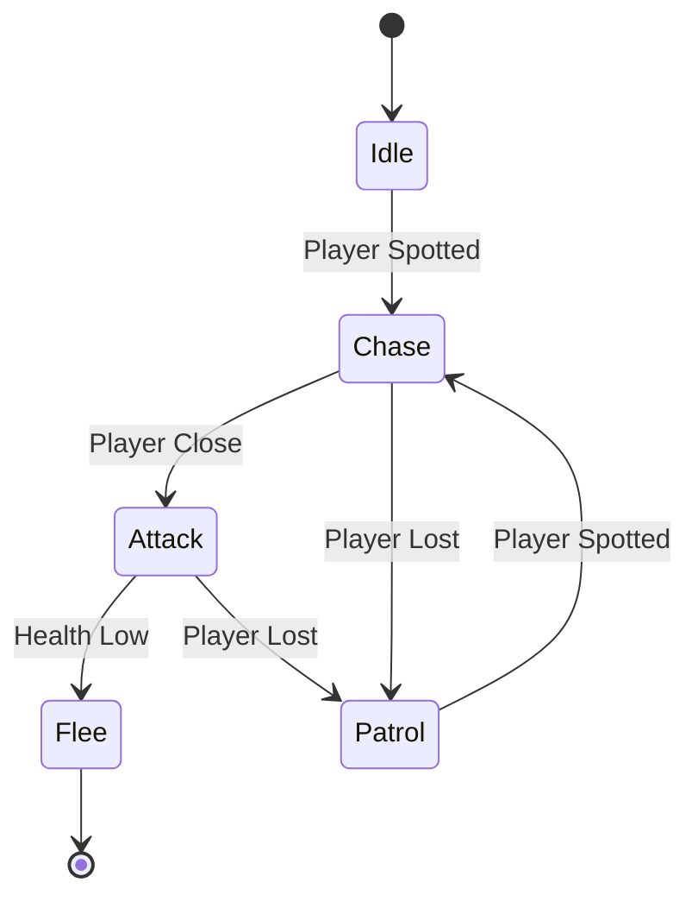

## Game AI Fundamentals: From Rule-Based Systems to Modern Approaches

## Overview

Before neural networks and reinforcement learning dominated headlines, game AI was built on elegant, deterministic systems that remain foundational today. Finite state machines (FSMs), utility systems, and rule-based architectures powered decades of beloved games — from Pac-Man's ghost behaviors to the guard AI in Metal Gear Solid. Understanding these systems is essential because they are still widely used in production games, they are predictable and debuggable (critical for shipped products), and modern approaches often build upon or hybridize with them.

The evolution from rule-based to learning-based game AI is not a story of replacement but of layering. A modern game might use an FSM for high-level NPC state management, a utility system for action selection, A* for pathfinding, and a neural network for player modeling — all working together. This lesson covers the foundational systems that form the base of that stack.

Game developers face a unique constraint that academic AI researchers do not: the AI must be fun, not optimal. An enemy that plays perfectly is frustrating; one that makes believable mistakes is engaging. This philosophy — the "illusion of intelligence" — shapes every design decision in game AI.

## Key Concepts

- **Finite State Machines (FSMs)**: The workhorse of game AI. An FSM defines a set of states (Idle, Patrol, Chase, Attack) and transitions between them based on conditions. Simple, predictable, and easy to debug, but they suffer from state explosion as complexity grows.

- **Hierarchical FSMs (HFSMs)**: Nested FSMs that manage complexity by grouping related states. A top-level FSM might have states like "Combat" and "Exploration," each containing sub-FSMs with detailed behaviors.

- **Utility Systems**: Instead of hard-coded transitions, utility systems score each possible action using utility functions and select the highest-scoring action. This produces more nuanced, emergent behavior than FSMs.

- **Rule-Based Systems**: Collections of if-then rules that fire when conditions are met. Production rule systems (like RETE-based engines) can handle complex logic but become unwieldy at scale.

- **Blackboard Architecture**: A shared memory structure where multiple AI subsystems read and write data. The blackboard decouples AI components, allowing them to cooperate without direct dependencies.

- **Sense-Think-Act Cycle**: The fundamental loop of game AI — sense the environment, think about what to do, and act on the decision. Every AI architecture implements this cycle in some form.

## Technical Details

### Finite State Machines

An FSM consists of:
- A finite set of **states** $S = \{s_1, s_2, \ldots, s_n\}$
- A set of **transitions** $T: S \times C \rightarrow S$ where $C$ is the set of conditions
- A **current state** $s_{\text{current}} \in S$

Each state has associated behaviors (what to do while in that state), and transitions have guard conditions that determine when to switch states.

### Utility Systems

In a utility system, each action $a_i$ has a utility function $U_i$ that maps the current world state to a score:

$$U_i(w) = \sum_{j} w_j \cdot f_j(\text{context})$$

where $f_j$ are response curves (linear, quadratic, logistic) applied to context variables, and $w_j$ are weights. The agent selects:

$$a^* = \arg\max_i U_i(w)$$

Response curves shape how context variables map to utility scores. Common curves include:

| Curve | Formula | Use Case |
|---|---|---|
| Linear | $f(x) = mx + b$ | Distance-based scoring |
| Quadratic | $f(x) = x^2$ | Urgency scaling |
| Logistic | $f(x) = \frac{1}{1 + e^{-k(x - x_0)}}$ | Threshold behaviors |
| Inverse | $f(x) = 1 - x$ | Diminishing returns |

## Code Examples

```python
from enum import Enum, auto
from typing import Callable

class State(Enum):
    IDLE = auto()
    PATROL = auto()
    CHASE = auto()
    ATTACK = auto()
    FLEE = auto()

class FSM:
    """A simple finite state machine for NPC behavior."""

    def __init__(self):
        self.current_state = State.IDLE
        self.transitions: dict[State, list[tuple[Callable, State]]] = {}
        self.actions: dict[State, Callable] = {}

    def add_transition(self, from_state: State, condition: Callable, to_state: State):
        self.transitions.setdefault(from_state, []).append((condition, to_state))

    def set_action(self, state: State, action: Callable):
        self.actions[state] = action

    def update(self, context: dict):
        # Check transitions from current state
        for condition, next_state in self.transitions.get(self.current_state, []):
            if condition(context):
                print(f"Transition: {self.current_state.name} -> {next_state.name}")
                self.current_state = next_state
                break
        # Execute current state action
        if self.current_state in self.actions:
            self.actions[self.current_state](context)

# Build a guard NPC FSM
guard = FSM()

# Define conditions
def player_spotted(ctx): return ctx["player_distance"] < 10
def player_close(ctx): return ctx["player_distance"] < 3
def player_lost(ctx): return ctx["player_distance"] > 15
def health_low(ctx): return ctx["health"] < 20

# Define actions
def idle_action(ctx): print("  Guard: Standing watch...")
def patrol_action(ctx): print("  Guard: Patrolling route...")
def chase_action(ctx): print(f"  Guard: Chasing player (dist={ctx['player_distance']:.1f})")
def attack_action(ctx): print("  Guard: Attacking!")
def flee_action(ctx): print("  Guard: Retreating to safety!")

# Set up transitions
guard.add_transition(State.IDLE, player_spotted, State.CHASE)
guard.add_transition(State.PATROL, player_spotted, State.CHASE)
guard.add_transition(State.CHASE, player_close, State.ATTACK)
guard.add_transition(State.CHASE, player_lost, State.PATROL)
guard.add_transition(State.ATTACK, health_low, State.FLEE)
guard.add_transition(State.ATTACK, player_lost, State.PATROL)

# Set actions
for state, action in [
    (State.IDLE, idle_action), (State.PATROL, patrol_action),
    (State.CHASE, chase_action), (State.ATTACK, attack_action),
    (State.FLEE, flee_action)
]:
    guard.set_action(state, action)

# Simulate
scenarios = [
    {"player_distance": 20, "health": 100},
    {"player_distance": 8, "health": 100},
    {"player_distance": 2, "health": 100},
    {"player_distance": 2, "health": 15},
]
for ctx in scenarios:
    print(f"\nContext: dist={ctx['player_distance']}, health={ctx['health']}")
    guard.update(ctx)
```

```python
import math

class UtilityAI:
    """Action selection via utility scoring."""

    def __init__(self):
        self.actions: dict[str, list[tuple[Callable, float]]] = {}

    def add_action(self, name: str, scorers: list[tuple[Callable, float]]):
        """Each scorer is (function, weight)."""
        self.actions[name] = scorers

    def evaluate(self, context: dict) -> dict[str, float]:
        scores = {}
        for name, scorers in self.actions.items():
            total = sum(w * fn(context) for fn, w in scorers)
            scores[name] = total
        return scores

    def select(self, context: dict) -> str:
        scores = self.evaluate(context)
        return max(scores, key=scores.get)

# Define scoring functions
def hunger_score(ctx): return ctx["hunger"] / 100.0
def danger_score(ctx): return 1.0 / (1 + math.exp(-0.1 * (ctx["threat_level"] - 50)))
def curiosity_score(ctx): return ctx["unexplored"] / 100.0

ai = UtilityAI()
ai.add_action("eat", [(hunger_score, 2.0), (danger_score, -0.5)])
ai.add_action("fight", [(danger_score, 2.0), (hunger_score, -0.3)])
ai.add_action("explore", [(curiosity_score, 1.5), (danger_score, -1.0)])

context = {"hunger": 80, "threat_level": 30, "unexplored": 60}
scores = ai.evaluate(context)
print(f"Scores: {scores}")
print(f"Selected: {ai.select(context)}")
```

## Diagrams



## Exercises

1. **Extend the FSM**: Add a `SEARCH` state to the guard FSM that activates when the player was recently spotted but is now out of sight. The guard should search the player's last known position before returning to patrol.

2. **Utility System Tuning**: Modify the `UtilityAI` example to add a "hide" action and a "heal" action. Experiment with different weight values and response curves. Find a configuration where the NPC flees when injured and threatened, eats when hungry and safe, and explores when curious.

3. **Compare FSM vs. Utility**: Implement the same NPC behavior (guard with patrol, chase, attack, flee) using both the FSM and utility system approaches. Run 50 random scenarios and compare the action distributions. Which system produces more varied behavior?

## Further Reading

- Millington, I. & Funge, J. — *Artificial Intelligence for Games* (3rd edition, CRC Press)
- Mark, D. — *Behavioral Mathematics for Game AI* (Charles River Media)
- [Game AI Pro](http://www.gameaipro.com/) — free collection of game AI articles
