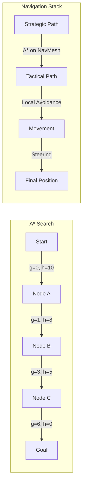

# Pathfinding and Navigation in Games

## Overview

Pathfinding is one of the most fundamental and ubiquitous AI problems in game development. Every game with moving characters — from top-down RPGs to open-world 3D games — needs agents that can navigate from point A to point B while avoiding obstacles. The problem seems simple, but scaling pathfinding to large, dynamic environments with hundreds of agents running simultaneously is a significant engineering challenge.

The A* algorithm, published by Hart, Nilsson, and Raphael in 1968, remains the gold standard for game pathfinding over 50 years later. Its elegance lies in combining the guaranteed optimality of Dijkstra's algorithm with the speed of greedy best-first search through a heuristic function. But A* alone is not enough for modern games — developers also use navigation meshes (NavMeshes) for 3D environments, flow fields for crowd simulation, hierarchical pathfinding for large maps, and dynamic obstacle avoidance for real-time scenarios.

Understanding pathfinding deeply — not just the algorithms but the data structures, heuristics, and practical optimizations — is essential for any game AI developer. This lesson covers the theory and practice of making game characters move intelligently through complex worlds.

## Key Concepts

- **A* Algorithm**: Combines actual cost from start ($g(n)$) with estimated cost to goal ($h(n)$) to find optimal paths efficiently. The evaluation function is $f(n) = g(n) + h(n)$.

- **Heuristic Functions**: An admissible heuristic never overestimates the true cost. Common choices: Manhattan distance (grid-based), Euclidean distance (open space), octile distance (8-directional grids).

- **Navigation Meshes (NavMesh)**: A polygon mesh covering walkable surfaces in 3D environments. Agents pathfind between polygon centroids or edges, then smooth the resulting path.

- **Flow Fields**: Precomputed vector fields that direct agents toward a goal. Efficient for many agents sharing the same destination (e.g., RTS unit movement).

- **Hierarchical Pathfinding**: Decompose the map into regions, plan a coarse path at the region level, then refine within each region. Dramatically reduces search space for large maps.

- **Steering Behaviors**: Low-level movement behaviors (seek, flee, arrive, wander, obstacle avoidance) that produce smooth, natural-looking motion.

## Technical Details

### A* Algorithm

A* maintains two sets: an **open set** (nodes to evaluate) and a **closed set** (nodes already evaluated). It uses a priority queue ordered by $f(n) = g(n) + h(n)$:

$$f(n) = g(n) + h(n)$$

where:
- $g(n)$ = actual cost from start to node $n$
- $h(n)$ = heuristic estimate from $n$ to goal

**Admissibility**: If $h(n) \leq h^*(n)$ (true cost) for all $n$, A* guarantees the optimal path.

**Consistency**: If $h(n) \leq c(n, n') + h(n')$ for every edge $(n, n')$, A* never needs to re-expand nodes.

### Common Heuristics for Grids

For a grid with position $(x_1, y_1)$ to $(x_2, y_2)$:

- **Manhattan** (4-directional): $h = |x_1 - x_2| + |y_1 - y_2|$
- **Euclidean**: $h = \sqrt{(x_1 - x_2)^2 + (y_1 - y_2)^2}$
- **Octile** (8-directional): $h = \max(dx, dy) + (\sqrt{2} - 1) \cdot \min(dx, dy)$

### Flow Fields

Flow fields work by:
1. Run Dijkstra from the goal outward to compute a cost field
2. For each cell, compute the gradient pointing toward the lowest-cost neighbor
3. Agents simply follow the vector at their current cell

Cost: $O(N)$ to build once, $O(1)$ per agent per frame to query.

## Code Examples

```python
import heapq
import numpy as np

def astar(grid: np.ndarray, start: tuple, goal: tuple) -> list[tuple]:
    """A* pathfinding on a 2D grid. 0 = walkable, 1 = obstacle."""
    rows, cols = grid.shape
    directions = [(-1,0),(1,0),(0,-1),(0,1),(-1,-1),(-1,1),(1,-1),(1,1)]

    def heuristic(a, b):
        # Octile distance for 8-directional movement
        dx, dy = abs(a[0]-b[0]), abs(a[1]-b[1])
        return max(dx, dy) + (1.414 - 1) * min(dx, dy)

    open_set = [(0, start)]
    came_from = {}
    g_score = {start: 0}

    while open_set:
        f, current = heapq.heappop(open_set)

        if current == goal:
            # Reconstruct path
            path = []
            while current in came_from:
                path.append(current)
                current = came_from[current]
            path.append(start)
            return path[::-1]

        for dr, dc in directions:
            neighbor = (current[0]+dr, current[1]+dc)
            if not (0 <= neighbor[0] < rows and 0 <= neighbor[1] < cols):
                continue
            if grid[neighbor[0], neighbor[1]] == 1:
                continue

            move_cost = 1.414 if dr != 0 and dc != 0 else 1.0
            tentative_g = g_score[current] + move_cost

            if tentative_g < g_score.get(neighbor, float('inf')):
                came_from[neighbor] = current
                g_score[neighbor] = tentative_g
                f_score = tentative_g + heuristic(neighbor, goal)
                heapq.heappush(open_set, (f_score, neighbor))

    return []  # No path found

# Create a grid with obstacles
grid = np.zeros((15, 15), dtype=int)
grid[3, 2:12] = 1   # Horizontal wall
grid[7, 4:14] = 1   # Another wall
grid[10, 0:10] = 1  # Another wall

path = astar(grid, (0, 0), (14, 14))
print(f"Path found with {len(path)} steps: {path[:5]}...{path[-3:]}")

# Visualize
display = grid.astype(str)
display[display == '0'] = '.'
display[display == '1'] = '#'
for r, c in path:
    display[r, c] = '*'
display[0, 0] = 'S'
display[14, 14] = 'G'
for row in display:
    print(' '.join(row))
```

```python
from collections import deque

def build_flow_field(grid: np.ndarray, goal: tuple) -> np.ndarray:
    """Build a flow field directing agents toward the goal."""
    rows, cols = grid.shape
    cost = np.full((rows, cols), float('inf'))
    flow = np.zeros((rows, cols, 2))

    # BFS from goal to compute cost field
    cost[goal] = 0
    queue = deque([goal])

    while queue:
        r, c = queue.popleft()
        for dr, dc in [(-1,0),(1,0),(0,-1),(0,1)]:
            nr, nc = r+dr, c+dc
            if 0 <= nr < rows and 0 <= nc < cols and grid[nr,nc] == 0:
                new_cost = cost[r, c] + 1
                if new_cost < cost[nr, nc]:
                    cost[nr, nc] = new_cost
                    queue.append((nr, nc))

    # Compute flow vectors (gradient toward lower cost)
    for r in range(rows):
        for c in range(cols):
            if grid[r, c] == 1:
                continue
            best_dir = np.array([0.0, 0.0])
            best_cost = cost[r, c]
            for dr, dc in [(-1,0),(1,0),(0,-1),(0,1)]:
                nr, nc = r+dr, c+dc
                if 0 <= nr < rows and 0 <= nc < cols and cost[nr,nc] < best_cost:
                    best_cost = cost[nr, nc]
                    best_dir = np.array([dr, dc], dtype=float)
            norm = np.linalg.norm(best_dir)
            if norm > 0:
                flow[r, c] = best_dir / norm
    return flow

flow = build_flow_field(np.zeros((10,10), dtype=int), (9, 9))
print("Flow at (0,0):", flow[0, 0])  # Should point toward (9,9)
print("Flow at (5,5):", flow[5, 5])
```

## Diagrams



## Exercises

1. **Benchmark Heuristics**: Modify the A* implementation to accept different heuristic functions. Compare Manhattan, Euclidean, and octile heuristics on the same grid in terms of nodes expanded and path length. Which heuristic works best for 8-directional movement?

2. **Dynamic Obstacles**: Extend the A* implementation to handle dynamic obstacles. Create a scenario where an obstacle appears after the path is computed, requiring re-planning. Implement a simple "replan when blocked" strategy.

3. **Flow Field Crowd Simulation**: Use the flow field implementation to simulate 50 agents all moving toward the same goal. Add simple collision avoidance between agents. Visualize the result as an animation or series of grid snapshots.

## Further Reading

- Hart, P.E., Nilsson, N.J., Raphael, B. — "A Formal Basis for the Heuristic Determination of Minimum Cost Paths" (1968)
- Sturtevant, N. — "Benchmarks for Grid-Based Pathfinding" (2012)
- [Red Blob Games: A* Pathfinding](https://www.redblobgames.com/pathfinding/a-star/introduction.html)
- [Recast Navigation Library](https://github.com/recastnavigation/recastnavigation)
