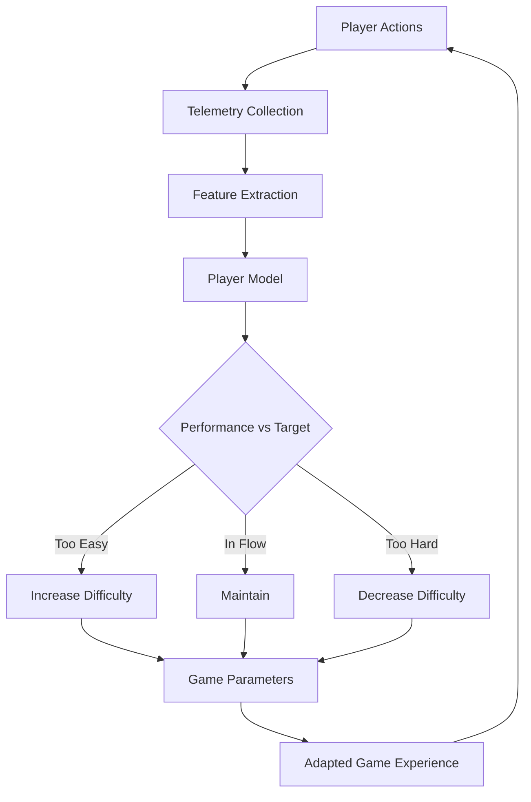

# Player Modeling and Behavior Prediction

## Overview

Every player is different. Some rush through levels at maximum speed, others explore every corner. Some prefer stealth, others prefer direct combat. Some are experts, others are beginners. Player modeling is the science of computationally representing these differences and using them to adapt the game experience in real time.

Player modeling emerged from the observation that static game difficulty and content leads to player frustration (too hard) or boredom (too easy). The concept of "flow" — the psychological state of optimal challenge where a player is fully immersed — requires the game to continuously adapt to the player's skill level and preferences. Mihaly Csikszentmihalyi's flow theory, originally from psychology, has become a cornerstone of adaptive game design.

Modern player modeling uses machine learning to build profiles from behavioral data: movement patterns, decision timing, resource usage, failure points, and play session characteristics. These models drive dynamic difficulty adjustment (DDA), personalized content recommendations, churn prediction, matchmaking, and player segmentation. Games like Left 4 Dead's AI Director, Resident Evil 4's adaptive difficulty, and Mario Kart's rubber-banding all use forms of player modeling to create more engaging experiences.

The challenge is modeling players accurately without being intrusive or manipulative. Ethical player modeling enhances enjoyment; exploitative modeling (e.g., optimizing for microtransaction spending) has drawn justified criticism.

## Key Concepts

- **Player Typologies**: Bartle's taxonomy (Achievers, Explorers, Socializers, Killers) was an early framework. Modern approaches use data-driven clustering rather than fixed categories.

- **Dynamic Difficulty Adjustment (DDA)**: Automatically modifying game difficulty based on player performance. Metrics include death rate, completion time, resource usage, and combo frequency.

- **Flow Theory in Games**: The zone between anxiety (too hard) and boredom (too easy). DDA attempts to keep players in the flow channel by adjusting challenge to match skill.

- **Behavioral Telemetry**: Collecting in-game data — positions, actions, timings, deaths, purchases — for analysis. Modern games generate terabytes of telemetry data.

- **Churn Prediction**: Predicting when a player will stop playing, enabling targeted retention interventions (e.g., special rewards, difficulty reduction).

- **Intent Prediction**: Inferring what a player is trying to do (their immediate goal) from their recent actions, enabling the game to offer relevant hints or adjust the environment.

## Technical Details

### Feature Engineering for Player Models

Raw telemetry must be transformed into meaningful features:

| Feature Category | Examples | Use Case |
|---|---|---|
| Performance | Win rate, accuracy, completion time | DDA, skill rating |
| Behavioral | Actions per minute, exploration ratio | Play style classification |
| Temporal | Session length, time between sessions | Churn prediction |
| Social | Friend count, chat frequency, team play | Community management |
| Economic | Spending patterns, resource hoarding | Monetization (ethical) |

### Skill Estimation with Elo/Glicko

The Elo rating system estimates player skill from win/loss outcomes:

$$E_A = \frac{1}{1 + 10^{(R_B - R_A)/400}}$$

After a match, ratings update:

$$R_A' = R_A + K \cdot (S_A - E_A)$$

where $S_A \in \{0, 0.5, 1\}$ is the actual outcome and $K$ controls update speed.

The Glicko-2 system extends Elo with rating deviation (uncertainty) and volatility, providing confidence intervals on skill estimates.

### DDA Control Loop

A DDA system is essentially a control loop:

1. **Measure**: Track player performance metrics (death rate, completion time)
2. **Compare**: Compare against target performance (desired flow state)
3. **Adjust**: Modify difficulty parameters (enemy health, spawn rate, AI aggressiveness)
4. **Smooth**: Apply changes gradually to avoid jarring transitions

## Code Examples

```python
import numpy as np
from collections import deque

class PlayerModel:
    """Track player performance and adapt difficulty."""

    def __init__(self, window_size: int = 20):
        self.performance_history = deque(maxlen=window_size)
        self.difficulty = 0.5  # 0.0 (easiest) to 1.0 (hardest)
        self.target_success_rate = 0.65  # Sweet spot for flow
        self.adjustment_rate = 0.05

    def record_outcome(self, success: bool, completion_time: float,
                       deaths: int):
        """Record the outcome of a game segment."""
        # Composite performance score
        time_score = max(0, 1 - completion_time / 120)  # 2-min baseline
        death_penalty = max(0, 1 - deaths * 0.2)
        score = (0.5 * float(success) + 0.3 * time_score
                 + 0.2 * death_penalty)
        self.performance_history.append(score)

    def get_success_rate(self) -> float:
        if not self.performance_history:
            return 0.5
        return np.mean(list(self.performance_history))

    def update_difficulty(self) -> float:
        """Adjust difficulty to maintain flow state."""
        if len(self.performance_history) < 5:
            return self.difficulty

        success_rate = self.get_success_rate()
        error = success_rate - self.target_success_rate

        # PID-like adjustment (proportional only for simplicity)
        adjustment = error * self.adjustment_rate
        self.difficulty = np.clip(self.difficulty + adjustment, 0.0, 1.0)
        return self.difficulty

    def get_difficulty_params(self) -> dict:
        """Convert difficulty scalar to game parameters."""
        d = self.difficulty
        return {
            "enemy_health_mult": 0.5 + d,         # 0.5x to 1.5x
            "enemy_damage_mult": 0.6 + 0.8 * d,   # 0.6x to 1.4x
            "spawn_rate": 0.5 + d,                 # 0.5x to 1.5x
            "ai_reaction_time": 1.0 - 0.6 * d,    # 1.0s to 0.4s
            "pickup_frequency": 1.5 - d,           # 1.5x to 0.5x
        }

# Simulate a play session
model = PlayerModel()
np.random.seed(42)

for segment in range(30):
    # Player skill improves over time
    player_skill = 0.3 + 0.02 * segment
    # Success depends on skill vs difficulty
    success_prob = 1 / (1 + np.exp(-5 * (player_skill - model.difficulty)))
    success = np.random.random() < success_prob
    time = np.random.exponential(60 / (player_skill + 0.1))
    deaths = np.random.poisson(max(0, (model.difficulty - player_skill) * 5))

    model.record_outcome(success, time, deaths)
    new_diff = model.update_difficulty()

    if segment % 5 == 0:
        params = model.get_difficulty_params()
        print(f"Segment {segment:2d}: success_rate={model.get_success_rate():.2f} "
              f"difficulty={new_diff:.3f} enemy_hp={params['enemy_health_mult']:.2f}x")
```

```python
class EloRating:
    """Simple Elo rating system for player matchmaking."""

    def __init__(self, k: int = 32, default_rating: float = 1500):
        self.k = k
        self.ratings: dict[str, float] = {}
        self.default = default_rating

    def get_rating(self, player: str) -> float:
        return self.ratings.get(player, self.default)

    def expected_score(self, player_a: str, player_b: str) -> float:
        ra, rb = self.get_rating(player_a), self.get_rating(player_b)
        return 1 / (1 + 10 ** ((rb - ra) / 400))

    def update(self, player_a: str, player_b: str, winner: str):
        ea = self.expected_score(player_a, player_b)
        sa = 1.0 if winner == player_a else 0.0 if winner == player_b else 0.5

        ra = self.get_rating(player_a) + self.k * (sa - ea)
        rb = self.get_rating(player_b) + self.k * ((1 - sa) - (1 - ea))

        self.ratings[player_a] = ra
        self.ratings[player_b] = rb

# Simulate a tournament
elo = EloRating()
players = ["Alice", "Bob", "Charlie", "Diana"]
true_skill = {"Alice": 0.8, "Bob": 0.6, "Charlie": 0.4, "Diana": 0.7}

for _ in range(200):
    p1, p2 = np.random.choice(players, 2, replace=False)
    # Higher skill = higher win probability
    p1_wins = np.random.random() < true_skill[p1] / (true_skill[p1] + true_skill[p2])
    elo.update(p1, p2, p1 if p1_wins else p2)

for p in sorted(players, key=lambda x: elo.get_rating(x), reverse=True):
    print(f"{p}: Elo={elo.get_rating(p):.0f} (true skill={true_skill[p]})")
```

## Diagrams



## Exercises

1. **Build a Play Style Classifier**: Generate synthetic player data with three play styles (aggressive, defensive, explorer). Use k-means clustering to discover the styles from behavioral features like actions-per-minute, exploration percentage, and combat engagement rate.

2. **Implement Glicko-2**: Extend the Elo rating system to include rating deviation (uncertainty). When a player hasn't played recently, their uncertainty should increase, leading to larger rating changes when they return.

3. **DDA Evaluation**: Run the `PlayerModel` with different `target_success_rate` values (0.5, 0.65, 0.8). Plot the difficulty curves and success rates over time. Which target produces the smoothest adaptation?

## Further Reading

- Yannakakis, G. N. & Togelius, J. — *Artificial Intelligence and Games*, Chapter 9 (Player Modeling)
- Csikszentmihalyi, M. — *Flow: The Psychology of Optimal Experience* (1990)
- Herbrich, R., Minka, T., Graepel, T. — "TrueSkill: A Bayesian Skill Rating System" (2006)
